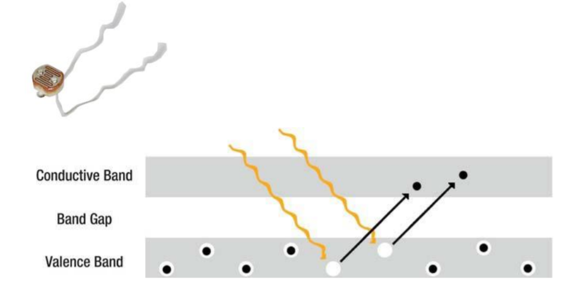
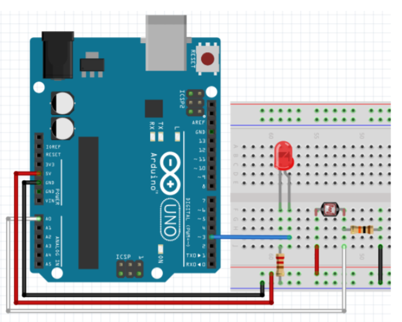
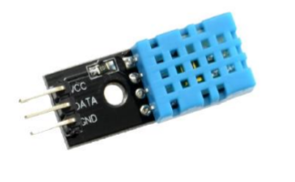
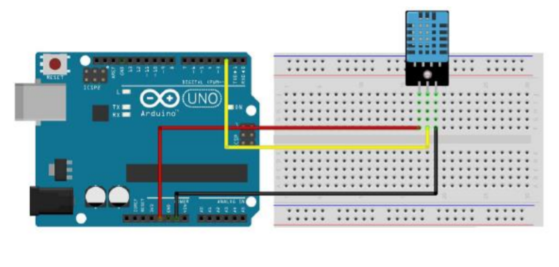
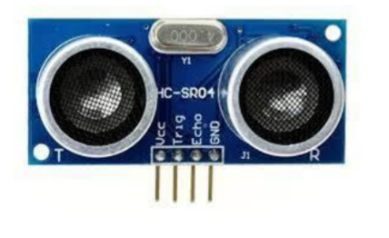
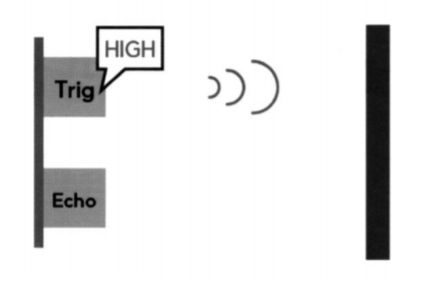
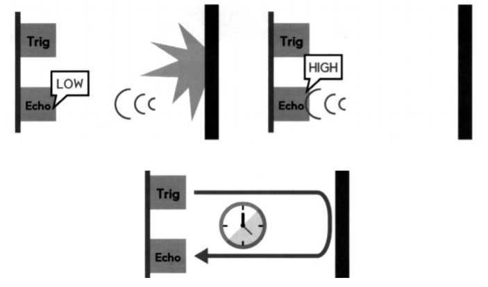
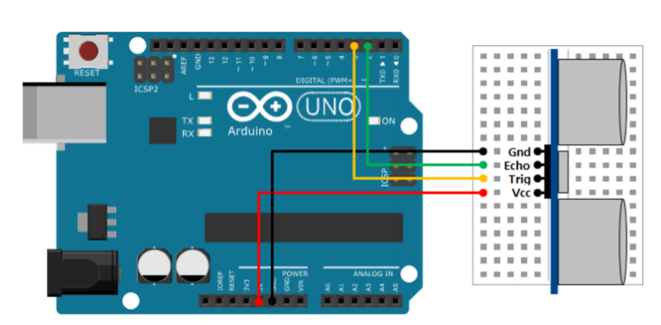

## 2020.09.16 TIL

##### class

- **배열명은 포인터 상수**이기 때문에 대입문을 써서 값을 바꿀 수 없다 (return값 배열 불가능)

  - **class를 이용하여 할 수 있음** - **복사 생성자**기 때문에 대입문을 써서 값을 바꿀 수 있다

  - **struct을 이용**하여  다수의 값을 return할 수 있다

    ```java
    typedef struct // 복합데이터를 하나의 변수로 운영할 수 있는 struct type
    {
        int x;
        int y;
        int z;
    } joystick_value_t;
    
    joystick_value_t read();
    ```

##### 조이스틱, 모터, LCD 이용하기

- Joystick.h

  ```java
  #pragma once
  
  #include <Arduino.h>
  #include <AnalogSensor.h>
  #include <Button.h>
  
  typedef struct // 복합데이터를 하나의 변수로 운영할 수 있는 struct type
  {
      int x;
      int y;
      int z;
  } joystick_value_t;
  
  
  class Joystick{
  protected : // 상속.. private : 상속이 안된다. *****
      AnalogSensor jX;
      AnalogSensor jY;
      Button btn;
  
  public:
      Joystick(int x, int y, int z);
  
      int readX();
      int readY();
      void setRangeX(int toMin, int toMax);
      void setRangeY(int toMin, int toMax);
  
      int readZ(); // 버튼의 상태 읽는것
      void setCallback(button_callback_t callback);
      void check();
  
      joystick_value_t read();
  };
  ```

- Joystick.cpp

  ```java
  #include "Joystick.h"
  
  Joystick::Joystick(int x, int y, int z)
      : jX(x), jY(y), btn(z){
  
  }
  
  int Joystick::readX(){
      return jX.read();
  }
  
  int Joystick::readY(){
      return jY.read();
  }
  
  void Joystick::setRangeX(int toMin, int toMax){
      jX.setRange(toMin, toMax);
  }
  
  void Joystick::setRangeY(int toMin, int toMax){
      jY.setRange(toMin, toMax);
  }
  
  int Joystick::readZ(){
      return btn.read();
  }
  // 버튼의 상태 읽는것
  void Joystick::setCallback(button_callback_t callback){
      btn.setCallback(callback);
  }
  
  void Joystick::check(){
      btn.check();
  }
  
  joystick_value_t Joystick::read(){
      joystick_value_t value;
      value.x = readX();
      value.y = readY();
      value.z = readZ();
      return value;
  }
  ```

- app.ino

  ```java
  #include <LiquidCrystal_I2C.h>
  #include <Servo.h>
  #include <SimpleTimer.h>
  #include <Joystick.h>
  
  const int SERVO_PIN = 5;
  Servo servo;
  Joystick joy(A0, A1, 3);
  bool mode = true;  // true : 주행모드, false: 카메라 방향 모드
  SimpleTimer timer;
  LiquidCrystal_I2C lcd(0x27, 16, 2);
  
  // joystick 값 읽고 출력하기.
  void readJoystick() {
      joystick_value_t value = joy.read();
      char buf[17];
  
      if(mode) {  //주행모드
          sprintf(buf, "X:%4d/Y:%4d", value.x, value.y);
          lcd.setCursor(0, 0);
          lcd.print(buf);
      } else {  // 카메라 방향 모드
          servo.write(value.x);  // 카메라 방향 조정
          sprintf(buf, "Angle: %3d", value.x);
          lcd.setCursor(0, 1);
          lcd.print(buf);
      }
  }
  
  // joystick 운영 모드 변경
  void changeMode() {
      mode = !mode;
      if(mode) {  // 주행 모드
          joy.setRangeX(-255,255);
          led.off();
      } else {  // 카메라 방향 모드
          joy.setRangeX(0, 180);
          led.on();
      }
  }
  
  void setup() {
      lcd.init();
      lcd.backlight();
      lcd.clear();
  
      // DC 모터 : 속도 조절은 PWM: 0 ~ 255, 전진, 후진 :
      joy.setRangeX(-255, 255);
      joy.setRangeY(-255, 255);
      joy.setCallback(changeMode);
  
      timer.setInterval(50, readJoystick);
  
      servo.attach(SERVO_PIN);
      Serial.begin(9600);
  }
  
  void loop() {
      timer.run();
      joy.check();
  }
  ```


### 조도 센서

##### 빛 저항으로 빛 세기 감지하기

- 빛 저항

  - 빛에 노출되면 저항이 줄어드는 저항  - 광전자 효과

  

- 회로 구성

  - 빛 저항 연결
    - 한쪽은 VCC에 연결
    - 다른 한쪽은 A0에 연결
    - 10k 옴 저항 연결

  

- 조도(밝기) 센서로 LED 켜고 끄기

  ```java
  int pSensor = A0;
  int ledPin = 3;
  
  void setup() {
      Serial.begin(9600);
      pinMode(ledPin, OUTPUT);
  }
  void loop() {
      int readVal = analogRead(pSensor);
      Serial.print("Read Value = ");
      Serial.println(readVal);
      
      if(readVal < 200) { // 어두워지면 LED 켜기
          digitalWrite(ledPin, HIGH);
      } else {
          digitalWrite(ledPin, LOW);
      }
      delay(200);
  }
  ```

- 모듈화하여 LCD로 조도 센서 값 받아오기

  ```java
  #include <LiquidCrystal_I2C.h>
  #include <AnalogSensor.h>
  #include <Led.h>
  
  AnalogSensor illu(A0, 0, 100); // 0~100%
  LiquidCrystal_I2C lcd(0x27, 16, 2);
  
  Led led(3);
  
  void setup() {
      Serial.begin(9600);
      lcd.init();
      lcd.backlight();
      lcd.off();
  }
  
  void printIllu(int value){
      char buf[17];
      sprintf(buf, "Read Value = %3d", value);
      lcd.setCursor(0, 0);
      lcd.print(buf);
  }
  
  void loop() {
      int readVal = illu.read();
      printIllu(readVal);
      if(readVal < 15) { // 어두워지면 LED 켜기
          led.on();
      } else {
          led.off();
      }
      delay(200);
  }
  ```

- PWM을 이용하여 조도센서 밝기 조절하기

  ```java
  #include <LiquidCrystal_I2C.h>
  #include <AnalogSensor.h>
  #include <Led.h>
  #include <PWMLed.h>
  
  AnalogSensor illu(A0, 0, 255); // 0~100%
  LiquidCrystal_I2C lcd(0x27, 16, 2);
  
  // Led led(3);
  PWMLed led(3);
  
  void setup() {
      Serial.begin(9600);
      lcd.init();
      lcd.backlight();
      lcd.off();
  }
  
  void printIllu(int value){
      char buf[17];
      sprintf(buf, "Read Value = %3d", value);
      lcd.setCursor(0, 0);
      lcd.print(buf);
  }
  
  void loop() {
      int readVal = illu.read();
  
      int brightness = map(readVal, 0, 255, 255, 0);
      printIllu(readVal);
      led.set(brightness);
      // if(readVal < 15) { // 어두워지면 LED 켜기
      //     led.on();
      // } else {
      //     led.off();
      // }
      delay(200);
  }
  ```

- constrain(x, a, b)

  - 숫자를 어느 범위로 제한

    - x : 제한할 수
    - a : 범위의 하한
    - b : 범위의 상한

  - 반환

    - x : x가 a와 b 사이에 있으면
    - a : x가 a보다 작으면
    - b : x가 b보다 크면

  - 센서 값을 10에서 150 사이로 제한

    ```java
    sensVal = constrain(sensVal, 10, 150);
    ```

  ```java
  #include <LiquidCrystal_I2C.h>
  #include <AnalogSensor.h>
  #include <Led.h>
  #include <PWMLed.h>
  
  AnalogSensor illu(A0, 0, 1023); // 0~1023 범위
  LiquidCrystal_I2C lcd(0x27, 16, 2);
  
  PWMLed led(3);
  
  void setup() {
      Serial.begin(9600);
      lcd.init();
      lcd.backlight();
      lcd.off();
  }
  
  void printIllu(int value){
      char buf[17];
      sprintf(buf, "Read Value = %3d", value);
      lcd.setCursor(0, 0);
      lcd.print(buf);
  }
  
  void loop() {
      int readVal = illu.read();
      readVal = constrain(readVal, 0, 200);
  	// 값의 범위를 0~200으로 조정, 200이하면 0, 이상이면 200
      // 다른 의미로 센서의 민감도를 조정한 것이다.
      
      int brightness = map(readVal, 0, 200, 255, 0);
      printIllu(readVal);
      led.set(brightness);
      delay(200);
  }
  ```


### DHT11

##### DHT11

- 온/습도 센서
  - 내부에 써미스터와 정전식 습도 센서가 내장되어있는 온습도 센서
  - 내부 써미스터는 온도에 따라 저항 값이 변하는 소자
  - 정전식 습도 센서는 습도에 따라 저항 값이 변하는 소자
  - 총 3개의 핀으로 구성되어 있으며 각각 VCC, DATA, GND로 구성
  - 온도 측정시 써미스터 특성상 약 1분정도의 시간이 소요



- 온도, 습도 센서

  - 실습 센서에 VCC, GND 확인

  

- 라이브러리 준비

  ```java
  #include <DHT.h>
  ```

- 객체 생성

  - DHT dht(pin, DHT타입);
  - dht.begin();

- 센서 값 읽기

  ```java
  dht.readHumidity(); // 습도 값 읽기
  dht.readTemperature(); // 온도 값 읽기
  ```

  - 주의 사항

    - 읽을 때마다 최소 2초 이상 간격으로 읽기 실행

    - 2초보다 작은 시간간격으로 읽을 시 에러 발생

      

- DHT 센서값 받아오기

  ```java
  #include <DHT.h> // DHT.h 라이브러리를 포함한다
  #define DHTPIN 2
  #define DHTTYPE DHT11
  
  DHT dht(DHTPIN, DHTTYPE); // DHT설정 - dht (디지털3, dht11)
  
  void setup() {
      Serial.begin(9600); // 9600 속도로 시리얼 통신을 시작한다
      dht.begin();
  }
  
  void loop() {
      delay(2000);
      // lcd에서는 float출력이 안됨, 문자열로 변환하여 출력해야 함
      float h = dht.readHumidity(); // 변수 h에 습도 값을 저장
      float t = dht.readTemperature(); // 변수 t에 온도 값을 저장
  
      Serial.print("Humidity: ");
      Serial.print(h);
      Serial.print("%\t");
      Serial.print("Temperature: ");
      Serial.print(t);
      Serial.println(" C");
  }
  ```

  

- 객체화 하여 LCD에 온,습도 출력하기

  - MiniCom.h

    ```java
    #pragma once
    
    #include <Arduino.h>
    #include <LiquidCrystal_I2C.h>
    #include <SimpleTimer.h>
    
    class MiniCom{
    protected:
        LiquidCrystal_I2C lcd;
        SimpleTimer timer;
    
    public:
        MiniCom(); // 생성자
        void init(); // 초기화 코드
        int setInterval(unsigned long d, timer_callback f); // 타이머 콜백 등록
        void run(); // 타이머 운영 및 기타 처리
    
        // LCD 출력 지원 helper 함수
        void print(int col, int row, const char *pMsg);
        void print(int row, const char *pMsg);
        void print(int row, const char *pTitle, int value);
        void print(int row, const char *pTitle, double value, int width=6);
    };
    
    // title : int value
    // title : double value
    ```

    

  - MiniCom.cpp

    ```java
    #include "MiniCom.h"
    
    MiniCom::MiniCom() : lcd(0x27, 16, 2){
    
    }
    
    void MiniCom:: init(){
        Serial.begin(9600);
        lcd.init();
        lcd.backlight();
    }
    
    int MiniCom::setInterval(unsigned long d, timer_callback f){
        return timer.setInterval(d, f);
    }
    
    void MiniCom::run(){
        timer.run();
    }
    
    void MiniCom::print(int col, int row, const char *pMsg){
        lcd.setCursor(col, row);
        char buf[17];
        sprintf(buf, "%-16s", pMsg);
        // 16s 준 이유는 과거에 길었던 문자를 지워버리기 위해
        lcd.print(buf);
    }
    
    void MiniCom::print(int row, const char *pMsg){
        print(0, row, pMsg);
    }
    
    void MiniCom::print(int row, const char *pTitle, int value){
        char buf[17];
        sprintf(buf, "%s: %d", pTitle, value);
        print(0, row, buf);
    }
    
    void MiniCom::print(int row, const char *pTitle, double value, int width){
        char buf[17];
        char temp[14];
        dtostrf(value, width, 2, temp); // 실수값을 문자열로 변경
        sprintf(buf, "%s : %s", pTitle, temp);
        print(0, row, buf);
    }
    ```

    

  - app.ino

    ```java
    #include <DHT.h> // DHT.h 라이브러리를 포함한다
    #include "MiniCom.h"
    #define DHTPIN 2
    #define DHTTYPE DHT11
    
    DHT dht(DHTPIN, DHTTYPE); // DHT설정 - dht (디지털3, dht11)
    
    MiniCom com;
    
    void checkHumiTemp(){
        // lcd에서는 float출력이 안됨, 문자열로 변환하여 출력해야 함
        float h = dht.readHumidity(); // 변수 h에 습도 값을 저장
        float t = dht.readTemperature(); // 변수 t에 온도 값을 저장
    
        com.print(0, "Humi", h);
        com.print(1, "Temp", t);
    }
    
    void setup() {
        com.init();
        com.setInterval(2000, checkHumiTemp);
        com.print(0, "MiniCom start...");
        com.print(1, "Humi/Temp Ex");
        dht.begin();
    }
    
    void loop() {
        com.run();
    }
    ```

    

### 초음파 센서

##### 초음파 센서

- 초음파 센서

  - 초음파를 이용하여 벽이나 사물의 거리를 측정하는 센서
  - HC-SR04 모듈
    - Vcc : 트리거 (초음파 송출 제어) - 초음파 쏘기
    - Echo : 에코(초음파 수신) - 반사된 초음파 받기
    - GND : 접지

  

- 초음파 센서 동작 원리

  - Trig에 HIGH 전압 인가시 초음파 발사
  - Echo에서 초음파 수신(처음에는 LOW)
  - 시간차이를 측정하여 거리 계산

  



- 거리 계산

  - 음속 : 340 m/s
  - 비례식
    - 1,000,000 us : 34,000 cm = x us : y cm
    - y = 34,000*x/1,000,000 = 0.034*x cm
  - 왕복 반영
    - y = 0.034*x/2 = 0.017 *x cm

- delayMicroseconds()

  - 아두이노 보드를 일정 시간 멈추는 함수

  - delayMicroseoonds(멈출 시간)

  - 매개변수

    - 멈출 시간 : 단위는 마이크로초로(0.0000001초)

  - 반환 값 -> 없음

  - 사용 예

    - ```java
      delayMicroseconds(2);
      // 아두이노 보드를 0.002 밀리초(0.000002초) 멈춥니다.
      ```

- **pulseln()**

  - 디지털 입력 핀의 전압이 LOW 또는 HIGH가 될 때까지 걸린 시간 측정

  - 핀은 꼭 pinMode 함수를 이용해 입력 모드로 설정

  - pulseln(핀 번호，전압)

    - 매개변수
      - 핀 번호: 전압이 바뀌는 시간을 재고자 하는 핀 번호
      - 전압: 바뀌는 전압. HIGH - LOW에서 HIGH가 될 때

  - 반환값

    - 전압이 바뀌는 데 걸린 시간을 마이크로초 기준으로 반환
    - 만약 1초 동안 기다렸는데도 전압이 바뀌지 않으면 0을 반환

  - 사용 예

    - ```java
      long duration = pulseln(3, HIGH);
      //3번 핀의 전압이 HIGH가 될 때까지 걸린 시간
      ```

  

- 초음파 센서 거리 측정

  ```java
  int echoPin = 2;
  int triggerPin = 3;
  
  void setup() {
      Serial.begin(9600);
      pinMode(echoPin, INPUT);
      pinMode(triggerPin, OUTPUT);
  }
  void loop() {
      // trigger 핀으로 10us의 펄스를 발생
      digitalWrite(triggerPin, HIGH);
      delayMicroseconds(10);
      digitalWrite(triggerPin, LOW);
  
      // echo 핀 입력으로부터 거리르 cm 단위로 계산
      int distance = pulseIn(echoPin, HIGH) / 58;
      // 비례식으로 2로 나누면 58이 됨
  
      Serial.println("Distance(cm) = " + String(distance));
  
      delay(1000);
  }
  ```

- LCD로 초음파 센서 거리 측정

  ```java
  #include <MiniCom.h>
  
  MiniCom com;
  
  int echoPin = 2;
  int triggerPin = 3;
  
  void checkDistance(){
      // trigger 핀으로 10us의 펄스를 발생
      digitalWrite(triggerPin, HIGH);
      delayMicroseconds(10);
      digitalWrite(triggerPin, LOW);
  
      // echo 핀 입력으로부터 거리르 cm 단위로 계산
      int distance = pulseIn(echoPin, HIGH) / 58;
      // 비례식으로 2로 나누면 58이 됨
      com.print(0, "distance", distance);
  }
  
  void setup() {
      com.init();
      pinMode(triggerPin, OUTPUT);
      pinMode(echoPin, INPUT);
      com.setInterval(1000, checkDistance);
  }
  void loop() {
      com.run();
  }
  ```

  - **LCD - A4: SDA선, A5: SCL선 --> I/2규약... 아두이노가 정해둠** 


- LCD로 초음파 센서 거리 측정 객체화

  - Ultra.h

    ```java
    #pragma once
    
    #include <Arduino.h>
    
    class Ultra{
    protected:
        int echo;
        int trig;
    public:
        Ultra(int echo, int trig);
        int read(); // 거리 측정
    };
    ```

  - Ultra.cpp

    ```java
    #include "Ultra.h"
    
    Ultra::Ultra(int echo, int trig) : echo(echo), trig(trig){
        pinMode(trig, OUTPUT);
        pinMode(echo, INPUT);
    }
    
    int Ultra::read(){
        // trigger 핀으로 10us의 펄스를 발생
        digitalWrite(trig, HIGH);
        delayMicroseconds(10);
        digitalWrite(trig, LOW);
    
        // echo 핀 입력으로부터 거리르 cm 단위로 계산
        int distance = pulseIn(echo, HIGH) / 58;
        // 비례식으로 2로 나누면 58이 됨   
    
        return distance; 
    }
    ```

  - app.ino

    ```java
    #include <MiniCom.h>
    #include "Ultra.h"
    
    MiniCom com;
    Ultra ultra(2, 3);
    
    void checkDistance(){
        int distance = ultra.read();
        com.print(0, "distance", distance);
    }
    
    void setup() {
        com.init();
        com.setInterval(1000, checkDistance);
    }
    
    void loop() {
        com.run();
    }
    ```

    