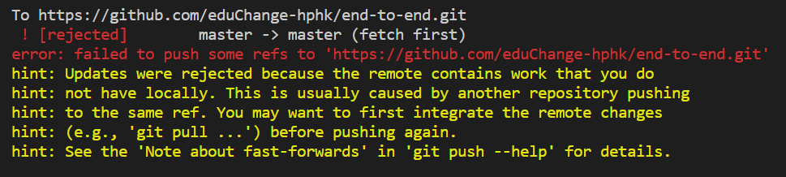
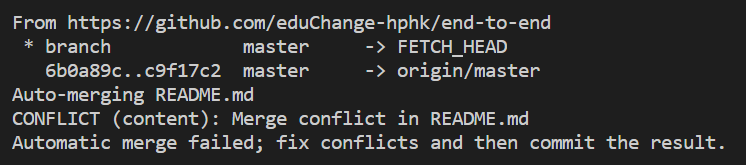
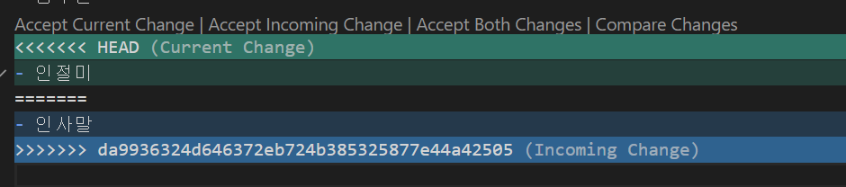

# 2020.08.21


### git pull

깃허브에 올려져있는 프로젝트 파일을 내 컴퓨터로 가져옵니다

```shell
git pull <remote name> <branch name> # ex) git pull origin master
```

### git 충돌

협업 프로젝트 중 2명이상의 인원이 commit 하고 한명이 push를 한 경우

다른 한명이 push를 할 때 오류가 난다.

![(2020-08-21.assets/image-20200821110000085.png)

#### 에러 발생! 



이 경우는 누군가 먼저 push를 해놓았을 때 나오는 에러, 최신 데이터를 pull 한 후 수정을 한다.



중복되있는 코드가 있다고 나온다.



이럴 때 최신데이터로 merge 할건지 나의 데이터로 merge할건지 팀원과 상의 후 push!!


### branch

분기라는 뜻으로 버전관리를 할 때 사용한다.

### branch 목록보기

```shell
git branch # branch 목록을 보여준다
```

### branch 생성

```shell
git branch -c <branch name> # git branch -create name
```

### branch 옮기기

```shell
git switch <change branch name> # 바꿀 branch 이름
```

### 합치기

master branch로 내가 작업한 코드를 merge할 때 사용한다.

### merge

먼저 master branch로 이동한다.

```shell
git switch master
```

병합할 코드가 담긴 branch를 합친다.

```shell
git merge <into merge branch name> # 병합할 branch name  
```

### git log

commit 한 기록 확인해주는 명령어

```shell
git log
```

### --oneline

commit한 기록을 정리해주는 옵션

```shell
git log --oneline
```

### --graph

충돌난 목록까지 보여주는 옵션?

```shell
git log --oneline --graph # commit된 기록을 한 줄로 보여주고 충돌 내역 까지 보여줌
```

### git branch -d

branch를 삭제하는 명령어

```shell
git branch -d <delete branch name>
```


### git pull origin 

branch 가져오는 명령어

```shell
git pull origin <branch name> # 브랜치를 가져올 땐 master인 상태에서 해야 한다.
```

