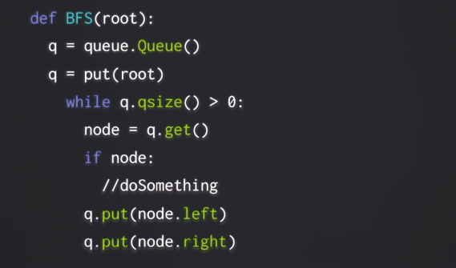
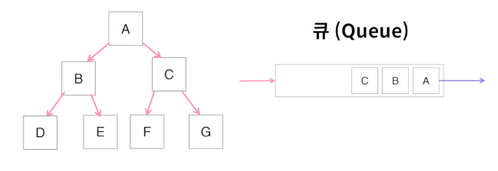
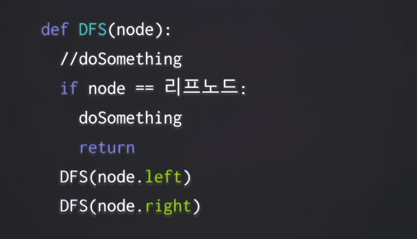

## 2020.10.20 TIL

### 재귀함수, Memorization, 트리, BFS, DFS

##### 팩토리얼 계산하기(재귀)

- 팩토리얼(!) 은 하나의 정수를 n을 입력받고 n X n-1 X n-2 X …. X 1 을 반환하는 연산자입니다.

  예를 들어서, 5! = 5 X 4 X 3 X 2 X 1 = 120 입니다.

  팩토리얼 연산자를 파이선 함수로 구현 해 봅시다. 재귀(recursion)방법과 반복(iteration)방법의 두 가지 다른 방법으로 구현 해 보도록 합시다.

  - 1! = 1, 0! = 1 입니다.
  - 입력값은 0보다 크거나 같은 정수라고 가정합시다.

```python
def factorial(num):
    if num == 0: # 재귀함수를 위한 종료조건
        return 1
    
    return num * factorial(num-1)

def main():
    print(factorial(5)) # should return 120

if __name__ == "__main__":
    main()
```

##### 피보나치 수(Memorization)

- 피보나치 수열은 `N 번째 수가 N-1번째 수와 N-2번째 수의 합`인 수열입니다.
  즉, F(0) = 0, F(1) = 1이며 그 이외의 모든 F(n) = F(n-1) + F(n-2) 입니다.

  예를 들어서 피보나치 수열을 0~ 10번째까지 적어보면

  0, 1, 1, 2, 3, 5, 8, 13, 21, 34, 55

  와 같습니다.

  F(10) = F(9) + F(8) = 21 + 34 = 55 임을 확인 할 수 잇습니다.

  0보다 크거나 같은 입력 정수 n이 주어졌을때 n번째 피보나치 수를 반환하는 함수를 구현 해 봅시다.

  예를 들어서, 10이 입력으로 주어지면 55를 반환해야 합니다.

```python
class Fib():
    def __init__(self):
        self.memo = {}

    def fibonacci(self, num):
        if num == 0:
            return 0
        if num == 1:
            return 1

        if num in self.memo:
            return self.memo[num]

        self.memo[num] = self.fibonacci(num-1) + self.fibonacci(num-2)

        return self.memo[num]


def main():
    f = Fib()
    print(f.fibonacci(10))  # should return 55


if __name__ == "__main__":
    main()
```

##### 이진 트리 출력하기(Q, BFS)

- 완벽한 이진 트리가 주어졌다고 합시다. 이때, 이 트리를 출력하기 좋은 형태로 반환하는 함수를 구현 해 봅시다.
  위에서부터 순서대로, 트리의 각 층별로 하나의 배열을 만들고, 이 배열들의 배열을 반환하는 형태면 됩니다.
- 예를 들어서

```python
 1
2 3
```

와 같은 트리가 주어졌을 경우 `[[1],[2,3]]` 을,

```python
   1
 2   3
4 5 6  7
```

과 같은 트리가 주어졌을 경우에는 `[[1],[2,3],[4,5,6,7]]`을 반환하면 됩니다.

```python
import queue


# ====이 문제를 풀기 위해 필요한 클래스와 함수들입니다. 따로 수정 할 필요는 없습니다.
class Node():
    def __init__(self, val):
        self.val = val
        self.left = None
        self.right = None


def listToCompleteBinaryTree(lst):
    def helper(index):
        if index >= len(lst):
            return None
        node = Node(lst[index])
        node.left = helper(index * 2 + 1)
        node.right = helper(index * 2 + 2)
        return node

    return helper(0)


# =================================================================================
def printTree(node):
    all_lines = []
    line = []

    q = queue.Queue()
    q.put(node)
    q.put(Node(-1)) # -1을 통해서 각 깊이를 구별하기 위해서

    while q.qsize() > 0:
        node = q.get()

        if not node:
            continue

        else:
            if node.val == -1: # -1를 만나면 새 리스트
                if q.qsize() > 0:
                    all_lines.append((line))
                    line = []
                    q.put(Node(-1))

            else:
                line.append(node.val)
                q.put(node.left)
                q.put(node.right)

    return all_lines


def main():
    node = listToCompleteBinaryTree([1, 2, 3, 4, 5, 6, 7])
    print(printTree(node))  # [[1], [2, 3], [4, 5, 6, 7]]


if __name__ == "__main__":
    main()
```

##### 너비 우선 탐색 (BFS)

Breadth First Search : 반복 기반의 탐색



- 큐에 노드를 순서대로 넣고 빼는 방식으로 탐색



##### 깊이 우선 탐색 (DFS)

- Depth First Search : 재귀 기반의 탐색



##### 트리의 경로의 합

- 완벽한 이진 트리가 주어졌다고 합시다. 그리고 어떤 합 숫자가 주어졌다고 합시다. 이때, 이 트리의 루트(root)에서부터 잎(leaf)까지의 가능한 경로들을 고려해서, 이 경로들 중 최소 하나 이상의 해당 경로상의 value들의 합산과 주어진 합 숫자가 일치하면 True를, 아니면 Fals를 반환하는 함수를 구현 해 봅시다.

  예를 들어서,

  ```python
   1
  2 3
  ```

  와 같은 트리가 주어지고 3 값이 주어진다면 1->2 경로의 합이 3이기 때문에 True를 반환하면 됩니다.

  ```python
     1
   2   3
  4 5 6  7
  ```

  과 같은 트리가 주어지고 8이 주어진다면 1->2->5 경로의 합이 8이기 때문에 True를 반환하면 됩니다. 하지만 만약 15가 주어진다면 해당 트리의 어떤 경로도 합산이 15가 되지 않기 때문에 False를 반환하면 됩니다.

  ```python
  # ====이 문제를 풀기 위해 필요한 클래스와 함수들입니다. 따로 수정 할 필요는 없습니다.
  class Node():
      def __init__(self, val):
          self.val = val
          self.left = None
          self.right = None
  
  
  def listToCompleteBinaryTree(lst):
      def helper(index):
          if index >= len(lst):
              return None
          node = Node(lst[index])
          node.left = helper(index * 2 + 1)
          node.right = helper(index * 2 + 2)
          return node
  
      return helper(0)
  
  
  def printTree(node):
      q = [Node(-1), node]
  
      line = []
      while q:
          node = q.pop()
          if not node:
              continue
          elif node.val == -1:
              if len(line) > 0:
                  print(" ".join(line))
                  line = []
                  q.insert(0, Node(-1))
          else:
              q.insert(0, node.left)
              q.insert(0, node.right)
              line.append(str(node.val))
  
  
  # =================================================================================
  def path_sum(node, targetSum):
      def dfsHelper(node, curSum):
          # DFS
          if node is None: # 리프노드일 때 합계가 목표와 같은지 체크
              if curSum == targetSum:
                  return True
              else:
                  return False
  
          else:
              curSum += node.val
              is_left = dfsHelper(node.left, curSum)
              is_right = dfsHelper(node.right, curSum)
  
          return is_left or is_right
  
      dfsHelper(node, 0)
  
      return dfsHelper(node, 0)
  
  def main():
      node = listToCompleteBinaryTree([1, 2, 3, 4, 5, 6, 7])
      printTree(node)
      print(path_sum(node, 8))  # return True
      print(path_sum(node, 15))  # return False
  
  
  if __name__ == "__main__":
      main()
  ```

  

