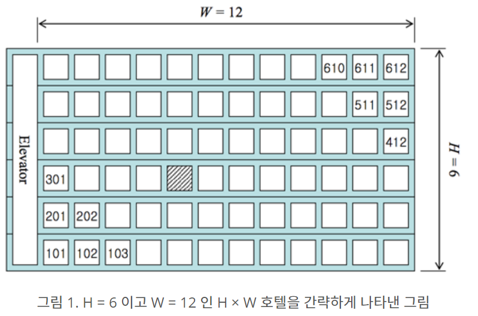

## 2021.01.03 TIL

##### 더하기 사이클 - 1110

- 문제

0보다 크거나 같고, 99보다 작거나 같은 정수가 주어질 때 다음과 같은 연산을 할 수 있다. 먼저 주어진 수가 10보다 작다면 앞에 0을 붙여 두 자리 수로 만들고, 각 자리의 숫자를 더한다. 그 다음, 주어진 수의 가장 오른쪽 자리 수와 앞에서 구한 합의 가장 오른쪽 자리 수를 이어 붙이면 새로운 수를 만들 수 있다. 다음 예를 보자.

26부터 시작한다. 2+6 = 8이다. 새로운 수는 68이다. 6+8 = 14이다. 새로운 수는 84이다. 8+4 = 12이다. 새로운 수는 42이다. 4+2 = 6이다. 새로운 수는 26이다.

위의 예는 4번만에 원래 수로 돌아올 수 있다. 따라서 26의 사이클의 길이는 4이다.

N이 주어졌을 때, N의 사이클의 길이를 구하는 프로그램을 작성하시오.

- 입력

첫째 줄에 N이 주어진다. N은 0보다 크거나 같고, 99보다 작거나 같은 정수이다.

- 출력

첫째 줄에 N의 사이클 길이를 출력한다.


```python
inp = num = int(input())

ans = 0

cycle = 0

while(True):
    one = num % 10
    ten = num // 10
    plus = one + ten

    plus_t = plus % 10

    res = int(str(one)+str(plus_t))

    cycle += 1

    if inp == res:
        break

    num = res

print(cycle)
```


##### ACM 호텔  - 10250

- 문제

ACM 호텔 매니저 지우는 손님이 도착하는 대로 빈 방을 배정하고 있다. 고객 설문조사에 따르면 손님들은 호텔 정문으로부터 걸어서 가장 짧은 거리에 있는 방을 선호한다고 한다. 여러분은 지우를 도와 줄 프로그램을 작성하고자 한다. 즉 설문조사 결과 대로 호텔 정문으로부터 걷는 거리가 가장 짧도록 방을 배정하는 프로그램을 작성하고자 한다.

문제를 단순화하기 위해서 호텔은 직사각형 모양이라고 가정하자. 각 층에 W 개의 방이 있는 H 층 건물이라고 가정하자 (1 ≤ H, W ≤ 99). 그리고 엘리베이터는 가장 왼쪽에 있다고 가정하자(그림 1 참고). 이런 형태의 호텔을 H × W 형태 호텔이라고 부른다. 호텔 정문은 일층 엘리베이터 바로 앞에 있는데, 정문에서 엘리베이터까지의 거리는 무시한다. 또 모든 인접한 두 방 사이의 거리는 같은 거리(거리 1)라고 가정하고 호텔의 정면 쪽에만 방이 있다고 가정한다.



방 번호는 YXX 나 YYXX 형태인데 여기서 Y 나 YY 는 층 수를 나타내고 XX 는 엘리베이터에서부터 세었을 때의 번호를 나타낸다. 즉, 그림 1 에서 빗금으로 표시한 방은 305 호가 된다.

손님은 엘리베이터를 타고 이동하는 거리는 신경 쓰지 않는다. 다만 걷는 거리가 같을 때에는 아래층의 방을 더 선호한다. 예를 들면 102 호 방보다는 301 호 방을 더 선호하는데, 102 호는 거리 2 만큼 걸어야 하지만 301 호는 거리 1 만큼만 걸으면 되기 때문이다. 같은 이유로 102 호보다 2101 호를 더 선호한다.

여러분이 작성할 프로그램은 초기에 모든 방이 비어있다고 가정하에 이 정책에 따라 N 번째로 도착한 손님에게 배정될 방 번호를 계산하는 프로그램이다. 첫 번째 손님은 101 호, 두 번째 손님은 201 호 등과 같이 배정한다. 그림 1 의 경우를 예로 들면, H = 6이므로 10 번째 손님은 402 호에 배정해야 한다.

- 입력

프로그램은 표준 입력에서 입력 데이터를 받는다. 프로그램의 입력은 T 개의 테스트 데이터로 이루어져 있는데 T 는 입력의 맨 첫 줄에 주어진다. 각 테스트 데이터는 한 행으로서 H, W, N, 세 정수를 포함하고 있으며 각각 호텔의 층 수, 각 층의 방 수, 몇 번째 손님인지를 나타낸다(1 ≤ H, W ≤ 99, 1 ≤ N ≤ H × W). 

- 출력

프로그램은 표준 출력에 출력한다. 각 테스트 데이터마다 정확히 한 행을 출력하는데, 내용은 N 번째 손님에게 배정되어야 하는 방 번호를 출력한다.

```python
num = int(input())

for _ in range(num):
    h, w, n = map(int,input().split())
    f = 0
    ho = 0
    if n % h == 0:
        f = h * 100
        ho = n // h

    else:
        f = (n % h) * 100
        ho = (n // h) + 1

    print(f+ho)
```


##### 블랙잭 - 2798

- 문제

카지노에서 제일 인기 있는 게임 블랙잭의 규칙은 상당히 쉽다. 카드의 합이 21을 넘지 않는 한도 내에서, 카드의 합을 최대한 크게 만드는 게임이다. 블랙잭은 카지노마다 다양한 규정이 있다.

한국 최고의 블랙잭 고수 김정인은 새로운 블랙잭 규칙을 만들어 상근, 창영이와 게임하려고 한다.

김정인 버전의 블랙잭에서 각 카드에는 양의 정수가 쓰여 있다. 그 다음, 딜러는 N장의 카드를 모두 숫자가 보이도록 바닥에 놓는다. 그런 후에 딜러는 숫자 M을 크게 외친다.

이제 플레이어는 제한된 시간 안에 N장의 카드 중에서 3장의 카드를 골라야 한다. 블랙잭 변형 게임이기 때문에, 플레이어가 고른 카드의 합은 M을 넘지 않으면서 M과 최대한 가깝게 만들어야 한다.

N장의 카드에 써져 있는 숫자가 주어졌을 때, M을 넘지 않으면서 M에 최대한 가까운 카드 3장의 합을 구해 출력하시오.

- 입력

첫째 줄에 카드의 개수 N(3 ≤ N ≤ 100)과 M(10 ≤ M ≤ 300,000)이 주어진다. 둘째 줄에는 카드에 쓰여 있는 수가 주어지며, 이 값은 100,000을 넘지 않는 양의 정수이다.

합이 M을 넘지 않는 카드 3장을 찾을 수 있는 경우만 입력으로 주어진다.

- 출력

첫째 줄에 M을 넘지 않으면서 M에 최대한 가까운 카드 3장의 합을 출력한다.

```python
n, maximum = map(int,input().split())
card = list(map(int,input().split()))

after = 0

for i in range(0,n-2):
    for j in range(i+1, n-1):
        for k in range(i+2, n):
            three = card[i]+card[j]+card[k]
            if after < three and maximum >= three :
                after = three

print(after)
```

