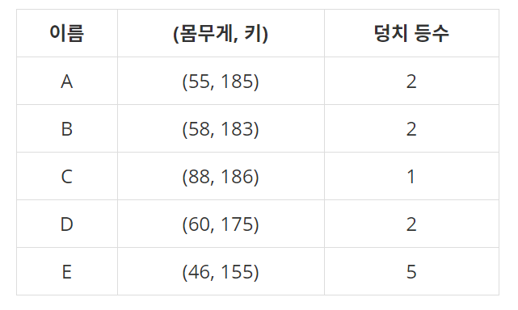

## 2021.01.18 TIL

##### 덩치 - 백준7568

- 우리는 사람의 덩치를 키와 몸무게, 이 두 개의 값으로 표현하여 그 등수를 매겨보려고 한다. 어떤 사람의 몸무게가 x kg이고 키가 y cm라면 이 사람의 덩치는 (x, y)로 표시된다. 두 사람 A 와 B의 덩치가 각각 (x, y), (p, q)라고 할 때 x > p 그리고 y > q 이라면 우리는 A의 덩치가 B의 덩치보다 "더 크다"고 말한다. 예를 들어 어떤 A, B 두 사람의 덩치가 각각 (56, 177), (45, 165) 라고 한다면 A의 덩치가 B보다 큰 셈이 된다. 그런데 서로 다른 덩치끼리 크기를 정할 수 없는 경우도 있다. 예를 들어 두 사람 C와 D의 덩치가 각각 (45, 181), (55, 173)이라면 몸무게는 D가 C보다 더 무겁고, 키는 C가 더 크므로, "덩치"로만 볼 때 C와 D는 누구도 상대방보다 더 크다고 말할 수 없다.

  N명의 집단에서 각 사람의 덩치 등수는 자신보다 더 "큰 덩치"의 사람의 수로 정해진다. 만일 자신보다 더 큰 덩치의 사람이 k명이라면 그 사람의 덩치 등수는 k+1이 된다. 이렇게 등수를 결정하면 같은 덩치 등수를 가진 사람은 여러 명도 가능하다. 아래는 5명으로 이루어진 집단에서 각 사람의 덩치와 그 등수가 표시된 표이다.

  

위 표에서 C보다 더 큰 덩치의 사람이 없으므로 C는 1등이 된다. 그리고 A, B, D 각각의 덩치보다 큰 사람은 C뿐이므로 이들은 모두 2등이 된다. 그리고 E보다 큰 덩치는 A, B, C, D 이렇게 4명이므로 E의 덩치는 5등이 된다. 위 경우에 3등과 4등은 존재하지 않는다. 여러분은 학생 N명의 몸무게와 키가 담긴 입력을 읽어서 각 사람의 덩치 등수를 계산하여 출력해야 한다.


```python
n = int(input())

graph = []

for _ in range(n):
    graph.append(list(map(int, input().split())))

for i in graph:
    cnt = 1
    for j in graph:
        if i[0] < j[0] and i[1] < j[1]:
            cnt += 1
    print(cnt, end=" ")
```


##### 영화감독 숌 - 백준 1436

- 666은 종말을 나타내는 숫자라고 한다. 따라서, 많은 블록버스터 영화에서는 666이 들어간 제목을 많이 사용한다. 영화감독 숌은 세상의 종말 이라는 시리즈 영화의 감독이다. 조지 루카스는 스타워즈를 만들 때, 스타워즈 1, 스타워즈 2, 스타워즈 3, 스타워즈 4, 스타워즈 5, 스타워즈 6과 같이 이름을 지었고, 피터 잭슨은 반지의 제왕을 만들 때, 반지의 제왕 1, 반지의 제왕 2, 반지의 제왕 3과 같이 영화 제목을 지었다.

  하지만 숌은 자신이 조지 루카스와 피터 잭슨을 뛰어넘는다는 것을 보여주기 위해서 영화 제목을 좀 다르게 만들기로 했다.

  종말의 숫자란 어떤 수에 6이 적어도 3개이상 연속으로 들어가는 수를 말한다. 제일 작은 종말의 숫자는 666이고, 그 다음으로 큰 수는 1666, 2666, 3666, .... 과 같다.

  따라서, 숌은 첫 번째 영화의 제목은 세상의 종말 666, 두 번째 영화의 제목은 세상의 종말 1666 이렇게 이름을 지을 것이다. 일반화해서 생각하면, N번째 영화의 제목은 세상의 종말 (N번째로 작은 종말의 숫자) 와 같다.

  숌이 만든 N번째 영화의 제목에 들어간 숫자를 출력하는 프로그램을 작성하시오. 숌은 이 시리즈를 항상 차례대로 만들고, 다른 영화는 만들지 않는다.


```python
n = int(input())
six = 666
cnt = 0

while(True):
    if '666' in str(six):
        cnt += 1
    if n == cnt:
        print(six)
        break
    six += 1
```


