## TIL 2020.09.08

### 생성자와 접근 제한자

##### 생성자 

- 객체가 인스턴스화 될 때 자동으로 호출되는 멤버 함수
- 리턴 타입이 없으며 클래스 이름과 동일★
- 멤버 변수의 초기화가 주요 역할임
- 생성자가 정의하지 않으면 컴파일러에 의해 디폴트 생성자가 자동 추가됨★★
  - 디폴트 생성자
    - 매개변수가 없는 생성자

```c++
#include <iostream>
using namespace std;

class Time{
public:
    int hour;
    int minute;

    // 생성자
    Time(){
        hour = 0;
        minute = 0;
    }

    // 생성자 overload
    Time(int h, int m){
        hour = h;
        minute = m;
    }

    void print(){
        cout << hour << ":" <<minute << endl;
    }
};

void printTime(Time t){
// Time T, call by value Time &T, call by reference, Time *time, call by address
    cout << "Time => " << t.hour << ":" << t.minute << endl;
}

int main(int argc, char const *argv[]) {
    Time a; // 디폴트 생성자를 사용
    Time b(10, 25); // (int, int) 생성자
    Time c; // 정적 객체

    c = b; // 정적 객체(할당)일 때 = 연산은 복사입니다.
    c.hour = 3;

    b.print();
    c.print();

    return 0;
}
```

##### 생성자 중복 정의(overload)

- 함수처럼 생성자도 오버로드 가능
  - 매개변수가 달라야 한다

##### 멤버 초기화 다른 방법

```c++
class Second{
public:
    int sec;
    Second(int s){
        sec = s;
    }
};
class Time{
public:
    int hour;
    int minute;
    Second sec;

    // 생성자
    Time() : sec(20) { // Second sec(20); 과 같음
        hour = 0;
        minute = 0;
    }
};

```

```c++
// 생성자 overload
Time(int h, int m) : hour(h), minute(m), sec(20){
}
```

- 디폴트 생성자가 없는 경우 해당 클래스의 멤버변수는 반드시 멤버 초기화 리스트를 이용하여 초기화를 해줘야 한다.

##### 소멸자

- ~클래스명()
- 인스턴스 변수가 메모리에서 사라질 때 자동으로 호출
  - 전역변수 : 프로그램 종료시
  - 지역변수 : 블럭이 끝날 때
  - 동적 생성 변수 : delete 호출시
- 동적 할당된 자원의 cleanup 작업 수행
- 매개변수가 없으며 오버로드 불가능 --> 1개만 만들 수 있음
- garbage collertor가 c++에선 지원해주지 않기 때문에 소멸자를 운영


- 포인터 - 메모리 주소값을 저장하는 변수 (데이터타입이 달라져도 크기는 같음,4Byte(32Bit))
- 정적할당 - 선언하는 시점에 Stack에 메모리가 생김, 지역변수
- 동적할당 - 변수가 선언되면 주소값만 할당할 수 있는 크기(포인터변수)가 선언된다, (4Byte), 개발자가 직접 Heap영역에 메모리를 할당해야 함
- new연산자를 통해 힙에 메모리를 할당해달라

```c++
#include <string.h>
#include <iostream>
using namespace std;

class MyString{
private:
    char *s; // char s 포인터 변수
    int size;

public:
    MyString(char *c){
        size = strlen(c) + 1;
        s = new char[size];
        // new연산자를 통해 힙에 char[size] 만큼의 영역을 할당(동적할당)
        strcpy(s, c);
    }
    
    ~MyString(){ // 소멸자
        cout << "~Mystring ... delete s" << endl;
        delete[]s;
        // delete함수를 사용하여 쓰레기메모리 삭제, new를 썼으면 반드시 delete를 써야함
    }
};

int main(int argc, char const *argv[]) {
   MyString str("abcdefghijk");

   return 0;
}
```

###  객체와 함수

##### 객체와 함수의 관계

- 객체가 함수의 매개 변수로 전달되는 경우 - **call by value**
- 객체의 참조자가 함수의 매개 변수로 전달되는 경우 - **call by reference**
- 함수가 객체를 반환하는 경우

##### 객체가 함수의 매개변수로 전달되는 경우

- 함수의 인수는 기본적으로 값에 의해 매개 변수로 전달
  - 객체일 때도 마찬가지 --> 객체가 복사됨

##### 객체의 참조자가 함수의 매개 변수로 전달되는 경우

- 객체를 복사하지 않고, 원본 복사에 새로운 이름을 부여하고 그 이름으로 접근
- int i;
- int &j = i; // i에 대한 참조자(새로운 이름) 정의

```c++
#include <iostream>
using namespace std;

class Pizza{
public:
    int size;
    Pizza(int s) : size(s) {}
};

void makeDouble(Pizza p){
    // Pizza p -> call by value, 만약 p앞에 &붙으면 call by reference
    p.size *= 2;
}

int main(int argc, char const *argv[]) {
   Pizza pizza(10);
   makeDouble(pizza);
   cout << pizza.size << "inch pizza" << endl;
    
   return 0;
}
```

##### 함수가 객체를 반환하는 경우

- 객체의 내용이 복사될 뿐 원본이 전달되지 않음

```c++
#include <iostream>
using namespace std;

class Pizza{
public:
    int size;
    Pizza(int s) : size(s) {}
};

Pizza makePizza(){
    Pizza p(10);
    return p;
}

int main(int argc, char const *argv[]) {
   Pizza pizza = makePizza();

   cout << pizza.size << "inch pizza" << endl;

   return 0;
}
```

### 객체 배열

##### 객체를 요소로 가지는 배열

- 클래스명 배열_이름 [배열크기];
- circle objArray[3];

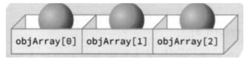

- objArray[0].calcArea();

```c++
#include <iostream>
using namespace std;

class Circle{
public:
    int x, y;
    int radius;

    Circle(): x(0), y(0), radius(0) {}
    Circle(int x, int y, int r): x(x), y(y), radius(r){}

    void print(){
        cout << "radius" << " @(" << x << "," << y << ")" << endl;
    }
};

int main(int argc, char const *argv[]) {

    Circle objArray[10]; // 10개의 요소가 디폴트 생성자에 의해 생성

    for(Circle &c: objArray){
        // 초기화가 어떻게 됐는지 확인, 읽기작업을 할땐 &붙여서 메모리 효율 확인
        c.print();
    }
    for(Circle &c: objArray) {
        c.x = rand()%500;
        c.y = rand()%300;
        c.radius = rand()%100;
    }

    for(Circle &c: objArray) {
        c.print();
    }
    cout << "--------------" << endl;
    cout << "Circle memory size: " << sizeof(Circle) << endl; // Circle 인스턴스의 크기
    cout << "array length : " << sizeof(objArray) / sizeof(Circle) << endl; // 배열의 길이

   return 0;
}
```

- **디폴트 생성자**는 쓰든 안쓰든 **정의하는 습관**을 들여야 한다.

##### 객체 배열의 초기화

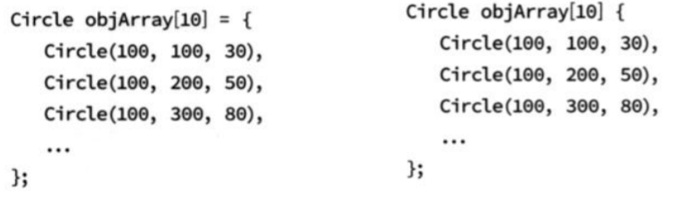

##### 벡터

- 배열은 크기가 고정되어 있는 단점이 있음

- 벡터는 동적으로 크기를 자동 조정

  ```c++
  #include <vector>
  ```

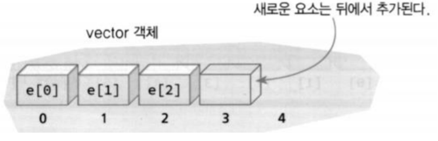

##### 벡터의 기초

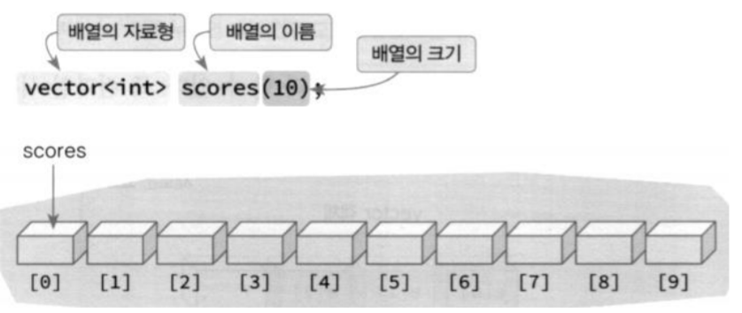

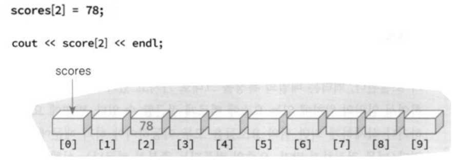

```c++
#include <vector>
#include <iostream>
using namespace std;

int main(int argc, char const *argv[]) {
   vector<int> fibo = {0, 1, 1, 2 ,3, 5, 8, 13, 21, 34, 55, 89};

    for(auto &number: fibo){
        cout << number << ' ';
    }

    cout<<endl;
    return 0;
}
```

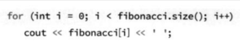

- 위에 사진은 fibo를 펼쳤을 때의 메커니즘이다.

##### push_back()과 pop_back()

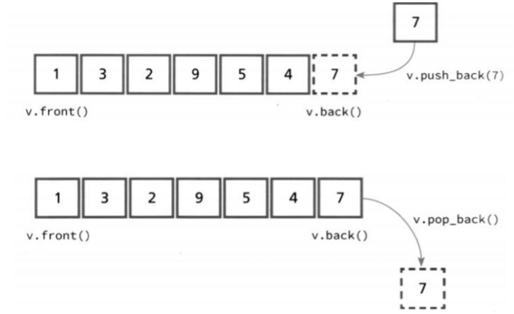

```c++
#include <vector>
#include <iostream>
using namespace std;

int main(int argc, char const *argv[]) {
    vector<int> v;

    cout << "size : " << v.size() << endl; // size : 0
    cout << "capacity : " << v.capacity() << endl; // capacity : 0

    v.push_back(10);
    v.push_back(20);
    v.push_back(30);
    v.push_back(40);
    v.push_back(50);

    for(auto &e : v){
        cout << e << ' ';
    }
    cout << endl;

    cout << "size : " << v.size() << endl; // size : 5
    cout << "capacity : " << v.capacity() << endl; // capacity : 8

    return 0;
}
```

- **size** - vector가 저장하는 데이터의 공간
- **capacity** - 빈번한 동적 메모리 할당 행위를 capacity를 통해 조절, size값과 capacity 값이 같을 경우 capacity는 size의 두배로 메모리를 할당함

```c++
#include <vector>
#include <iostream>
using namespace std;

int main(int argc, char const *argv[]) {
   vector<int> v;
   for(int i=0; i<10; i++){
       v.push_back(i);
   }

   for(auto &e : v){
       cout << e << ' ';
   }
    cout << endl;
    cout << "size : " << v.size() << endl; // size : 10
    cout << "capacity : " << v.capacity() << endl; // capacity : 16

    cout << "delete" << endl;

    while(v.empty() != true){
        cout << v.back() << " ";
        v.pop_back();
    }
    
    cout << endl;
    cout << "size : " << v.size() << endl; // size : 0
    cout << "capacity : " << v.capacity() << endl; // capacity : 16

   return 0;
}
```

### 포인터와 동적 객체 생성

##### 포인터

- **메모리의 주소값**을 저장하는 변수

- 변수 선언시 타입 뒤에 * 지정

  ```c++
  int *p; // 정수를 가리키는 포인터 선언
  ```

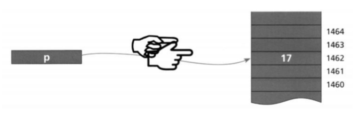

- 포인터는 **4바이트** 크기의 공간을 확보

##### 주소 연산자 &

- 기존 변수의 주소 값을 획득하여 포인터 변수에 저장할 때 사용

- **&의 위치**에 따라 기능이 달라진다

- **int &total = sum <- 참조변수 (sum의 값을 가리키는 곳을 참조한다) 라는 뜻**

- **total = &sum <- 주소값저장(sum변수의 주소값을 total에 저장한다) 라는 뜻**

  ```c++
  int number = 10;
  int *p; // 정수를 가리키는 포인터 선언
  p = &number;// number변수의 주소값을 p에 저장하겠다
  ```

  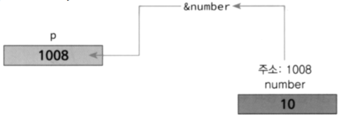

##### 간접 참조 연산자 *

- 포인터 변수에는 주소가 저장되어 있음
- 그 주소에 저장되어 있는 데이터를 얻을 때 사용

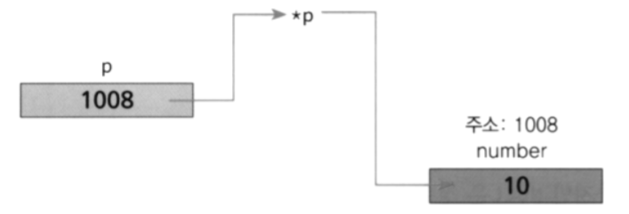

```c++
#include <iostream>
using namespace std;

int main(int argc, char const *argv[]) {
   int number = 0;
   double d = 20.2;

   int *p = &number;
   double *pd = &d;

   cout << p << endl;
   cout << *p << endl;

   cout << sizeof(number) << "," << sizeof(d) << endl;
   cout << sizeof(p) << endl; // int *
   cout << sizeof(pd) << endl; // double *

   return 0;
}
```

- pointer변수는 앞에 소문자**p**를 붙인다 ex) *pNumber

##### NULL

- 포인터가 아무것도 가리키지 않는 것을 의미하는 특수한 데이터
  - 0으로 해석되므로 int이기도 하면서 포인터 이기도 함
- 포인터 변수를 초기화할 때 사용
- nullptr 사용 가능
  - 포인터로만 해석

```c++
#include <iostream>
using namespace std;

void f(int i){
    cout << "f(int)" << endl;
}
void f(char *p){
    cout << "f(char *)" << endl;
}

int main(int argc, char const *argv[]) {
   int *pNumber = NULL; // 권장
   int *pNumber2; // 권장하지 않음, 임의의 초기값을 가짐

   if(pNumber != NULL){ // 포인터의 안전성을 고려하여 사용
       cout << *pNumber << endl;
   }

   if(pNumber2 != NULL){ // 결과 장담 못함
       cout << *pNumber2 << endl;
   }

   // f(NULL); // -- int, char * 둘 다 가능하므로 에러, NULL - 숫자 0
   f(nullptr); // nullptr : 포인터 NULL -> f(char *)
   f(0); // 숫자 0 -> f(int)
   return 0;
}
```

##### 프로그램에서의 메모리

- 스택
  - 지역 변수 할당 (정적 할당) - **선언했을 때 메모리가 할당, 블럭이 끝났을 때 삭제**
  - 시스템에 의해 관리 -  **함수호출 -> 지역변수 할당 -> 함수 끝 -> 지역변수 사라짐**
- 힙
  - 동적 메모리 할당 - **모든게 개발자의 의사**(생성 - **new**, 삭제 - **delete**)
  - 개발자에 의해 관리

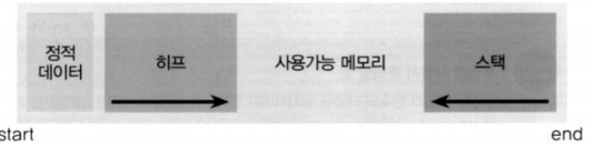

##### new, delete

- new

  - 동적으로 **힙**에 메모리를 할당
  - 리턴값은 **힙의 주소**
  - 대입 연산을 받을 수 있는 것은 **포인터 변수**만 가능하다

- delete

  - 동적으로 힙에 할당된 메모리를 회수
  - 파괴자가 호출됨
  - 동적 메모리를 회수하지 않으면 garbage 증가 -- 메모리 누수

- ```c++
  class T {};
  T *p = new T;
  T *p = new T[N];
  T *p = new T[N] {initializer1, ... , initializeerN};
  ```

- ```c++
  int *p;
  p = new int[5];
  ```

  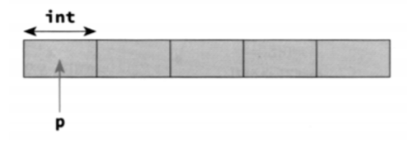

- ```c++
  int *p = new int[5] {0, 1, 2, 3, 4};
  ```

