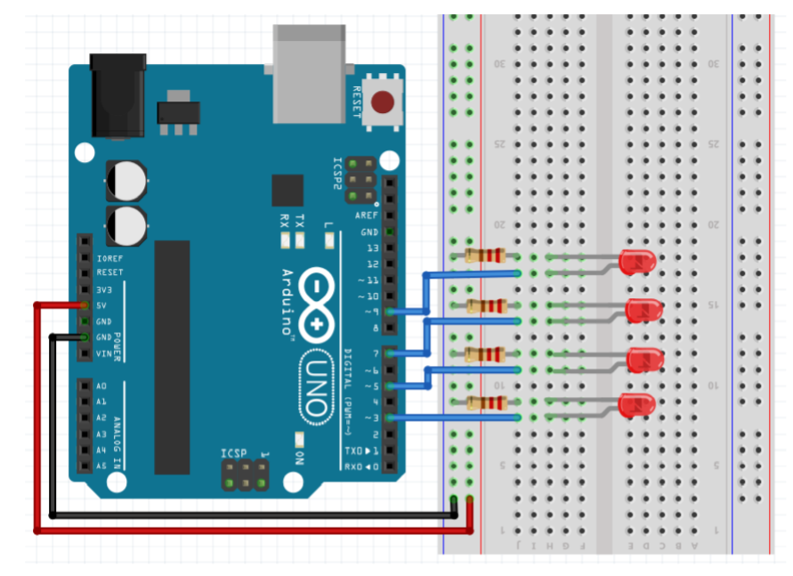
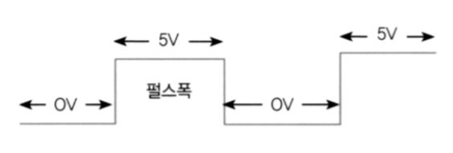

## 2020.09.11 TIL

### LED

##### 여러 개의 LED 점등하기



```java
int pins[] = {8, 7, 6, 5};
int state = 0;

void setup() {
    Serial.begin(9600);
    for (int i = 0; i < 4; i++) {
        pinMode(pins[i], OUTPUT);
        digitalWrite(pins[i], LOW);
    }
}

void loop() {
    for (int i = 0; i < 4; i++) {
        if (i == state) {
            Serial.print("0 ");
            digitalWrite(pins[i], HIGH);
        } else {
            Serial.print("X ");
            digitalWrite(pins[i], LOW);
        }
    }
    Serial.println();
    state = (state + 1) % 4;
    delay(1000);
}
```

##### 시리얼 입력으로 LED 켜고 끄기

```java
int pin_LED = 13;

void setup(){
    Serial.begin(9600);
    pinMode(pin_LED, OUTPUT);
}

void loop(){
    if(Serial.available()) { // 수신 데이터가 있으면 true, 없으면 false
        char inChar = Serial.read();
        if(inChar == '\r' || inChar == '\n') return;
        if(inChar == '1'){
            digitalWrite(pin_LED,HIGH);
        }
        else{
            digitalWrite(pin_LED,LOW);
        }
    }
}
```

##### 시니얼 모니터를 통한 LED 점멸 제어

```java
int pins[] = {3,5,7,9};
int state = 0;

void setup(){
    Serial.begin(9600);
    for(int i=0; i<4; i++){
        pinMode(pins[i], OUTPUT);
        digitalWrite(pins[i],LOW);
    }
}

void loop(){
    if(Serial.available()){
        char data = Serial.read();
        if(data == '\r' || data == '\n') return;

        Serial.print(String("You entered \'") + data + '\'');
        if(data >= '1' && data <= '4') {
            state = data - '0' - 1; // LED 인덱스로 변환
            Serial.print("LED ");
            Serial.print(state + 1);
            Serial.println(" i On...");
        } else {
            Serial.println("* Invalid LED number ...");
            state = -1;
        }

        for(int i=0; i<4; i++) {
            if(i==state) {
                Serial.print("O ");
                digitalWrite(pins[i], HIGH);
            } else {
                Serial.print("X ");
                digitalWrite(pins[i], LOW);
            }
        }
    Serial.println();
    }
}
```

### blink without delay

##### 시간 측정 함수

- **★millis()**
  - 현재 시간은 ms로 리턴
  - unsigned(부호없는) long 타입으로 리턴 

``` java
int pin_LED = 13;
boolean LED_state = false;
unsigned long time_previous, time_current;
unsigned long count = 0;

void setup() {
    pinMode(pin_LED, OUTPUT);
    digitalWrite(pin_LED, LED_state);
    Serial.begin(9600);
    time_previous = millis(); // 초기화되는 첫번째 시간을 previous에 저장
}

void loop() {
    time_current = millis(); // loop 돌때마다 현재시간을 측정
    count ++;
    // 1초 이상 시간이 경과한 경우
    if(time_current - time_previous >= 1000) {
        time_previous = time_current;
        LED_state =!LED_state;
        digitalWrite(pin_LED, LED_state);
        Serial.println(count);
        count = 0;
    }
}
```

##### 서로 다른 점멸 간격을 가지는 2개 LED 제어

```java
int pin_LED1 = 3;
int pin_LED2 = 5;

boolean LED_state1 = false;
unsigned long time_previous1, time_current1;

boolean LED_state2 = false;
unsigned long time_previous2, time_current2;

unsigned long count = 0;

void setup() {
    pinMode(pin_LED1, OUTPUT);
    pinMode(pin_LED2, OUTPUT);
    digitalWrite(pin_LED1, LOW);
    digitalWrite(pin_LED2, LOW);
    Serial.begin(9600);
    time_previous1 = millis();
    time_previous2 = millis();

}


void loop(){
    blink_1000();
    blink_500();
}

void blink_1000() {
    time_current1 = millis();
    // 1초 이상 시간이 경과한 경우
    if(time_current1 - time_previous1 >= 1000) {
        time_previous1 = time_current1; 
        // 1초가 지나고 time_previous를 현재 시간으로 바꿔줌
        LED_state1 = !LED_state1;
        digitalWrite(pin_LED1, LED_state1);
    }
}

void blink_500() {
    time_current2 = millis();
    // 0.5초 이상 시간이 경과한 경우
    if(time_current2 - time_previous2 >= 500) {
        time_previous2 = time_current2;
        LED_state2 = !LED_state2;
        digitalWrite(pin_LED2, LED_state2);
    }
}
```

##### SimpleTimer

```java
#include <SimpleTimer.h>

SimpleTimer timer; // 정적할당, 전역영역

void printTest(){
    Serial.println("simple call by 1 sec");
}

void printTest2(){
    Serial.println("simple call by 0.5 sec");
}

void setup(){
    Serial.begin(9600);
    timer.setInterval(1000, printTest);
    timer.setInterval(500, printTest2);
}

void loop(){
    timer.run();
}
```

##### SimpleTimer를 이용한 2개 LED 제어

```java
#include <SimpleTimer.h>
int pin_LED1 = 3;
int pin_LED2 = 5;
SimpleTimer timer;

void blink_1000(){
    int state = digitalRead(pin_LED1); // 지정한 핀의 현재 상태 읽기
    digitalWrite(pin_LED1, !state);
}

void blink_500(){
    int state = digitalRead(pin_LED2);
    digitalWrite(pin_LED2, !state);
}

void setup(){
    pinMode(pin_LED1, OUTPUT);
    pinMode(pin_LED2, OUTPUT);
    timer.setInterval(1000, blink_1000);
    timer.setInterval(500, blink_500);
}

void loop(){
    timer.run();
}
```

##### LED 밝기 조절(아날로그 출력)

- 아날로그 출력 방식
  - 디지털 출력을 조절해서 동일한 효과를 구현
  - PWM(pulse Width Modulation) : 펄스 폭 변조
    - 디지털 값 -> 아날로그 값 : 아날로그 출력
    - 아날로그의 값의 비율 만큼 HIGH의 폭을 가변
    - PWM 주파수 : 500Hz



- 듀티비, 듀티사이클 (Duty rate, Duty cycle)
  - 500Hz -> 2ms 초마다 바뀜
  - analogWrite()는 0 ~ 255 값 출력
    - analogWrite(255) : 항상 켜짐, 100%
    - analogWrite(127) : 50%


- analogWrite()

  - 아날로그 출력 핀의 전압을 설정하는 함수

  - 전압을 0V에서 5V 사이에 원하는 값으로 설정

  - 틸트(~) 표시가 있는 핀을 사용(6개)

    - ~3, ~5, ~6, ~9, ~10, ~11

  - anologWrite(핀 번호, 전압)

    - 매개변수
      - 핀 번호 : 전압을 설정하고자 하는 핀 번호
      - 전압 : 0~255 0V는 0, 5V는 255를 입력
    - 반환값 : 없음

  - 사용 예

    ```java
    analogWrite(9, 0); // 9번 핀의 전압을 0V로 설정
    analogWrite(9, 129); // 9번 핀의 전압을 약 2.5V로 설정
    analogWrite(9, 255); // 9번 핀의 전압을 5V로 설정
    ```

```java
int pin_LED = 3;
void setup() {
    pinMode(pin_LED, OUTPUT);
}
void loop() {
    for(int i=0; i<=255; i++) { // 0 ~ 100% 천천히 전압 증가
        analogWrite(pin_LED, i);
        delay(20);
    }

    for(int i=255; i>=0; i--){ // 100 ~ 0% 천천히 전압 감소
        analogWrite(pin_LED, i);
        delay(20);
    }
}
```

##### analogWrite이용한 3개 LED 순차적 점등

```java
int leds[] = {3, 5, 6};

void setup() {
    for(auto &pin_LED: leds){
        pinMode(pin_LED, OUTPUT);
    }
}

void repeat(int pin_LED){
    for(int i=0; i<=255; i++) {
        analogWrite(pin_LED, i);
        delay(10);
    }

    for(int i=255; i>=0; i--){
        analogWrite(pin_LED, i);
        delay(10);
    }
}

void loop() {
    for(auto &pin_LED : leds){
        repeat(pin_LED);
    }
}
```

### 3색 LED

- R, G, B 핀에 0~255 사이의 값을 anlogWrite() 함수로 출력
- 3색의 조합으로 색상 결정


##### 자동으로 랜덤하게 색 바꾸기

```java
const int redPin = 11; // RED
const int greenPin = 10; // GREEN
const int bluePin = 9; // BLUE

void setup() {
    randomSeed(analogRead(A0));
    // 랜덤한 숫자가 필요하다, 아두이노 A0 핀에 아무것도 꽂혀있지 않으면 랜덤값을
    // 뿌려주기 때문에 이용(0~1023 사이의 값 랜덤)
}

void loop() {
    analogWrite(redPin, random(256)); // 0~255 사이 랜덤값
    analogWrite(greenPin, random(256));
    analogWrite(bluePin, random(256));
    delay(1000);
}
```

### 16x2 LCD

##### 1602 Character LCD (16×2, LiquidCrystalDisplay 1602 V1)

- 1줄에 16개의 문자씩 2줄을 보여주는 LCD 모듈
- 백라이트는 5V, 가변 저항으로 폰트의 명암을 조정


##### LCD Interface Converter

- I2C 인터페이스를 사용해서 LCD를 제어
  - 단 4개 선으로 LCD 조작
  - 공급전압 : DC 2.5-6V
  - 점퍼 스위치 : LCD 백라이트 ON/OFF 제어
  - 가변저항 : LCD 명암 조절
  - I2C 주소 초기값 : 0x27 또는 0x3F


##### 주요 메소드


``` java
// I2C 주소, 칸 수(X), 줄 수(Y)
LiquidCrystal_I2C lcd(0x27, 16, 2);

void setup()
{
    lcd.init(); // LCD 초기화
    lcd.backlight(); // 백라이트 켜기
    lcd.setCursor(3,0); // 커서 위치 설정 (x,y)
    
    // 문자열 출력
    lcd.print("Hello, world!");
}

void loop() {
    lcd.backlight();
    delay(1000);
    lcd.noBacklight(); // 백라이트 끄기
    delay(1000);
}
```

