## 2020.09.14 TIL

### 16x2 LCD

##### 1602 Character LCD ((16×2, LiquidCrystalDisplay 1602 V1)

- 1줄에 16개의 문자씩 2줄을 보여주는 LCD 모듈
- 백라이트는 5V, 가변 저항으로 폰트의 명암을 조절

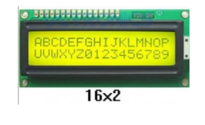

- I2C 인터페이스를 사용해서 LCD를 제어

  - 단 4개 선으로 LCD 조작
  - 공급전압 : DC 2.5-6V
  - 점퍼 스위치 : LCD 백라이트 ON/OFF 제어
  - 가변저항 : LCD 명암 조절
  - I2C 주소 초기값 : 0x27 또는 0x3F

  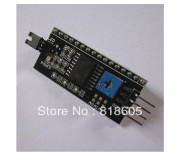

##### 주소 스캐닝

```java
# include <Wire.h>

void setup(){
    Wire.begin();
    Serial.begin(9600);
}

void loop() {
    byte error, address;
    int nDevices = 0;

    Serial.println("Start Scanning...");
    for(address = 1; address < 127; address++ ){
        // 1바이트의 의미 없는 데이터를 전송
        Wire.beginTransmission(address);
        error = Wire.endTransmission();
        if (error == 0){
            Serial.print("I2C device found at address 0x");
            if(address < 16) Serial.print("0");
            Serial.print(address, HEX);
            Serial.println();

            nDevices++;
        }
    }

    if(nDevices == 0)
        Serial.println("No I2C devices found\n");

    delay(5000); // 5초 후 다시 스캐닝
}
```

##### LCD 출력 위치 설정

```java
#include <LiquidCrystal_I2C.h>

LiquidCrystal_I2C lcd(0x27, 16, 2);
void setup()
{
    Serial.begin(9600);
    lcd.init();
    lcd.setCursor(0, 0);
    lcd.print("Arduino LCD");
    delay(1000);
    lcd.setCursor(0, 1);
    lcd.print("Welcome");
    delay(250);

    // LCD 백라이트 두번 점멸
    lcd.noBacklight();
    delay(250);
    lcd.backlight();
    delay(250);
    lcd.noBacklight();
    delay(250);
    lcd.backlight();
    delay(3000);
    // Open Serial Monitor Type to display 표시
    lcd.clear();
    lcd.setCursor(0, 0);
    lcd.print("Open Serial Mntr");
    lcd.setCursor(0, 1);
    lcd.print("Type to display");
}


// 파이썬의 input() 함수에 해당..
String readLine() {
    //
    String line = "";
    // serial로 부터 한줄 입력 받아... line 변수에 저장

    while (Serial.available() > 0)
        {
            char ch = Serial.read();  // 문자 1개 리드
            if(ch != '\r' && ch != '\n')
                line += ch;
        }

    return line;
}

// 16x2
// 라인별로 한줄 전체를 덮어쓰는 형태...

void loop() {

    if (Serial.available()) // 수신된 데이터 있는지
    {
        delay(100);
        lcd.clear(); // 긴 문장 보내고 ---> 짧은 문장 전송.
        lcd.setCursor(0, 0);
        lcd.print("Message from PC");
        lcd.setCursor(0, 1);
        
        String line = readLine();
        if(line != "") {  //수신데이터 유무
            lcd.setCursor(0, 1);
            char buf[17]; 
            // null 문자열이 자동적으로 맨 끝에 자동으로 생겨서 17개로 배열만든다.

            // lcd.print(line.c_str());  // const char * 타입
            sprintf(buf,  "%-8s %04d   ", line.c_str(),123); 
            // 문자열 buf에 출력, %-16s : 16칸 왼쪽 정렬
            lcd.print(buf);
        }
    }
}
```

##### 실수값을 문자열로 변경하기

- ``` java
  char * dtostrf(double __val, signed char __width, unsigned char __prec, char)
  ```

  - __val : 변환할 실수 값
  - __width : 전체 자리 수(소수점은 제외)
  - __prec: 소스점 이하 유효숫자 수
  - __s : 변환된 문자열을 정리할 버퍼

- ``` java
  float fltValue = 123.456;
  char pChrBuffer[50];
  
  dtostrf(fltValue , 5, 2, pChrBuffer); // 5 : width, 2 : precision
  ```

##### 사용자 문자 정의 가능

- 5x7 도트 문자 폰트 데이터

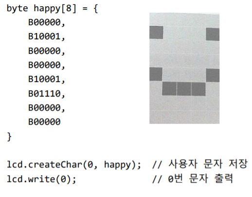

폰트 데이터 커스터마이징 사이트 : [maxpromer](https://maxpromer.github.io/LCD-Character-Creator/) 


##### Timer

```java
#include <SimpleTimer.h>
#include <LiquidCrystal_I2C.h>

LiquidCrystal_I2C lcd(0x27, 16, 2);
SimpleTimer timer;

void printTime(){
    char buf[17];
    unsigned long t = millis();

    // millisecond -> 시:분:초 변환해서 출력
    int misec = t % 1000 / 100; // 100ms 단위
    t = t / 1000; // 밀리초 -> 초
    int h = t / 3600; // 초 -> 시간
    int m = ( t - (h * 3600)) / 60; // 초 -> 분
    int s = t - (h * 3600 + m * 60); // 초

    sprintf(buf, "%02d:%02d:%02d.%d", h, m, s, misec);
    lcd.setCursor(0, 0);
    lcd.print(buf);
}

void setup(){
    Serial.begin(9600);
    lcd.init();
    lcd.backlight();

    timer.setInterval(100, printTime); // 0.1초 간격으로 호출
}

void loop(){
    timer.run();
}
```

### 피에조 부저

- **Active Buzzer** (스티커 있는거)
  - 회로 내장형
  - 전원만 인가되면 단일음
- **Passive Buzzer**
  - 회로 내장하지 않음
  - 필요한 음역대의 주파수(펄스)를 제공하여 멜로디 연주 가능
  - PWM 이용

- 회로 구성

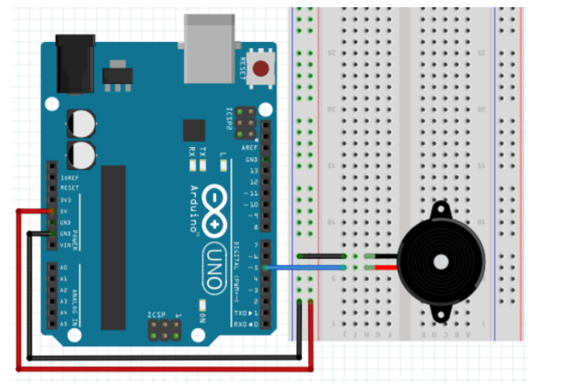

##### 능동 부저

```java
int buzzerPin = 5;

void setup(){
    pinMode(buzzerPin, OUTPUT);
}

void loop(){
    digitalWrite(buzzerPin, HIGH);
    delay(50);
    digitalWrite(buzzerPin, LOW);
    delay(200);
}
```

- **Passive Buzzer**

  - 주파수
    - HIGH/LOW 신호의 비율
    - 신호음의 음 또는 음높이 결정
    - Hz 단위

- 제어 함수

  - tone(핀번호, 주파수 [, 기간])

    - 피에조 스피커에  특정 주파수를 발생
      - 주파수 : unsigned int
      - 기간 : unsigned long
    - tone(9, 2000)
      - 2000 Hz 주파수 소리를 냄
    - tone(9, 2000, 3000)
      - 9000 Hz 주파수 소리를 3초간 냄

    noTone(핀번호)

    - 피에조 스피커에 주파수 발생 중지

    ``` java
    int speakerPin = 5;
    
    void setup(){
    }
    
    void loop(){
        tone(speakerPin, 5000, 1000);
        delay(2000);
    }
    ```

    

##### 도레미파솔라시도 연주하기

```java
int speakerPin = 5;
int melody[] = {262, 294, 330, 349, 392, 440, 494, 523}; // 도레미파솔라시도 주파수

void setup(){
    for(int i=0; i<8; i++){
        tone(speakerPin, melody[i], 250); // 4분음표
        delay(400);
    noTone(speakerPin);
    }
}

void loop(){
}
```

##### 피에조 부저로 연주하기

```java
#define C 262
#define D 294
#define E 330
#define _F 349
#define G 392
#define A 440
#define B 494
#define H 523

int pzoPin = 5;
int tempo = 200; // 음 재생 시간 설정
int notes[25] = {
    G, G, A, A, G, G, E, G, G, E, E, D, G, G, A, A, G, G, E, G, E, D, E, C
};

void setup() {
pinMode(pzoPin, OUTPUT);
}

void loop() {
    for(int i=0; i<12; i++) {
        tone(pzoPin, notes[i], tempo);
        delay(300);
    }
delay(100);

    for(int i=12; i<25; i++) {
        tone(pzoPin, notes[i], tempo);
        delay(300);
    }
}
```

##### 멜로디 만들기

```java
#include <pitches.h>
int speakerPin = 5;

int melody[] = {
    NOTE_C4, NOTE_G3, NOTE_G3, NOTE_A3, NOTE_G3, 0, NOTE_B3, NOTE_C4,
};

// 음표의 길이 4 = 4분음표(한박자), 8 = 8분 음표(반 박자)
int noteDurations[] = {4, 8, 8, 4, 4, 4, 4, 4};

void setup() {
    for(int thisNote = 0; thisNote<8; thisNote++) {
        int noteDuration = 1000/noteDurations[thisNote];
        tone(speakerPin, melody[thisNote], noteDuration);
        // 음을 구별하기 위해 그 사이에 최소한의 간격을 둔다.
        int pauseBetweenNotes = noteDuration * 1.30;
        delay(pauseBetweenNotes);
        noTone(speakerPin); // 멜로디 멈춤
    }
}

void loop() {}
```

### 버튼

##### 택트(Tact) 스위치

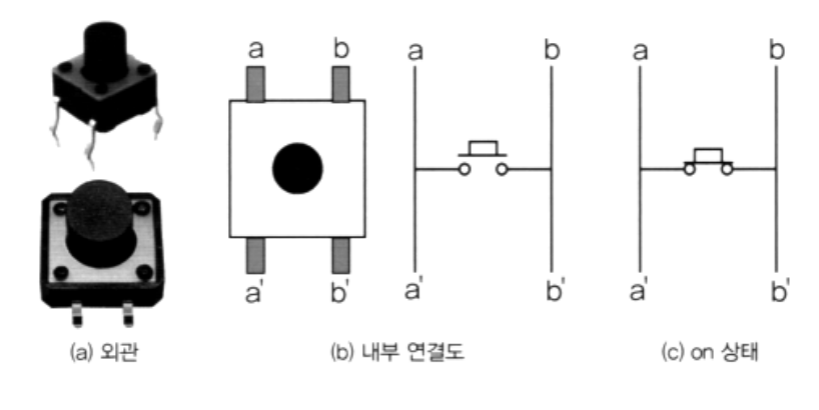

##### 풀업 방식 스위치 on, off 상태

- 풀업 저항
  - 전압 소스와 회로 내에 있는 입력 핀 사이에 배치 - 디폴트 HIGH
  - 버튼/스위치는 입력 핀과 접지(GND) 사이에 배치 - 스위치를 누르면 LOW
  - 하드웨어 구성으로 풀업 방식을 **더 선호** (저항이 회로를 보호해주고 있기 때문)

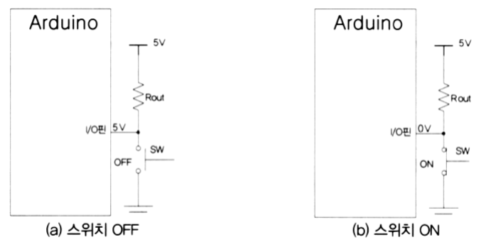

##### 풀다운 방식 스위치 on, off 상태

- 풀다운 저항
  - 접지와 회로 내에 있는 입력 핀 사이에 배치 - 디폴트 LOW
  - 버튼/스위치는 전원 소스와 핀 사이에 배치 - 스위치를 누르면 HIGH

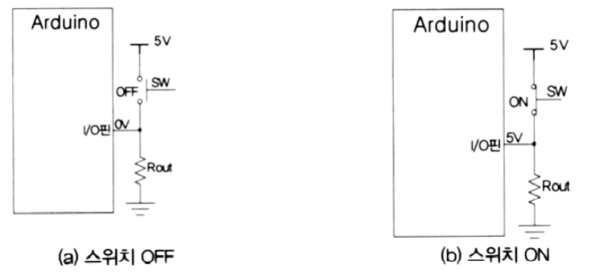

##### 디지털 입력 읽기

- digitalRead(핀번호)
  - 해당 핀 번호의 값 읽기
  - HIGH/LOW 리턴

##### 풀다운 버튼

- 버튼 연결 저항 : 10k옴
- 디폴트 : LOW
- 누른 경우 : HIGH

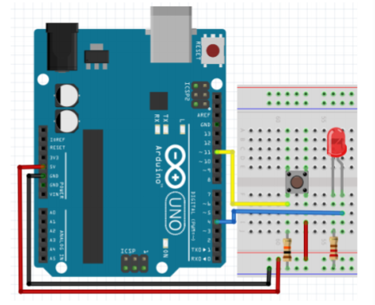

##### 버튼으로 LED 켜고 끄기(풀다운)

```java
int LED = 13;
int BUTTON = 11;
void setup() {
    pinMode(BUTTON, INPUT);
    pinMode(LED, OUTPUT);
}
void loop() {
    if(digitalRead(BUTTON)) { // 누른 경우
    digitalWrite(LED, HIGH);
    } else {
    digitalWrite(LED, LOW);
    }
    delay(10);
}
```

##### 풀업 버튼

- 버튼 연결 저항 : 10k옴
- 디폴트 : HIGH
- 누른 경우 : LOW
- 권장 구성

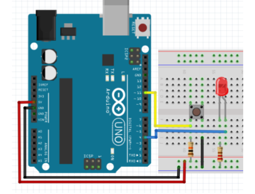

``` java
int LED = 13;
int BUTTON = 11;
void setup() {
    pinMode(BUTTON, INPUT);
    pinMode(LED, OUTPUT);
}
void loop() {
    if(digitalRead(BUTTON) == LOW) { // 누른 경우
    digitalWrite(LED, HIGH);
    } else {
    digitalWrite(LED, LOW);
    }
    delay(10);
}
```

##### 내부 풀업 저항 사용 시 I/O

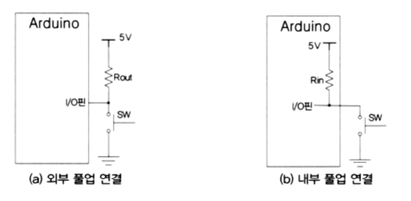

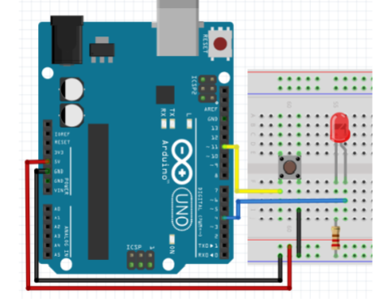

```java
const int ledPin = 13;
const int inputPin = 11;

void setup() {
    pinMode(ledPin, OUTPUT);
    pinMode(inputPin, INPUT_PULLUP); // 내부 풀업 스위치
}
void loop() {
    int swInput = digitalRead(inputPin);

    if(swInput == LOW)
        digitalWrite(ledPin, HIGH);
    else
        digitalWrite(ledPin, LOW);
}
```

##### 2개 LED의 1개의 버튼

- 12번 LED는 1초간격으로 점멸
- 13번 LED는 버튼을 누른 경우에만 켜짐

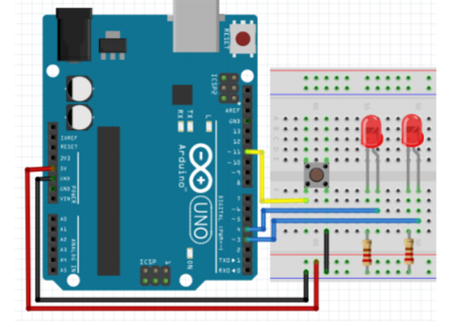

``` java
#include <SimpleTimer.h>

SimpleTimer timer;

int pin_LED1 = 4;
int pin_LED2 = 3;
int pin_button = 11;
boolean LED_state = false;
void setup() {
    pinMode(pin_LED1, OUTPUT);
    digitalWrite(pin_LED1, LED_state);
    pinMode(pin_LED2, OUTPUT);
    digitalWrite(pin_LED2, false);

    pinMode(pin_button, INPUT_PULLUP); // 버튼처리할 때 가장 중요!
    timer.setInterval(1000, blink); // 1초 간격으로 블링크, 함수를 매개변수로 참조하는것
}

void blink(){
    LED_state = !LED_state; // 타이머 운영
    digitalWrite(pin_LED1, LED_state); 
}
void loop() {
    timer.run(); 
    // 버튼 상태를 읽어서 13번 핀에 연결된 LED에 표시
    digitalWrite(pin_LED2, !digitalRead(pin_button)); // 풀업이기때문에 부정(!)
}
```

- **함수명** 의미 : 함수의 시작주소를 가지고 있는 포인터 상수
- **배열명**의 의미 : int a[10]; 변수 a 자체는 첫 번째 엘리먼트의 주소를 가리키는 포인터 (상수)


##### 디지털 신호 입력 시간 측정하기

```java
const int pin_button = 11;
long startTime = 0;
long swCountTimer = 0;


void setup() {
    Serial.begin(9600);
    pinMode(pin_button, INPUT_PULLUP); // 버튼처리할 때 가장 중요!

}

void loop() {
    if(digitalRead(pin_button) == LOW){ // 스위치가 눌러진 경우
        startTime = millis(); // 현재 시간 측정
        while(digitalRead(pin_button) == LOW); // 눌러진 시간 동안 지연

        // 스위치를 뗀 시간을 측정하여 차이 계산
        swCountTimer = millis() - startTime;

        Serial.print(swCountTimer);
        Serial.println(" ms");
    }
}
```

##### 채터링

- 버튼을 누르거나 뗄 때 물리적 접촉 발생으로 짧은 시간 동안 ON/OFF를 반복하는 것

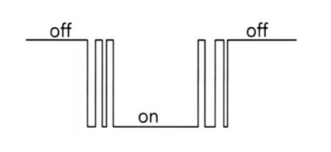

- 해결 방법 (디바운스, debounce)
  - 채터링이 끝날 때까지 조금 대기


##### 스위치 상태 변경 시점 감지

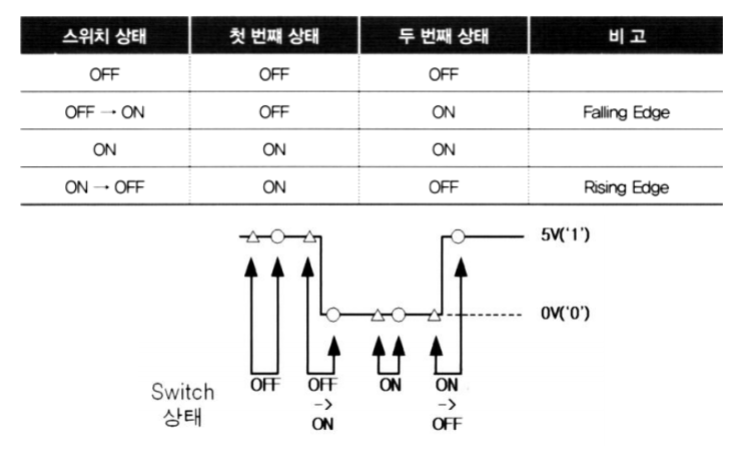

##### 버튼 누른 횟수 세기

```java
int pin_button = 11;
boolean state_previous = true;
boolean state_current;

int count = 0;
void setup() {
    Serial.begin(9600);
    pinMode(pin_button, INPUT_PULLUP);
}

void loop() {
    state_current = digitalRead(pin_button);
    if(!state_current){ // 누른 경우
        if(state_previous == true){
            // 버튼을 누른 시점에서 해야할 작업, 굉장히 중요함
            count++;
            Serial.println(count);
        }
        delay(10); // 채터링방지
    } else {
        state_previous = true;
    }
}
```

##### 모듈화를 통해 코드 클래스화

- **Led.h**

  ```java
  #pragma once
  
  #include <Arduino.h> // cpp 파일에서 DigitalRead, Write, HIGH, LOW 등을 사용할 수 있음
  
  class Led{ // Digital Device
  protected:
      int pin;
  
  public:
      Led(int pin);
      void on();
      void off();
      void toggle();
      void set(int value);
  }
  ```

- **Led.cpp**

  ```java
  #include "Led.h"
  
  Led::Led(int pin) : pin(pin){
      pinMode(pin, OUTPUT);
  }
  
  void Led::on(){
      digitalWrite(pin, HIGH);
  }
  void Led::off(){
      digitalWrite(pin, LOW);
  }
  void Led::toggle(){
      int state = digitalRead(pin);
      digitalWrite(pin, !state);
  }
  void Led::set(int value){
      digitalWrite(pin, value);
  }
  ```

- **Button.h**

  ```java
  #pragma once
  #include <Arduino.h>
  
  class Button{
  protected:
      int pin;
      bool state_previous = true;
      bool state_current;
  
  public:
      Button(int pin);
      int read();
  };
  ```

- **Button.cpp**

  ```java
  #include "Button.h"
  
  Button::Button(int pin) : pin(pin){
      pinMode(pin, INPUT_PULLUP);
      state_previous = true;
  }
  
  int Button::read(){
      return !digitalRead(pin);
      // 실제 하드웨어는 pullup이지만 소프트웨어에선 pulldown형식으로 운영하기 위해 부정(!)을 붙임
  }
  
  ```

- **app.ino**

  ```java
  #include "Led.h"
  #include "Button.h"
  
  Led led(13);
  Button btn(11);
  
  void setup() {
      Serial.begin(9600);
  }
  
  void work(){
      led.toggle();
  }
  
  void loop() {
      led.set(btn.read()); // pullup 버튼인 경우 반전
      // if(!state_current){ // 누른 경우
      //     if(state_previous == true){
      //         // 버튼을 누른 시점에서 해야할 작업
      //         state_previous = false;
      //         work();
      //     }
      //     delay(10); // 채터링방지
      // } else {
      //     state_previous = true;
      // }
  }
  ```

  