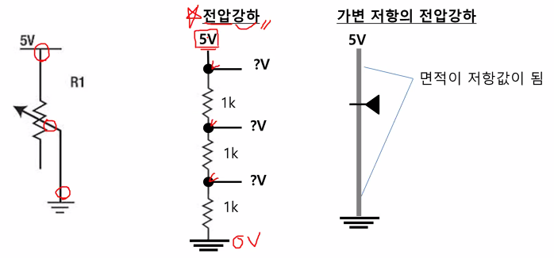
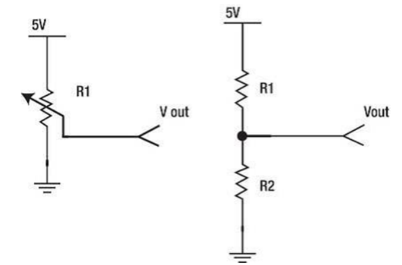
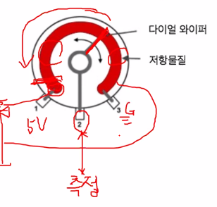
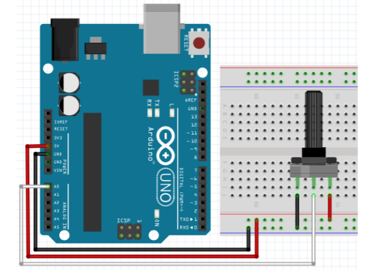
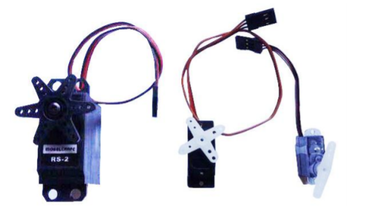
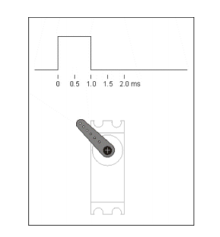
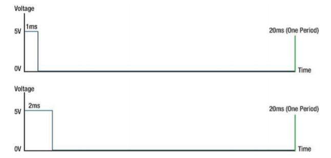
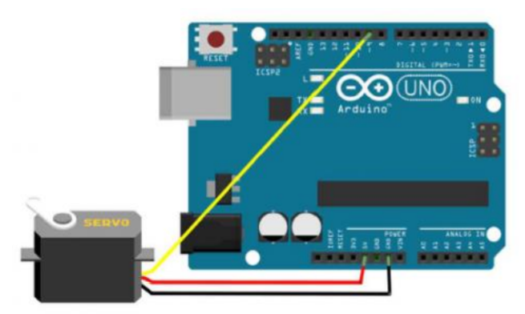
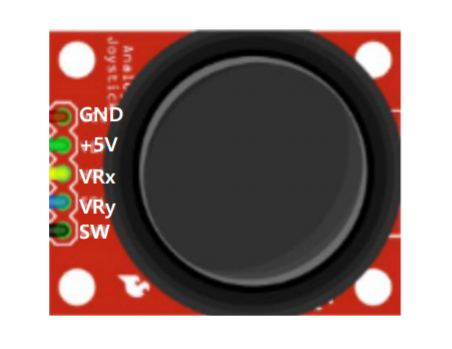
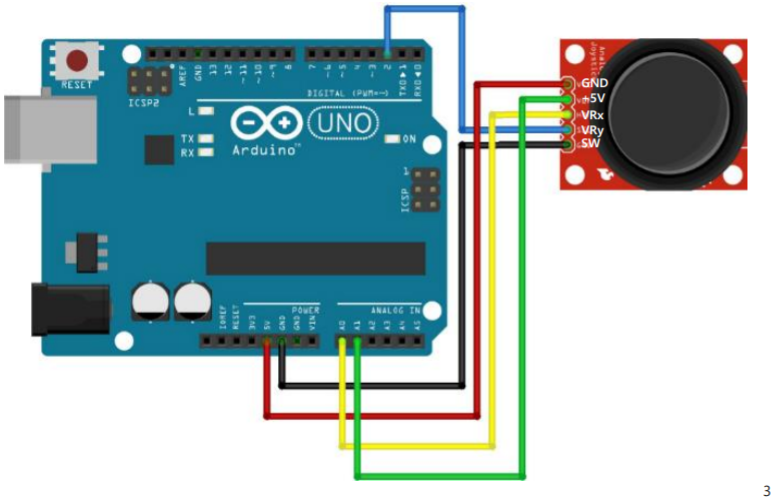

## 2020.09.15 TIL

##### 모듈화를 통해 코드 클래스화

- **Led.h**

  ```java
  #pragma once
  
  #include <Arduino.h> // cpp 파일에서 DigitalRead, Write, HIGH, LOW 등을 사용할 수 있음
  
  class Led{ // Digital Device
  protected:
      int pin;
  
  public:
      Led(int pin);
      void on();
      void off();
      void toggle();
      void set(int value);
  }
  ```

- **Led.cpp**

  ```java
  #include "Led.h"
  
  Led::Led(int pin) : pin(pin){
      pinMode(pin, OUTPUT);
  }
  
  void Led::on(){
      digitalWrite(pin, HIGH);
  }
  void Led::off(){
      digitalWrite(pin, LOW);
  }
  void Led::toggle(){
      int state = digitalRead(pin);
      digitalWrite(pin, !state);
  }
  void Led::set(int value){
      digitalWrite(pin, value);
  }
  ```

- **Button.h**

  ```java
  #pragma once
  #include <Arduino.h>
  
  class Button{
  protected:
      int pin;
      bool state_previous = true;
      bool state_current;
      void (*callback)();
  
  public:
      Button(int pin);
      int read();
      void setCallback(void (*callback)());
      // 매개변수가 return 타입이 없는 함수의 대한 포인터를 전달 받겠다.
      int check();
  };
  ```

- **Button.cpp**

  ```java
  #include "Button.h"
  
  Button::Button(int pin) : pin(pin){
      pinMode(pin, INPUT_PULLUP);
      state_previous = true; // default : HIGH
      callback = NULL;
  }
  
  int Button::read(){
      return !digitalRead(pin);
      // 실제 하드웨어는 pullup이지만 소프트웨어에선 pulldown형식으로 운영하기 위해 부정(!)을 붙임
  }
  
  void Button::setCallback(void (*callback)()){
      this -> callback = callback;
  }
  
  int Button::check(){
      state_current = digitalRead(pin);
      if(!state_current){ // 누른 경우
          if(state_previous == true){
              // 버튼을 누른 시점에서 해야할 작업
              state_previous = false;
              if(callback != NULL){
                  callback();
              }
          }
          delay(10); // 채터링방지
      } else {
          state_previous = true;
      }
  }
  ```

- **app.ino**

  ```java
  #include "Led.h"
  #include "Button.h"
  
  Led led(13);
  Button btn(11);
  
  void work() {
      led.toggle();
  }
  
  void setup() {
      Serial.begin(9600);
      btn.setCallback(work);
  }
  
  
  // 함수 포인터 형식 : void(*포인터_변수명)(매개변수);
  
  void loop() {
      // led.set(btn.read()); // pullup 버튼인 경우 반전
      btn.check(); // 에지(Falling)가 발생했는지
  }
  ```

- **함수 포인터 형식** : void(*포인터_변수명)(매개변수);

- 객체화 장점 : 인스턴스를 여러개 만들 수 있다

##### 버튼 및 LED 제어

- app.ino

```java
#include "Led.h"
#include "Button.h"
#include <SimpleTimer.h>

SimpleTimer timer; // 정적할당, 전역영역

Led led1(3);
Led led2(4);
Led led3(6);

Button btn1(9);
Button btn2(10);
Button btn3(12);

bool blinkPlay = false; // 블링크 중인지 여부, 디폴트는 중지
int blinkTimer = -1; // 블링크용 타이머 ID

void led2OnOff() {
    led2.toggle();
}

void led3Blink(){
    led3.toggle();
}

void led3BlinkControl() {
    blinkPlay = !blinkPlay; // 상태반전
    if(!blinkPlay){ // 이제 블링크 중지면
        led3.off(); 
    }
    timer.toggle(blinkTimer); // 타이머 활성 / 비활성 토글
}

void setup() {
    Serial.begin(9600);
    btn2.setCallback(led2OnOff);
    btn3.setCallback(led3BlinkControl);
    blinkTimer = timer.setInterval(500, led3Blink);
    timer.disable(blinkTimer);
}


// 함수 포인터 형식 : void(*포인터_변수명)(매개변수);

void loop() {
    timer.run();
    led1.set(btn1.read()); // pullup 버튼인 경우 반전
    btn2.check(); // 에지(Falling)가 발생했는지
    btn3.check();
}
```

##### StopWatch

```java
#include <Led.h>
#include <Button.h>
#include <SimpleTimer.h>
#include <LiquidCrystal_I2C.h>

LiquidCrystal_I2C lcd(0x27, 16, 2);
SimpleTimer timer;

Led led1(3); // 정지 상태에서 on, 기동 중 off
Led led2(4); // 기동중 블링크
// Led led3(6);

Button btn1(9); // start, stop
Button btn2(10); // lap time
Button btn3(12); // reset

int timerId = -1; // stopwatch용 타이머
int blinkTimerId = -1; // 블링크용 타이머

bool state = false; // 0: 준비 상태, 1: 가동 상태
unsigned long startTime = 0; // 시작 버튼을 누른 시점 시간 ****

void printTime(unsigned long t, int row){
    char buf[17];

    // millisecond -> 시:분:초 변환해서 출력
    int misec = t % 1000 / 100; // 100ms 단위
    t = t / 1000; // 밀리초 -> 초
    int h = t / 3600; // 초 -> 시간
    int m = ( t - (h * 3600)) / 60; // 초 -> 분
    int s = t - (h * 3600 + m * 60); // 초

    sprintf(buf, "%02d:%02d:%02d.%d", h, m, s, misec);
    lcd.setCursor(0, row);
    lcd.print(buf);
}

void printTime(){
    unsigned long t = millis();
    unsigned long diff = t - startTime;
    printTime(diff, 0);
}

void startStop(){
    if(state == false){ // 리셋 이후 처음 버튼을 누른 경우
        // 최초 기동 시작
        startTime = millis(); // 기준 시간 설정
        timer.enable(blinkTimerId);
        led2.off();
        state = true; // 기동중임을 설정
    }

    timer.toggle(timerId);
}

void laptime(){
    if(state){ // 가동중일 때만 출력
        unsigned long t = millis();
        unsigned long diff = t - startTime;
        printTime(diff, 1);
    }
}

void reset(){
    state = false;
    lcd.clear();
    lcd.setCursor(0,0);
    lcd.print("00:00:00.0");
    led1.on();
    led2.off();
    timer.disable(timerId);
    timer.disable(blinkTimerId);
}

void blink(){
    led2.toggle();
}

void setup(){
    Serial.begin(9600);
    lcd.init();
    lcd.backlight();

    // 타이머 ID, 0부터 배정
    timerId = timer.setInterval(100, printTime); // 스톱워치용 0.1초 간격으로 호출
    blinkTimerId = timer.setInterval(250, blink); // 블링크용 0.25초 간격으로 호출
    reset();

    btn1.setCallback(startStop);
    btn2.setCallback(laptime);
    btn3.setCallback(reset);
}

void loop(){
    timer.run();
    btn1.check();
    btn2.check();
    btn3.check();
}
```

- void disable(int timerId)
  - 지정한 timerId 비활성화


### 가변 저항

##### 가변저항

- 가변저항 특성

  - 값이 변하는 저항

  - 세 개의 선으로 회로에 연결

  - 연결 방법에 따라 두가지 기능 제공

    - 바깥 단자와 중간 단자만 연결하는 경우

    



- 가변저항의 모양
  - trimmer 타입
    - 스크류 드라이버를 이용하여 저항을 조절
  - rotary 타입
    - 손잡이로 저항을 조정

- 가변저항 특성

  - 연결 방법에 따라 두가지 기능 제공
    - 세번째 단자도 회로에 연결하는 경우
      - 전형적인 전압 분위기

  



- 보드 설정하기
  - 아날로그 입력
    - A0~A5
    - 칩 내부에서 ADC(Analog to Digital Converter) 모듈로 연결
      - 아날로그 -> 디지털
      - 아날로그 값의 범위 0~5V -> 0~1023 사이의 디지털 값으로 변환
    - 대부분의 센서들은 아날로그 입력 핀으로 연결
- 가변 저항
  - ADC로 연결되는 부품
    - 센서의 입력 원리와 같다
    - 센서는 환경에 따라 변하고, 가변저항은 사람이 조정하는 점이 차이



- 아날로그 값 읽기

  - 아날로그 입력 핀 사용

    - A0 ~ A5 판

    - 0~5V 사이의 입력 전압의 변화 감지

    - analogRead(핀번호)

      - 0~1023 범위의 아날로그 값으로 리턴

      - 해당 입력 값을 Voltage로 변환

      - ```java
        float voltage= sensorValue * (5.0 / 1023.0);
        ```

- 가변 저항 테스트

  ```java
  int vResister = A0;
  void setup() {
      Serial.begin(9600);
      pinMode(vResister, INPUT);
  }
  
  void loop() {
      Serial.println(analogRead(vResister));
      delay(1000);
  }
  ```

- 가변저항으로 LED 빛 조절하기

  ```java
  int LED = 10;
  
  void setup() {
      pinMode(LED, OUTPUT);
  }
  void loop() {
      int readVal = analogRead(A0); // 범위 0~1023
      int brightVal = readVal / 4;
      analogWrite(LED, brightVal); // PWM 범위는 0~255이기 때문에 /4 연산
      delay(10);
  }
  ```

  

- map(value, fromLow, fromHigh, toLow, toHigh);

  - 숫자를 한 범위에서 다른 곳으로 변환
  - 매개변수
    - value : 변환할 수
    - fromLow : 현재 범위 값의 하한
    - fromHigh : 현재 범위 값의 상한
    - toLow : 목표 범위 값의 하한
    - toHigh : 목표 범위 값의 상한
  - 반환값
    - 새로운 범위의 값

- map()함수

  ```java
  const int ledPin = 10;
  const int potentiometerPin = A0;
  int potentiometerValue;
  int brightness;
  void setup() {
      Serial.begin(9600);
  }
  
  void loop() {
      potentiometerValue = analogRead(potentiometerPin);
  
      Serial.print("potentiometer Value : ");
      Serial.println(potentiometerValue);
  
      brightness = map(potentiometerValue, 0, 1023, 0, 255);
      Serial.print("potentiometer Value : ");
      
      Serial.println(brightness);
      analogWrite(ledPin, brightness);
  }
  ```

- LCD에 가변저항 출력

  ```java
  #include <LiquidCrystal_I2C.h>
  
  // I2C 주소, 칸 수(X), 줄 수(Y)
  LiquidCrystal_I2C lcd(0x27, 16, 2);
  
  const int ledPin = 10;
  const int potentiometerPin = A0;
  int potentiometerValue;
  int brightness;
  void setup() {
      Serial.begin(9600);
      lcd.init(); // LCD 초기화
      lcd.backlight(); // 백라이트 켜기
      lcd.setCursor(0,0); // 커서 위치 설정 (x,y)
  }
  
  void loop() {
      char buf[17];
  
      potentiometerValue = analogRead(potentiometerPin);
  
      sprintf(buf, "org : %4d", potentiometerValue);
      lcd.setCursor(0, 0);
      lcd.print(buf);
  
      brightness = map(potentiometerValue, 0, 1023, 0, 255);
      // map함수는 많이 쓰임 (0,1023,255,0) 처럼 감소하는 범위도 가능
  
      sprintf(buf, "bright : %4d", brightness);
      lcd.setCursor(0, 1);
      lcd.print(buf);
  
      analogWrite(ledPin, brightness);
  }
  ```

  ### 서보모터 제어

  ##### 서보 모터 제어하기

- 서보 모터

  - 미리 정해진 범위 내에서 모터의 축을 세부 조정하도록 제한된 모터
  - 취미용 서보
    - 축의 움직임 범위 180도
    - 50Hz의 주파수 내에서 주파수를 이용해 동작
      - -> 20ms의 신호주기
  - 제어를 위한 특별한 회로 없음 -> 바로 연결 가능



- 서보 모터
  - 마이크로 서보모터(SG-90)
    - 0~180도 회전
    - 선구분
      - 주황 : 디지털 핀
      - 빨간 : 전원 Vcc
      - 갈색 : Gnd



- 서보 모터 제어
  - 신호가 HIGH로 설정된 시간 양 -> 서보의 각도
    - 가장 왼쪽에 배치
      - 1ms 동안 HIGH 유지, 남은 시간은 LOW 유지
    - 가장 오른쪽에 배치
      - 2ms 동안 HIGH 유지, 남은 시간은 LOW 유지



- 서보 모터
  - 3개의 핀
    - 빨간 선 : Vin / +5V에 연결
    - 검은 선 : GND 연결
    - 기타(오렌지 또는 흰색) : 디지털 출력 핀으로 연결
- 연결
  - 주황색선을 9번 핀에 연결



- Servor 클래스 객체

  - 서보모터 제어 메서드 제공

  - Servo.h 포함

    ```java
    #include <Servo.h>
    
    Servo servoMotor;
    ```

  - 서보 모터의 데이터선 연결 핀 설정

    ```java
    servomotor.attach(핀번호);
    ```

  - 서보 모터에 전달할 각도값 설정

    ```java
    servomotor.write(각도); // 0~179
    ```

    

```java
#include <Servo.h>

Servo servoMotor;
const int servoMotorPin = 9;
int angle;

void setup() {
    servoMotor.attach(servoMotorPin);
    servoMotor.write(0);
    delay(1000);
}

void loop() {
    for(angle = 0; angle <= 179; angle++) {
        servoMotor.write(angle);
        delay(10);
    }

    delay(100);

    for(angle = 179; angle >= 0; angle--) {
        servoMotor.write(angle);
        delay(10);
    }

    delay(100);
}
```

- 가변저항 서브모터 제어

  ```java
  #include <LiquidCrystal_I2C.h>
  #include <Servo.h>
  #include <AnalogSensor.h>
  #include <SimpleTimer.h>
  
  AnalogSeneor poten(A0, 0, 180);
  // I2C 주소, 칸 수(X), 줄 수(Y)
  LiquidCrystal_I2C lcd(0x27, 16, 2);
  
  const int servoPin = 9;
  Servo servoMotor;
  SimpleTimer timer;
  
  void motorControl(){
      char buf[17];
  
      int angle = poten.read();
      servoMotor.write(angle);
  
      sprintf(buf, "angle : %3d", angle);
      lcd.setCursor(0, 0);
      lcd.print(buf);
  }
  
  void setup() {
      lcd.init(); // LCD 초기화
      lcd.backlight(); // 백라이트 켜기
      lcd.clear();
  
  
      servoMotor.attach(servoPin);
      servoMotor.write(poten.read());
      timer.setInterval(50, motorControl);
      Serial.begin(9600);
  }
  
  void loop() {
      timer.run();
  }
  ```


### 조이스틱

- 조이스틱

  - VRx : x축 가변 저항 (아날로그 입력 연결)
  - VRy : y축 가변 저항 (아날로그 입력 연결)
  - sw : 스위치(디지털 입력 연결)

  



```java
#include <AnalogSensor.h>
#include <Button.h>
#include <SimpleTimer.h>
#include <LiquidCrystal_I2C.h>

AnalogSeneor jX(A0, 0, 1023);
AnalogSeneor jY(A1, 0, 1023);
Button btn(2);

LiquidCrystal_I2C lcd(0x27, 16, 2);
SimpleTimer timer;

void readJoystick(){
    char buf[17];

    int x = jX.read();
    int y = jY.read();
    int z = btn.read();
    sprintf(buf, "x: %4d, y: %4d", x,y);
    lcd.setCursor(0, 0);
    lcd.print(buf);

    sprintf(buf, "z: %d", z);
    lcd.setCursor(0, 1);
    lcd.print(buf);
}

void setup() {
    lcd.init(); // LCD 초기화
    lcd.backlight(); // 백라이트 켜기
    lcd.clear();

    timer.setInterval(50, readJoystick);
    Serial.begin(9600);
}

void loop() {
    timer.run();
}
```