## 2020.09.23 TIL

### 라즈베리 파이

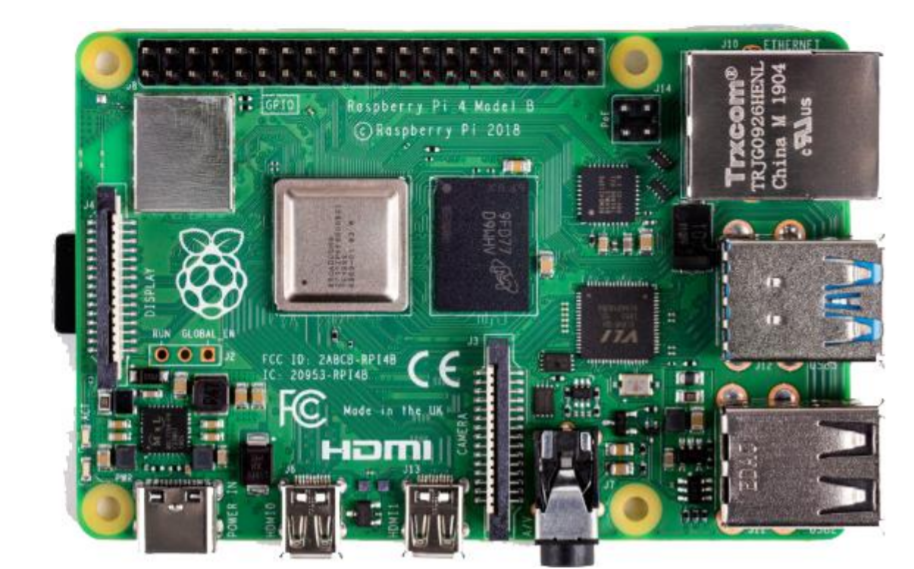

-  라즈베리 파이 타입별 스펙

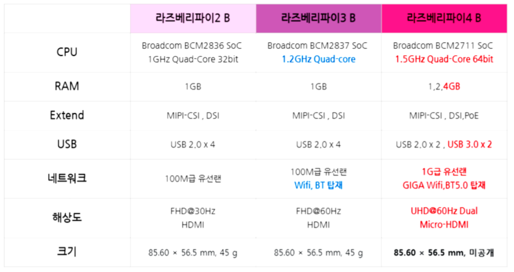

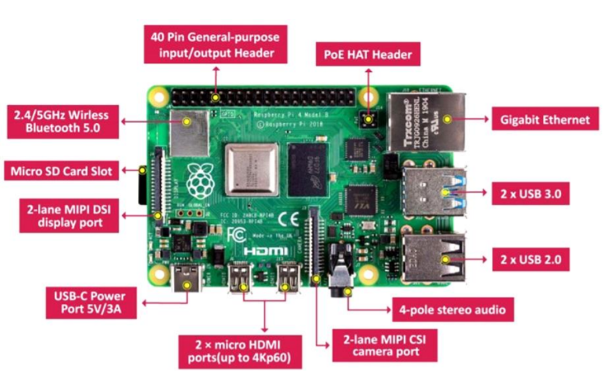

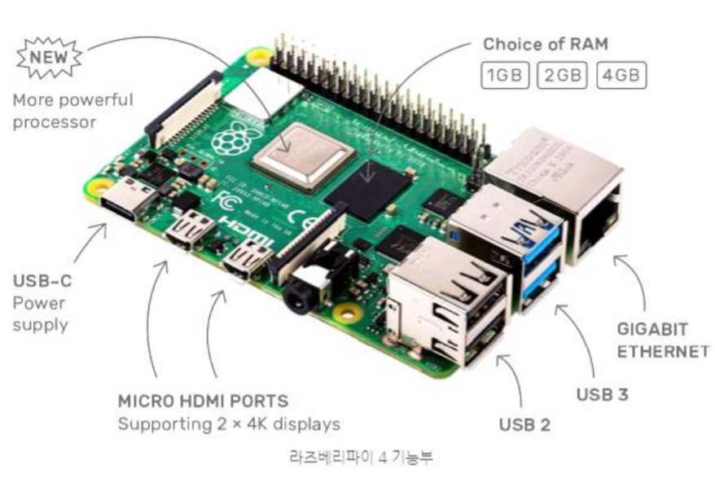

- 핀번호

  - BOARD : 보드의 핀 번호로 설정
    - GPIO.setmode(GPIO.BOARD)
  - BCM : GPIO 핀 번호로 설정
    - GPIO.setmode(GPIO.BCM)

  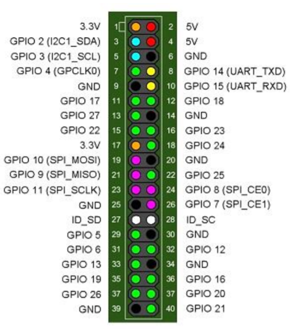


- 시스템 업데이트

  ```shell
  $ sudo apt update
  $ sudo apt upgrade
  ```

  - 주 1회 간격으로 실행 권장

- 가상 키패드 설치

  ```shell
  $ sudo apt install florence -y
  $ sudo apt install at-spi2-core -y
  ```

  - 메뉴 > Universal Access > Florence Virtual Keyboard

    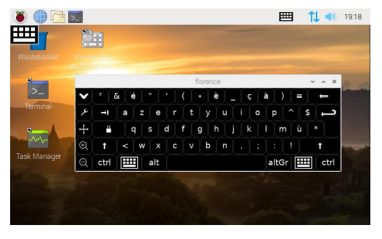

- 한글 폰트 설치

  ```shell
  $ sudo apt-get install fonts-unfonts-core
  ```

- 한글 입력기 설치

  ```shell
  $ sudo apt-get install nabi im-config
  ```

- 5인치 터치 LCD 드라이버

  ```shell
  $ git clone https://github.com/goodtft/LCD-show.git
  $ cd LCD-show/
  $ chmod +x LCD5-show
  $ sudo ./LCD5-show
  ```

### Samba

##### Samba

- 삼바(Samba)

  - 리눅스(UNIX-like)와 윈도우간에 파일 및 프린터를 공유 지원 패키지
  - 컴퓨터 간 파일 공유등의 서비스 구현
  - SMB/CIFS 프로토콜 사용
  - 리눅스 서버를 타운영체제와 파일을 공유할 수 있는 파일서버로도 사용

- 삼바 설치

  ```shell
  $ sudo apt install samba samba-common-bin
  ```

- 사용자 추가

  - 시스템 사용자 id와 삼바 사용자 id 다름
  - smbpasswd로 삼바를 사용할 id를 추가
    - 이 id를 사용하여, 다른 컴퓨터에서 라즈베리파이로 삼바 접속


- 삼바 구성 정보 설정

  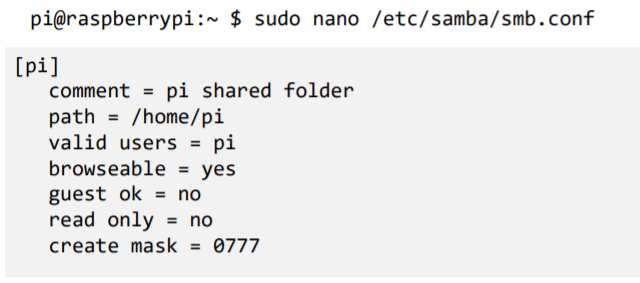

- samba 재시작

  ```shell
  $ sudo service smbd restart
  ```


### Python3 설정

- 라즈베리파이의 파이썬

  - /usr/bin에 기본 명령 존재
  - python : python2에 대한 심벌릭 링크
  - pip : pip2의 복사본

- python3을 디폴트로 만들기

  ```shell
  $ cd /usr/bin
  $ sudo ln -sf python3.7 python
  $ sudo ln -sf python3.7-config python-config
  $ sudo cp pip3 pip
  ```

  

### 리눅스 기초 

- 리눅스 디렉토리 구조

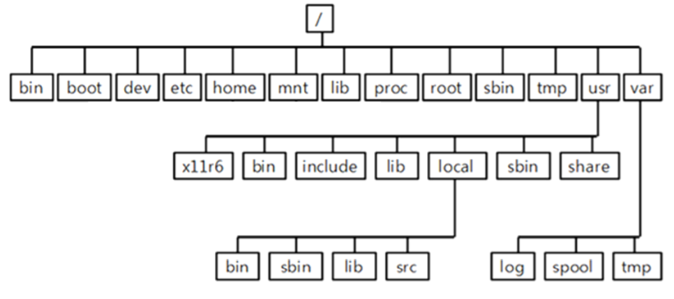

- /etc

  - 시스템 환경 설정 파일이 있는 디렉토리
  - 네트워크 관련 설정파일, 사용자 정보 및 암호정보, 파일 시스템 정보, 보안파일, 시스템 초기화 파일등 중요 설정 파일들의 위치한 디렉토리
  - /etc/cron.d : crontab 명령의 설정파일이 있음
  - /etc/cron.daily : 매일 작동하게 하는 crontab 스크립트 파일이 존재
  - /etc/httpd : 아파치 웹 서버의 설정 및 로그파일이 있음
  - /etc/mail : 센드메일과 관련된 파일이 있음
  - /etc/ppp : ppp 설정에 관련된 파일들이 있음
  - /etc/profile.d : 쉘 로그인 하여 프로파일의 실행되는 스크립트에 대한 정의 가 있음
  - /etc/rc.d : 시스템 초기화와 관련된 스크립트가 존재
  - /etc/samba : 삼바에 관련된 파일들이 있음
  - /etc/security : 터미널 보안에 관련된 설정이 있음
  - /etc/skel : 새로운 사용자를 추가할 때 자동적으로 생성되는 디렉토리와 파일 이 있음
  - /etc/ssh : secure shell 설정 파일이 있음
  - /etc/sysconfig : 시스템과 네트워크 설정을 담고 있음

- 쉘(shell)

  - 사용자와 운영체제를 연결해주는 프로그램
    - 사용자가 입력한 명령을 실행
  - Windows의 cmd.exe, powershell.exe에 해당
  - 리눅스에서는 터미널을 통해 제공
    - Ctrl + Shift + T

- date 명령어

  - 현재 날짜 확인 및 설정

    ```shell
    $ date
    $ sudo date -s "2020-08-01 09:00:00"
    ```

- hostname 명령어

  - 호스트의 이름 확인 및 변경

- ls 명령어


- passwd 명령어

  - 사용자 비밀번호 변경

    ```shell
    $ passwd # 자신의 비밀번호 변경
    $ sudo passwd <사용자 id> # 사용자 id의 비밀번호 변경
    ```

- 파일 및 디렉터리

  

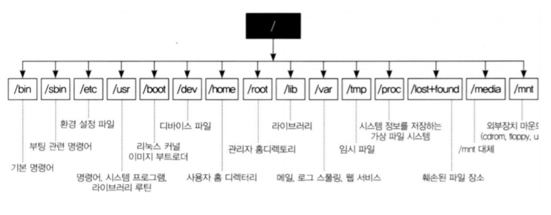

- Home 디렉토리 : /home/<사용자 id>

  - 사용자 소유의 최상위 디렉터리

    - 사용자가 로그인 했을 때 위치하는 디렉토리
    - 이 디렉토리에 대해서 모든 권한을 가짐

  - $HOME 환경 변수 자동 설정

    ```shell
    $ cd $HOME
    $ cd ~
    $ cd
    ```

- pwd 명령어

  - print working directory
    - wd : 현재 작업을 수행하고 있는 디렉토리
    - cd 명령으로 변경됨

  ```shell
  $ pwd
  /home/pi
  ```

- mkdir 명령어

  - make directory

    ```shell
    $ mkdir test
    ```

- rmdir 명령어

  - remove directory

    ```shell
    $ rmdir test
    ```

- touch 명령어

  - 파일의 최근 접근 시간을 현재 시간으로 수정

  - 파일이 존재하지 않으면 새로 생성

    ```shell
    $ cd ~
    $ mkdir webapps
    $ cd webapps
    $ mkdir ch02
    $ cd ch02
    $ touch read.txt
    ```

- ls 명령어

  - list
  - 지정한 디렉토리/파일의 정보를 보여줌
  - ls <디렉토리>| <파일명> …
  - 옵션
    - -a : 히든 파일을 포함해 모두 출력
    - -l : 긴 포맷으로 출력
    - -al : -a, -l 을 같이 지정

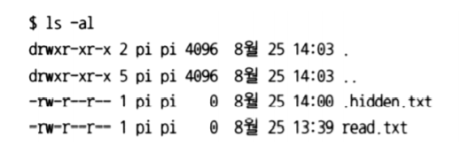

- cat명령어

  - 지정한 파일들을 연결하여 하나의 내용으로 출력

  - 파일의 내용 확인용으로 사용

    ```shell
    $ cd ~
    $ cat .bashrc # .bashrc의 내용 출력
    $ cat a.txt b.txt # a.txt, b.txt의 내용 출력
    $ cat a.txt b.txt > c.txt # a.txt, b.txt의 내용을 c.txt로 저장
    $ cat a.txt b.txt >> c.txt # a.txt, b.txt의 내용을 c.txt의 끝에 추가
    ```

- head 명령어

  - 지정한 파일의 앞 부분 출력

  - -n

    - n줄만 출력(생략 시 디폴트 5줄)

    ```shell
    $ head -5 .bahsrc
    ```

- tail 명령어

  - 지정한 파일의 뒷 부분 출력

  - -n

    - n 줄만 출력(생략 시 디폴트 5줄)

    ```shell
    $ tail -5 .bahsrc
    ```

- cp 명령어(copy)

  - 파일을 복사 해주는 명령어
  - cp <복사할 대상> <복사할 위치>
    - 여러 개의 대상 지정 가능
  - cp <복사할 대상> <복사할 위치/파일명>
    - 새로운 파일명으로 파일을 복사

- mv 명령어(move)

  - 파일을 이동하는 명령
  - mv <파일명> <이동할 위치>
    - 여러 개의 파일 지정 가능
  - mv <파일명> <새로운 파일명>

- rm 명령어(remove)

  - rm <파일명> ...
  - rm -r <디렉토리> ...

- which 명령어

  - 실행 명령어의 위치를 찾아 줌

  ```shell
  $ which python3
  ```

- whereis 명령

  - 실행파일, 소스파일 등의 위치를 찾아 줌

- 권한

  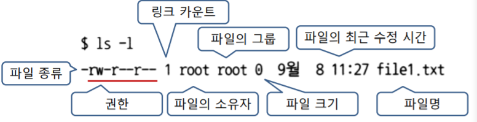

  - 파일 종류

    - \- : 일반 파일
    - d : 디렉토리
    - l : 심벌릭 링크
    - b : 블록형 디바이스 파일
    - c : 문자형 디바이스 파일 

  - 소유자, 그룹, 다른 사람에 대해서 지정

  - 각 권한은 읽기(r), 쓰기(w), 실행(x) 권한으로 구성

    - 해당 권한이 없는 경우 (-)

    - 8진수로 표현 가능

    - 디렉토리의 실행 권한은 탐색 권한을 의미

      -> cd 명령으로 디렉토리 이동 허용 여부

    

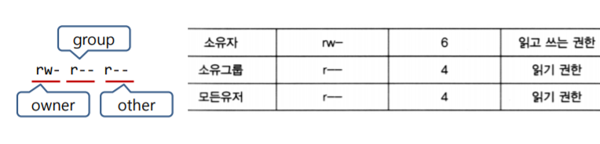

- chmod 명령어 (change mode)

  - 파일의 권한 설정을 변경
  - 지정 파일의 소유자, root 만 가능

  ```shell
  chmod <수정번호> <파일>
  $ chmod 755 read.txt # rwxr-xr-x
  $ chmod 751 read.txt # rwxr-xr--
  $ chmod +w read.txt # 쓰기 권한 추가
  $ chmod -w read.txt # 쓰기 권한 제거
  $ chmod u+x a.out # 소유자만 실행 권한 추가(u, g, o)
  $ sudo chmod 755 read.txt # rwxr-xr-x
  ```

- chown 명령어 (change owner)

  - 파일의 소유권을 다른 사용자로 이전
  - root만 사용 가능
  - chown <소유자>:<소유그룹> <파일명 or 디렉토리명>

  ```shell
  $ sudo chown root:pi file1.txt
  ```

-  IO 리다이렉션(Redirection)

  - 모든 프로세스는 표준 입력장치, 출력장치, 에러 출력장치를 가짐

    - 표준 입력장치: 키보드
    - 표준 출력장치, 에러 출력장치: 모니터

  - IO 리다이렉션

    - 표준 입/출력 장치를 다른 장치로 변경

    - < : 입력장치 리다이렉션

    - \>, >> : 출력장치 리다이렉션

      ```shell
      $ ls -l > file_list.txt
      ```

    - ▪ 2>, 2>> : 에러 출력 장치 리다이렉션


- 파일 아카이블/압축, 압축 해제

  - 파일 아카이브

    ```shell
    $ mkdir aaa
    $ tar -cvf aaa.tar aaa # aaa 디렉토리를 aaa.tar로 아카이브
    ```

  - 파일 아카이브 해제

    ```shell
    $ tar -xvf aaa.tar
    ```

  - 파일 압축

    ```shell
    $ mkdir ccc
    $ tar -zcvf ccc.tar.gz ccc
    ```

  - 파일 압축 해제

    ```shell
    $ tar -zxvf ccc.tar.gz
    ```

    

  