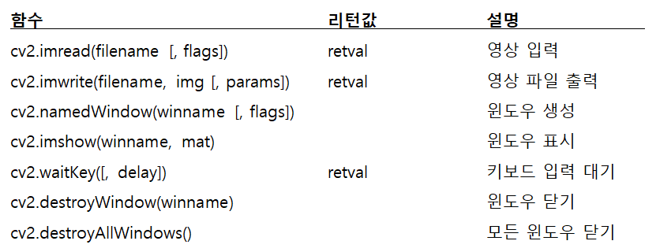
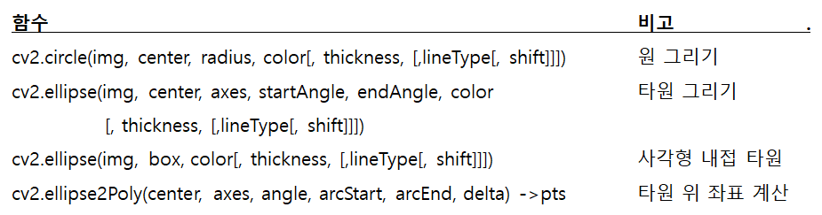
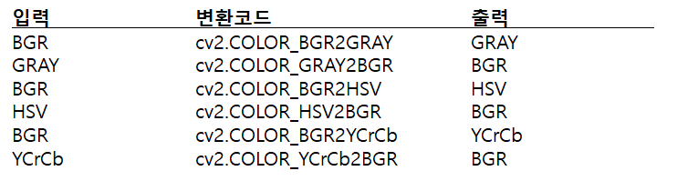

## 2020.09.28 TIL

### GPIO-ZERO

##### PWM

- PWMLED 객체
  - value 속성 : 0 ~ 1 사이의 값 지정
  - pulse() : 지속적으로 fade in/out 반복

##### **LED with variable brightness**.py

```python
from gpiozero import PWMLED
from time import sleep

led = PWMLED(17)

while True:
    led.value = 0  # off
    sleep(1)
    led.value = 0.5  # half brightness
    sleep(1)
    led.value = 1  # full brightness
    sleep(1)
```


##### gpiobutton.py

```python
from gpiozero import Button

button = Button(2)

while True:
    if button.is_pressed:
        print("Button is pressed")
    else:
        print("Button is not pressed")
```

##### gpiobutton2.py

```python
from gpiozero import Button
from signal import pause

def say_hello():
    print("Hello!")

def say_goodbye():
    print("Goodbye!")

button = Button(2)

button.when_pressed = say_hello
button.when_released = say_goodbye

pause()
```

##### gpio_led_button.py

```python
from gpiozero import LED, Button
from signal import pause

led = LED(17)
button = Button(2)

button.when_pressed = led.on
button.when_released = led.off

pause()
```

##### gpio_led_button.py2

```python
from gpiozero import LED, Button
from signal import pause

led = LED(17)
button = Button(2)

led.source = button.values

pause()
```

##### ledboard.py

```python
from gpiozero import LEDBoard
from time import sleep
from signal import pause

leds = LEDBoard(5, 6, 13, 19, 26, pwm=True)

# 모두 같이 동작
leds.on()
sleep(1)
leds.off()
sleep(1)

# 개별적인 값을 튜플로 지정
leds.value = (0.2, 0.4, 0.6)
sleep(1)
leds.blink()

pause()
```

##### ledbargraph

```python
from gpiozero import LEDBarGraph
from time import sleep

graph = LEDBarGraph(5, 6, 13, pwm=True)

graph.value = 1/10  # (0.5, 0, 0, 0, 0)
sleep(1)
graph.value = 3/10  # (1, 0.5, 0, 0, 0)
sleep(1)
graph.value = -3/10  # (0, 0, 0, 0.5, 1)
sleep(1)
graph.value = 9/10  # (1, 1, 1, 1, 0.5)
sleep(1)
graph.value = 95/100  # (1, 1, 1, 1, 0.75)
sleep(1)
```

##### distancesensor.py

```python
from gpiozero import DistanceSensor
from time import sleep

sensor = DistanceSensor(23, 24)	# echo, trig

while True:
    print('Distance to nearest object is', sensor.distance, 'm')
    sleep(1)
```

##### distancesensor2.py

```python
from gpiozero import DistanceSensor, LED
from signal import pause

sensor = DistanceSensor(23, 24, max_distance=1, threshold_distance=0.2)
led = LED(16)

sensor.when_in_range = led.on
sensor.when_out_of_range = led.off

pause()
```

##### 서보 **모터 제어** **: Servo** **클래스**

- Servo(pin, *, initial_value=0, min_pulse_width=1/1000, max_pulse_width=2/1000, frame_width=20/1000, pin_factory=None)
  - min() : 최소 각도로 이동
  - mid() : 중간 각도로 이동
  - max() : 최대 각도로 이동
  - value : 이동 값
    - -1 : 최소 각도
    - 0 : 중간 각도
    - 1 : 최대 각도

##### gpioservo.py

```python
from gpiozero import Servo
from time import sleep
 
myGPIO=17
 
servo = Servo(myGPIO)
 
while True:
    servo.mid()
    print("mid")
    sleep(0.5)
    servo.min()
    print("min")
    sleep(1)
    servo.mid()
    print("mid")
    sleep(0.5)
    servo.max()
    print("max")
    sleep(1)
```

### 영상 및 비디오 입출력

##### OpenCV 설치

```shell
$ pip install opencv-python
```

##### Numpy, Matplotlib, pillow 설치

```shell
$ pip install numpy matplotlib pillow
```

##### v**cv2.imread(filename** **[, flags])**

- 영상파일(BMP, JPEG, PNG, TIFF 등)을 읽어 numpy 배열로 반환 
- 읽기 실패하면 None을 반환
  - filename : 
    - 영상파일(BMP, JPEG, PNG, TIFF 등)의 파일명
  - flags
    - cv2.IMREAD_COLOR(디폴트)
    - cv2.IMREAD_GRAYSCALE
    - cv2.IMREAD_UNCHANGED

##### 영상 입출력 메소드


##### v**cv_ex01.py**파일 영상 읽기 **및** **화면표시**

```python
import cv2

image_file = './data/lena.jpg'
img = cv2.imread(image_file)	# cv2.IMREAD_COLOR
img2 = cv2.imread(image_file, cv2.IMREAD_GRAYSCALE)

print(img.shape, img2.shape)

cv2.imshow('Lena color', img)
cv2.imshow('Lena grayscale', img2)

cv2.waitKey(0)
cv2.destroyAllWindows()
```

##### cv2.imwrite(filename, **img** **[,** params])

- numpy.ndarray의 배열 img를 filename의 영상 파일로 저장
- 파일의 확장자에 의해 영상 포맷 결정
- params는 압축 관련 인수로 생략 가능
  - cv2.IMWRITE_PNG_COMPRESSION [0,9] 기본값 3
  - cv2.IMWRITE_JPEG_QUALITY  [0, 100] 기본값 95

##### vcv_ex02.py 영상 파일 저장

```python
import cv2

image_file = './data/lena.jpg'
img = cv2.imread(image_file)	

cv2.imwrite('./data/Lena.bmp', img)
cv2.imwrite('./data/Lena.png', img)
cv2.imwrite('./data/Lena2.png', img, [cv2.IMWRITE_PNG_COMPRESSION, 9])
cv2.imwrite('./data/Lena2.jpg', img, [cv2.IMWRITE_JPEG_QUALITY, 90])
```

##### 비디오 관련 메소드


##### property id 주요 상수


##### cv_ex03.py 채널 **순서**

```python
import cv2
import matplotlib.pyplot as plt

imageFile = './data/lena.jpg'
img_bgr = cv2.imread(imageFile)

plt.axis('off')
plt.imshow(img_bgr)
plt.show()

plt.axis('off')
img_rgb = cv2.cvtColor(img_bgr, cv2.COLOR_BGR2RGB) # 원본 이미지배열 BGR에서 RGB로 변환
plt.imshow(img_rgb)
plt.show()
```

##### 비디오 파일 녹화


##### cv_ex07 .py **비디오** **캡처와** **화면**

```python
import cv2

cap = cv2.VideoCapture(1)		# 1번 카메라
# cap.set(cv2.CAP_PROP_FRAME_WIDTH, 320)
# cap.set(cv2.CAP_PROP_FRAME_HEIGHT, 240)

frame_size = (int(cap.get(cv2.CAP_PROP_FRAME_WIDTH)),
				 int(cap.get(cv2.CAP_PROP_FRAME_HEIGHT)))
print('frame_size = ', frame_size)

while True:
    retval, frame = cap.read()	# 프레임 캡처
    if not retval: break

    cv2.imshow('frame', frame)
    key = cv2.waitKey(25)
    if key == 27: break		# ESC키를 누른 경우 루프 탈출
if cap.isOpened():
    cap.release()

cv2.destroyAllWindows()
```

##### cv_ex09.py

```python
import cv2

cap = cv2.VideoCapture(1)		# 1번 카메라

frame_size = (int(cap.get(cv2.CAP_PROP_FRAME_WIDTH)),
              int(cap.get(cv2.CAP_PROP_FRAME_HEIGHT)))
print('frame_size = ', frame_size)

# fourcc = cv2.VideoWriter_fourcc(*'DIVX')
fourcc = cv2.VideoWriter_fourcc(*'XVID')

out1 = cv2.VideoWriter('./data/record0.mp4', fourcc, 20.0, frame_size)
out2 = cv2.VideoWriter('./data/record1.mp4', fourcc, 20.0, frame_size, isColor=False)

while True:
    retval, frame = cap.read()	# 프레임 캡처
    if not retval: break

    out1.write(frame)
 
    gray = cv2.cvtColor(frame, cv2.COLOR_BGR2GRAY)
    out2.write(gray)

    cv2.imshow('frame', frame)
    cv2.imshow('gray', gray)    

    key = cv2.waitKey(25)
    if key == 27: break		# ESC

cap.release()
out1.release()
out2.release()

cv2.destroyAllWindows()
```

### 간단한 그래픽 처리

##### 주요 메소드



##### cv2.line(img, pt1, pt2, color[, thickness[,lineType[,shift]]])

- img에 좌표 pt1에서 pt2까지 연결하는 직선을 그림
- color는 색상, thickness는 두께
- lineType : cv2.LINE_8(디폴트), cv2.LINE_4, cv2.LINE_AA 등
- shift : pt1과 pt2의 각 좌표에 대한 비트 이동을 설정

##### cv_ex01.py 직선 및  사각형 그리기

```python
import cv2
import numpy as np

# White 배경 색상
img = np.zeros(shape=(512, 512, 3), dtype=np.uint8) + 255
# img = np.ones((512, 512, 3), dtype=up.uint8) * 255
# img = np.full((512, 512, 3), (255,255,255), dtype=up.uint8) 

pt1 = 100, 100
pt2 = 400, 400
cv2.rectangle(img, pt1, pt2, (0, 255, 0), 2)

cv2.line(img, (0,0), (500,0), (255, 0, 0), 5)
cv2.line(img, (0,0), (0, 500), (0, 0, 255), 5)

cv2.imshow('img', img)
cv2.waitKey()
cv2.destroyAllWindows()
```

##### 원 및 타원 그리기



##### cv2.circle(img, center, radius, color[, thickness, [,lineType[, shift]]])

- 영상 img에 중심점 center, 반지름 radius의 원을 색상 color, 두께 thickness로 그림
- thickness = cv2.CV_FILLED(-1)이면 color 색상으로 채운 원을 그림

##### cv_ex03.py

```python
import cv2
import numpy as np

img = np.zeros(shape=(512, 512, 3), dtype=np.uint8) + 255
cx = img.shape[0] // 2
cy = img.shape[1] // 2

for r in range(200, 0, -100):
    cv2.circle(img, (cx, cy), r, color = (255, 0, 0))

cv2.circle(img, (cx, cy), radius=50, color=(0, 0, 255), thickness = -1)

cv2.imshow('img', img)
cv2.waitKey()
cv2.destroyAllWindows()
```

##### 문자열 출력

##### putText(img, text, org, font, **fontScale**, color)

- img: 이미지
- text: 출력할 문자열
- org: 출력할 좌표(문자열의 좌측 하단 코너 기준)
- font: CvFont 구조체
- fontScale: 폰트 크기 비율 
- color: 텍스트 컬러
- **한글 출력 불가**


### OpenCV 기본연산

##### cv_ex01.py 영상 속성

```python
import cv2
import numpy as np

img = cv2.imread('.././data/lena.jpg')
# img = cv2.imread('./data/lena.jpg', cv2.IMREAD_GRAYSCALE)

print('img.ndim=', img.ndim)
print('img.shape=', img.shape)
print('img.dtype=', img.dtype)

# np.bool, np.uint16, np.unit32, np.float32, np.float64, np.complex64
img = img.astype(np.int32)
print('img.dtype=', img.dtype)

img = np.uint8(img)
print('img.dtype=', img.dtype)
```

##### cv_ex03.py 화소 접근 : 그레이스케일 영상

```python
import cv2
# import numpy as np

img = cv2.imread('.././data/lena.jpg', cv2.IMREAD_GRAYSCALE)
img[120, 200] = 0		# 화소값(밝기, 그레이스케일) 변경
print(img[100:110, 200:210])	# ROI 접근

# for y in range(100, 400):
#     x in range(200, 300):
#         img[y, x] = 0

img[100:400, 200:300] = 0	# ROI 접근

cv2.imshow('img', img)
cv2.waitKey()
cv2.destroyAllWindows()
```

##### cv_ex04.py 화소 접근 : 컬러 영상(BGR)

```python
import cv2
# import numpy as np

img = cv2.imread('.././data/lena.jpg')
img[120, 200] = [255, 0, 0]		# 컬러(BGR) 변경
print(img[100:110, 200:210])		# ROI 접근

# for y in range(100, 400):
#     x in range(200, 300):
#         img[y, x] = [255, 0, 0]	# 파란색으로 변경

img[100:400, 200:300] = [255, 0, 0]	# ROI 접근

cv2.imshow('img', img)
cv2.waitKey()
cv2.destroyAllWindows()

```

### 관심영역과 ROI(Region Of Interest)

##### selectROI(windowName, img[,showCrosshair[, **fromCenter**]]) -> **retval**

- windowName 윈도우(디폴트 ROI selector)에 img 영상을 표시하고, 사용자가 마우스 클릭과 드래그로 ROI를 선택할 수 있게한다.
- showCrosshair = True이면 선택 영역에 격자가 표시
- fromCenter=True이면 마우스 클릭 위치 중심을 기준으로 박스로 선택
- Space 또는 Enter를 사용하여 선택 종료, c를 사용하여 선택 취소
- 반환값 retval에 선택 영역의 튜플(x, y, widht, height)를 반환

##### v**selectROIs**(windowName, img[, showCrosshair[, fromCenter]]) -> **boundingBoxes**

- windowName 윈도우를 생성해 img 영상을 표시하고, 마우스 클릭과 드래그로 다중 ROI를 선택
- 선택 확정 space, Enter, 모든 선택 완료 종료 Esc
- 선택한 영역의 리스트 반환

##### cv_ex06.py ROI에 의한 블록 평균 영상

```python
import cv2
import numpy as np

src = cv2.imread('.././data/lena.jpg', cv2.IMREAD_GRAYSCALE)
dst = np.zeros(src.shape, dtype=src.dtype)

N = 64		# 8, 32, 64
height, width = src.shape
# height, width, _ = src.shape	# 컬러 영상

h = height // N
w = width // N

for i in range(N):
    for j in range(N):
        y = i * h
        x = j * w
        roi = src[y:y+h, x:x+w]
        dst[y:y+h, x:x+w] = cv2.mean(roi)[0]		# 그레이스케일 영상
        # dst[y:y+h, x:x+w] = cv2.mean(roi)[0:3]	# 컬러 영상

cv2.imshow('dst', dst)
cv2.waitKey()
cv2.destroyAllWindows()
```

##### cv_ex07.py 영상 복사

```python
import cv2
src = cv2.imread('.././data/lena.jpg', cv2.IMREAD_GRAYSCALE)

# dst = src		# 참조
dst = src.copy()	# 복사
dst[100:400, 200:300] = 0

cv2.imshow('src', src)
cv2.imshow('dst', dst)
cv2.waitKey()
cv2.destroyAllWindows()
```

### 컬러 공간 변환

##### cv2.cvtColor(src, code[, dst[, dstCn]]) -> dst

- GRAY, HSV, YCrCb 등의 다양한 컬러 공간 포맷으로 변환
- 입력 영상 src를 code에 따라 출력 영상 dst에 반환
- dstCn: 출력 영상의 채널 수, 자료형에 따라 다름



### 영상의 크기 변환과 회전

##### cv2.resize(src, dsize[, dst[, fx[, fy[, interpolation]]]]) -> dst

- 영상의 크기를 변환하여 확대/축소 한다.
- dsize는 출력 영상 크기
- fx, fy는 가로와 세로의 스케일
- interpolation(보간법)
  - cv2.INTER_NEARES
  - cv2.INTER_LINEAR(디폴트)
  - cv2.INTER_AREA
  - cv2.INTER_CUBIC
  - cv2.INTER_LANCZOS4 등

##### cv_ex10.py 영상 크기 변환

```python
import cv2
import numpy as np

src = cv2.imread('.././data/lena.jpg', cv2.IMREAD_GRAYSCALE)

dst = cv2.resize(src, dsize=(320, 240))
dst2 = cv2.resize(src, dsize=(0,0), fx=1.5, fy=1.2)

cv2.imshow('dst', dst)
cv2.imshow('dst2', dst2)

cv2.waitKey()
cv2.destroyWindows()
```


### 영상의 크기 변환과 회전

##### cv2.rotate(src, rotateCode[, dst]) -> dst

- 입력 영상 src를 크기 rotateCode에 따라 90의 배수로 회전시켜 dst에 반환
- rotateCode
  - cv2.ROTATE_90_CLOCKWISE
  - cv2.ROTATE_180
  - cv2.ROTATE_90_COUNTERCLOCKWISE 등

##### cv_ex11.py 영상 회전

```python
import cv2
import numpy as np

src = cv2.imread('./data/lena.jpg', cv2.IMREAD_GRAYSCALE)

dst1 = cv2.rotate(src, cv2.ROTATE_90_CLOCKWISE)
dst2 = cv2.rotate(src,  cv2.ROTATE_90_COUNTERCLOCKWISE)

cv2.imshow('dst1', dst1)
cv2.imshow('dst2', dst2)

cv2.waitKey()
cv2.destroyWindows()
```

### OpenCV 얼굴 영역 검출

##### Haar Cascade

- 머신 러닝기반의 오브젝트 검출 알고리즘
- 비디오 또는 이미지에서 오브젝트 검출
- 직사각형 영역으로 구성
- 찾으려는 오브젝트(여기에선 얼굴)가 포함된 이미지와 오브젝트가 없는 이미지를 사용하여 Haar Cascade Classifier(하르 특징 분류기)를 학습
- 분류기를 사용하여 오브젝트 검출

##### 사전 훈련된 분류기

- opencv 라이브러리 설치 디렉토리 아래 data 패키지
  - C:\Users\\.conda\envs\keras\Lib\site-packages\cv2\data


##### haarcascade_frontalface_default.xml

- 얼굴 영역 검출 분류기
  - face_classifier = cv2.CascadeClassifier( 'haarcascade_frontalface_default.xml')
    - xml 파일을 작업 디렉토리에 복사 후 작업
- 목표 영역 검출하기
  - cascade.detectMultiScale(image, scaleFactor=1.1, minNeighbors=1, minSize=(150,150))
  - 검출된 영역 리스트(x, y, w, h) 리턴


##### cv_face_ex01.py 얼굴 영역 검출 및 영역 표시하기

```python
import cv2
import sys

cascade_file = "haarcascade_frontalface_alt.xml"
cascade = cv2.CascadeClassifier(cascade_file)

image_file = ".././data/face1.jpg" # ./data/face2.jpg
image = cv2.imread(image_file)
image_gs = cv2.cvtColor(image, cv2.COLOR_BGR2GRAY)

face_list = cascade.detectMultiScale(image_gs, scaleFactor=1.1, minNeighbors=1, minSize=(150,150))

if len(face_list) > 0:
    print(face_list)
    color = (0, 0, 255)
    for face in face_list:
        x,y,w,h = face
        cv2.rectangle(image, (x,y), (x+w, y+h), color, thickness=8)
        cv2.imwrite("facedetect-output.PNG", image)
else:
    print("no face")
```


##### cv_face_ex02.py 검출된 얼굴 영역 모자이크 처리하기

```python
import cv2
import sys

cascade_file = "haarcascade_frontalface_alt.xml"
cascade = cv2.CascadeClassifier(cascade_file)

image_file = ".././data/face1.jpg" # .././data/face2.jpg
output_file = "face1-mosaic.jpg" # face2-mosaic.jpg

image = cv2.imread(image_file)
image_gs = cv2.cvtColor(image, cv2.COLOR_BGR2GRAY)

cascade = cv2.CascadeClassifier(cascade_file)
face_list = cascade.detectMultiScale(image_gs, scaleFactor=1.1, minNeighbors=1, minSize=(100,100))

if len(face_list) == 0:
    print("no face")
    quit()

# 확인한 부분에 모자이크 처리하기
mosaic_rate = 30

print(face_list)
color = (0, 0, 255)

for (x,y,w,h) in face_list:
    face_img = image[y:y+h, x:x+w] # 얼굴 부분 자르기
    # 자른 이미지를 지정한 배율로 확대/축소하기
    face_img = cv2.resize(face_img, (w//mosaic_rate, h//mosaic_rate))
    # 확대/축소한 그림을 원래 크기로 돌리기
    face_img = cv2.resize(face_img, (w, h), interpolation=cv2.INTER_AREA)
    image[y:y+h, x:x+w] = face_img # 원래 이미지에 붙이기
# 렌더링 결과를 파일에 출력
cv2.imwrite(output_file, image)
```


##### cv_face_ex03.py 동영상에서 얼굴 영역 추출

```python
import cv2
import numpy as np

face_classifier = cv2.CascadeClassifier('haarcascade_frontalface_default.xml')

cap = cv2.VideoCapture(0)

# cap.get(cv2.CAP_PROP_POS_FRAMES)
# cap.get(cv2.CAP_PROP_FRAME_COUNT)
# cap.set(cv2.CAP_PROP_FRAME_WIDTH, 640) (3)
# cap.set(cv2.CAP_PROP_FRAME_HEIGHT, 480) (4)

if cap.isOpened():
    print('width: {}, height : {}'.format(cap.get(3), cap.get(4)))
else:
    print("No Camera") 

while True:
    ret, frame = cap.read()
    if ret:
        gray = cv2.cvtColor(frame, cv2.COLOR_BGR2GRAY)

        # 얼굴 검출
        faces = face_classifier.detectMultiScale(gray,1.3,5)
        for (x,y,w,h) in faces:
            cropped_face = frame[y:y+h, x:x+w].copy()
            cropped_face = cv2.resize(cropped_face, dsize=(300, 300), interpolation=cv2.INTER_AREA)
            cv2.rectangle(frame, (x,y),(x+w, y+h), (0,0,255), 3)

            cv2.imshow('face', cropped_face)
        cv2.imshow('video', frame)

        if cv2.waitKey(1) == 27: break # ESC 키
    else:
        print('error')

cap.release()
cv2.destroyAllWindows()
```

##### 비디오에서 몸 영역 추출

```python
import cv2
import numpy as np

face_classifier = cv2.CascadeClassifier('haarcascade_fullbody.xml')

cap = cv2.VideoCapture('.././data/vtest.avi')

# cap.get(cv2.CAP_PROP_POS_FRAMES)
# cap.get(cv2.CAP_PROP_FRAME_COUNT)
# cap.set(cv2.CAP_PROP_FRAME_WIDTH, 640) (3)
# cap.set(cv2.CAP_PROP_FRAME_HEIGHT, 480) (4)

if cap.isOpened():
    print('width: {}, height : {}'.format(cap.get(3), cap.get(4)))
else:
    print("No Camera") 

while True:
    ret, frame = cap.read()
    if ret:
        gray = cv2.cvtColor(frame, cv2.COLOR_BGR2GRAY)

        # 얼굴 검출
        faces = face_classifier.detectMultiScale(gray,1.3,5)
        for (x,y,w,h) in faces:
            cropped_face = frame[y:y+h, x:x+w].copy()
            cropped_face = cv2.resize(cropped_face, dsize=(300, 300), interpolation=cv2.INTER_AREA)
            cv2.rectangle(frame, (x,y),(x+w, y+h), (0,0,255), 3)

            #cv2.imshow('face', cropped_face)
        cv2.imshow('video', frame)

        if cv2.waitKey(1) == 27: break # ESC 키
    else:
        break

cap.release()
cv2.destroyAllWindows()
```


##### cam.py 모듈화

```python
import cv2
class USBCam:
    def __init__(self, show=False, framerate=25, width=640, height=480):
        self.size = (width, height)
        self.show = show
        self.framerate = framerate

    def __iter__(self):
        self.cap = cv2.VideoCapture(0) # 0번 카메라
        self.cap.set(cv2.CAP_PROP_FRAME_WIDTH, self.size[0])
        self.cap.set(cv2.CAP_PROP_FRAME_HEIGHT, self.size[1])

        while True:
            retval, frame = self.cap.read() # 프레임 캡처
            yield frame

    def run(self, callback):
        self.cap = cv2.VideoCapture(0) # 0번 카메라
        self.cap.set(cv2.CAP_PROP_FRAME_WIDTH, self.size[0])
        self.cap.set(cv2.CAP_PROP_FRAME_HEIGHT, self.size[1])

        while True:
            retval, frame = self.cap.read() # 프레임 캡처
            if not retval: break
            if not callback(frame): break

            if self.show:
                cv2.imshow('frame', frame)
                key = cv2.waitKey(self.framerate)
                if key == 27: break

        if self.cap.isOpened():
            self.cap.release()
```

##### cv_face_ex04.py

```python
import cv2

from cam import USBCam

c = USBCam() # USBCam(show=True)

def capture(frame):
    # frame 처리
    cv2.imshow('frame', frame)
    key = cv2.waitKey(25)
    if key == 27: return False
    return True
    
c.run(capture)
```

##### cv_face_ex05.py 얼굴 영역 분리 출력 및 저장

```python
import numpy as np
from cam import USBCam
import cv2

FACE_WIDTH = 200
face_cascade = cv2.CascadeClassifier('haarcascade_frontalface_default.xml')

ix = 0
def save_image(img):
    global ix
    cv2.imwrite(f'd:/temp/faces/face_{ix:04d}.jpg', img, [cv2.IMWRITE_JPEG_QUALITY, 90])

    ix += 1

face_image = np.array((FACE_WIDTH, FACE_WIDTH,3), dtype=int)

def detect_face(frame):
    global face_image
    gray = cv2.cvtColor(frame, cv2.COLOR_BGR2GRAY)
    # 이미지에서 얼굴을 검출합니다.
    faces = face_cascade.detectMultiScale(gray, 1.3, 5)
    # 얼굴이 검출되었다면 얼굴 위치에 대한 좌표 정보를 리턴받습니다.

    for (x,y,w,h) in faces:
        # 원본 이미지에 얼굴의 위치를 표시
        # cv2.rectangle(frame,(x,y),(x+w,y+h),(255,0,0),2)
        minLength = min(w, h)
        if minLength < 150: break
        width = max(w, h)

        # 얼굴 부분 검출
        # face_image = frame[y:y+h, x:x+w].copy()
        x = x + w//2 - width//2
        y = y + h//2 - width//2
        face_image = frame[y:y+width, x:x+width].copy()
        cv2.rectangle(frame,(x,y),(x+width,y+width),(255,0,0),2)

        face_image = cv2.resize(face_image,dsize=(FACE_WIDTH, FACE_WIDTH),interpolation=cv2.INTER_AREA)
        save_image(face_image) # 얼굴영역 저장

    frame[0:FACE_WIDTH, 0:FACE_WIDTH] = face_image[:] # 좌측 상단에 출력
    return True

c = USBCam(show=True)
print('cam start')
c.run(detect_face)
```

