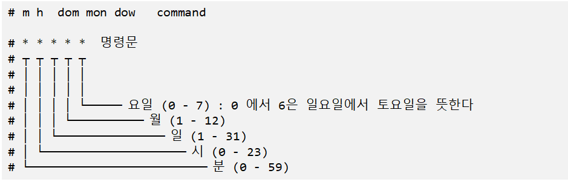
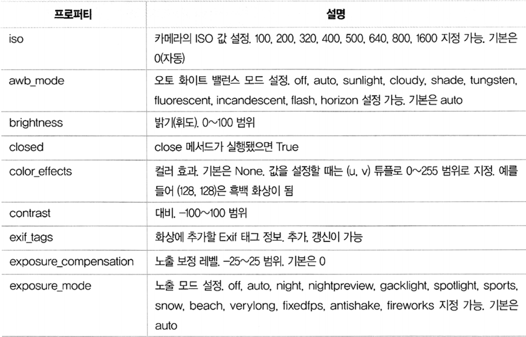
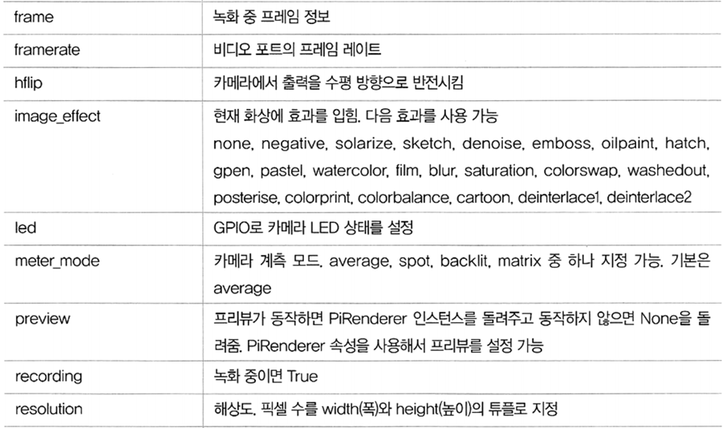
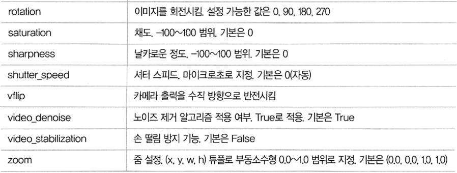

## 2020.09.29 TIL

### Picamera

##### 동작 확인

- raspistill -v -o test.jpg
  - 미리보기 화면을 5초간 보여준 후 촬영 
  - 촬영한 이미지를 test.jpg 파일로 저장함

##### 타이머 변경

- raspistill -t 1000 -o cam.jpg
  - -t : 밀리초 단위로 촬영 타이머 설정

##### 크기 변경

- raspistill -w 300 -h 300 -o cam.jpg
  - -w : 이미지 폭 지정
  - -h : 이미지 높이 지정

##### 밝기 조정

- raspistill -br 0 -o br-0.jpg
- raspistill -br 50 -o br-50.jpg
- raspistill -br 100 -o br-100.jpg
  - -br : 밝기를 %로 지정

##### 화면 뒤집기

- raspistill -hf cam.jpg
  - -hf : 수평 방향으로 뒤집기
  - -vf : 수직 방향으로 뒤집기

##### 쉡 스크립트로 촬영하기

- 파일명 : camera.sh

```shell
#!/bin/bash

DATE=$(date +"%Y-%m-%d_%H%M")

raspistill -o /home/pi/picamera/$DATE.jpg
```

- ```shell
  $ chmod +x camera.sh
  $ ./camera.sh
  ```

##### 연속 촬영(타임 랩스)

```shell
$ raspistill -o image_%04d.jpg -tl 3000 -t 30000
```

- -t : 촬영 시간
- -tl : 촬영 간격
- 30초 동안 3초 간격으로 사진 촬영

##### cron에 촬영 스케쥴 등록하기

- cron으로 스케줄 생성

  ```shell
  $ sudo crontab -e
  ```

  - 에디터 선택 묽음에 nano 또는 leafpad 선택

##### cron 테이블 형식



- /* * * * */home/pi/camera.sh 2>&1
  - 매분마다 camera.sh 실행

##### 비디오 촬영

``` shell
$ raspivid -o video.h264
```

- 기본 촬영 시간 : 5초


```shell
$ raspivid -t 100000 -o video.h264
```

- -t : 촬영시간 옵션, 단위 밀리초


##### 비디오 재생

```shell
$ omxplayer video.h264
```


### python-picamera

##### python-picamera

- 라즈베리 파이 카메라를 파이썬으로 제어하는 라이브러리
- 최신 라즈베리 파이에는 이미 설치되어 있음
- sudo apt-get install python-picamera

```python
from picamera import PiCamera

camera = PiCamera()		# PiCamera 객체 생성
```

##### picamera 주요 프로퍼티







##### 미리보기 화변

- start preview()
  - 미리 보기 화면을 생성
- stop preview()
  - 미리 보기 화면을 닫음

##### picamera_basic_ex01.py

```python
from picamera import PiCamera
from time import sleep

camera = PiCamera()

# 180도 회전하기
# camera.rotation = 180

camera.start_preview()		# 미리보기 화면 시작
# camera.start_preview(alpha=200)		# 투명도 설정, 값의 범위 : 0~255

sleep(10)

camera.stop_preview()		# 미리보기 화면 정지
```

##### 해상도 설정

- resolution 속성에 해상도 설정값을 튜플로 지정
  - camera.resolution = (1024, 768) # 1024x768 해상도

##### 이미지 촬영하기

- capture(파일명)
  - 촬영한 이미지를 저장할 파일 경로를 매개변수로 지정

##### picamera_basic_ex02.py

```shell
# picamera 라이브러리 임포트
import picamera

# time 라이브러리 임포트
import time

# PiCamera 객체 인스턴스 생성
with picamera.PiCamera() as camera:

    # 해상도를 선택하도록 함
    res = int(input('Resolution(1:320x240, 2:640x480, 3:1024x768)?'))

    # 선택한 값에 따라 해상도 설정
    if res == 3:
        camera.resolution = (1024, 768)
    elif res == 2:
        camera.resolution = (640, 480)
    else:
        camera.resolution = (320, 240)    
    
    # 파일명 입력 받기
    filename = input('File Name?')

    # 프리뷰 화면 표시
    camera.start_preview()

    # 1초 대기
    time.sleep(1)

    # 프리뷰 종료
    camera.stop_preview()

    # 촬영하고 저장
    camera.capture(filename + '.jpg')
```

##### 텍스트 설정

- annotate_text : 표시할 문자열
- annotate_text_size : 텍스트 크기 (6~160), 기본 32
- annotate_foreground : 글자 색
- annotate_background : 글자 배경색 

##### picamera_basic_ex04.py

```python
from picamera import PiCamera, Color
from time import sleep

camera = PiCamera()

camera.start_preview()
camera.annotate_text_size = 50
camera.annotate_background = Color('blue')
camera.annotate_foreground = Color('yellow')
camera.annotate_text = " Hello world "
sleep(5)
camera.capture('/home/pi/Desktop/text.jpg')
camera.stop_preview()
```

##### 동영상 촬영

- start recording(파일명)
  - 동영상 저장 시작
- stop recordinf()
  - 동영상 저장 마침

##### picamera_basic_ex08.py

```python
import picamera
import time

with picamera.PiCamera() as camera:
    res = int(input('Resolution(1:320x240, 2:640x480, 3:1024x768)?'))

    # 선택한 값에 따라 해상도 설정
    if res == 3:
        camera.resolution = (1024, 768)
    elif res == 2:
        camera.resolution = (640, 480)
    else:
        camera.resolution = (320, 240)

    # 파일명 입력
    filename = input('File Name?')

    camera.framerate = 15
    # 프리뷰 화면 표시
    camera.start_preview()
    # 촬영하고 파일 저장
    camera.start_recording(output = filename + '.h264')

    # 5초 대기
    camera.wait_recording(5)

    # 촬영 종료
    camera.stop_recording()

    # 프리뷰 화면 종료
    camera.stop_preview()
```

### python-picamera 2 이미지 캡처

##### 이미지 캡처(이미지 촬영)

- camera.capture('파일명' [, '포맷']) # 저장할 파일 경로 
- camera.capture(file [, '포맷']) # 파일 객체 
- camera.capture(stream [, '포맷']) # IO.Bytes 스트림

##### picam_capture_ex04.py

```python
from io import BytesIO
from time import sleep
from picamera import PiCamera
from PIL import Image

# Create the in-memory stream
stream = BytesIO()

camera = PiCamera()

camera.start_preview()
sleep(2)
camera.capture(stream, format='jpeg')

# 내용을 읽기위해 스트림을 되감기함(rewind)
stream.seek(0)
image = Image.open(stream)
```

##### picam_capture_ex05.py 캡쳐 이미지 크기 조정

```python
from time import sleep
from picamera import PiCamera

camera = PiCamera()
camera.resolution = (1024, 768)
camera.start_preview()

# Camera warm-up time
sleep(2)

camera.capture('foo.jpg', resize=(320, 240))
```

##### 연속 사진 촬영

-  camera.capture_sequence(파일명 리스트(또는 튜플)) 
-  capture_continuous('파일명 패턴')
  - for 루프의 시퀀스로 사용
  - 파일명 패턴
    - 'img{counter:03d}.jpg'
    - 'img{timestamp:%Y-%m-%d-%H-%M}.jpg'

##### picam_capture_ex06.py 연속 이미지 캡처

```python
from time import sleep
from picamera import PiCamera

camera = PiCamera()
camera.start_preview()
sleep(2)

for filename in camera.capture_continuous('img{counter:03d}.jpg'):
    print('Captured %s' % filename)
    sleep(10) # wait 10 seconds
```

### python-picamera 3 동영상 촬영

##### 여러 파일로 녹화하기

- split_recording('파일명')
  - 녹화 중 여러 파일에 저장하기
- record_sequence(파일명 리스트)
  - for 문의 시퀀스로 사용

##### picam_video_ex03.py 여러 파일에 저장하기

```python
from picamera import PiCamera

camera = PiCamera(resolution=(640, 480))
camera.start_recording('1.h264')
camera.wait_recording(5)

for i in range(2, 11):
    camera.split_recording('%d.h264' % i)
    camera.wait_recording(5)
    
camera.stop_recording()
```

```python
from picamera import PiCamera

camera = PiCamera(resolution=(640, 480))

for filename in camera.record_sequence('%d.h264' % i for i in range(1, 11)):
    
	camera.wait_recording(5)
```

##### 환형 스트림에 녹화하기

- PiCameraCircularIO 클래스
  - 동작을 감지하고 동작이 감지 된 비디오 만 디스크에 기록하려는 보안 응용

#####  picam_video_ex05.py 환형 스트림에 녹화하기

```python
import io
import random
from picamera import PiCamera, PiCameraCircularIO

def motion_detected():
    # Randomly return True (like a fake motion detection routine)
    return random.randint(0, 10) == 0

camera = PiCamera()
stream = PiCameraCircularIO(camera, seconds=20)

camera.start_recording(stream, format='h264')
try:
    while True:
        camera.wait_recording(1)
        if motion_detected():
            # 동작이 감지됬다면 10초간 녹화하여 디스크에 스트림을 기록
            camera.wait_recording(10)
            stream.copy_to('motion.h264') # 스트림을 파일로 저장하기
finally:
    camera.stop_recording()
```

##### picam_video_ex05_02.py

```python
from gpiozero import DistanceSensor
import io
import random
from picamera import PiCamera, PiCameraCircularIO

sensor = DistanceSensor(24, 23)

def motion_detected():
    print("detected")
    return sensor.distance <= 0.2
print("start")

camera = PiCamera()
stream = PiCameraCircularIO(camera, seconds=20)

camera.start_recording(stream, format='h264')
print("ready")
try:
    while True:
        print("while")
        # camera.wait_recording(1)
        if motion_detected():
            print('motion detected')
            camera.start_preview()
            camera.wait_recording(10)
            camera.stop_preview()
            stream.copy_to('motion.h264')
finally:
    camera.stop_recording()
```

### python-picamera 이미지 프로세싱

##### numpy 배열에 저장하기

- camera.capture(numpy배열, '이미지포맷')
  - numpy 배열의 공간이 확보되야 함
  - 이미지 포맷
    - rbg
    - bgr (OpenCV)

##### picam_processing_ex01.py numpy 배열에 저장하기

```python
import time
from picamera import PiCamera
import numpy as np
import cv2

with PiCamera() as camera:
    camera.resolution = (320, 240)
    camera.framerate = 24
    time.sleep(2)

    output = np.empty((240, 320, 3), dtype=np.uint8)
    camera.capture(output, 'bgr')

    cv2.imshow('frame', output)
    cv2.waitKey(0)
    cv2.destroyAllWindows()
```

##### picam_processing_ex09.py 빠른 캡처

```python
import time
import picamera

with picamera.PiCamera() as camera:
    camera.resolution = (1024, 768)
    camera.framerate = 30
    camera.start_preview()
    #time.sleep(2)

    camera.capture_sequence([
        'image1.jpg',
        'image2.jpg',
        'image3.jpg',
        'image4.jpg',
        'image5.jpg',
        ], use_video_port=True)
```

### 카카오 음성합성, 음성인식

##### 카카오 음성 API

- 음성 인식(뉴톤)
  - Speech-to-Text(STT): 음성을 텍스트로 변환
- 음성 합성(뇨톤톡)
  - Text-to-Speech(TTS): 텍스트를 음성으로 변환

##### 카카오 개발자 등록

- https://developers.kakao.com/

##### 음성 합성 요청 xml

- <speak> 루트

  - <voice>
    - 음성 합성할 텍스트 지정
    - name 속성: 보이스 선택(성별, 음색)
    - 텍스트는 반드시 UTF-8 인코딩이어야 함

  - 예제

    ```python
    <speak>
        <voice name="WOMAN_READ_CALM"> 지금은 여성 차분한 낭독체입니다.</voice>
        <voice name="MAN_READ_CALM"> 지금은 남성 차분한 낭독체입니다.</voice>
        <voice name="WOMAN_DIALOG_BRIGHT"> 안녕하세요. 여성 밝은 대화체예요.</voice>
        <voice name="MAN_DIALOG_BRIGHT">안녕하세요. 남성 밝은 대화체예요.</voice>
    </speak>
    ```

##### kakao_synthesize.py

```python
import requests
import io

URL = "https://kakaoi-newtone-openapi.kakao.com/v1/synthesize"
HEADERS = {
    "Content-Type" : "application/xml",
    "Authorization" : "KakaoAK REST API"
}

DATA = """
<speak>
    그는 그렇게 말했습니다.
    <voice name="MAN_DIALOG_BRIGHT">잘 지냈어? 나도 잘 지냈어.</voice>
    <voice name="WOMAN_DIALOG_BRIGH" speechStyle="SS_ALT_FAST_1">금요일이 좋아
    요.</voice>
</speak>
"""
res = requests.post(URL, headers = HEADERS, data = DATA.encode('utf-8'))
with open("result.mp3", "wb") as f:
    f.write(res.content)
```

##### kakao_synthesize.py

```python
import requests
import io
from pydub import AudioSegment
from pydub.playback import play

URL = "https://kakaoi-newtone-openapi.kakao.com/v1/synthesize"
HEADERS = {
    "Content-Type" : "application/xml",
    "Authorization" : "KakaoAK de5f167d646efcbf8021b575867fe002"
}

DATA = """
<speak>
    그는 그렇게 말했습니다.
    <voice name="MAN_DIALOG_BRIGHT">잘 지냈어? 나도 잘 지냈어.</voice>
    <voice name="WOMAN_DIALOG_BRIGH" speechStyle="SS_ALT_FAST_1">금요일이 좋아
    요.</voice>
</speak>
"""
res = requests.post(URL, headers = HEADERS, data = DATA.encode('utf-8'))
# 음성 합성 결과를 파일로 저장하기
with open("result.mp3", "wb") as f:
    f.write(res.content)

sound = io.BytesIO(res.content)
song = AudioSegment.from_mp3(sound)

# 파일에서 재생하기
song = AudioSegment.from_mp3("./result.mp3")
play(song)
```

