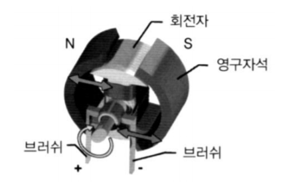
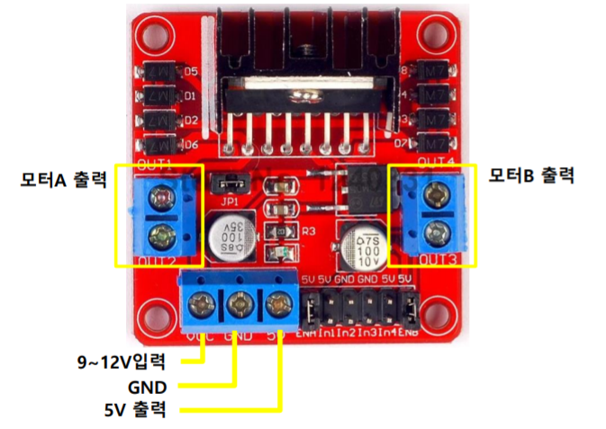
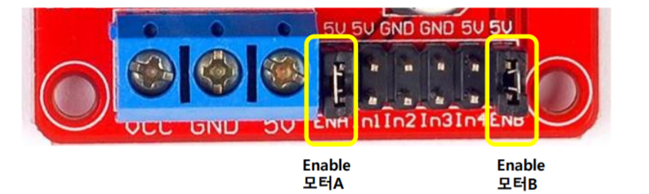
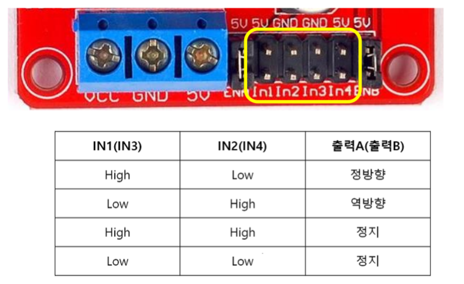
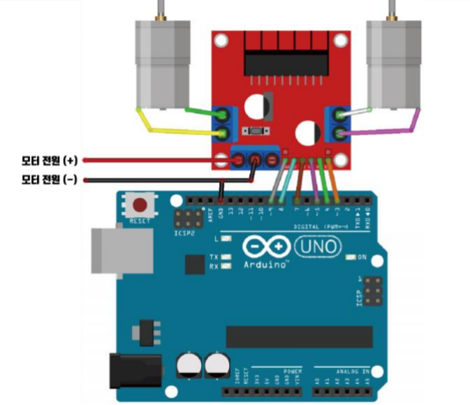

## 2020.10.06 TIL

### 아두이노 블루투스 통신

##### btsocket.py

```python
from bluetooth import * 

class BtSocket(BluetoothSocket) :
    def __init__(self, *args):
        super().__init__(*args)
        self.buf = ''

    def readline(self):
        ix = self.buf.find('\r\n') 
        if ix != -1 :
            line = self.buf[:ix]
            self.buf = self.buf[ix+2:]
            return line

        self.buf += self.recv(1024).decode()
        return self.readline()
```

##### bt_ex02.py

```python
from bluetooth import *
from btsocket import BtSocket

LINE_END =  "\r\n"

client_socket=BtSocket(RFCOMM)
client_socket.connect(("00:18:91:D7:65:BC", 1)) 

try:
    while True: 
        msg = input("Send : ") + LINE_END 
        client_socket.send(msg) 	# 전송

        # msg = client_socket.recv(1024)
        msg = client_socket.readline()
        print(f"recived message : {msg}")

except KeyboardInterrupt:
    print("Finished")

client_socket.close() 
```

##### joystick으로 블루투스 컨트롤

```c++
#include <Led.h>
#include <JoyStick.h>
#include <BtMiniCom.h>

Led led(13);
JoyStick joy(A0, A1, 9);
BtMiniCom com(10, 11, NULL);

bool mode = true; // true : 주행모드, false: 카메라 방향 모드

void setup(){
    com.init();
    com.print(0, "MiniCom Start");
    joy.setRangeX(255, -255);
    joy.setRangeY(-255, 255);
    joy.setCallback(changeMode);
    led.off();
    com.setInterval(50, readJoystick);
}

void loop() {
    joy.check();
    com.run();
}

// joystick 값 읽고 출력하기
void readJoystick(){
    joystick_value_t value = joy.read();
    char buf[17];

    if(mode){ // 주행 모드
        com.print(0, "X", value.x, "Y", value.y);
        sprintf(buf, "0,%d,%d", value.x, value.y);
    } else{ // 카메라 방향 모드
        com.print(1,"Angle",value.x);
        sprintf(buf, "1,%d", value.x);
    }
    com.send(buf);
}

// joystick 운영 모드 변경
void changeMode(){
    mode = !mode;
    if(mode){ // 주행 모드
        joy.setRangeX(-255, 255);
        led.off();
    } else{ // 카메라 방향 모드
        joy.setRangeX(90, -90);
        led.on();
    }
}
```

##### 서보 모터 제어

- AngularServo

  - 각도로 서보모터를 조정하는 클래스
  - 180도 조정 범위 설정

  ```c++
  AngularServo(25, min_angle=-90, max_angle=90,min_pulse_width=0.0006, max_pulse_width=0.0024)
  ```

##### bt_ex03.py

```python
from btsocket import BtSocket
from bluetooth import * 
from gpiozero import AngularServo

servo = AngularServo(25, min_angle=-90, max_angle=90, 
                     min_pulse_width=0.0006, max_pulse_width=0.0024)

def control(tokens):
    command = int(tokens[0])
    if command == 0 : # 주행모드
        x = int(tokens[1])
        y = int(tokens[2])
    elif command == 1 : #카메라 모드
        angle = int(tokens[1])
        servo.angle = angle

RFADDR = "00:18:91:D7:65:BC"
client_socket=BtSocket( RFCOMM ) 
client_socket.connect((RFADDR, 1)) 

try:
    while True:
        line = client_socket.readline()
        print(line)
        control(line.split(','))
except KeyboardInterrupt:
    print("Finished")

client_socket.close() 
```


### DC모터



##### L298N

- 모터 드라이버 모듈



##### 속도 설정



- ENA, ENB
  - 점퍼스위치가 있는 경우 정속도(속도 조절 불가) 
  - 점퍼스위치를 제거하고 PWM 핀에 연결하면 속도 조절 가능

##### 모터 방향 설정





##### 자동차 제어

```c++
// 우측 바퀴
int IN1=6;
int IN2=7;
int EN1=5; //PWM 제어

// 좌측 바퀴
int IN3=8;
int IN4=9;
int EN2=10; //PWM 제어

void setup(){
    pinMode(IN1, OUTPUT);
    pinMode(IN2, OUTPUT);
    pinMode(EN1, OUTPUT);

    pinMode(IN3, OUTPUT);
    pinMode(IN4, OUTPUT);
    pinMode(EN2, OUTPUT);
}

void loop(){
    // 전진
    digitalWrite(IN1, HIGH);
    digitalWrite(IN2, LOW);
    analogWrite(EN1, 200);
    digitalWrite(IN3, HIGH);
    digitalWrite(IN4, LOW);
    analogWrite(EN2, 200);;
    delay(1000);

    // 정지
    digitalWrite(IN1, LOW);
    digitalWrite(IN2, LOW);
    digitalWrite(IN3, LOW);
    digitalWrite(IN4, LOW);
    delay(2000);
}
```

