## 2020.10.12 TIL

### MonggoDB 이해하기

##### NoSQL

- NoSQL DBMS의 네 가지 분류


##### 관계형 모델과 MongoDB 모델

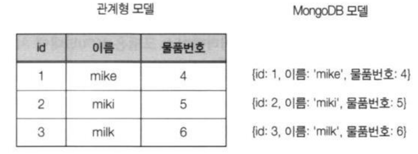

##### 언제 어떻게 써야 할까?

##### 분산 컴퓨팅 환경

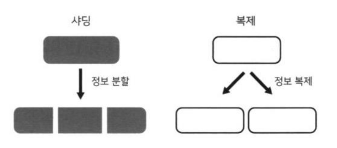

##### MonggoDB 실행

- 서버 실행

  - ```shell
    > mongod
    ```

    - c:\data\db 디렉토리가 있어야 함 
    -  디폴트 데이터 저장 디렉토리 
    - 없으면 에러

- 클라이언트 실행

  - ```shell
    > mongo
    ```

##### MongoDB 구성 요소


##### BSON 구조의 도큐먼트 형식

- BSON : Binary JSON(JavaScript Object Notaion)

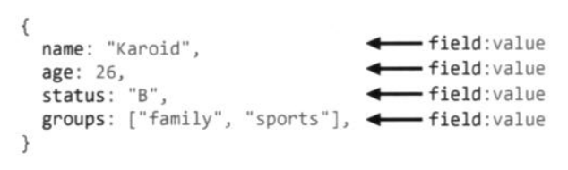

##### 데이터베이스와 컬렉션 생성

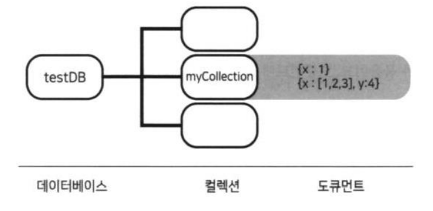

- 데이터베이스 생성

  - use 데이터베이스명
    - 지정한 데이터베이스가 존재하면 그대로 사용
    - 없으면 새로 생성
    - db 전역변수로 참조

- 컬렉션 생성

  - db.으로 문서를 저장 
    - 문서가 처음 저장될 때 컬렉션 자동 생성

  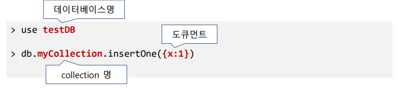

##### 데이터베이스와 컬렉션 조회

- db
  - 현재 사용중인 데이터베이스명 출력
- show dbs
  - 모든 데이터베이스명 출력
- show collections
  - 현재 사용 중인 데이터베이스에 있는 컬렉션 목록 출력

##### BSON 구조의 다양한 데이터 타입

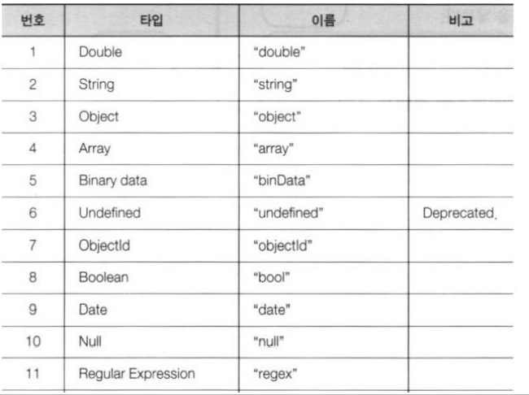

##### 기본 타입

- BSON의 값

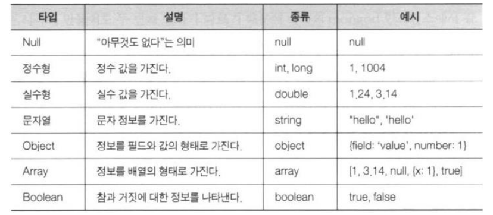

##### 예

```javascript
{
    title: "게시글 제목",
    content: "게시글 내용",
    up_vote: 1,
    is_visible: true,
    comments: [
        {username: "홍길동", content: "댓글 내용"},
        {username: "글쓴이", content: "댓글 내용"},
    ]
}
```

##### Timestamp

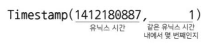

##### Date

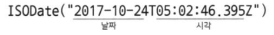

##### ★ObjectId

- 도큐먼트의 _id 필드(Primary Key)

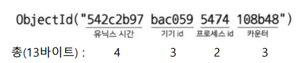

- 서버에서 발급하는 것이 아니라 클라이언트에서 발급


### MongoDB 셸 경험하기

##### 개발 툴

- MongoDB for VSCode 확장팩
-  Azure Cosmos DB 확장팩
- Robomongo


##### 데이터베이스와 컬렉션의 삭제와 수정

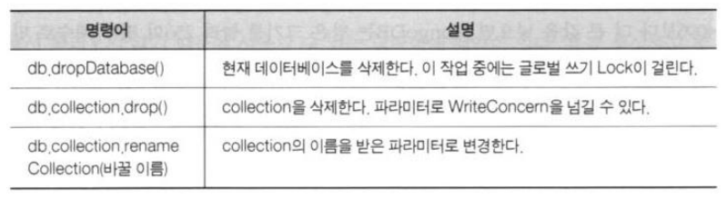

##### 데이터베이스 상태 조회

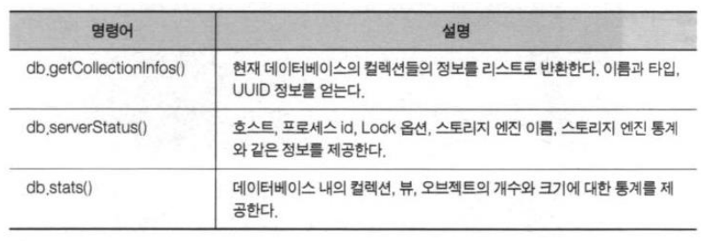

##### 컬렉션 상태 조회

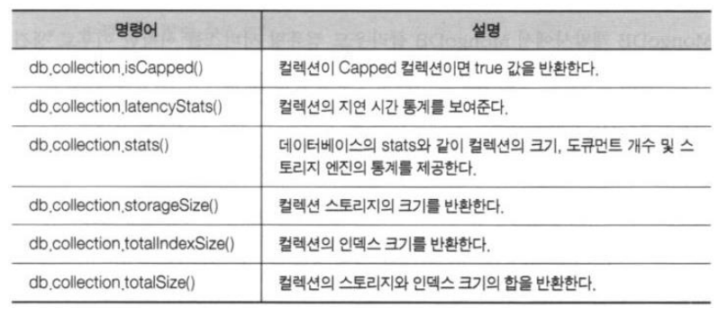

##### 실습

```javascript
use testDB
db.createCollection("cappedCollection", {
    capped: true,
    size: 10000
})
db.cappedCollection.insertOne({x:1})
db.cappedCollection.find()
```

```javascript
for(i=0; i<1000; i++) {
	db.cappedCollection.insert({x: i})
}
db.cappedCollection.find()
```

##### 단일 도큐먼트 생성

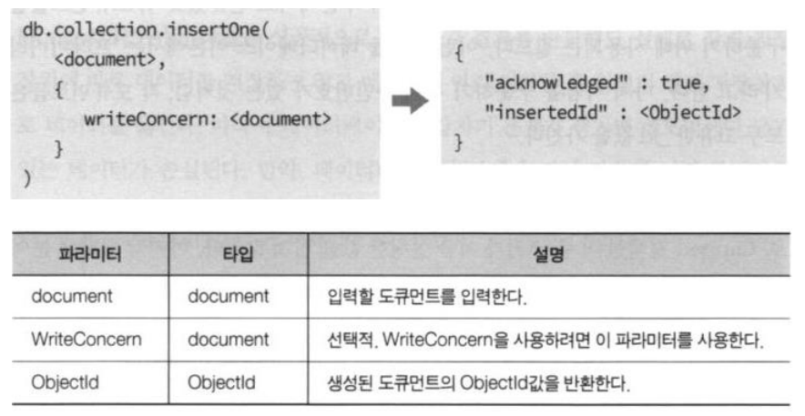

```javascript
> use testDB
> db.user.insertOne({ // 컬렉션이 없으면 자동생성
    username: "karoid",
    password: "1111"
})
> db.user.find().pretty()
```

##### 다수 도큐먼트 생성

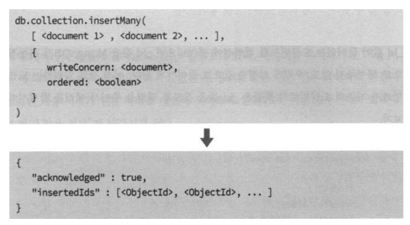

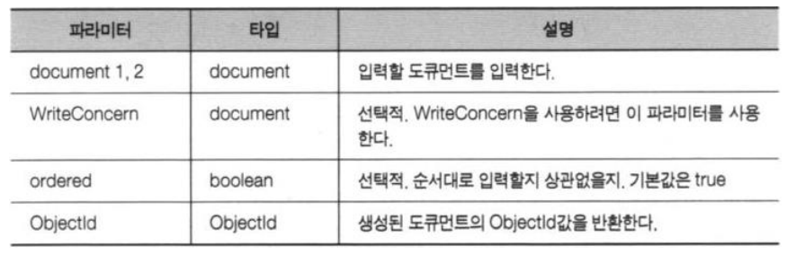

```javascript
use testDB
db.myCollections.insertMany([
    {_id: 13, item: "envelopes", qty: 60},
    {_id: 14, item: "stamps", qty: 110},
    {_id: 14, item: "packing tape", qty: 38},
])
// _id 중복으로 에러가 발생함
// 에러가 발생하면 전체 작업이 취소 됨 → 원자성
```

##### 원자성

- MongoDB는 RDBMS의 트랜잭션 처리를 지원하지 않음
- 명령의 원자성으로 이를 대신함
- MongoDB의 모든 명령은 원자성을 보장
  - 성공하거나 실패하거나
  - 부분 성공은 없음


##### 실습

1. board 데이터베이스에 작업한다. 
2. 자유게시판과 비밀게시판을 생성한다.
3. 자유게시판에 아무 글이나 3개 작성하자. 특히, 그 중에서 글 하나에는 댓 글 하나가 달린 상태로 생성해보자
4.  비밀게시판 작성자가 'noname' 값을 가지는 글을 하나 작성하자

```javascript
use board
freeboard_result = db.board.insertOne({name: "자유게시판"})
freeboard_id = freeboard_result.insertedId

db.article.insertMany([
    {
        board_id: freeboard_id,
        title: 'hello',
        content: 'hi, hello1'
    },
    {
        board_id: freeboard_id,
        title: 'hello',
        content: 'hi, hello2',
        author: 'Jeong'
    }
])
    
     
db.article.insertOne({
    board_id: freeboard_id,
    title: 'hi',
    content: 'hi, hello3',
    author: 'Hong',
    comments: [
        {author: 'Karoid', content: 'hello Hong!'}
    ]
})
```

```javascript
use board
secret_id = db.board.insertOne({name: "비밀게시판"}).insertedId

db.article.insertOne({
    board_id: secret_id,
    title: 'my Secret Title',
    content: 'hi, hello1',
    author: 'noname'
})
```


##### 도큐먼트 조회

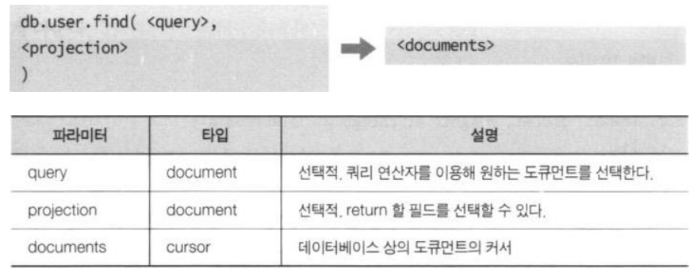

##### 쿼리

- 검색 조건을 도큐먼트 형태로 정의한 것

```javascript
db.containerBox.find({name: "가위"})
```

```javascript
use testDB
db.containerBox.insertMany([
    {name: 'bear', weight: 60, category: 'animal'},
    {name: 'bear', weight: 10, category: 'animal'},
    {name: 'cat', weight: 2, category: 'animal'},
    {name: 'phone', weight: 1, category: 'electronic'}
]);
```

```javascript
db.containerBox.find({})
/* 실행 결과
{ "_id" : ObjectId("5eb8e9f95284dfa9e50224e3"), "name" : "bear",
"weight" : 60, "category" : "animal" }
{ "_id" : ObjectId("5eb8e9f95284dfa9e50224e4"), "name" : "bear",
"weight" : 10, "category" : "animal" }
{ "_id" : ObjectId("5eb8e9f95284dfa9e50224e5"), "name" : "cat",
"weight" : 2, "category" : "animal" }
{ "_id" : ObjectId("5eb8e9f95284dfa9e50224e6"), "name" : "phone",
"weight" : 1, "category" : "electronic" }
*/
```

```javascript
db.containerBox.find({category:'animal', name:'bear'})
/*
{ "_id" : ObjectId("5eb8e9f95284dfa9e50224e3"), "name" : "bear",
"weight" : 60, "category" : "animal" }
{ "_id" : ObjectId("5eb8e9f95284dfa9e50224e4"), "name" : "bear",
"weight" : 10, "category" : "animal" }
*/
```

##### 점연산자

```javascript
var myVar = {hello: 'world'}
var a = {
    name: {
        firstName: 'Karoid', lastName: 'Jeong'
        }
    }
db.A.insert(a);
db.A.find({
    'name.firstName' : 'Karoid'
   // 내장 document key지정할 땐 반드시 따옴표''를 묶고 지정해야 한다.
    })
```

```javascript
db.B.insertMany([
    {numbers: [101, 32, 21, 11]},
    {numbers: [64, 94, 15]},
    {numbers: [52, 68, 75]}
])
db.B.find({"numbers.0": 52})
```

##### 프로젝션

- db.collection.find({조건문서},{프로젝션문서}) 
- 프로젝션 문서 - **select *** 뜻함 (default - *)
- 프로젝션 문서의 프로퍼티
- 프로퍼티명 : true : 출력
- 프로퍼티명: false : 출력 제외

```javascript
> db.containerBox.find({category:'animal', name:'bear'}, {weight:1}) // 카테고리:animal, 이름:bear인 컬럼의 wieght 필드출력
{ "_id" : ObjectId("5eb8e9f95284dfa9e50224e3"), "weight" : 60 }
{ "_id" : ObjectId("5eb8e9f95284dfa9e50224e4"), "weight" : 10 }
> db.containerBox.find({category:'animal', name:'bear'},
{category:0, name:0}) // 카테고리와 네임을 제외한 나머지 필드출력
{ "_id" : ObjectId("5eb8e9f95284dfa9e50224e3"), "weight" : 60 }
{ "_id" : ObjectId("5eb8e9f95284dfa9e50224e4"), "weight" : 10 }
> db.containerBox.find({category:'animal', name:'bear'}, {_id:0, weight:1}) // id 제외하고 weight만 출력
{"weight" : 60 }
{"weight" : 10 }
> db.containerBox.find({},{name: true, weight: true})
// 모든 문서 중 name과 weight만 출력
```

**단일 도큐먼트 교체**

```javascript
> db.collection.replaceOne(
<query>,
<document>,
{
    upsert: <boolean>,
    writeConcern: <document>,
    collation: <document>
}
)
```

- 교체이므로 _id의 값은 변경되지 않음

##### 단일 도큐먼트 교체

```javascript
db.collection.replaceOne()
```

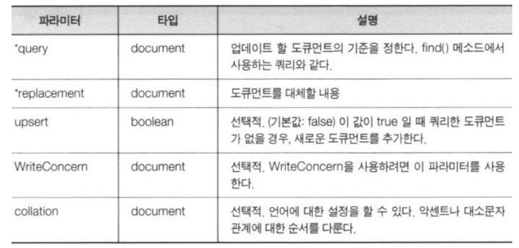

```javascript
use testDB
db.user.findOne({username: 'Karoid'})
db.user.replaceOne({username: 'Karoid'},
    {
    username: 'Karpoid',
    status: 'Sleep',
    points: 100,
    password: 2222
    }
);
db.user.findOne({username: 'Karpoid'})
```

```javascript
db.myCollection.findOne({item: 'abc123'});
db.myCollection.replaceOne({ item: 'abc123' },
    {
    item: 'abc123',
    status: 'P',
    points: 100
    },
    { upsert: true } // 있으면 replace, 없으면 추가
);
db.myCollection.findOne({item: 'abc123'});
```

##### 도큐먼트 수정

```javascript
db.containerBox.find({}, {_id: false});
db.containerBox.updateMany({name: 'bear'},
    {$set: {name: 'teddy bear', category: 'tody'}}
);
db.containerBox.find({}, {_id: false});
```

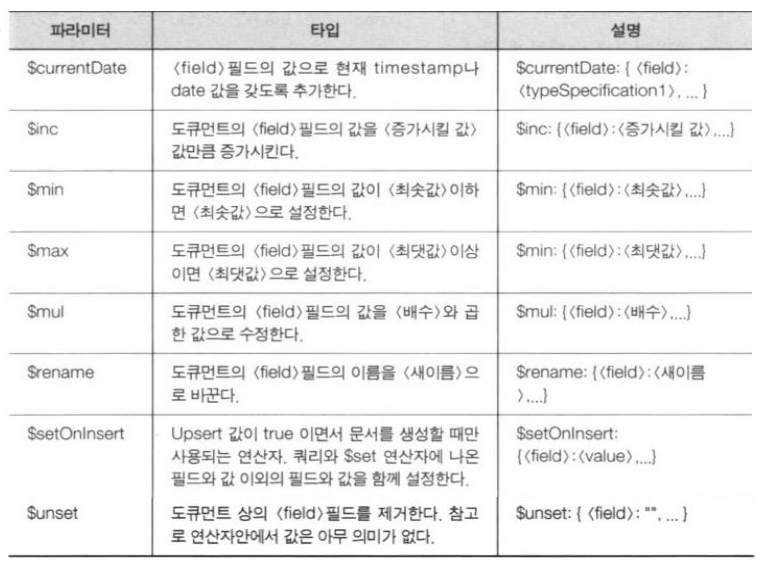

##### 도큐먼트 삭제

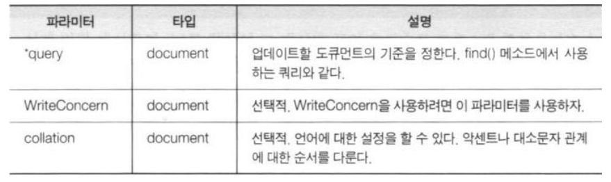

```javascript
> db.character.deleteMany({})
> db.character.drop()
> db.containerBox.deleteMany({ category: "animal"})
```


### PyMongo

##### ex01.py 데이터베이스 접속

```python
from pymongo import MongoClient
# db 서버 접속
db_client = MongoClient("mongodb://localhost:27017/")
# 기존 데이터베이스이름 목록 출력
print(db_client.list_database_names())
```

##### ex02.py 문서 하나 삽입

```python
from pymongo import MongoClient
from datetime import datetime
import random

db_client = MongoClient("mongodb://localhost:27017/")

iot_db = db_client['iot_service'] # 데이터베이스 선택, 없으면 자동 생성, use iot_service랑 같음
sensors_col = iot_db['sensors'] # 컬렉션 선택, 없으면 자동 생성

sensor_value = {
    "topic" : "iot/home1/device1/temp", # Topic과 value는 Mqtt를 써 수신된 데이터를 DB에 저장
    "value" : 24 + random.random(),
    "reg_date" : datetime.utcnow() # 현재 시간
}

x = sensors_col.insert_one(sensor_value)
print(x.inserted_id)
```

##### ex03.py 여러 개의 문서 삽입

```python
from pymongo import MongoClient
from datetime import datetime
import random

db_client = MongoClient("mongodb://localhost:27017/")

iot_db = db_client['iot_service']
sensors_col = iot_db['sensors']

sensor_values = [
    {
    "topic" : "iot/home1/device1/temp",
    "value" : 24 + random.random(),
    "reg_date" : datetime.utcnow() # 현재 시간
    },
    {
    "topic" : "iot/home1/device1/humi",
    "value" : 55 + random.random(),
    "reg_date" : datetime.utcnow() # 현재 시간
    },
    {
    "topic" : "iot/home2/device1/temp",
    "value" : 24 + random.random(),
    "reg_date" : datetime.utcnow() # 현재 시간
    },
    {
    "topic" : "iot/home2/device1/humi",
    "value" : 55 + random.random(),
    "reg_date" : datetime.utcnow() # 현재 시간
    }
]

x = sensors_col.insert_many(sensor_values)# 여러 문서 삽입
print(x.inserted_ids)
```

##### ex05.py 여러 문서 읽기

```python
from pymongo import MongoClient
from datetime import datetime
import random

db_client = MongoClient("mongodb://localhost:27017/")

iot_db = db_client['iot_service']
sensors_col = iot_db['sensors']

slist = sensors_col.find()

for x in slist:
    print(x)
```

##### ex06.py 정렬하기

```python
from pymongo import MongoClient
from datetime import datetime
import random

db_client = MongoClient("mongodb://localhost:27017/")

iot_db = db_client['iot_service']
sensors_col = iot_db['sensors']

slist = sensors_col.find().sort("value")
# 내림차순 .sort("value", -1)

for x in slist:
    print(x)
```

##### ex07.py 쿼리하기

```python
from pymongo import MongoClient
from datetime import datetime
import random

db_client = MongoClient("mongodb://localhost:27017/")

iot_db = db_client['iot_service']
sensors_col = iot_db['sensors']

query = {"topic":"iot/home1/device1/humi"}
slist = sensors_col.find(query).sort("value")
# .sort("value", -1)

for x in slist:
    print(x)
```

##### ex08.py 비교연산자로 쿼리하기

```python
from pymongo import MongoClient
from datetime import datetime
import random

db_client = MongoClient("mongodb://localhost:27017/")

iot_db = db_client['iot_service']
sensors_col = iot_db['sensors']

query = {"value": {"$gt":24.1}} # 비교연산자 gt: > ,lt: <
projection = {"_id":0, "topic":1, "value":1}
slist = sensors_col.find(query, projection).sort("value")
# .sort("value", -1), projection으로 필요한 것만 출력

for x in slist:
    print(x)
```

##### ex09.py 데이터 한개 수정하기

```python
from pymongo import MongoClient
from datetime import datetime
import random

db_client = MongoClient("mongodb://localhost:27017/")

iot_db = db_client['iot_service']
sensors_col = iot_db['sensors']

query = {"value":{"$gt":24.1}}
newvalues = {"$set": { "reg_date": datetime.now() }}
# datetime.now -> 국내시간
projection = {"_id":0, "value":1, "reg_date":1}
sensors_col.update_one(query, newvalues) # 하나만 수정

sensor_values = sensors_col.find(query,projection)
for x in sensor_values:
    print(x)
```

##### ex09.py 데이터 여러개 수정하기

```python
from pymongo import MongoClient
from datetime import datetime
import random

db_client = MongoClient("mongodb://localhost:27017/")

iot_db = db_client['iot_service']
sensors_col = iot_db['sensors']

query = {"value":{"$gt":24.1}}
newvalues = {"$set": { "reg_date": datetime.now() }}
# datetime.now -> 국내시간
projection = {"_id":0, "value":1, "reg_date":1}
sensors_col.update_many(query, newvalues) # 여러개 수정

sensor_values = sensors_col.find(query,projection)
for x in sensor_values:
    print(x)
```

##### ex09.py 하나 삭제하기

```python
from pymongo import MongoClient
from datetime import datetime
from bson.objectid import ObjectId
import random

db_client = MongoClient("mongodb://localhost:27017/")

iot_db = db_client['iot_service']
sensors_col = iot_db['sensors']

# query = {"value":{"$gt":24.1}}
query = {"_id" : ObjectId("5f83e7f23675ceaa89117e2e")}
# 일반적으로 데이터를 삭제할 땐 id를 받아 삭제를 진행
sensors_col.delete_one(query) # 한개삭제

sensor_values = sensors_col.find()
for x in sensor_values:
    print(x)
```


### 스레드

##### 프로세스(process)

- 실행 중인 하나의 프로그램
- 하나의 프로그램이 여러 프로세스로 만들어짐

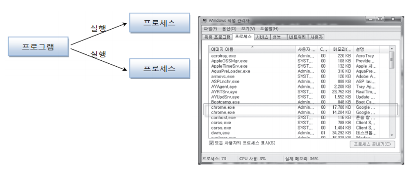

##### 멀티 태스킹(multi tasking)

- 두 가지 이상의 작업을 동시에 처리하는 것
- 멀티 프로세스
  - 독립적으로 프로그램들을 실행하고 여러 가지 작업 처리
- 멀티 스레드
  - 한 개의 프로그램을 실행하고 내부적으로 여러 가지 작업 처리

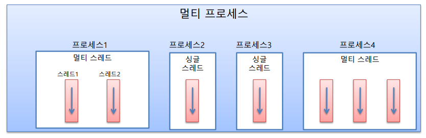

##### 메인(main) 스레드

- 모든 프로그램은 메인 스레드가 실행하며 시작 
- 실행 파일의 첫 코드부터 아래로 순차적으로 실행 
- 더 이상 실행할 코드가 없는 경우 종료

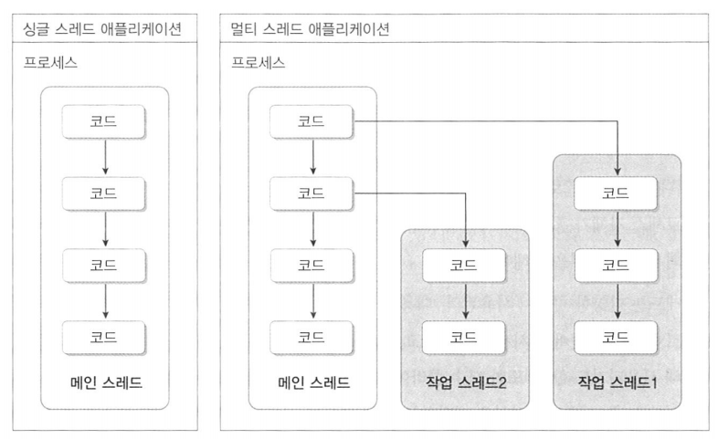

- 실행 종료 조건
  - 마지막 코드 실행
  - return 문을 만나면
- main 스레드는 작업 스레드들을 만들어 병렬로 코드들 실행
  - 멀티 스레드 생성해 멀티 태스킹 수행
- 프로세스의 종료
  - 싱글 스레드: 메인 스레드가 종료하면 프로세스도 종료
  - 멀티 스레드: 실행 중인 스레드가 하나라도 있다면, 프로세스 미종료

##### 멀티 스레드로 실행하는 어플리케이션 개발

- 몇 개의 작업을 병렬로 실행할지 결정하는 것이 선행되어야

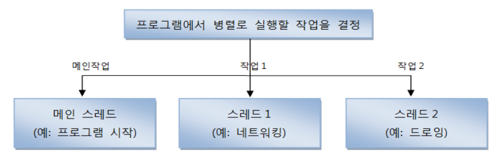

##### threading 모듈

- Thread 클래스
- 스레드 운영 방법
  - Thread에게 작업 함수를 전달해서 실행
  - Thread 클래스를 상속 받아 재정의
    - run() 메서드 재정의
- 스레드의 기동
  - start() 호출


### 스레드 함수

##### threading 모듈

- threading.Thread() 함수를 호출하여 Thread 객체 생성
  - 생성자에 실행 함수와 인자를 전달
- Thread 객체의 start() 메서드 호출


##### ex01.py 

```python
import threading
from time import sleep

def sum(low, high):
    total = 0
    for i in range(low, high):
        total += i
        sleep(0.001)
    print("Subthread", total)

t = threading.Thread(target=sum, args=(1, 1000))
t.start()

print("Main Thread")
```

##### 인터넷으로 파일 다운로드 받기

- requests 모듈
- get(url)
  - 지정한 url을 요청하고 웹 서버로부터 받은 응답(response)을 리턴
- response
  - text
    - 웹 서버가 리턴한 텍스트 저장
  - content
    - 웹 서버가 리턴한 실제 데이터 저장

```python
from threading import Thread
import requests
import time

def getHtml(url):
    resp = requests.get(url)
    time.sleep(1)
    print(url, len(resp.text), resp.text)
    
t1 = Thread(target=getHtml, args=('https://naver.com',))
t1.start()
```


### 스레드 클래스

##### Thread 상속 방법

```python
from threading import Thread

class WorkerThread(Thread):
    def __init__(self):
        super().__init__()
        # 속성 초기화
        
    def run(self): # 반드시 run함수가 있어야 된다.
        # 워커 스레드 작업 정의
        pass

t = WorkerThread()
t.start()
```

##### threading 모듈

- Thread 클래스 상속 방법
- run() 메소드 구현

```python
import threading, requests, time

class HtmlGetter (threading.Thread):
    def __init__(self, url):
        threading.Thread.__init__(self)
        self.url = url
        
    def run(self):
        resp = requests.get(self.url)
        time.sleep(1)
        print(self.url, len(resp.text), resp.text)

t = HtmlGetter('https://google.com')
t.start()

print("### End ###")
```


### MQTT Python Client - Paho

##### paho-mqtt 모듈

- MQTT Python Client 모듈 
- 설치 
  - sudo pip3 install paho-mqtt

##### 구독자(Subscriber) 개발 절차

- MQTT 클라이언트 클래스 인스턴스화 
- 브로커 연결 
- 토픽 구독 신청 
- 토픽 수신시 호출할 핸들러 등록
-  토픽 수신 대기 
- 토픽 수신시 처리 - 핸들러 호출

##### 발행자(Publisher) 개발 절차

- MQTT 클라이언트 클래스 인스턴스화
- 브로커 연결
- 필요시 토픽 발행(전송)

#####  클라이언트 클래스 인스턴스화하기 : Client( )

```python
Client(client_id="", clean_session=True, userdata=None, protocol=MQTTv311,transport="tcp")
```

- client_id
  - 브로커에 연결할 때 사용되는 고유 클라이언트 ID 문자열. 
  - 비어있거나 None인 경우, 무작위로 결정
    - 이 경우 clean_session은 True여야함.
- clean_session
  - 브로커와의 연결이 끊어졌을 때 브로커가 클라이언트의 정보를 지울지 여부
- userdata
  - 핸들러에서 사용한 사용자 정의 데이터 타입
-  protocol 
  - MQTT 버전( MQTTv31 or MQTTv311)
- transport
  - 전송 프로토콜("tcp" 또는 "websocket")

##### 클라이언트 클래스 인스턴스화하기 : Client( )

```python
import paho.mqtt.client as mqtt
mqttc = mqtt.Client()
```

##### 연결: connect()

```python
connect(host, port=1883, keepalive=60, bind_address="")
```

- host
  - 브로커의 호스트명 또는 IP 주소
- port
  - 브로커의 포트 번호
-  keepalive
  - 브로커와의 통신 사이에 허용되는 최대 기간 (초). 
  - 다른 메시지가 교환되지 않으면 클라이언트가 브로커에 ping 메시지를 보낼 속도 를 제어
- bind_address
  - 네트워크 인터페이스(랜카드)가 여러 개 인 경우, 바인딩할 IP 주소
- 콜백(Callback)
  - 연결 성공시 on_connect() 콜백 호출

#####  비동기 연결 : connect_async ( )

```python
connect_async(host, port=1883, keepalive=60, bind_address="")
```

- loop_start () 와 함께사용 하여 비 차단 방식으로 연결

#####  재연결 : reconnect( )

- 이전에 사용했던 접속 정보로 다시 접속 시도

```python
reconnect()
```

##### 연결 끊기 : disconnect()

```python
disconnect()
```

##### 네트워크 루프(프로그래밍)

- 메시지 수신 처리를 위해서는 스레드로 구현 필요
- loop()
  - 1개의 네트워크 이벤트 처리
- loop_start()
  - 새로운 스레드를 실행하여 loop()를 무한 실행
- loop_forever()
  - 현재 스레드에서 loop()를 무한 실행

##### 토픽 발간하기 : publish( )

```python
publish (topic, payload = None, qos = 0, retain = False)
```

- topic
  - 메시지를 게시 할 주제
- payload
  - 전송할 메시지
  - 문자열 또는 바이트 데이터(struct.pack() 필요)
- qos
  - qos(quality of service) 수준
- retain
  - True 설정한 경우, 해당 토픽에 대한 가장 최근의 메시지 유지

#####  구독/구독 취소: subscribe( ) / unsubscribe( )

```python
subscribe(topic, qos=0)
unsubscribe(topic)
```

##### 콜백

- 특정 이벤트(접속 성공, 메시지 수신 등)가 발생했을 때 호출되는 핸들러 (함수) 
- on_connect(client, userdata, flags, rc)
  - 브로커가 연결 요청에 응답 할 때 호출
  -  client 
    - 이 콜백의 클라이언트 인스턴스 
  - userdata
    -  Client() 또는 user_data_set()에서 설정한 사용자 데이터
  - flags
    - 브로커가 보낸 응답 플래그
  - rc
    - 연결 결과
    - 0 : 연결 성공 
    - 1~5 : 연결 거부
    -  -255 : 현재 사용되지 않습니다.
- on_disconnect(client, userdata, rc)
  - 브로커와 연결이 끊어질때 호출
  - client
    - 이 콜백의 클라이언트 인스턴스
  - userdata
    - Client() 또는 user_data_set()에서 설정한 사용자 데이터
  - rc
    - 처리 결과
    - 0: 정상적으로 끊김
    - 0이 아닌 값 : 예외에 의해 끊어짐
- on_message(client, userdata, message)
  - subscriber에서 메시지(토픽)가 수신됬을 때 호출
  - client
    - 이 콜백의 클라이언트 인스턴스
  - userdata
    - Client() 또는 user_data_set()에서 설정한 사용자 데이터
  -  message
    -  MQTTMessage 인스턴스. 
    - 속성 : topic , payload , qos , retain 

##### subscriber.py

```python
import paho.mqtt.client as mqtt
from time import sleep
from pymongo import MongoClient
from datetime import datetime

mongodb = MongoClient("mongodb://localhost:27017")
# mongodb = MongoClient("mongodb://192.168.0.21") # pc에 mongodb가 설치되어 있을 때, ip주소 접근
db = mongodb.iot_service

# 브로커 접속 시도 결과 처리 콜백 함수
def on_connect(client, userdata, flags, rc):
    print("Connected with result code "+ str(rc))
    if rc == 0:
        client.subscribe("iot/#") # 연결 성공시 토픽 구독 신청
    else:
        print('연결 실패 : ', rc)

# 관련 토픽 메시지 수신 콜백 함수
def on_message(client, userdata, msg):
    value = float(msg.payload.decode())
    print(f" {msg.topic} {value}")
    # MongoDB에 데이터 저장하는 코드가 여기에서 이루어짐
    doc = {
        "topic" : msg.topic,
        "value" : value,
        "reg_date" : datetime.now()
    }
    db.sensors.insert_one(doc)

# 1. MQTT 클라이언트 객체 인스턴스화
client = mqtt.Client()

# 2. 관련 이벤트에 대한 콜백 함수 등록
client.on_connect = on_connect
client.on_message = on_message

try :
    # 3. 브로커 연결
    client.connect("localhost")

    # 4. 메시지 루프 - 이벤트 발생시 해당 콜백 함수 호출됨
    client.loop_forever() # 메인스레드가 loop 실행
   # client.loop_start() # 새로운 스레드를 기동해서 운영 - daemon 스레드 Thread.setDaemon(true)

except Exception as err:
    print('에러 : %s'%err)
```

##### publisher.py

```python
import paho.mqtt.client as mqtt
from time import sleep
from random import random

# 1. MQTT 클라이언트 객체 인스턴스화
client = mqtt.Client()

try :
    # 2. 브로커 연결
    client.connect("localhost")

    # 3. 토픽 메시지 발행
    while True:
        client.publish("iot/home2/temp", 25+random())
        client.loop(2)
        sleep(2)
except Exception as err:
    print('에러 : %s'%err)
```


