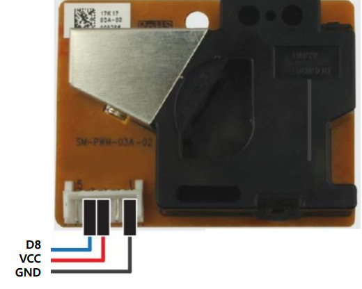

## 2020.10.13 TIL

### 미세먼지 센서

- SW-PWM-03A-02
- 수직으로 세워서 측정
- 특성상 눕여 놓으면 먼지가 쌓임



##### 국제 미세먼지농도에 따른 경계단계 기준분류

- 30ug/m3 이하 : 좋음
- 30~80ug/m3 : 보통
- 80~150ug/m3 : 나쁨
- 150ug/m3 초과 : 매우 나쁨

##### dust_ex01.ino

```c++
#include <MiniCom.h>

unsigned long lowpulseoccupancy = 0;
float ratio = 0;

const int DUST_PIN = 8;
unsigned long sampletime_ms = 2000;

MiniCom com;

void dust_check() {

    // Integer percentage 0=>100
    ratio = lowpulseoccupancy / (sampletime_ms * 10.0);
    double concentration = 1.1 * pow(ratio, 3) - 3.8 * pow(ratio, 2) + 520 * ratio + 0.62; // using spec sheet curve
    int dustDensity = concentration * 100 / 13000;
    lowpulseoccupancy = 0;
    int dust_level = 0;

    if(dustDensity > 150) dust_level = 3;
    else if(dustDensity > 80) dust_level = 2;
    else if(dustDensity > 30) dust_level = 1;
    else dust_level = 0;

    Serial.print(dustDensity);
    Serial.print(",");
    Serial.println(dust_level);
    com.print(0, "D", dustDensity, "L", dust_level);
}

void setup() {
    com.init();
    pinMode(DUST_PIN, INPUT);
    com.setInterval(sampletime_ms, dust_check);
}

void loop() {
    unsigned long duration = pulseIn(DUST_PIN, LOW);
    lowpulseoccupancy += duration;
    com.run();
}
```

### 아두이노와 라즈베리 통신

##### 아두이노 - app.ino (publisher)

```c++
#include <SoftwareSerial.h>
#include <WiFiEsp.h>
#include <PubSubClient.h>
#include <SimpleTimer.h>
#include <WifiUtil.h>
#include <DHT.h>
#include <MiniCom.h>

SoftwareSerial softSerial(2, 3);           // RX, TX

const char ssid[] = "ABC";               // 네트워크 SSID
const char password[] = "kim3262286";       // 비밀번호
const char mqtt_server[] = "192.168.0.21"; // 라즈베리파이의 브로커 주소

unsigned long lowpulseoccupancy = 0;
float ratio = 0;

MiniCom com;
DHT dht(5, DHT11); // DHT설정 - dht (디지털3, dht11)
const int DUST_PIN = 8;
unsigned long sampletime_ms = 2000;

// MQTT용 WiFi 클라이언트 객체 초기화
WifiUtil wifi(2, 3);
WiFiEspClient espClient;
PubSubClient client(espClient);

void mqtt_init() {
    client.setServer(mqtt_server, 1883);
}

// MQTT 서버에 접속될 때까지 재접속 시도
void reconnect() {

    while (!client.connected()) {
        Serial.print("Attempting MQTT connection...");
        
        if (client.connect("ESP8266Client")) {
            Serial.println("connected");
            // subscriber로 등록
            client.subscribe("home/iot/#");  // 구독 신청
        } else {
            Serial.print("failed, rc=");
            Serial.print(client.state());
            Serial.println(" try again in 5 seconds");
            delay(5000);
        }
    }
}

void publish() {
    float h = dht.readHumidity();
    float t = dht.readTemperature();
    char message[10];
    // 토픽 발행
    dtostrf(h, 5, 2, message);
    client.publish("iot/home1/humi", message);
    dtostrf(t, 5, 2, message);
    client.publish("iot/home1/temp", message);

    com.print(0, "humi", h);
    com.print(1, "temp", t);
    Serial.print(h);
    Serial.print(",");
    Serial.println(t);
}

// 2초 간격으로 publish
SimpleTimer timer;

void setup() {
    com.init();
    wifi.init(ssid, password);
    mqtt_init();
    dht.begin();
    pinMode(DUST_PIN, INPUT);
    com.setInterval(2000,publish);
}

void loop() {
    if (!client.connected()) {  // MQTT가 연결 X
        reconnect();
    }

    client.loop();
    com.run();
    timer.run();
}
```

##### 라즈베리파이 subscriber.py

```python
import paho.mqtt.client as mqtt
from time import sleep
from pymongo import MongoClient
from datetime import datetime

mongodb = MongoClient("mongodb://192.168.0.12:27017")
db = mongodb.iot_service

# 브로커 접속 시도 결과 처리 콜백 함수
def on_connect(client, userdata, flags, rc):
    print("Connected with result code "+ str(rc))
    if rc == 0:
        client.subscribe("iot/#") # 연결 성공시 토픽 구독 신청
    else:
        print('연결 실패 : ', rc)

# 관련 토픽 메시지 수신 콜백 함수
def on_message(client, userdata, msg):
    value = float(msg.payload.decode())
    print(f" {msg.topic} {value}")
    # MongoDB에 데이터 저장하는 코드가 여기에서 이루어짐
    doc = {
        "topic" : msg.topic,
        "value" : value,
        "reg_date" : datetime.now()
    }
    db.sensors.insert_one(doc)

# 1. MQTT 클라이언트 객체 인스턴스화
client = mqtt.Client()

# 2. 관련 이벤트에 대한 콜백 함수 등록
client.on_connect = on_connect
client.on_message = on_message

try :
    # 3. 브로커 연결
    client.connect("localhost")

    # 4. 메시지 루프 - 이벤트 발생시 해당 콜백 함수 호출됨
    client.loop_forever() # 메인스레드가 loop 실행
   # client.loop_start() # 새로운 스레드를 기동해서 운영 - daemon 스레드 Thread.setDaemon(true)

except Exception as err:
    print('에러 : %s'%err)
```

### Motion JPEG

##### 앱 만들기

```shell
$ pip install django
$ django-admin startproject mysite
$ mv mysite iot
$ cd iot
$ python manage.py startapp mjpeg
```

##### mysite/settings.py

```python
:
ALLOWED_HOSTS = ['192.168.219.103', '127.0.0.1', 'localhost']
INSTALLED_APPS = [
:
    'mjpeg.apps.MjpegConfig'
]
:
LANGUAGE_CODE = 'ko-kr'
TIME_ZONE = 'Asia/Seoul'
:
```

##### mysite/urls.py

```python
from django.contrib import admin
from django.urls import path, include
urlpatterns = [
    path('admin/', admin.site.urls),
    path('mjpeg/', include('mjpeg.urls')),
]
```

##### mjpeg/urls.py

```python
from django.contrib import admin
from django.urls import path
from mjpeg.views import *

urlpatterns = [
    path('', CamView.as_view()),
    path('snapshot/', snapshot, name='snapshot'),
    path('stream/', mjpeg_stream, name='stream'),
]
```

##### usbcam.py

```python
import cv2

class USBCam:
    def __init__(self, show = False, framerate = 25, width = 640,height= 480):
        self.size = (width,height)
        self.show = show
        self.framerate = framerate

        self.cap = cv2.VideoCapture(1) # 1번 카메라
        self.cap.set(cv2.CAP_PROP_FRAME_WIDTH,self.size[0])
        self.cap.set(cv2.CAP_PROP_FRAME_HEIGHT, self.size[1])

    def snapshot(self): # jpeg 이미지 1장 리턴
        retval, frame = self.cap.read() # 프레임 캡쳐, frame: numpy배열 - BGR
        if retval :
            _, jpg = cv2.imencode('.JPEG', frame) # _, True False를 받아주는 변수
            return jpg.tobytes()

class MJpegStreamCam(USBCam):
    def __init__(self, show = False, framerate = 25, width = 640,height= 480):
        super().__init__(show=show, framerate=framerate, width=width, height=height)

    def __iter__(self): # 열거 가능객체이기 위한 조건 for x in MJpegStreamCam() :
        while True:
            retval, frame = self.cap.read()
            _, jpg = cv2.imencode('.JPEG',frame)
            yield(
                b'--myboundary\n'
                b'Content-Type:image/jpeg\n'
                b'Content-Length: ' + f"{len(jpg)}".encode()+b'\n'
                b'\n' + jpg.tobytes() + b'\n'
            )
        
```

