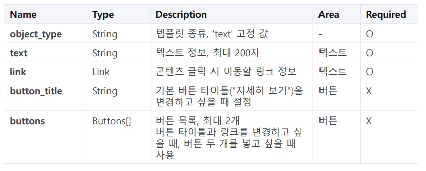
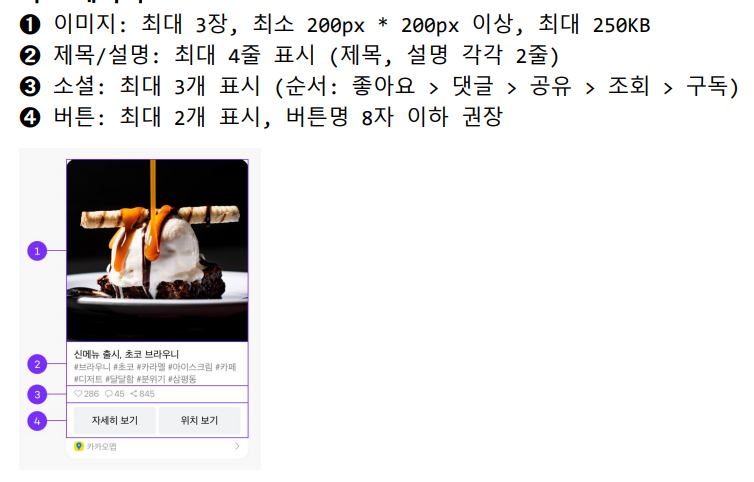
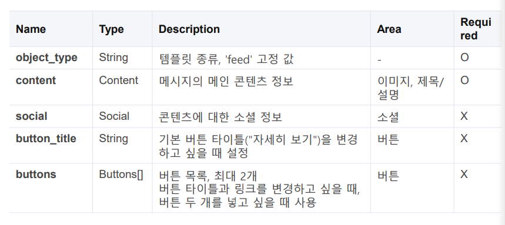
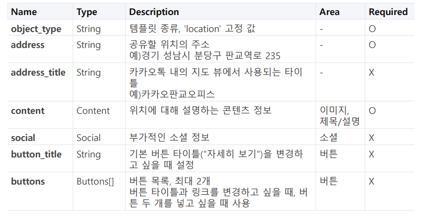
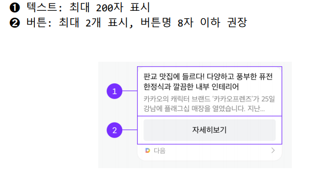

## 2020.10.14 TIL

### Motion JPEG

##### picam.py

```python
import cv2
import io
import time
import numpy as np
from picamera.array import PiRGBArray
from picamera import PiCamera

class PiCam:
    def __init__(self, show=True, framerate=25, width=640, height=480):
        self.size = (width, height)
        self.show = show
        self.framerate = framerate

        self.camera = PiCamera()
        self.camera.rotation = 180
        self.camera.resolution = self.size
        self.camera.framerate = self.framerate


    def snapshot(self):
        frame = io.BytesIO()
        self.camera.capture(frame, 'jpeg',use_video_port=True)
        frame.seek(0)
        return frame.getvalue()

class MJpegStreamCam(PiCam):
    def __init__(self, show=True, framerate=25, width=640, height=480):
        super().__init__(show=show, framerate=framerate, width=width, height=height)

    def __iter__(self):
        frame = io.BytesIO()
        while True:
            self.camera.capture(frame, format="jpeg", use_video_port=True)
            image = frame.getvalue()
            yield(
                b'--myboundary\n'
                b'Content-Type:image/jpeg\n'
                b'Content-Length: ' + f"{len(image)}".encode()+b'\n'
                b'\n' + image + b'\n')
            frame.seek(0)
            # frame.truncate(0) # 기존 내용은 버리겠다
```

### 카톡  메시지 보내기

##### kakao 앱 추가

```shell
python manage.py startapp kakao
```

##### settings.py

```python
INSTALLED_APPS = [
:
'kakao.apps.KakaoConfig'
]
```

##### kakao/view.py

```python
from django.shortcuts import render
from django.views.generic import TemplateView, FormView
from kakao.forms import KaKaoTalkForm
import json
import requests
from django.contrib import messages

client_id = "REST API"

class KakaoLoginView(TemplateView):
    template_name = "kakao_login.html"

    def get_context_data(self, **kwargs):
        context = super().get_context_data(**kwargs)
        context["client_id"] = client_id
        return context


class KakaoAuthView(TemplateView):
    template_name = "kakao_token.html"

    def get_context_data(self, **kwargs):
        context = super().get_context_data(**kwargs)
        code = self.request.GET['code']
        token = self.getAccessToken(code)
        context["client_id"] = client_id
        context["token"] = token
        self.save_access_token(token["access_token"])

        return context

    # 세션 코드값 code 를 이용해서 ACESS TOKEN과 REFRESH TOKEN을 발급 받음
    def getAccessToken(self, code):
        url = "https://kauth.kakao.com/oauth/token"
        payload = "grant_type=authorization_code"
        payload += "&client_id=" + client_id
        # redirect url을 넣어준다. 라즈베리파이 주소
        payload += "&redirect_url=http://192.168.0.10:8000/kakao/oauth&code=" + code
        headers = {
            'Content-Type': "application/x-www-form-urlencoded",
            'Cache-Control': "no-cache",
        }
        response = requests.post(url, data=payload, headers=headers)
        return response.json()

    def save_access_token(self, access_token):
        with open("access_token.txt", "w") as f:
            f.write(access_token)

class KakaoTalkView(FormView):
    form_class = KaKaoTalkForm
    template_name = "kakao_form.html"
    success_url = "/kakao/talk"

    def form_valid(self, form):
        res, text = form.send_talk()

        if res.json().get('result_code') == 0:
            messages.add_message(self.request, messages.SUCCESS, "메시지 전송 성공 : " + text)
        else:
            messages.add_message(self.request, messages.ERROR,"메시지 전송 실패 : " + str(res.json()))
        return super().form_valid(form)
```

##### kakao/templates/kakao_login.html

```html
<div>
<h1 class="my-5"> 카카오 로그인</h1>
<a
href="https://kauth.kakao.com/oauth/authorize?client_id={{client_id}}&redirect
_uri=http://192.168.0.21:8000/kakao/oauth&response_type=code&scope=talk_message"
class="btn btn-primary">Kakao login</a>
</div>
```

##### kakao/templates/kakao_token.html

```html
<h1 class="my-3">카카오 토큰 정보</h1>

<div class="alert alert-danger">
    <div class="row">
        <div class="col-sm-2">error</div>
        <div class="col-sm-10">{{token.error}}</div>
    </div>
    <div class="row">
        <div class="col-sm-2">error_description</div>
        <div class="col-sm-10">{{token.error_description}}</div>
    </div>
</div>
<a href="javascript:history.back()" class="btn btn-primary">돌아가기</a>

<div>
    <div class="row">
        <div class="col-sm-2">access_token</div>
        <div class="col-sm-10">{{token.access_token}}</div>
    </div>
    <div class="row">
        <div class="col-sm-2">token_type</div>
        <div class="col-sm-10">{{token.token_type}}</div>
    </div>
    <div class="row">
        <div class="col-sm-2">scope</div>
        <div class="col-sm-10">{{token.scope}}</div>
    </div>
    <div class="row">
        <div class="col-sm-2">expires_in</div>
        <div class="col-sm-10">{{token.expires_in}}</div>
    </div>
    <div class="row">
        <div class="col-sm-2">refresh_token</div>
        <div class="col-sm-10">{{token.refresh_token}}</div>
    </div>
    <div class="row">
        <div class="col-sm-2">refresh_token_expires_in</div>
        <div class="col-sm-10">{{token.refresh_token_expires_in}}</div>
    </div>
</div>

</div>
```

##### kakao/urls.py

```python
from django.urls import path
from kakao.views import *

app_name = "kakao"

urlpatterns = [
    path('login', KakaoLoginView.as_view(), name="login"),
    path('oauth', KakaoAuthView.as_view(), name="oatuh"),
    path('talk', KakaoTalkView.as_view(), name="talk"),
]
```

##### forms.py

```python
from django import forms
import json
import requests

class KaKaoTalkForm(forms.Form):
    text = forms.CharField(label='전송할 Talk', max_length=300)
    web_url = forms.CharField(label='Web URL', max_length=300,
                        initial='http://192.168.0.21:8000/mjpeg?mode=stream')
    mobile_web_url = forms.CharField(label='Mobile Url', max_length=300,
                        initial='http://192.168.0.21:8000/mjpeg?mode=stream')

    def send_talk(self):
        talk_url = "https://kapi.kakao.com/v2/api/talk/memo/default/send"
        with open("access_token.txt", "r") as f:
            token = f.read()

        header = {"Authorization": f"Bearer {token}"}
        text_template = {
            'object_type': 'text',
            'text': self.cleaned_data['text'],
            'link': {
                'web_url': self.cleaned_data['web_url'],
                'mobile_web_url': self.cleaned_data['mobile_web_url']
            },
            'button_title' : '카메라 보기'
        }
        print(text_template)
        payload = {'template_object': json.dumps(text_template)}
        res = requests.post(talk_url, data=payload, headers=header)

        return res, self.cleaned_data['text']
```

##### kakao_form.html

```html
<h1>Talk 보내기</h1>

    
    <div>
        {{msg.message}}
    </div>
    
    <hr>



<form method="post">
    <div>{{form.text.label}} : {{form.text}}</div>
    <div>{{form.web_url.label}} : {{form.web_url}}</div>
    <div>{{form.mobile_web_url.label}} : {{form.mobile_web_url}}</div>
    <input type="submit" value="보내기">
</form>
```

##### 메시지 종류


##### 텍스트 메시지



##### 피드메시지





##### 위치 메시지



##### 텍스트 메시지



```python
from django import forms
import json
import requests

class KaKaoTalkForm(forms.Form):
    text = forms.CharField(label='전송할 Talk', max_length=300)
    web_url = forms.CharField(label='Web URL', max_length=300,
                        initial='http://192.168.0.21:8000/mjpeg?mode=stream')
    mobile_web_url = forms.CharField(label='Mobile Url', max_length=300,
                        initial='http://192.168.0.21:8000/mjpeg?mode=stream')

    def send_talk(self):
        talk_url = "https://kapi.kakao.com/v2/api/talk/memo/default/send"
        with open("access_token.txt", "r") as f:
            token = f.read()

        header = {"Authorization": f"Bearer {token}"}
        # text_template = {
        #     'object_type': 'text',
        #     'text': self.cleaned_data['text'],
        #     'link': {
        #         'web_url': self.cleaned_data['web_url'],
        #         'mobile_web_url': self.cleaned_data['mobile_web_url']
        #     },
        #     'button_title' : '카메라 보기'
        # }
        text_template = {
            "object_type": "location",
            "address" : "경기도 부천시 조마루로 135",
            "content": {
                "title": "달 사진",
                "description": "위치보기는 집으로",
                "image_url": "https://www.thisiscolossal.com/wp-content/uploads/2019/02/moon_crop-640x640.jpg",
                "image_width": 640,
                "image_height": 640,
                "link": {
                    "web_url": "http://www.daum.net",
                    "mobile_web_url": "http://m.daum.net",
                    "android_execution_params": "contentId=100",
                    "ios_execution_params": "contentId=100"
                }
            },
        }
        template_object={
            "object_type": "feed",
            "content": {
                "title": "ㅇㅇ",
                "image_url": "https://taegon.kim/wp-content/uploads/2018/05/image-5.png",
                "image_width": 640,
                "image_height": 640,
                "link": {
                    "web_url": "https://taegon.kim/wp-content/uploads/2018/05/image-5.png",
                    "mobile_web_url": "http://m.daum.net",
                    "android_execution_params": "contentId=100",
                    "ios_execution_params": "contentId=100"
                }
            },
            "social": {
                "like_count": 100,
                "comment_count": 200,
                "shared_count": 300,
                "view_count": 400,
                "subscriber_count": 500
            },
            "buttons": [
                {
                    "title": "웹으로 이동",
                    "link": {
                        "web_url": "http://www.daum.net",
                        "mobile_web_url": "http://m.daum.net"
                    }
                },
                {
                    "title": "위치보기",
                    "link": {
                        "address" : "경기도 부천시"
                    }
                }
            ]
        }

        print(text_template)
        payload = {'template_object': json.dumps(text_template)}
        res = requests.post(talk_url, data=payload, headers=header)

        return res, self.cleaned_data['text']
```

