# TIL 2020.09.04 c++

### 기본 자료형

``` c++
#include <iostream>

using namespace std;

int main(int argc, char const *argv[])
{

  cout << "Hello world" << endl;

  return 0;

}
```

+ main 함수 - 프로그램의 진입점(entry point)
+ #include - 외부 프로그램 소스를 포함시키는 매크로
+ iostream - 입출력 관련 기본 라이브러리, std 네임스페이스를 정의
+ :: - 스코프 연산자, 어디에 정의되어 있는지 지정할 때 사용

+ namespace - 네임스페이스 생략을 위해 지정 ex) std::cout --> cout

  ``` c++
  #include <iostream>
  // using namespace std;
  
  int main(int argc, char const *argv[])
  {
      // cout << "Hello world" << endl;
      std:: cout <<"Hello world" << std::endl; // using space를 쓰지 않으면 각각 어떤 식별자인지 직접적으로 넣어줘야 한다
      return 0;
  }
  ```

  

+ cout - 출력, python에 print문과 같이 출력문

+ ``` c++
  <method> << <content> <<//메소드에 content를 넣어라 
  ```


#### python과 c++의 다른점

+ c++은 python과 다르게실행파일을 만들어 주기 때문에 소스파일의 변경이 없으면 따로 컴파일을 할 필요가 없다.

+ 실행파일을 만들어 주는 행위를 컴파일이라고 하고, 실행파일을 만들어주는 도구가 컴파일러 이다.

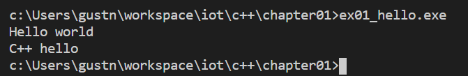


#### 변수

+ 변수를 사용하기 위해서는 먼저 선언을 하고 사용해야 함

+ 해당 변수의 데이터 타입을 지정 - 한번 지정하면 다른 데이터 타입은 사용불가

+ 데이터타입 변수명

  ```c++
  int i;
  i = 100;
  ```

##### 변수의 자료형

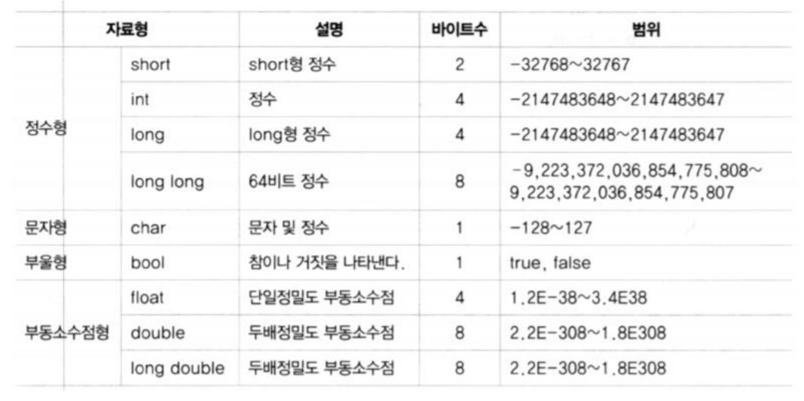

+ boolean 
  + true/false 만 가질 수 있는 타입
    + true - 0이 아닌 모든 값, 일반적으로 1로 표현
    + flase - 0

``` c++
#include <iostream>
using namespace std;

int main(int argc, char const *argv[])
{
    bool b;
    b = true;

    cout << b << endl; // 1로 출력됨.

    b = false;
    cout << b; // 0로 출력됨.
    return 0;
}
```


+ char
  + 글자 하나를 저장하는 데이터 타입
  + 작은 따옴표로 묶어서 글자 표현

``` c++
#include <iostream>
using namespace std;

int main(int argc, char const *argv[])
{
    char ch;
    ch = 'a';

    cout << ch;

    ch = 'ab'; // error
    ch = "a"; // error
    ch = ''; //error

    cout <<ch;
    return 0;
}
```

+ string
  + 문자열을 저장하는 데이터 타입(객체)
  + 연산자로 문자열 결합 가능
  + == 로 내용 비교 가능

```c++
string s1 = "Good";
string s2 = "Morning";
string s3 = s1 + " " + s2+ "!";
```

+ const
  + 기호 상수 정의
  + 한 번 초기화 되면 수정 불가
  + 관례상 대문자로 이름 지정

``` c++
#include <iostream>
#include <string>
using namespace std;
int main(int argc, char const *argv[]) {
    const double TAX_RATE = 0.25; // 기호 상수 선언
    int income = 1000;
    // TAX_RATE = 0.3; -- 에러
    income = income - TAX_RATE * income;
    cout << income << endl;
    return 0;
}
```

+ auto
  + 컴파일러가 문맥을 보고 자동으로 데이터 타입을 결정

```c++
#include <iostream>
#include <string>
using namespace std;

auto add(int x, int y){
    return x+y;
}

int main(int argc, char const *argv[]) {
    auto d = 1.0; // 값을 보고 double 타입이 됨
    auto sum = add(5, 10);

    cout << d << " " << sum << endl;
    return 0;
}
```

##### 출력과 입력

+ cout
  + 콘솔에 대한 출력 객체
  + << 연산자를 통해 값을 출력
  + 연속 사용 가능
+ cin
  + 콘솔(키보드)로 부터 값을 입력 받는 객체
  + 변수의 데이터 타입에 따라 자동 형 변환 (python은 입력을 String으로변환 )

``` c++
#include <iostream>
#include <string>
using namespace std;

int main(int argc, char const *argv[]) {
    int i;
    cout << "integer : ";
    cin >> i;

    cout << "double : ";
    double f;
    cin >> f;

    cout << i << " " << f << endl;
    return 0;
}
```

##### 연산자

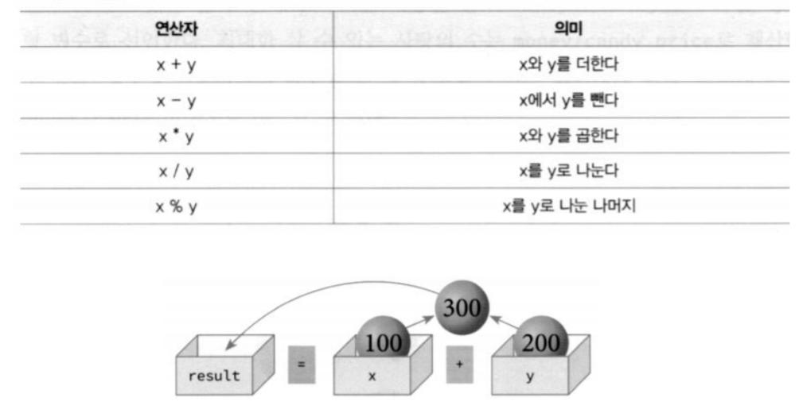

```c++
#include <iostream>
#include <string>
using namespace std;

int main(int argc, char const *argv[]) {
    int x = 100;
    int y = 200;

    int result = x + y;
    cout << "x + y : " << result << endl;
    cout << "x- y : " << x- y << endl;
    cout << "x / y : " << x /y << endl;
    cout << "x / y : " << x /(double)y << endl; // type cast
    cout << "x % 3 : " << x % 3 << endl;
    cout << 1/2 << endl; // 정수/정수 --> 정수(몫)
    cout << 1/2. << endl; // 정수/실수 --> 실수, 좀 더 범위가 넓은걸로 반환
    return 0;
}
```

+ 연산자
  + ++ :  현재 값에서 1증가
  + --  : 현재 값에서 1 감소

```c++
#include <iostream>
#include <string>
using namespace std;

int main(int argc, char const *argv[])
{
    int x = 100;
    x++; // x는 11
    cout << x << endl;

    x--;
    cout << x << endl;
    
    cout << ++x << endl;
    cout << x++ << endl;
    cout << x << endl;
    cout << --x << endl;
    cout << x-- << endl;
    return 0;
}
```

### 제어 구조와 배열

##### 제어 구조

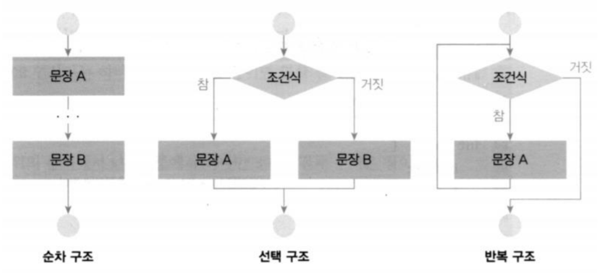

##### 관계 연산자

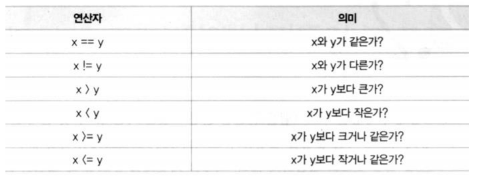

``` c++
#include <iostream>
using namespace std;

int main(int argc, char const *argv[]) {
    bool b;

    b = (1 == 2);

    cout<< std::boolalpha; // 부울린을 true, false로 출력, 모양새는 출력문이지만
                           // 출력문이 아닌 boolean을 설정하는 명령문이다.
                           // std:: 를 붙여줌으로써 출력문이 아니란것을 보여줌(관례)

    cout << b << endl;

    return 0;
}
```

```c++
#include <iostream>
using namespace std;

int main(int argc, char const *argv[]) {
    bool b;
    int x = 3;
    int y = 3;
    cout << std::boolalpha;

    b = (x == 3) && (y == 3);
    cout << b << endl;

    y = 2;
    b = (x == 3) || (y == 3);
    cout << b << endl;

    b = !(x == 3);
    cout << b << endl;
    
    return 0;
}
```

+ 논리 연산자

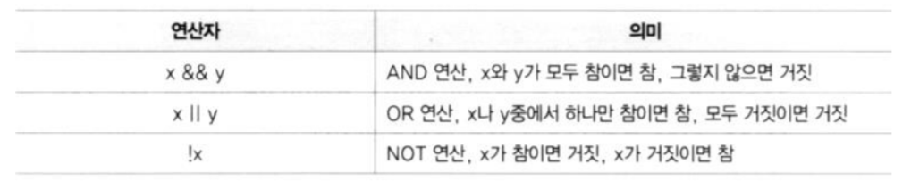

+ if ~ else 문

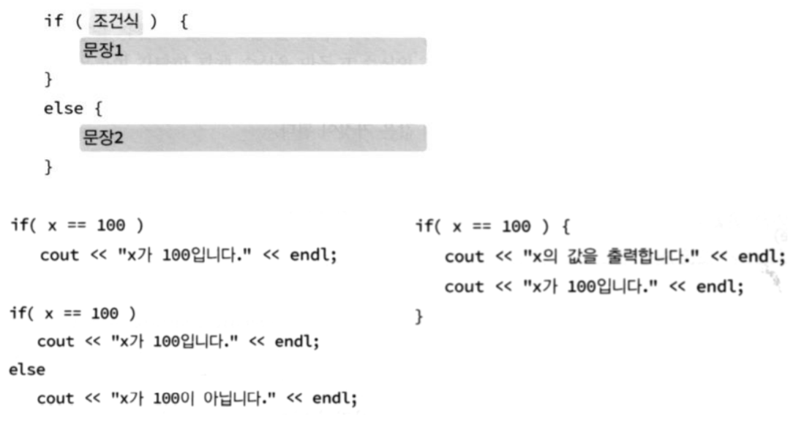

```c++
#include <iostream>
using namespace std;

int main(int argc, char const *argv[]) {
    int x = 100;

    if(x == 100){
        cout << "x가 100 입니다." << endl;
    }

    if(x == 100){
        cout << "x의 값을 출력합니다." << endl;
        cout << "x가 100입니다." << endl;
    }
    return 0;
}
```

``` c++
#include <iostream>
using namespace std;

int main(int argc, char const *argv[]) {
   int x, y;
   cout << "input x : ";
   cin >> x;

   cout << "input y : ";
   cin >> y;

   if(x>y){
       cout << "y more than x" << endl;
   } else{
       cout << "x more than y or same" << endl;
   }
   return 0;
}
```

##### 다중 if ~ else 문

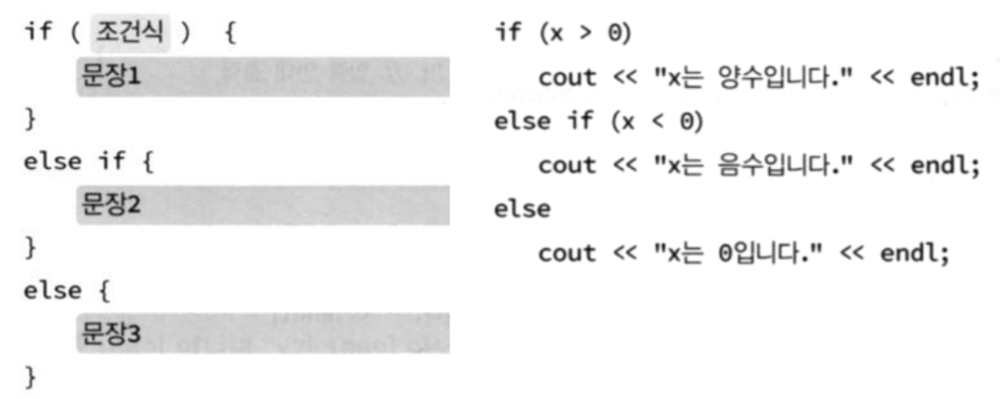

``` c++
#include <iostream>
using namespace std;

int main(int argc, char const *argv[]) {
   int x, y;

    cout << "x값을 입력하세요";
    cin >> x;

    cout << "y값을 입력하세요";
    cin >> y;

    if(x > y)
        cout << "x가 y보다 큽니다." << endl;
    else if (x < y)
        cout << "x가 y보다 작습니다." << endl;
    else
        cout << "x와 y가 같습니다." << endl;

   return 0;
}
```

##### switch 문

```c++
#include <iostream>
using namespace std;

int main(int argc, char const *argv[]) {
    int number;
    cout << "숫자를 입력하세요:";
    cin >> number;

    switch(number) {
        case 0:
            cout <<"zero\n";
            break;
        case 1:
            cout <<"one\n";
            break;
        case 2:
            cout <<"two\n";
            break;
        default:
            cout <<"many\n";
            break;
    }

   return 0;
}
```

- case문은 정수만 가능하다.

##### while 루프

- 조건이 참일 동안 반복

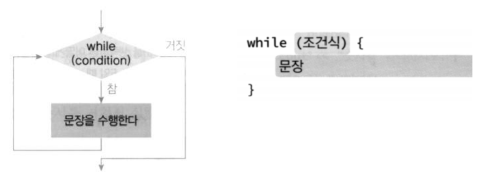

``` c++
#include <iostream>
using namespace std;

int main(int argc, char const *argv[]) {
   int n = 10;

   while(n>0){
       cout << n << " ";
       n--;
   }

   cout << "fire!" << endl;
   return 0;
}
```

``` c++
#include <iostream>
using namespace std;

int main(int argc, char const *argv[]) {
   	int n;
    int i = 1;

    cout << "input dan: ";
    cin >> n;
	// 구구단 출력
    while( i<=9 ) {
        cout << n << " * " << i
        << " = " << n*i << endl;
        i++;
    }
   return 0;
}
```

##### do while 루프

- 조건이 참일 동안 반복

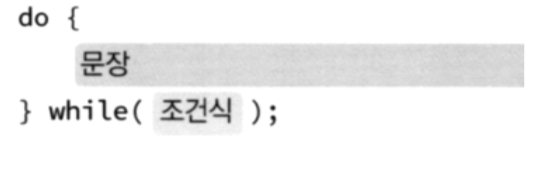

```c++
#include <iostream>
using namespace std;

int main(int argc, char const *argv[]) {
   string str;

   do{
       cout<< "input string: ";
       getline(cin, str); // 공백이 있는 라인인 경우도 나옴
    //    cin >> str; // 공백이 있는 라인이면 공백을 기준으로 쪼갬
       cout << "input for user: " << str << endl;
   }while(str != "exit");
   return 0;
}
```

##### for 루프

- 조건이 참일 동안 반복

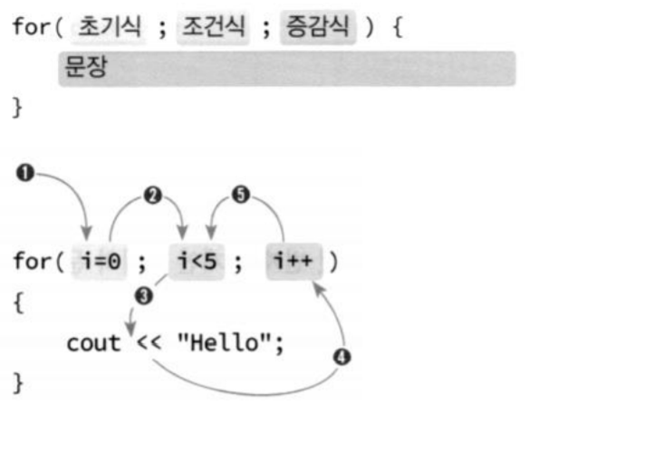

```c++
#include <iostream>
using namespace std;

int main(int argc, char const *argv[]) {
   int sum = 0;
   for(int i=0; i<=10; i++){
       sum += i;
   }

   cout << "1 to 10 sum = " << sum << endl;
   return 0;
}
```

### 배열

##### 배열

- 같은 종류의 데이터들이 순차적으로 메모리에 저장되는 자료 구조
- 각각의 데이터들은 인덱스를 사용하여 독립적으로 접근
- 대용량의 데이터를 동일한 이름으로 쉽게 저장하고 처리 가능

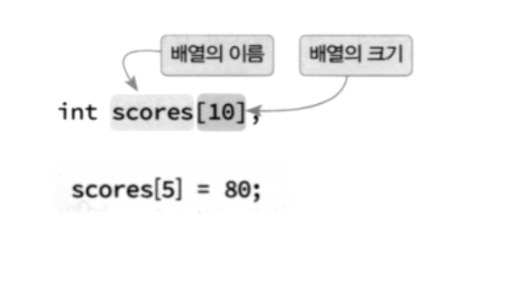

- 파이썬의 list와 배열의 차이

  - 파이썬은 어떤종류든 다 들어갈 수 있지만, 배열은 같은종류의 데이터들이 들어가야 함

  - 파이썬과 다르게 배열은 크기를 할당 해야 함, 크기가 고정돼있음

``` c++
#include <iostream>
using namespace std;

int main(int argc, char const *argv[]) {
    const int STUDENTS = 10;
    int scores[STUDENTS];
    int sum = 0;
    int i, average;

    for(i=0; i<STUDENTS; i++) {
        cout << "input student score: ";
        cin >> scores[i];
    }

    for(i=0; i<STUDENTS; i++) {
        sum += scores[i];
    }

    average = sum / STUDENTS;
    cout << "score average = " << average << endl;
    return 0;
}
```

##### 배열의 초기화

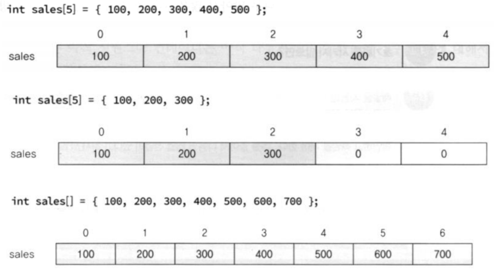

- 배열의 초기화는 되게 중요하다 왜냐하면 동적이아니고 정적이기 때문이다.

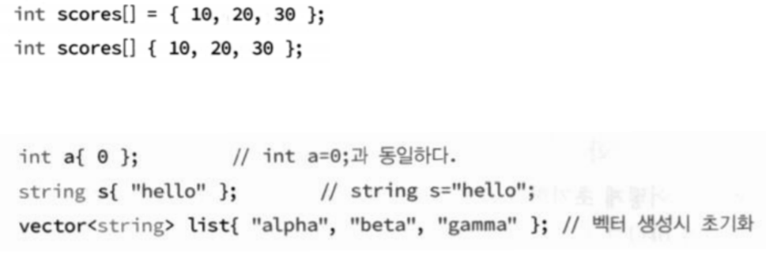

```c++
#include <iostream>
using namespace std;

int main(int argc, char const *argv[]) {
   const int STUDENTS = 5;

    int scores[STUDENTS] = {
    100, 200, 300, 400, 500 // 엘레먼트 개수가 많은 경우는 syntax error
    };

    int sum = 0;
    int i, average;

    for(i=0; i<STUDENTS; i++) {
        sum += scores[i];
    }
    
    average = sum / STUDENTS;
    cout << "성적 평균= " << average << endl;

   return 0;
}
```

##### 범위 기반 for 문

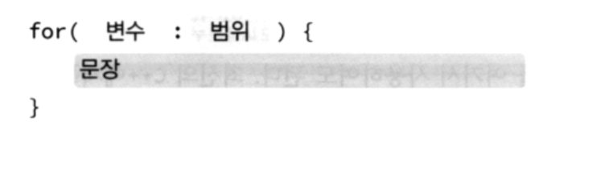

``` c++
#include <iostream>
using namespace std;

int main(int argc, char const *argv[]) {
   int list[] = {1,2,3,4,5,6,7,8,9,10};
   int sum = 0;
   for(int i : list){ // 범위 기반 for 문
       sum += i;
   }

   cout << sum << endl << endl ;

   for(int& i : list){ // & 참조변수
       cout << i << " ";
   }

   cout << endl;
   for(auto& i : list){ // 이런 경우에 auto를 많이 사용한다.
       cout << i << " ";
   }
   return 0;
}
```

##### c++ 변수의 종류

일반변수, 참조변수, 포인터 변수 존재

일반 변수 - 저장공간이 할당된다

참조변수 - 저장공간이 따로 할당되지 않고 참조한다

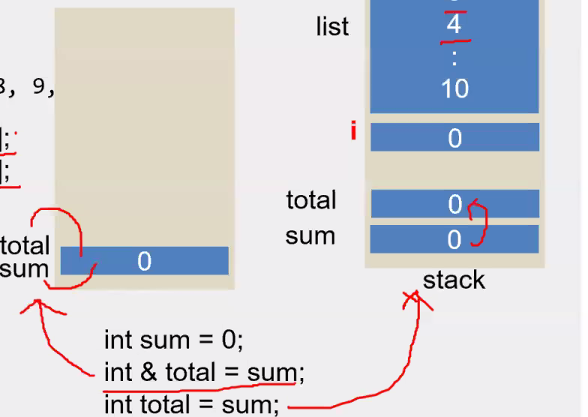

int & total = sum; 이라고 하면 sum에 할당된 공간을  total이라는 참조변수가 참조를 받고있음

int total = sum; 이라고 하면 total이라는 일반변수가 공간을 할당한 후 sum의 할당된 값을 복사함