## 2020.09.07 TIL

### 다차원 배열

##### 2차원 배열

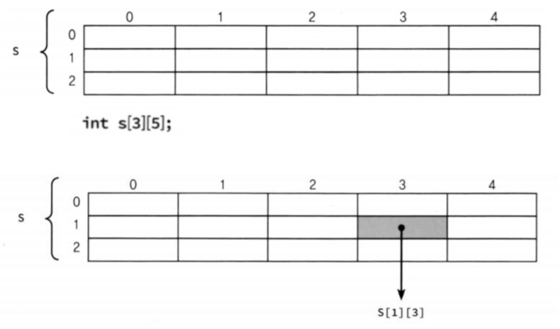

##### 다차원 배열의 초기화

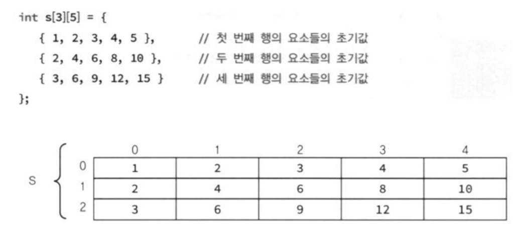

``` c++
#include <iostream>
using namespace std;
#define WIDTH 9
#define HEIGHT 3

int main(int argc, char const *argv[]) {
   int table [HEIGHT][WIDTH];
   int r, c;

    for(r=0; r<HEIGHT; r++){
        for(c = 0; c < WIDTH; c++){
            table[r][c] = (r+1)*(c+1);
        }
    }

    for(r = 0; r < HEIGHT; r++){
        for(c = 0;c < WIDTH; c++){
            cout << table[r][c] << ", ";
        }
        cout << endl;
    }

   return 0;
}
```

##### 배열의 크기 계산 방법

``` c++
int list[] = {1, 2, 3, 4, 5, 6, 7, 8, 9, 10};
int list2[10];

int length = sizeof(list) / sizeof(int); // 40 / 4 => 10
```

##### 배열의 복사

```c++
#include <iostream>
using namespace std;

int main(int argc, char const *argv[]) {
    int list[] = {1, 2, 3, 4, 5, 6, 7, 8, 9, 10};
    int list2[10];
    
    // list2 = list <- 문법에러 

    int length = sizeof(list) / sizeof(int); // 40 / 4 => 10

    for(auto i : list2){ // 복사 전 list2 출력
        cout << i << " ";
    }

    for(int i = 0; i < length; i++){ // 값 복사
        list2[i] = list[i];
    }

    for(auto i : list2){ // 복사 후 list2 출력
        cout << i << " ";
    }
    cout << endl;

    return 0;
}
```

### 함수와 문자열

##### 함수의 구조

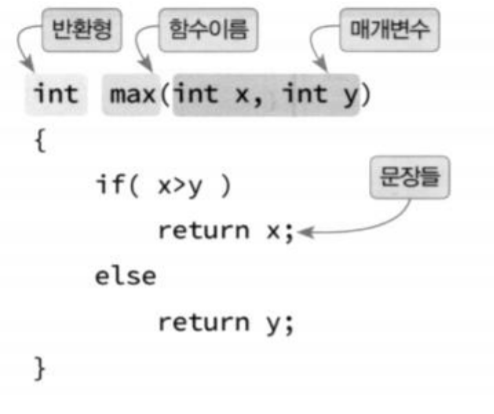

- 반환값 default = int

##### 함수의 호출

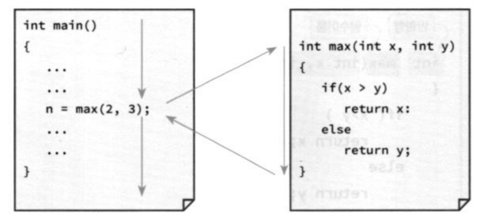

``` c++
#include <iostream>
using namespace std;

int max(int x, int y){
    if(x > y){
        return x;
    }
    else{
        return y;
    }
}

int main(int argc, char const *argv[]) {
    int n;
    n = max(2,3);
    cout << "result : " << n << endl;
    return 0;
}
```

##### 함수 원형

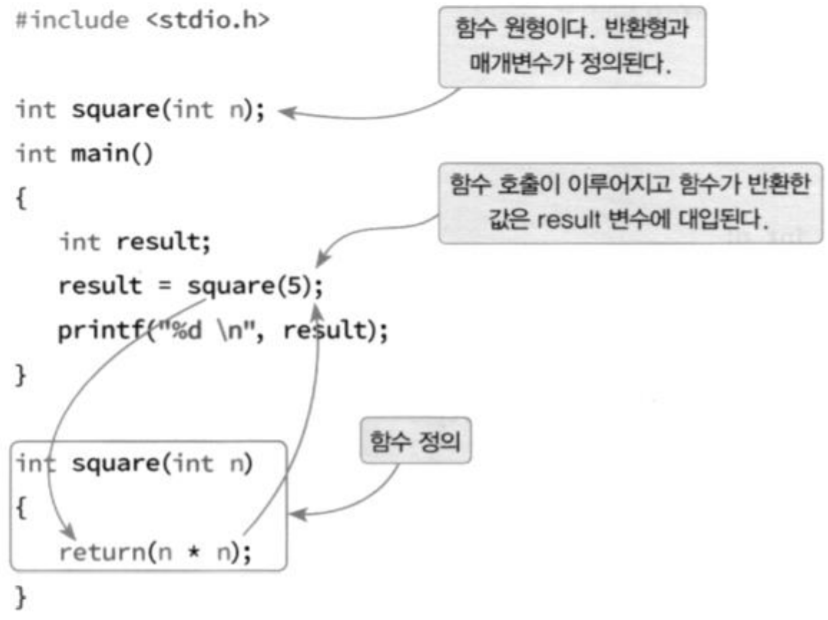

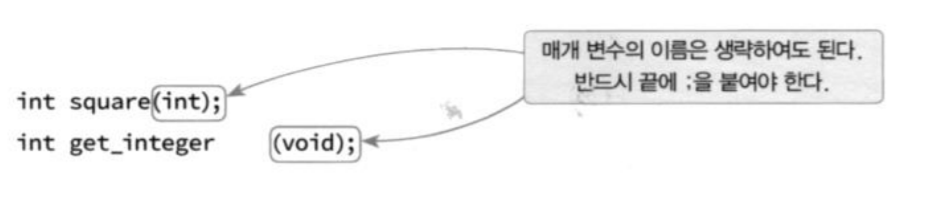

##### 함수인자 전달 방법

- call by value

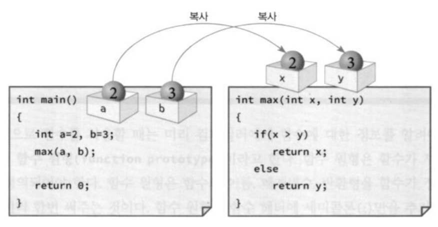

- call by reference

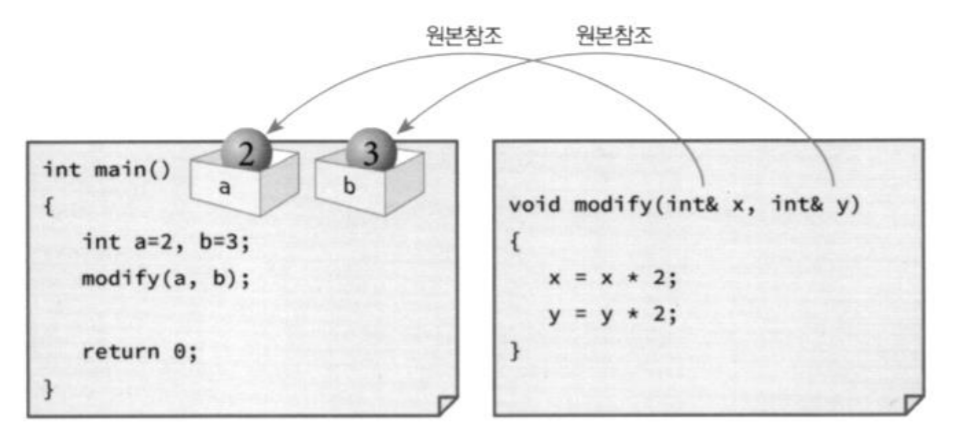

##### 참조 변수

- 기존 변수에 새로운 이름을 추가하는 것

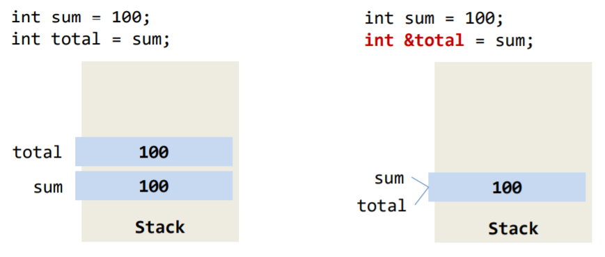

- call by reference example

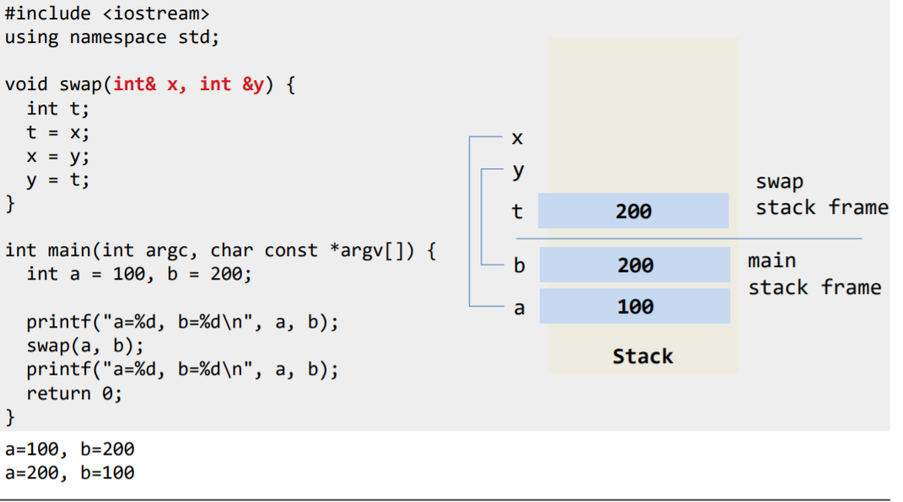

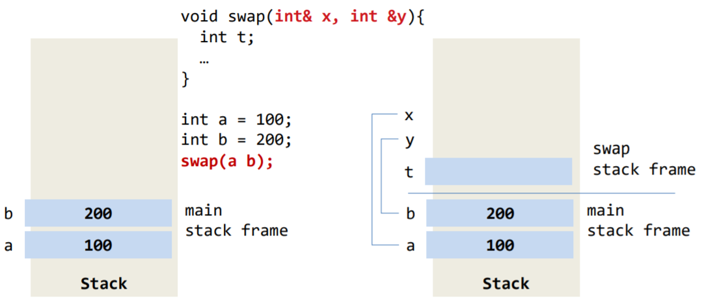

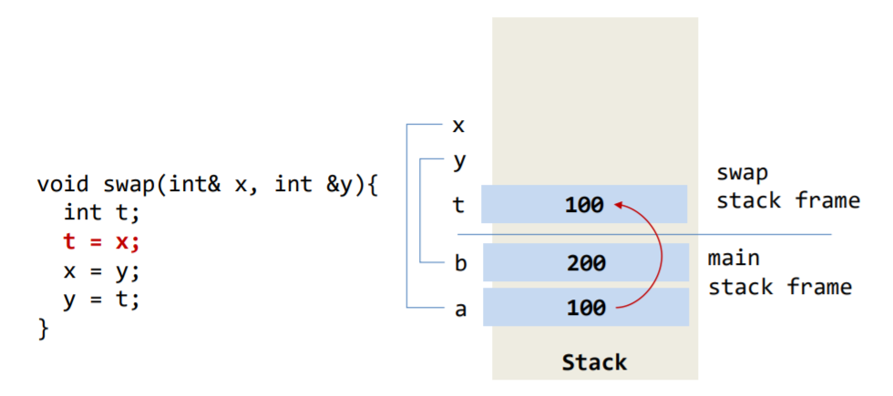

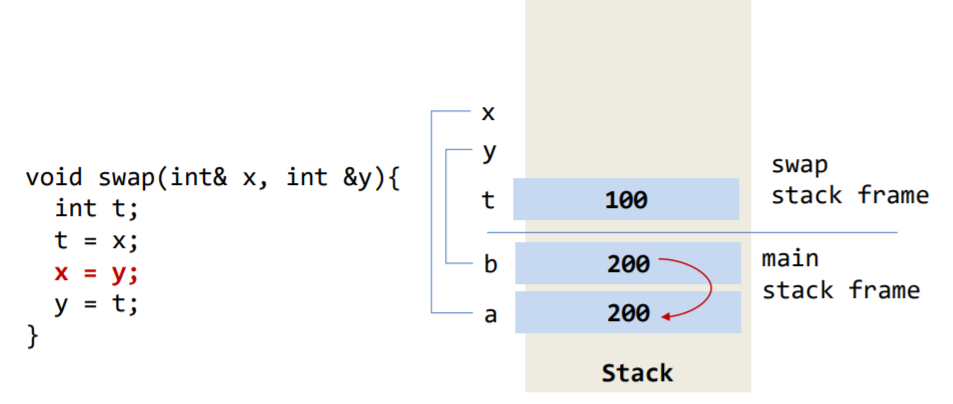

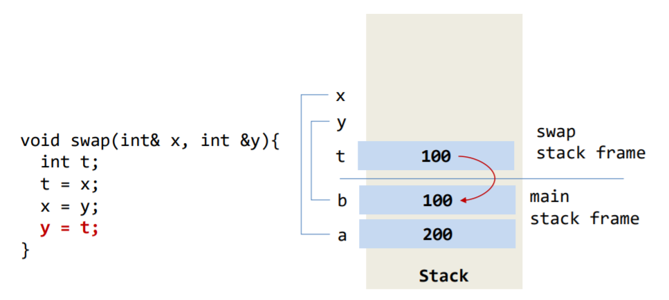

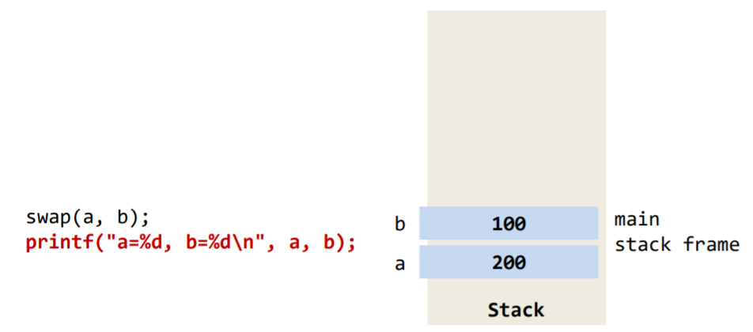

##### 중복함수 (overload)

- 함수의 이름은 동일하지만 함수의 인자가 다르면 다른 함수로 인식
- 리턴 타입은 상관 없음

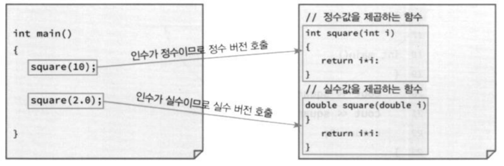

- c++, java에서 지원하는 기능, 만약 파이썬이라면 기존 같은이름 함수는 사라지고 마지막 함수만 남지만, c++에서는 overload 기능을 제공하고 있어 각각 다른 함수로 인식하여 사라지지 않음

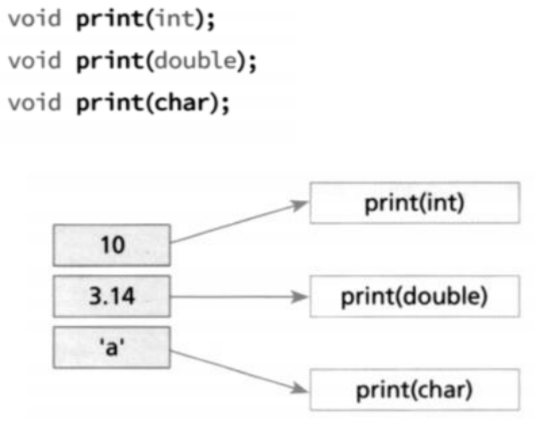

``` c++
#include <iostream>
using namespace std;

int square(int i){
    cout << "square(int) call" << endl;
    return i*i;
}

double square(double i){
    cout << "square(double) call" << endl;
    return i*i;
}

int main(int argc, char const *argv[]) {
    cout << square(10) << endl;
    cout << square(2.0) << endl;

   return 0;
}
```

##### 인수의 디폴트 값

- 함수 호출 시 인수 값을 지정하지 않았을 때 가지는 값

``` c++
#include <iostream>
using namespace std;

void display(char c = '*', int n = 10){
    for(int i=0; i<n; i++){
        cout << c;
    }
    cout << endl;
}

int main(int argc, char const *argv[]) {
   display(); // **********
   display('#'); // ##########
   display('#',5); // #####
   return 0;
}
```

##### 배열을 인수로 호출하는 함수

```c++
#include <iostream>
using namespace std;

void initArray(int array[], int size, int value=0){
    for(int i=0; i<size; i++){
        array[i] = value;
    }
}

void printArray(int array[], int size){
    for(int i=0; i<size; i++){
        cout << array[i] << ", ";
    }
    cout << endl;
}

int main(int argc, char const *argv[]) {
   int intList[10];

   initArray(intList, 10, 100);
   printArray(intList, 10);

   initArray(intList, 10);
   printArray(intList, 10);
   return 0;
}
```

- 배열은 대입연산자를 통하여 값을 복사할 수 없다, 즉 call by value가 불가능하다

##### 인수의 디폴트 값 지정 시 주의 사항

- 뒤에서 부터 배정
- 앞에서 부터 배정하는 경우 오류

```c++
int print( double dvalue = 0.0, int prec); // 오류
```

##### string 클래스

- 문자열 데이터 저장 및 문자열  처리 함수(메소드) 제공
- #include <string>을 먼저 지정 후 사용

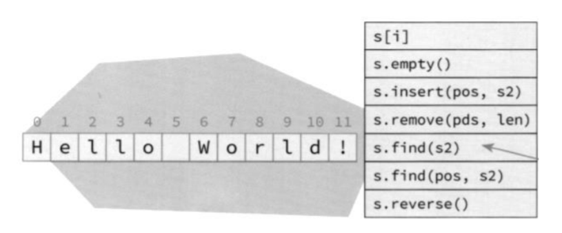

- python의 string은 불변객체 , 조작이 불가능
- c++은 불변객체가 아니다, 조작이 가능

``` c++
#include <iostream>
#include <string>
using namespace std;

int main(int argc, char const *argv[]) {
   string s1 = "Slow", s2 = "steady";
   string s3 = "the race.";
   string s4;

   s4 = s1 + " and " + s2 + " wins " + s3;
   cout << s4 << endl;
   
   return 0;
}
```

- *String은 변수타입이 아니고 객체이다!!

```c++
#include <iostream>
#include <string>
using namespace std;

int main(int argc, char const *argv[]) {
   string s1, addr;

   cout << "input name : ";
   cin >> s1;
   cin.ignore(); // 엔터키 제거

   cout << "input address : ";
   getline(cin, addr); // enter칠 때까지 입력을 받아달라
   
   cout << addr << " to " << s1 << " hello ? " << endl;
   return 0;
}
```

##### string 클래스

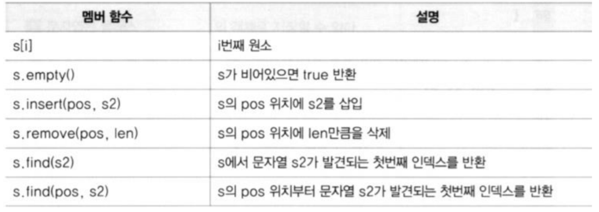

```c++
#include <iostream>
#include <string>
using namespace std;

int main(int argc, char const *argv[]) {
   string s = "When in Rome, do as the Romans"; // String 객체는 데이터를 수정할 수 있음

   int size = s.size();
   int index = s.find("Rome");

   cout << size << endl;
   cout << index << endl;

   s.insert(0, "Hello !! "); // 맨 앞에 문자열 추가
   cout << s << endl;

   s += " End of World"; // 맨 뒤에 문자열 추가
   cout << s << endl;

   s.append("\n---------\n"); // 맨 뒤에 문자열 추가
   cout << s;

   return 0;
}
```

```c++
#include <iostream>
using namespace std;

int main(int argc, char const *argv[]) {
   string s = "When in Rome, do as the Romans";
	// W h e n   i n   R o m e ,   d o   a s   t h e   R o m a n s 
   for(auto ch : s){
       cout << ch << ' ';
   }
   return 0;
}
```

```c++
#include <iostream>
using namespace std;

int main(int argc, char const *argv[]) {
   string list[] = {"홍길동", "고길동", "둘리"};

   for(auto& name: list){
       cout << name << endl;
   }
   return 0;
}
```

### 클래스와 객체

##### 객체의 구성요소

- 멤버 변수
  - 객체의 상태를 저장하는 변수
- 멤버 함수(메서드)
  - 객체 안에 정의된 함수
  - 멤버 변수 접근에 자유로움

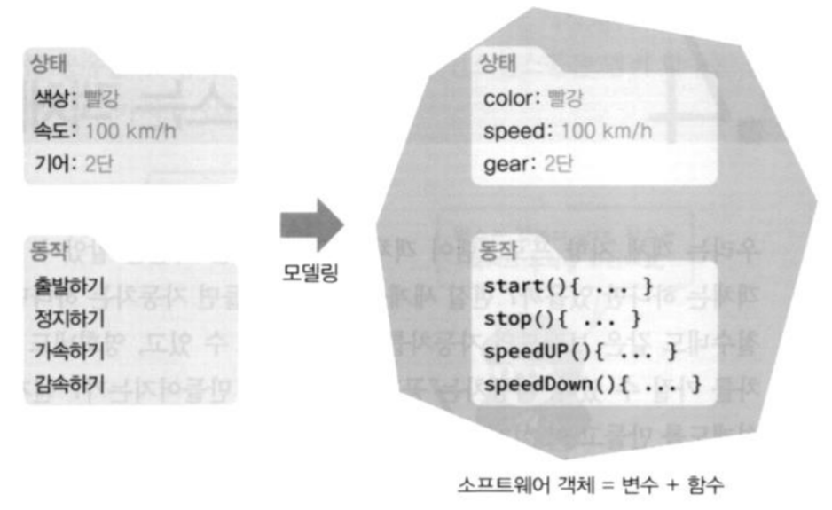

##### 클래스와 객체(인스턴스)

- 클래스
  - 객체의 형태를 정의하는 설계도
- 객체(인스턴스)
  - 클래스의 형태를 취하는 실체

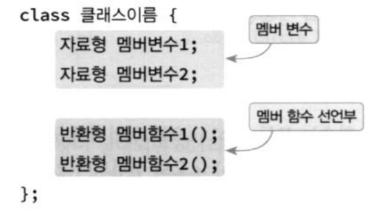

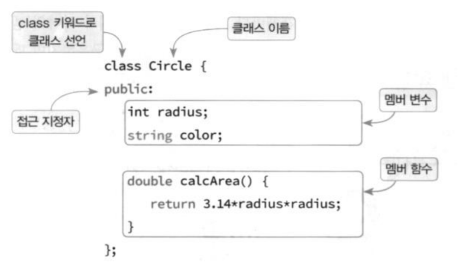

##### 접근 지정자

- private
  - 클래스 안에서만 접근(사용)할 수 있음
- protected
  - 클래스 안과 상속된 클래스에서 접근 가능
- public
  - 어디서나 접근이 가능

##### 객체 생성

- 클래스 타입으로 변수를 선언하면 해당 객체(인스턴스)가 생성됨

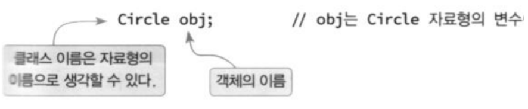

- C++ 객체는 stack에 저장된다, Python의 객체는 Heap에 저장된다 
- Python에서 숫자나 boolean을 제외하고 모두 Heap에 저장된다

- 정적할당의 특징 - 선언과 동시에 메모리가잡히고 메모리는 지역이나 스택에 할당된다
- 동적할당은 힙에 메모리가 할당된다
- int a, Circle obj 같은 형식은 stack에 저장된다
- 클래스 하나 당 파일을 따로 운영

##### 객체 멤버 접근

- .연산자로 접근

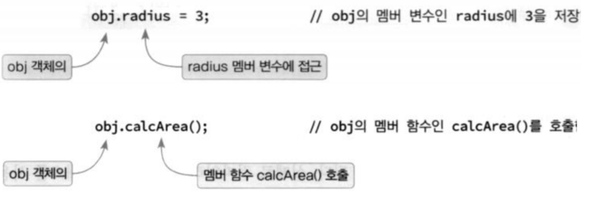

``` c++
#include <iostream>
using namespace std;

class Circle{
public:
    int radius; // 반지름
    string color; // 색상

    double calcArea(){ // python과 달리 self 매개 변수 없음
        return 3.14 * radius * radius; // 멤버 변수 접근 시 바로 사용
    }
};

int main(int argc, char const *argv[]) {
   Circle obj;
   obj.radius = 100;
   obj.color = "blue";
   // obj.area = 40; // 에러 -- 동적으로 멤버 추가 불가

   cout << "circle's radius " << obj.calcArea() << endl;
   return 0;
}
```

``` c++
int main(int argc, char const *argv[]) {
   Circle pizza1, pizza2; // 객체 생성, 정적할당(stack에 저장)

   pizza1.radius = 100;
   pizza1.color = "yellow";
   cout << "pizza's radius " << pizza1.calcArea() << endl;

   pizza2.radius = 200;
   pizza2.color = "white";
   cout << "pizza's radius " << pizza2.calcArea() << endl;  
   return 0;
}
```

##### 멤버함수 오버로드

```c++
#include <iostream>
using namespace std;

class PrintData{
public:
    void print(int i){ cout << i << endl; }
    void print(double f) { cout << f << endl; }
    void print(string s = "No Data!") { cout << s << endl;} 
};

int main(int argc, char const *argv[]) {
   
    PrintData prn;

    prn.print(1);
    prn.print(3.14);
    prn.print("C++ is cool.");
    prn.print();
    
    return 0;
}
```

##### 객체지향 특징

- 캡슐화
- 정보 은닉
- 상속과 다형성 <-- 이 기능을 얼마나 잘 짜는냐가 중요함

##### 상속

```c++
class 자식 클래스명: public 부모 클래스명 {
// 자식 클래스 멤버 정의
}
```

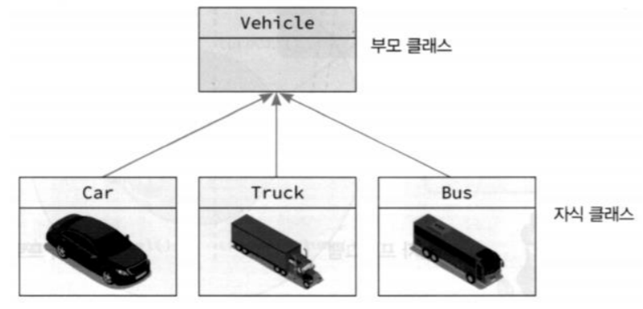

##### 상속

```c++
class Shape {
protected:
    int x, y;
public:
    void draw() {}
    void move() {}
};

class Reactangle: public Shape
{
protected:
    int width;
    int height;
public:
    int calcArea() {
    return width*height;
	}
};
```

##### 클래스 원형과 구현 정의 분리

- 헤더 파일에 클래스 원형
  - 멤버 변수 정의
  - 멤버 함수의 원형 정의
- cpp파일에 멤버 함수 정의
  - 헤더 파일을 먼저 include
  - 멤버 함수 구현

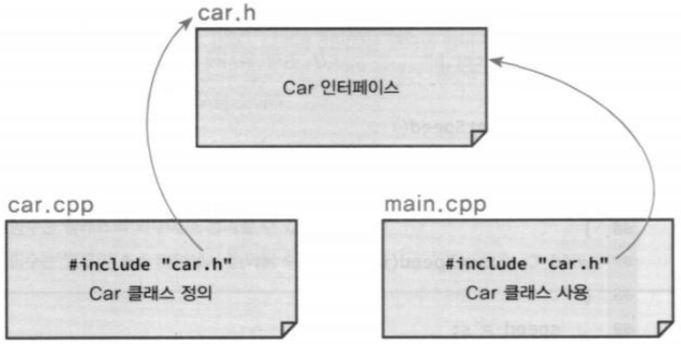

##### 다중 파일을 위한 프로젝트 관리

- Easy C++ projects 확장 팩 설치

- F1 -> create new c++ project
- 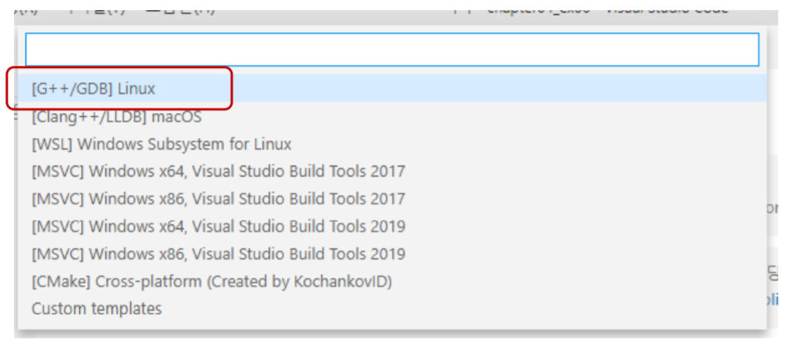
- 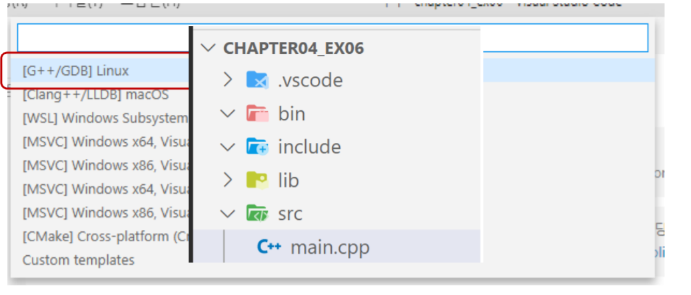
- 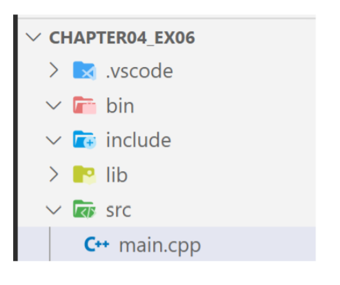
- F1 -> create new class
- 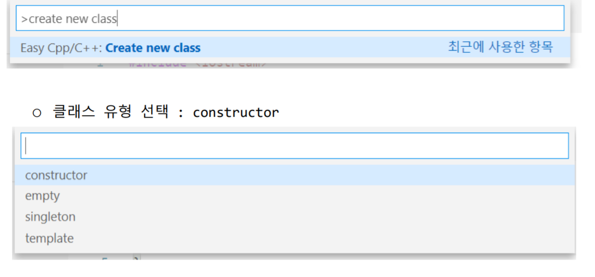

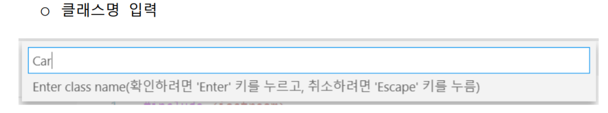

##### Car 클래스 헤더 파일 / Car.hpp

``` c++
#pragma once

#include <string>
using namespace std;

// 클래스 원형
class Car { 
// 디폴트 접근 제한자 : private
    int speed;
    int gear;
    string color;

public:
    int getSpeed(); // 함수 원형
    void setSpeed();
};
```

##### Car 클래스 정의 파일 / Car.cpp

```c++
#include "Car.hpp"
// 검색 순서 : cwd(working directory)(& include 검색) -> 사용자 lib -> 컴파일러 lib
#include<iostream> // 검색 순서 : 사용자 lib -> 컴파일러 lib

// 클래스 정의 파일
void Car::setSpeed(int s){ // :: scope 연산자
    speed = s;
}

int Car::getSpeed(){
    return speed;
}
```

##### main.cpp

```c++
#include<iostream>
#include<string>

#include "Car.hpp"
using namespace std;

int main(int argc, char const *argv[])
{
    Car myCar;
    myCar.setSpeed(100);
    cout << "speed : " << myCar.getSpeed() << endl;
    return 0;
}
```

- 컴파일 할 땐 터미널 창에서 make 한 후 bin/main.exe 파일이 생성됐는지 확인
- 생성이 됐다면 bin\main.exe 실행

##### *C++* 에서는 garbage collector가 존재하지 않는다, 즉 heap에 대한 메모리관리가 개발자 책임이기 때문에 신경을 더 써야 한다.