## 2020.09.10 TIL

### 아두이노

##### 아두이노?

- 2005년 이탈리아 이브레아에서 예술가와 디자이너를 위한 마이크로컨트롤러 프로젝트로 시작
- 아두이노
  - 하드웨어(아트멜의 AVR 시리즈 마이크로컨트롤러)와
  - 소프트웨어(프로그램 개발을 위한 전용 라이브러리를 포함하는 개발 환경)를 함께 지칭
- 아두이노 하드웨어는 마이크로컨트롤러 보드의 일종임
  - 아두이노 보드라고도 함
  - 마이크로컨트롤러 + 커넥터 + 알파
- 아두이노의 하드웨어와 소프트웨어는 모두 오픈 소스 정책에 따라 공개되어 있음

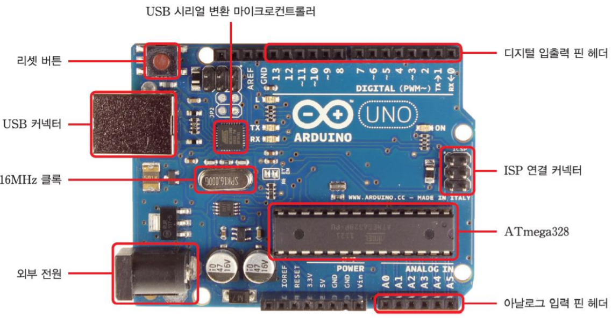

##### 특수목적용 아두이노

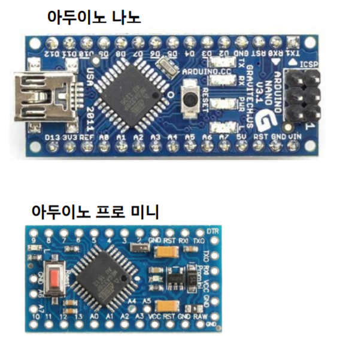

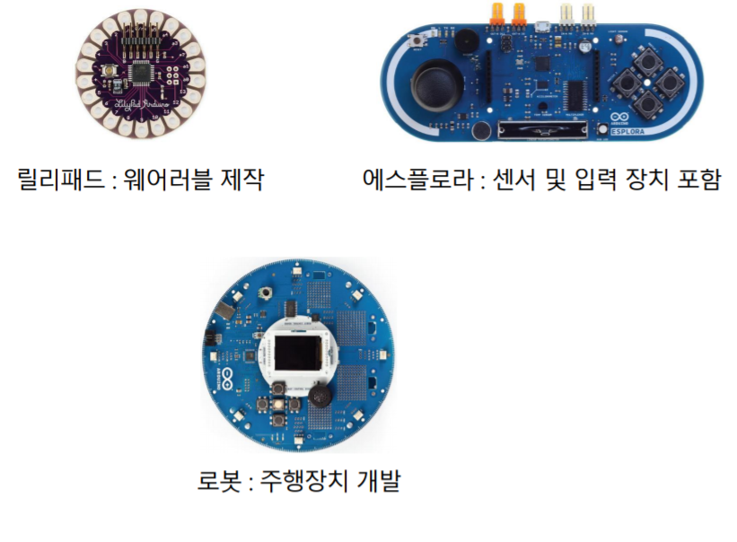

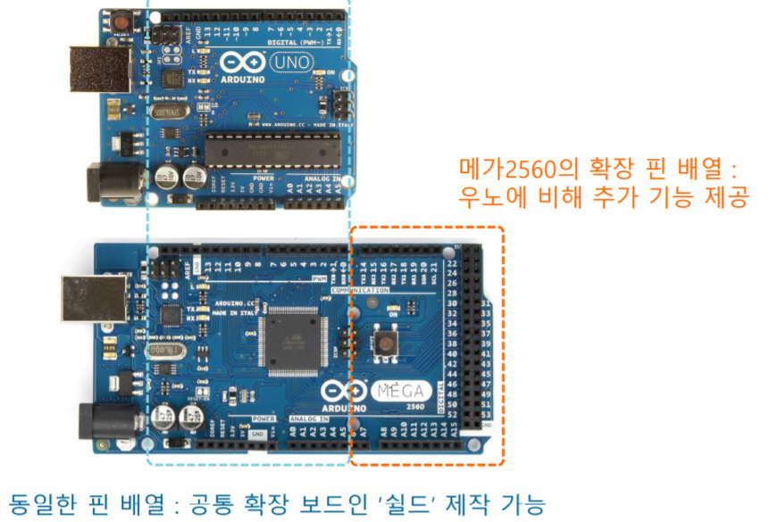

##### 쉴드

- 아두이노 보드의 기능 확장을 위한 하드웨어
- 다양한 아두이노의 공식 쉴드 및 써드 파티 업체의 호환 쉴드 존재
  - 호환 쉴드는 아두이노의 오픈 하드웨어 정책에 따라 가능

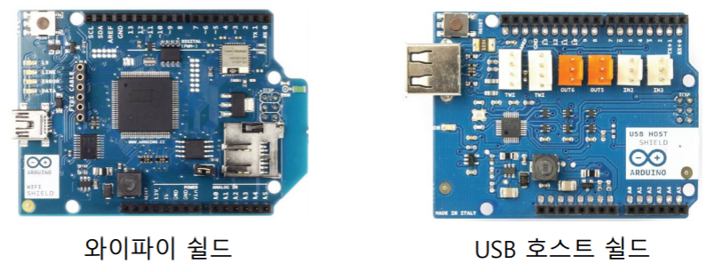

##### 아두이노 우노

- 아두이노 보드 중 가장 기본이 되는 보드
- 8비트 CPU 포함
- 20개의 디지털 입출력 핀 사용 가능
  - 0번에서 19번까지 핀 단위의 번호 지정
  - 6개의 핀으로 PWM 신호 출력 가능
    - 3, 5, 6, 9, 10, 11번 핀
- 6개의 아날로그 입력 핀 사용 가능
  - 14번에서 19번까지의 디지털 입력 핀과 동일
  - 10비트 ADC 사용 (0~1023의 양자화된 값)
    - DAC는 포함되어 있지 않으므로 아날로그 값 출력은 불가능
- 아두이노 메가 2560은 디지털/아날로그 핀의 수만 다르고 기본적인 기능은 아두이노 우노와 동일

##### 아두이노 우노 사양

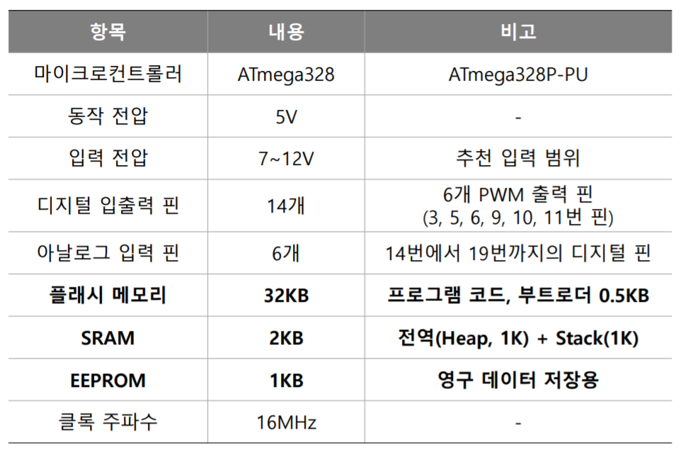

##### 스케치 프로그램 구조

- 스케치는 C/C++을 기반으로 함
- main 함수는 존재하지 않음
  - main 함수는 숨겨져 있으므로 신경 쓰지 않아도 됨
- 2개의 기본 함수로 구성
  - setup() 함수
    - 초기화 함수
    - 스케치 실행이 시작될 때 한 번만 수행
  - loop() 함수
    - 반복 실행 함수
    - 프로그램에서 메인/이벤트 루프에 해당

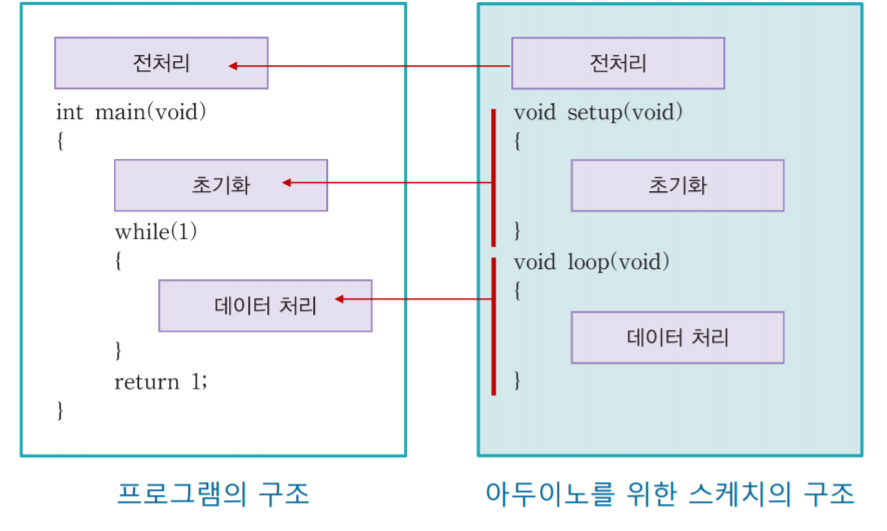

```java
void setup() {
  // put your setup code here, to run once:
  Serial.begin(9600); // 시리얼통신 시작(속도:9600) -> 1초에 9600bit를 보내겠다
  Serial.println("hello, Arduino"); // 시리얼 모니터에 "hello, Arduino"를 출력
}

void loop() { // 무한루프
  Serial.println("hello, Arduino");
  delay(500); // 500ms 동안 대기
}
```

### LED

##### Bread board

- 납땜이 필요없는 프로토타입용 보드

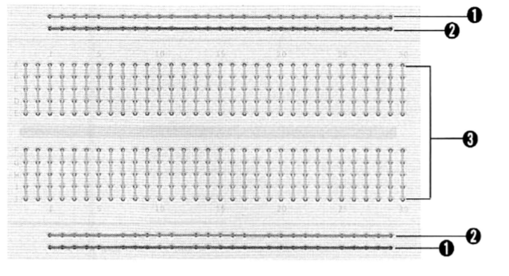


##### 점퍼 선

- 브레드 보드에 부품들을 서로 연결할 때 이용

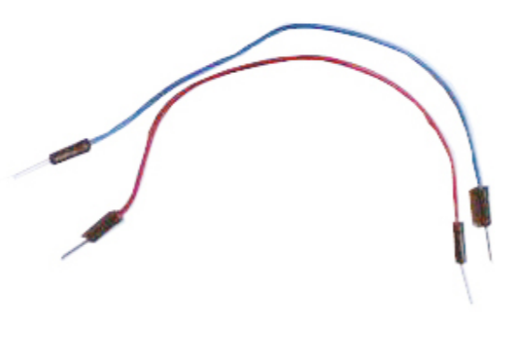

- +극 연결할 땐 빨간색 사용
- -극 연결할 땐 검정색 사용

##### LED 발광 다이오드

- 전류가 흐르면서 빛을 발하는 반도체
- 다이오드 : 전류가 한쪽 방향으로만 흐르게 함
- 과다 전류가 흐를 경우 파손
  - LED에 저항을 배치

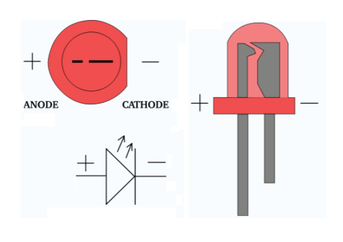

##### 저항

- 전기의 흐름을 제한

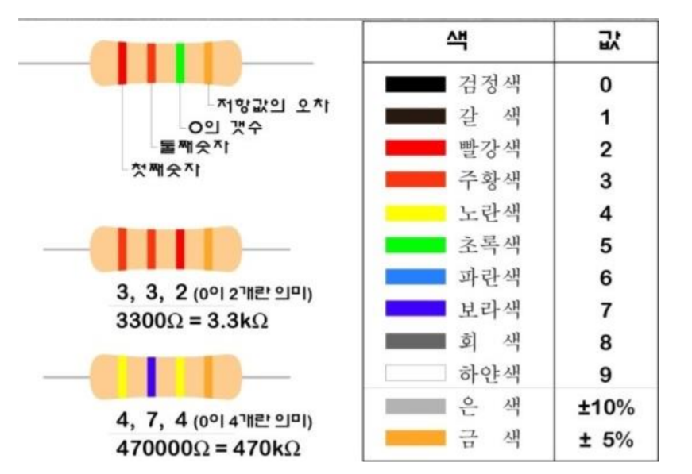

##### led제어하기

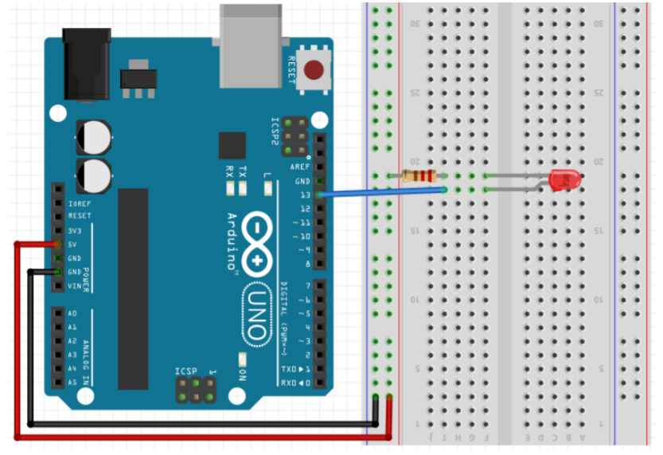

##### pinMode()

- 디지털 핀의 모드를 출력 또는 입력으로 설정하는 함수
- pinMode(핀 모드, 모드)
  - 매개변수
    - 핀 번호: 모드를 설정하고자 하는 핀 번호
    - 모드 : 출력인 경우 OUTPUT, 입력인 경우 INPUT
    - 반환값 : 없음
  - 사용 예
    - pinMode(13, OUTPUT); //13번 핀을 출력 모드로 설정
    - pinMode(13, INPUT) // 13번 핀을 입력 모드로 설정


##### digitalWrite()

- 디지털 핀의 전압을 HIGH 또는 LOW로 설정하는 함수
  - digitalwrite() 사용하려는 핀은 꼭 pinMode()로 출력 모드 설정
- digitalWrite(핀번호, 전압)
  - 매개변수
    - 핀 번호: 전압을 설정하고자 하는 핀 번호
    - 전압 : HIGH인 경우 HIGH, LOW인 경우 LOW를 입력
  - 반환값 : 없음
- 사용 예
  - digitalWrite(13, HIGH); //13번 핀의 전압을 HIGH로 설정
  - digitalWrite(13, LOW) // 13번 핀의 전압을 LOW로 설정

##### 상태 변수로 LED 점등하기

``` JAVA
void setup() {
  pinMode(13, OUTPUT); // 13번 핀을 출력모드로
  digitalWrite(13, false); // 13번 핀의 전압을 LOW로 설정

}

void loop() {
  digitalWrite(13, HIGH);
  delay(300);
  digitalWrite(13, LOW);
  delay(600);
}
```

```java
int pin_LED = 7;
boolean LED_state = false;

void setup() {
  pinMode(pin_LED, OUTPUT);
  digitalWrite(pin_LED, LED_state);
}

void loop() {
 LED_state = !LED_state; // T->F, F->T
 digitalWrite(pin_LED, LED_state);
 delay(1000);
}
```

```java
int pin_LED = 7;

void setup() {
  pinMode(pin_LED, OUTPUT);
}

void loop() {
  digitalWrite(pin_LED, HIGH);
  delay(500);
  digitalWrite(pin_LED, LOW);
  delay(500);

  digitalWrite(pin_LED, HIGH);
  delay(1000);
  digitalWrite(pin_LED, LOW);
  delay(1000);

  digitalWrite(pin_LED, HIGH);
  delay(2000);
  digitalWrite(pin_LED, LOW);
  delay(2000);

}
```

##### 2개 LED 점멸

```java
const int pin_LED1 = 13;
const int pin_LED2 = 7;
void setup() {
  pinMode(pin_LED1, OUTPUT);
  pinMode(pin_LED2, OUTPUT);
}
void loop() {
  digitalWrite(pin_LED1, HIGH);
  digitalWrite(pin_LED2, LOW);
  delay(100);
  
  digitalWrite(pin_LED1, LOW);
  digitalWrite(pin_LED2, HIGH);
  delay(100);
}
```

##### 서로 다른 점멸 간격을 가지는 2개 LED 제어

```java
int pin_LED1 = 13;
int pin_LED2 = 7;

void setup() {
  pinMode(pin_LED1, OUTPUT);
  pinMode(pin_LED2, OUTPUT);
  
  digitalWrite(pin_LED1, LOW);
  digitalWrite(pin_LED2, LOW);
}

void loop() {
  digitalWrite(pin_LED1, HIGH);
  delay(500);
  
  digitalWrite(pin_LED1, LOW);
  digitalWrite(pin_LED2, HIGH);
  delay(500);
  
  digitalWrite(pin_LED1, HIGH);
  delay(500);
  
  digitalWrite(pin_LED1, LOW);
  digitalWrite(pin_LED2, LOW);
  delay(500);
}
```

##### 여러개 LED 점등시키기

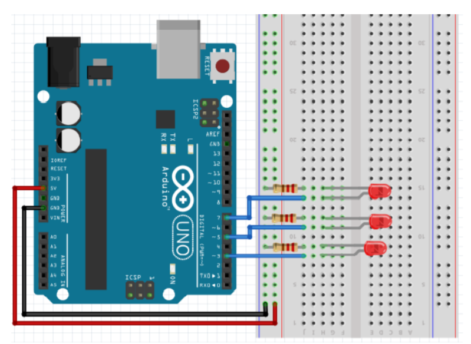

```java
int pin_LED1 = 13;
int pin_LED2 = 7;
int pin_LED3 = 12;

void setup()
{
	pinMode(pin_LED1, OUTPUT);
    pinMode(pin_LED2, OUTPUT);
    pinMode(pin_LED3, OUTPUT);
}

void loop()
{
	digitalWrite(pin_LED1, HIGH);
    delay(1000);

    digitalWrite(pin_LED1, LOW);
    digitalWrite(pin_LED2, HIGH);
    delay(500);

    digitalWrite(pin_LED2, LOW);
    digitalWrite(pin_LED3, HIGH);
    delay(1000);

    digitalWrite(pin_LED3, LOW);
}
```

##### 신호등 만들기

```java
int redLed = 7;
int greenLed = 12;
int yellowLed = 13;


void setup()
{
	pinMode(redLed, OUTPUT);
    pinMode(greenLed, OUTPUT);
    pinMode(yellowLed, OUTPUT);
}

void go(int duration=0){
    digitalWrite(redLed, LOW);
    digitalWrite(yellowLed, LOW);
    digitalWrite(greenLed, HIGH);

    if(duration!=0){
        delay(duration);
    }
}

void stop(int duration=0){
    digitalWrite(redLed, HIGH);
    digitalWrite(yellowLed, LOW);
    digitalWrite(greenLed, LOW);

    if(duration!=0){
        delay(duration);
    }
}

void leftTurn(int duration=0){
    digitalWrite(redLed, LOW);
    digitalWrite(yellowLed, HIGH);
    digitalWrite(greenLed, HIGH);

    if(duration!=0){
        delay(duration);
    }
}

// 2초간 직진 신호
// 1초간 직진, 좌회전 동시 신호
// 2초간 정지 신호
void loop()
{
    go(2000);
    leftTurn(1000);
    stop(2000);
}
```

##### 신호등 2

```java
int redLed = 7;
int greenLed = 12;
int yellowLed = 13;


void setup()
{
	pinMode(redLed, OUTPUT);
    pinMode(greenLed, OUTPUT);
    pinMode(yellowLed, OUTPUT);
}

void go(int duration=0){
    digitalWrite(redLed, LOW);
    digitalWrite(yellowLed, LOW);
    digitalWrite(greenLed, HIGH);

    if(duration!=0){
        delay(duration);
    }
}

void stop(int duration=0){
    digitalWrite(redLed, HIGH);
    digitalWrite(yellowLed, LOW);
    digitalWrite(greenLed, LOW);

    if(duration!=0){
        delay(duration);
    }
}

void leftTurn(int duration=0){
    digitalWrite(redLed, LOW);
    digitalWrite(yellowLed, HIGH);
    digitalWrite(greenLed, HIGH);

    if(duration!=0){
        delay(duration);
    }
}

void blink(int pin, int duration){
    digitalWrite(pin, HIGH);
    delay(duration/2);
    digitalWrite(pin, LOW);
    delay(duration/2);
}

void leftWarning(int duration=0){
    digitalWrite(redLed, LOW);
    digitalWrite(greenLed, HIGH);

    int interval = duration/5;
    for(int i=0; i<5; i++){
        blink(yellowLed, interval);
    }
}

// 2초간 직진 신호
// 2초간 직진, 좌회전 동시 신호
// 2초간 직진 및 좌회전 블링크
// 2초간 정지 신호
void loop()
{
    go(5000);
    leftTurn(2000);
    leftWarning(2000);
    stop(2000);
}

```

- 신호등의 재사용을 위해 헤더파일로 정의

**TrafficLight.h**

```java
#ifndef __TRAFFIC_LIGHT_H__ // 헤더파일을 불러올 때 한번만 include 시켜주는 거
#define __TRAFFIC_LIGHT_H__

#include <Arduino.h>

class TrafficLight{
private: // 멤버변수의 접근 제한자
    int redLed;
    int greenLed;
    int yellowLed;

public: // 멤버 함수의 접근 제한자
    TrafficLight(int greenLed, int yellowLed, int redLed);

    void go(int duration=0);
    void leftTurn(int duration=0);
    void leftTurnWarning(int duration=0);
    void stop(int duration=0);
    void blink(int pin, int duration);

    void run(); // 신호등 운영 메소드
};

#endif
```

##### TrafficLight.cpp

```java
#include "TrafficLight.h"

 TrafficLight::TrafficLight(int greenLed, int yellowLed, int redLed)//함수의 원형
        : greenLed(greenLed),yellowLed(yellowLed),redLed(redLed) {
    
    pinMode(redLed,OUTPUT);
    pinMode(yellowLed,OUTPUT);
    pinMode(greenLed,OUTPUT);
}

void TrafficLight::go(int duration){
    digitalWrite(redLed, LOW);
    digitalWrite(yellowLed, LOW);
    digitalWrite(greenLed, HIGH);

    if(duration!=0){
        delay(duration);
    }
}
void TrafficLight::leftTurn(int duration){
    digitalWrite(redLed, LOW);
    digitalWrite(yellowLed, HIGH);
    digitalWrite(greenLed, HIGH);

    if(duration!=0){
        delay(duration);
    }
}
void TrafficLight::leftTurnWarning(int duration){
    digitalWrite(redLed, LOW);
    digitalWrite(greenLed, HIGH);

    int interval = duration/5;
    for(int i=0; i<5; i++){
        blink(yellowLed, interval);
    }
}
void TrafficLight::stop(int duration){
    digitalWrite(redLed, HIGH);
    digitalWrite(yellowLed, LOW);
    digitalWrite(greenLed, LOW);

    if(duration!=0){
        delay(duration);
    }
}
void TrafficLight::blink(int pin, int duration){
    digitalWrite(pin, HIGH);
    delay(duration/2);
    digitalWrite(pin, LOW);
    delay(duration/2);
}

// 신호등 운영 메소드
void TrafficLight::run(){
    go(5000);
    leftTurn(2000);
    leftTurnWarning(2000);
    stop(2000);
} 
```

##### app.ino

```java
#include "TrafficLight.h"

TrafficLight lights(12,13,7);

void setup()
{

}

// 2초간 직진 신호
// 2초간 직진, 좌회전 동시 신호
// 2초간 직진 및 좌회전 블링크
// 2초간 정지 신호
void loop()
{
    lights.run();
}
```

