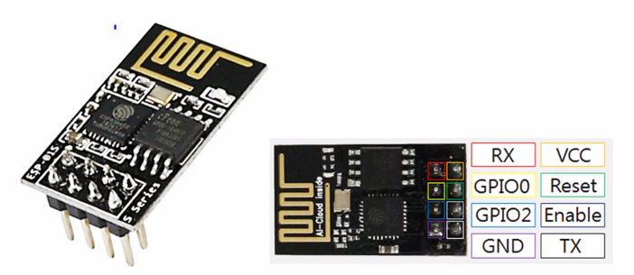
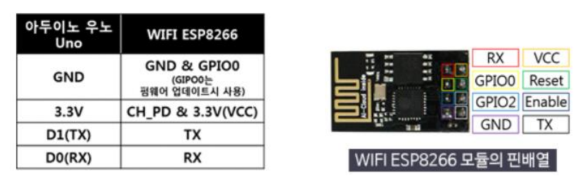
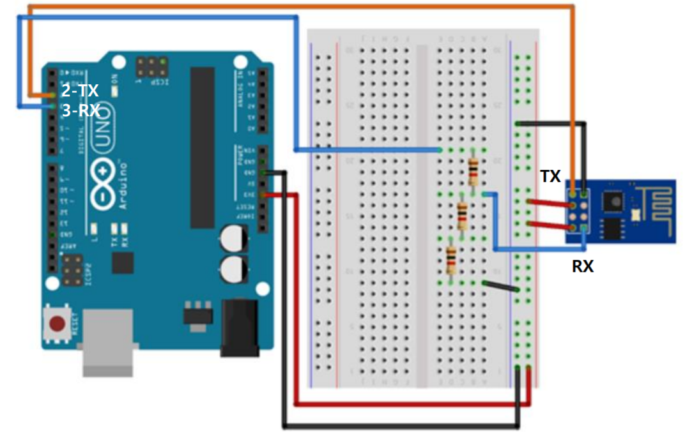
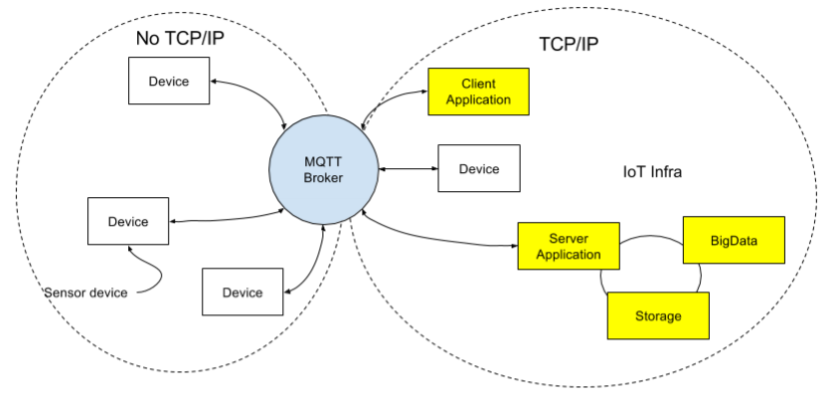
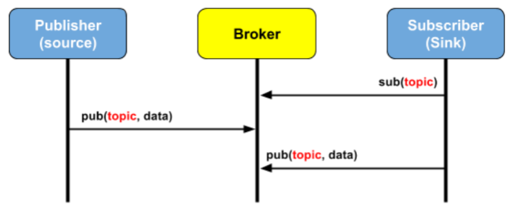
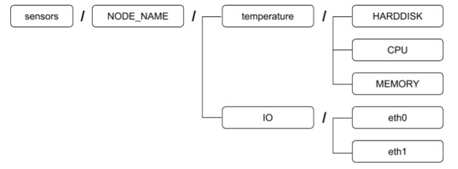
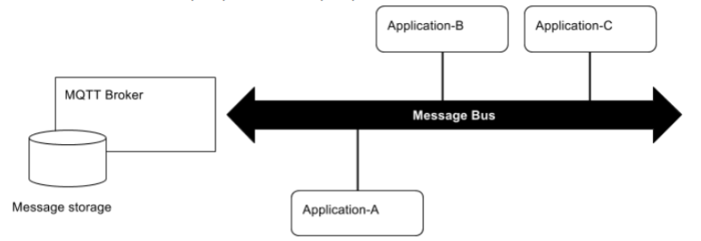
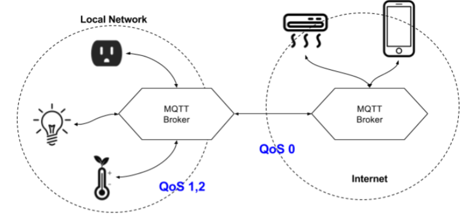
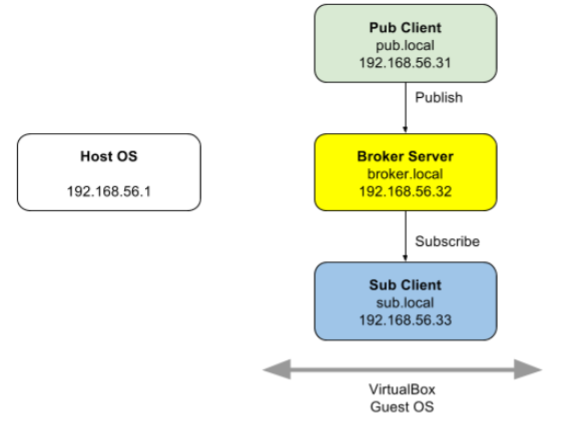

## 2020.09.19 TIL

##### 초음파 센서

- 10cm이내 거리 측정 경보기(모터까지 적용)

  ```java
  #include <MiniCom.h>
  #include "Ultra.h"
  #include <Led.h>
  #include <Servo.h>
  
  MiniCom com;
  Ultra ultra(2, 3);
  Led led(8);
  // LED랑 부저와 동일선상에 있기 때문에 8번으로 부저도 같이 제어
  Servo servo;
  
  void checkDistance(){
      int distance = ultra.read();
      com.print(0, "distance", distance);
      if(distance < 10){
          led.on();
          servo.write(90);
      } else {
          led.off();
          servo.write(0);
      }
  }
  
  void setup() {
      com.init();
      servo.attach(9);
      servo.write(0);
      com.setInterval(1000, checkDistance);
  }
  
  void loop() {
      com.run();
  }
  ```

- 후방카메라 만들기

  - Pulse.h

    ```java
    #pragma once
    
    #include <Arduino.h>
    
    typedef void (*button_callback_t)(int);
    
    class Pulse{
    protected :
        int onDelay; // HIGH 시간
        int offDelay; //LOW 시간
    
        int value; // 현재(H/L) 상태
        unsigned long oldTime; // 최근의 상태 변경 시점 기록
        bool state; // 펄스의 운영 여부
        button_callback_t callback;
    
    public:
        Pulse(int onDelay, int offDelay);
        void setDelay(int onDelay, int offDelay);
        void run();
        int read() { return value; }
        // 간단한 함수는 헤더파일에 정의해도 된다
    
        bool getState(){ return state; }
        void play();
        void stop();
    
        void setCallback(button_callback_t callback)
        { this->callback = callback; }
    };
    ```

  - Pulse.cpp

    ```java
    #include "Pulse.h"
    
    Pulse::Pulse(int onDelay, int offDelay)
        : onDelay(onDelay), offDelay(offDelay){
    
            value = HIGH;
            state = false; // 시작은 운영 안함
            callback = NULL;
            oldTime = millis();
    }
    
    void Pulse::setDelay(int onDelay, int offDelay){
        this -> onDelay = onDelay;
        this -> offDelay = offDelay;
    }
    
    void Pulse::play(){
        state = true;
        value = HIGH;
        oldTime = millis();
    }
    
    void Pulse::stop(){
        state = false;
        value = LOW;
    }
    
    void Pulse::run(){
        if(!state) return;
    
        unsigned long currentTime = millis();
        unsigned long diff = currentTime - oldTime;
        long interval = value? onDelay : offDelay;
        // 3항 연산자, 조건 true, 앞에 값 false, 뒤에 값
    
        if(diff >= interval){
            oldTime = currentTime;
            value = !value;
            if(callback != NULL){
                callback(value);
            }
        }
    }
    ```

    

  - app.ino

    ```java
    #include <MiniCom.h>
    #include "Ultra.h"
    #include <Led.h>
    #include <Servo.h>
    #include "Pulse.h"
    
    MiniCom com;
    Ultra ultra(2, 3);
    Led led(8);
    // LED랑 부저와 동일선상에 있기 때문에 8번으로 부저도 같이 제어
    Servo servo;
    Pulse pulse(100, 500);
    
    int delayTime[] = {
        50, 100, 200, 300, 500
    };
    
    void pulseCallback(int value){
        //LED 제어
        led.set(value);
    }
    
    void checkDistance(){
        int distance = ultra.read();
        com.print(0, "distance", distance);
        if(distance < 10){
            // led.on();
            // Pulse의 offDelay를 distance를 고려하여 조정
            int offDelay = map(distance, 0, 9, 0, 4);
            pulse.setDelay(10, delayTime[offDelay]);
    
            servo.write(90);
            if(!pulse.getState()){ // 처음 10cm 이하로 됐을 때
                pulse.play(); 
            }
        } else {
            if(pulse.getState()){
                pulse.stop();
            }
            // led.off();
            servo.write(0);
        }
    }
    
    void setup() {
        com.init();
        servo.attach(9);
        servo.write(0);
        pulse.setCallback(pulseCallback);
        com.setInterval(1000, checkDistance);
    }
    
    void loop() {
        com.run();
        pulse.run();
    }
    ```

    - **Event driven 방식** : 키보드의 입력, 마우스 클릭, 네트워크 패킷 등 언제 동작할 지 모르는 반응(event)가 일어 났을 때 처리되는(driven)방식을 의미


### WIFI ESP8266 AT 명령

##### ESP8266





- SoftSerial
  - 아두이노 Uno는 RX(0번)/RX(1번) 핀 1번만 지원(PC 연결에 사용)
  - 일반 디지털 핀을 소프트웨적으로 RX/TX 처리 이용 필요
    - SoftSerial
  - 2번 핀/3번 디지털 핀을 RX/TX로 연결
  - 9600 속도에서 안정적으로 동작
    - 더 빨라지면 오류 발생
    - ESP8266의 속도를 9600으로 설정 필요
- ESP8266는 3.3V로 동작
  - RX/TX 핀도 3.3V로 동작
  - 아두이노의 디지털 출력은 5V
    - 전압 강하 필요
    - 1:2 비율로 전압 강하로 ESP8266의 RX로 연결
  - 아두이노는 1.7V 이상을 HIGH로 미만을 LOW로 인식하므로 TX는 바로 연결




##### AT명령

- AT
  - 동작 여부 확인
  - 정상 : OK 응답
  - 비정상 : 무응답
- AT+RST
  - 리셋
- AT+GMR
  - 모듈 버전 확인
- AT+CWMODE(Current Working Mode)
  - AT+CWMODE? : 현재 모드 출력
  - AT+CWMODE=1(Stand Alone) / 2(AP) / 3(Stand Alone + AP)
- AT+CWLAP
  -  AP 리스트 출력
- AT+CWJAP
  - AP 접속 명령
  - AT+CWJAP="SSID","비밀번호
  - AT+CWJAP="SevenRoom3","12345678"
  - AT+CWJAP="U+NetADD3","6000033359"
- AT+CIFSR
  - 접속 IP 확인
  - 192.168.25.4
- AT+CWQAP
  - AP 접속 해제
- 보드레이트 재정의(펌웨어 디폴트 : 115200)
  - AT+UART_DEF=9600,8,1,0,0


### ESP8266 라이브러리 (WiFiEsp)

##### ESP8266 라이브러리

- WiFi 객체 주요 메소드
  - WiFi AP(공유기)에 접속하고 IP를 받는 역할
  - WiFi.init(&softSerial)
    - SoftwareSerial을 통해 초기화
  - WiFi.status() 
    - AP 연결 상태 리턴
  - WiFi.begin(ssid, password)
    - AP 접속
    - 접속 성공시 IP 할당 받음
  - WiFi.SSID()
    - AP의 SSID 리턴
  - WiFi.localIP()
    - 할당 받은 IP (IPAddress 객체) 리턴
  - WiFi.RSSI()
    - AP의 신호 강도 리턴


- WIFI 연결

  ```java
  #include <WiFiEsp.h>
  #include <SoftwareSerial.h>
  
  SoftwareSerial softSerial(2, 3); // RX, TX
  
  char ssid[] = "SSID"; // your network SSID (name)
  char pass[] = "password"; // your network password
  int status = WL_IDLE_STATUS; // the Wifi radio's status
  
  void printWifiStatus() {
      // print the SSID of the network you're attached to
      Serial.print("SSID: ");
      Serial.println(WiFi.SSID());
      // print your WiFi shield's IP address
      IPAddress ip = WiFi.localIP();
      Serial.print("IP Address: ");
      Serial.println(ip);
      // print the received signal strength
      long rssi = WiFi.RSSI();
      Serial.print("Signal strength (RSSI):");
      Serial.print(rssi);
      Serial.println(" dBm");
  }
  
  void setup() {
      Serial.begin(115200); // PC와 통신(PC는 모든 통신을 지원)
      softSerial.begin(9600); // 9600이 제일 안정적
      WiFi.init(&softSerial); // & : 주소 연산자, 중요
  
      if (WiFi.status() == WL_NO_SHIELD) { // WL_NO_SHIELD, ESP가 꽂혀있지 않다
          Serial.println("WiFi shield not present");
          while (true);
      }
      while ( status != WL_CONNECTED) { // AP의 접속 여부
          Serial.print("Attempting to connect to WPA SSID: ");
          Serial.println(ssid);
          status = WiFi.begin(ssid, pass); // 중요
      }
      Serial.println("You're connected to the network");
  
      printWifiStatus();
  }
  void loop() {
  
  }
  ```

  

- 코드 재사용을 위한 클래스화

  - WifiUtil.h

    ```java
    #ifndef __WIFI_UTIL_H__ // #pragma once랑 같음
    #define __WIFI_UTIL_H__ // #pragma once랑 같음
    
    #include <SoftwareSerial.h>
    #include <WiFiEsp.h>
    
    class WifiUtil {
    private :
        const char *ssid; // 읽기만 허용되는 포인터(값 상수)
        const char *password;
        SoftwareSerial softSerial;
        int status = WL_IDLE_STATUS; // Status
    
    public :
        WifiUtil(int rx, int tx);
        void init(const char *ssid, const char *password);
        void checkShield();
        void printInfo();
        int check(); // 접속
    };
    
    #endif
    ```

  - WifiUtil.cpp

    ```java
    #include "WifiUtil.h"
    
    WifiUtil::WifiUtil(int rx, int tx): softSerial(rx, tx) {
    
    }
    // 쉴드 존재유무 확인
    void WifiUtil::checkShield() {
        if (WiFi.status() == WL_NO_SHIELD) {
            Serial.println("WiFi shield not present");
            while (true);
        }
    }
    
    // 와이파이 접속여부 확인 - 미접속이면 접속 시도
    int WifiUtil::check() {
        while (WiFi.status() != WL_CONNECTED) {
            Serial.print("Attempting to connect to WPA SSID: ");
            Serial.println(ssid);
            status = WiFi.begin(ssid, password);
            if(status == WL_CONNECTED) {
                printInfo();
                return 1; // 끊겼다가 다시 접속
            }
        }
        return 0; // 끊긴적 없음
    }
    
    // 초기화 및 AP 접속
    void WifiUtil::init(const char *ssid, const char *password) {
        this->ssid = ssid;
        this->password = password;
    
        softSerial.begin(9600);
        WiFi.init(&softSerial);
    
        checkShield();
        check();
    }
    
    void WifiUtil::printInfo() {
        // 와이파이 접속정보
        Serial.println("You're connected to the network");
        Serial.print("SSID: ");
        Serial.println(WiFi.SSID());
    
        IPAddress ip = WiFi.localIP();
        Serial.print("IP Address: ");
        Serial.println(ip);
    
        long rssi = WiFi.RSSI();
        Serial.print("Signal strength (RSSI):");
        Serial.print(rssi);
        Serial.println(" dBm");
        Serial.println();
    }
    
    
    ```

  - app.ino

    ```java
    #include <WifiUtil.h>
    
    const char SSID[] = "SSID"; // your network SSID (name)
    const char PASSWORD[] = "password"; // your network password
    
    WifiUtil wifi(2,3); // Rx, Tx
    
    void setup(){
        Serial.begin(9600);
        wifi.init(SSID, PASSWORD);
    }
    
    void loop(){
        if(wifi.check()){
            ;
        }
    }
    ```

- WiFiEspClient 객체

  - TCP Socket 처리 객체
  - connect(서버주소, 포트번호)
    - 지정 서버의 포트 번호로 접속
  - print(), println() 
    - 메시지 출력
  - available()
    - 수신된 메시지 존재 여부
    - 수신된 메시지의 길이 리턴
  - read()
    - 수신 메시지의 1바이트 읽기

``` java
#include <WifiUtil.h>

const char SSID[]="ABC"; // your network SSID (name)
const char PASSWORD[]="kim3262286"; // your network password
const char server[]="arduino.cc";

WifiUtil wifi(2, 3);
WiFiEspClient client;

void request() {
    // if you get a connection, report back via serial
    if (client.connect(server, 80)) { // webserver
        Serial.println("Connected to server");
        // Make a HTTP request
        client.println("GET /asciilogo.txt HTTP/1.1");
        client.println("Host: arduino.cc");
        client.println("Connection: close");
        client.println();
    }
}
void response( ) {
    while (client.available()) {
        char c = client.read();
        Serial.write(c);
    }
}

void setup() {
    Serial.begin(9600);
    wifi.init(SSID, PASSWORD);
    request();
}

void loop() {
    response();
}
```


## MQTT

##### MQTT

- MQTT(Message Queue Telemetry Transport)

  - (https://www.joinc.co.kr/w/man/12/MQTT/Tutorial)

  - 경량의 Publish/Subscribe(Pub/Sub) 메시징 프로토콜

  - M2M(machine-to-machine)와 IoT(Internet of things) 분야 적용

  - 특징

    - 저전력

    - 신뢰할 수 없는 네트워크에서 운용 가능

    - No TCP/IP 기반 운영 가능

      -> 소형기기의 제어와 센서정보 수집에 유리

- 구성

  

- 활용

  - 센서(Sensor) 정보 수집
  - 제어
    - 센서로 부터 받은 데이터를 토대로 기기 제어
    - 각 기기에 MQTT broker를 설치 또는 중앙 MQTT broker에 bind
  - Message Push Server
    - 모바일 애플리케이션을 위한 메시지 Push 서버
    - 페이스북의 경우 MQTT를 이용해서 메시지를 push 하고 있음

- MQTT 특징

  - Publish/Subscribe

    - Publisher과 Subscriber은 모두 Broker에 대한 클라이언트로 작동
    - Publisher는 토픽을 발행
    - Subscriber은 토픽을 구독
    - 둘 다 Broker 서버에 염

    

- 토픽
  - Pub와 Sub는 토픽을 기준으로 작동
  - 토픽은 슬래시(/)를 이용해서 계층적으로 구성
  - 대량의 센서 기기들을 효율적으로 관리



- MQTT 특징

  - 토픽 와일드 카드 문자

    - \+ : 1레벨
      - ex) iot/home1/+/temperature
      - -> iot/home1/livingroom/temperature
      - -> iot/home1/bedroom/temperature
      - -> iot/home1/bathroom/temperature
    - \# : 하위 모든 레벨
      - 예) iot/home1/#

  - 시스템 토픽

    - $토픽명
    - 브로커 내부용으로 사용

  - 메시지 버스

    - MQTT는 메시지 버스 시스템
    - MQTT Broker가 메시지 버스를 만들고 여기에 메시지를 흘려보내면, 버스에 붙은 애플리케이션들이 메시지를 읽어가는 방식
    - 메시지 버스에는 다양한 주제의 메시지들이 흐를 수 있는데, 메시지를 구분하기 위해서 "Topic"을 이름으로 하는 메시지 채널을 만듦.
    - 애플리케이션들은 Message Bus에 연결하고 관심있는 토픽(Topic)을 등록 해서 메시지를 구독(SUB)하거나 발행(PUB)함.

    

  - QoS(Quality of Service) - 메시지 신뢰성

    - 3단계의 QoS(Quality of service) 제공
      - 0 : 메시지는 한번만 전달하며, 전달여부를 확인하지 않는다. Fire and Forget 타입이다.
      - 1 : 메시지는 반드시 한번 이상 전달된다. 하지만 메시지의 핸드셰이킹 과정 을 엄밀하게 추적하지 않기 때문에, 중복전송될 수도 있다.
      -  2 : 메시지는 한번만 전달된다. 메시지의 핸드셰이킹 과정을 추적한다. 높은 품질을 보장하지만 성능의 희생이 따른다.
    - 서비스의 종류에 따라서 적당한 QoS 레벨을 선택
    - No TCP/IP와 TCP/IP가 섞여있는 로컬 네트워크에서는 QoS 1, 2를 선택
    - 원격 네트워크에서는 0번
      - 네트워크의 신뢰성을 믿음
    - 클라이언트는 MQTT queue에 있는 메시지를 읽기 위해서 이전에 연결했던 MQTT에 연결
      - QoS 레벨은 0으로 하고, 소프트웨어에서 QoS를 처리

    

- MQTT 브로커 : Mosquitto

  - eclipse에서 제작 및 배포
  - BSD 라이센스 기반의 오픈소스 메시지 브로커

  

- Mosquitto 운영 테스트

  - 구독자(Subscriber) 실행

    - mosquitto_sub -h 브로커주소 -t 토픽명
    - mosquitto_sub -h localhost -t iot/#

    

  - 발행자(Publisher) 실행

    - mosquitto_pub -h 브로커주소 -t 토픽명 -m 메시지
    - mosquitto_pub -h localhost -t iot/home/greet -m "안녕하세요"

