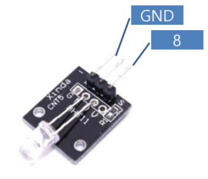
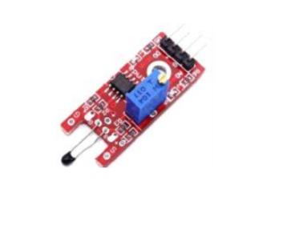

## 2020.09.18 TIL

### Arduino MQTT PubSubClient 라이브러리

##### Arduino MQTT

- **주요 메소드**

  - PubSubClient(Client)

    - 생성자

    - Client 객체를 매개변수로 지정

      ```java
      WiFiEspClient espClient;
      PubSubClient client(espClient);
      ```

  - setServer(서버주소, 포트번호)

    - 서버 정보 설정

      ```java
      client.setServer(MQTT_SERVER, 1883);
      ```

  - setCallback(callback)

    - 구독자인 경우 메시지 수신

      ```java
      client.setCallback(callback);
      ```

  - connect() / connect(ClientId)

    - MQTT 서버 연결

      ```java
      client.connect("ESPClient");
      ```

  - publish(토픽, 메시지)

    - 토픽 발행

      ```java
      client.publish("home/livingroom/led", message);
      ```

  - subscribe(토픽)

    - 구독자로 등록

    - 주로 접속 성공 후 등록

      ```java
      client.subscribe("home/livingroom/led");
      ```


- **구독자 콜백 함수**

  - void callback(char* topic, byte* payload, unsigned int length)

    - 토픽 메시지 수신 시 호출

    - topic : 수신된 토픽

    - payload : 메시지 byte 배열

    - length : 수신된 메시지 길이

    - 문자열 변환 처리

      ```java
      char message[100];
      memcpy(message, payload, length); // 메모리 블록 복사(dest, src, length)
      message[length] = NULL;
      ```

- Arduino MQTT

  ```java
  #include <SoftwareSerial.h>
  #include <WiFiEsp.h>
  #include <PubSubClient.h>
  #include <SimpleTimer.h>
  #include <WifiUtil.h>
  
  SoftwareSerial softSerial(2, 3);           // RX, TX
  
  const char ssid[] = "ABC";               // 네트워크 SSID
  const char password[] = "kim3262286";       // 비밀번호
  const char mqtt_server[] = "192.168.0.10"; // 서버 주소
  
  // MQTT용 WiFi 클라이언트 객체 초기화
  WifiUtil wifi(2, 3);
  WiFiEspClient espClient;
  PubSubClient client(espClient);
  
  void callback(char *topic, byte *payload, unsigned int length) {
      payload[length] = NULL;
      char *message = payload;
  
      if (strcmp("1", message) == 0) {
          digitalWrite(13, HIGH);
      } else {
          digitalWrite(13, LOW);
      }
  
      Serial.print(topic);
      Serial.print(" : ");
      Serial.println(message);
  }
  
  void mqtt_init() {
      client.setServer(mqtt_server, 1883);
      // subscriber인경우 메시지 수신시 호출할 콜백 함수 등록
      client.setCallback(callback);
  }
  
  // MQTT 서버에 접속될 때까지 재접속 시도
  void reconnect() {
  
      while (!client.connected()) {
          Serial.print("Attempting MQTT connection...");
          
          if (client.connect("ESP8266Client")) {
              Serial.println("connected");
              // subscriber로 등록
              client.subscribe("home/livingroom/led");  // 구독 신청
          } else {
              Serial.print("failed, rc=");
              Serial.print(client.state());
              Serial.println(" try again in 5 seconds");
              delay(5000);
          }
      }
  }
  
  void publish() {
      int state = !digitalRead(13);
      char message[10];
      sprintf(message, "%d", state);
  
      // 토픽 발행
      client.publish("home/livingroom/led", message);
  }
  
  // 2초 간격으로 publish
  SimpleTimer timer;
  
  void setup() {
      wifi.init(ssid, password);
      mqtt_init();
  
      pinMode(13, OUTPUT);
      digitalWrite(13, LOW);
      timer.setInterval(2000, publish);
  }
  
  void loop() {
      if (!client.connected()) {  // MQTT가 연결 X
          reconnect();
      }
  
      client.loop();
      timer.run();
  }
  ```

  

### RGB LED, SMD LED

##### RGB LED, SMD LED


### 7Color Flashing LED Module

##### 7Color Flashing LED Module

- 7가지의 색을 자동으로 번갈아 가며 발광하는 LED




- 7_COLOR_LED

  ```java
  int led = 8;
  void setup(){
      pinMode(led, OUTPUT);
  }
  
  void loop(){
      digitalWrite(led, HIGH); // set the LED on
      delay(2000); // wait for a second
      digitalWrite (led, LOW); // set the LED off
      delay(2000); // wait for a second
  }
  ```

- red and green LED module

  -  3 mm red and green LED module (common cathode)
  -  5 mm red and green LED module (common cathode)
  - 배터리 상태, 충전여부에 사용


- 2_COLOR_LED

  ```java
  int redpin = 10; // select the pin for the red LED
  int bluepin = 11; // select the pin for the blueLED
  int val;
  
  void setup() {
      pinMode(redpin, OUTPUT);
      pinMode(bluepin, OUTPUT);
  }
  
  void loop() {
      for (val = 255; val > 0; val--) {
          analogWrite(redpin, val);
          analogWrite(bluepin, 255- val);
          delay(15);
      }
  
      for (val = 0; val < 255; val ++) {
          analogWrite(redpin, val);
          analogWrite(bluepin, 255- val);
          delay(15);
      }
  }
  ```


### 아날로그 온도 센서


- thermister

  ```java
  #include <math.h>
  
  double Thermister(int RawADC) {
      double Temp;
      Temp = log(((10240000 / RawADC) - 10000));
      Temp = 1 / (0.001129148 + (0.000234125 + (0.0000000876741 * Temp * Temp)) *Temp);
      Temp = Temp - 273.15; // Convert Kelvin to Celcius
  
      return Temp;
  }
  
  void setup()
  {
      Serial.begin(9600);
  }
  
  void loop()
  {
      Serial.print(Thermister(analogRead(A0))); // display Fahrenheit
      Serial.println("c");
      delay(500);
  }
  ```


### Digital Temperature



```java
int Led = 13; // define LED Interface
int buttonpin = 3; // define the digital temperature sensor
int val; // define numeric variables val

void setup() {
    pinMode(Led, OUTPUT);
    pinMode(buttonpin, INPUT);
}

void loop() {
    val = digitalRead(buttonpin);
    if (val == HIGH) {
        digitalWrite(Led, HIGH);
    }
    else {
        digitalWrite(Led, LOW);
    }
}
```


### 레이저 센서 laser transmitter module


- LASER

  ```java
  void setup () {
      pinMode (13, OUTPUT);
  }
  
  void loop () {
      digitalWrite (13, HIGH);
      delay (1000);
      digitalWrite (13, LOW);
      delay (1000);
  }
  ```


### High-sensitive Voice Sensor


- MIC_SOUND

  ```java
  // digital
  int Led = 13; // define LED Interface
  int buttonpin = 3; // define D0 Sensor Interface
  int val; // define numeric variables val
  
  void setup() {
      pinMode(Led, OUTPUT); // define LED as output interface
      pinMode(buttonpin, INPUT); // output interface D0 is defined sensor
  }
  void loop() {
      val = digitalRead(buttonpin);
      if (val == HIGH) {
          digitalWrite(Led, HIGH);
      }
      else {
          digitalWrite(Led, LOW);
      }
  }
  
  // // analog
  // int sensorPin = A5; // select the input pin for the potentiometer
  // int ledPin = 13; // select the pin for the LED
  // int sensorValue = 0; // variable to store the value coming from the sensor
  
  // void setup() {
  //     pinMode(ledPin, OUTPUT);
  //     Serial.begin(9600);
  // }
  // void loop() {
  //     sensorValue = analogRead(sensorPin);
  //     digitalWrite(ledPin, HIGH);
  //     delay(sensorValue);
  //     digitalWrite(ledPin, LOW);
  //     delay(sensorValue);
  //     Serial.println(sensorValue, DEC);
  // }
  ```


### Tilt SWITCH MODULE

- Tilt switch module(Ball Switch)

  - 내부에 볼 스위치를 이용하여 회로를 작동시키는 구조

  - 기울기에 따라 ON/OF

  - 경사각을 구할 수는 없음

    


- TILT_SWITCH

  ```java
  int Led = 13;
  int buttonpin = 3;
  int val;
  
  void setup() {
      pinMode(Led, OUTPUT);
      pinMode(buttonpin, INPUT);
  }
  
  void loop() {
      val = digitalRead
      (buttonpin);
      if (val == HIGH) {
          digitalWrite(Led, HIGH);
      }
      else {
          digitalWrite(Led, LOW);
      }
  }
  ```

  

### 각도스위치센서 mercury tilt switch module

- mercury tilt switch module

  - 작은 수은 구가 있음

  - 기울였을 때 회로를 닫힘

    


- mercury tilt switch module

  ```java
  int Led = 13;
  int buttonpin = 3;
  int val;
  
  void setup() {
      pinMode(Led, OUTPUT);
      pinMode(buttonpin, INPUT);
  }
  
  void loop() {
      val = digitalRead
      (buttonpin);
      if (val == HIGH) {
          digitalWrite(Led, HIGH);
      }
      else {
          digitalWrite(Led, LOW);
      }
  }
  ```


### Magic light cup module

##### Magic light cup module

- Mercury tilt을 이용하여 LED 밝기를 제어하는 센서

  


- Magic light cup module

  ```java
  int pinLed = 11;
  int pinInput = 10; // Light Cup 제어 핀으로 선언
  int stateA = 0; // Light Cup 상태 저장 변수
  int brightness = 0; // 현재 발광 값 저장 변수
  int oldBrightness = 0; // 이전 발광 값 저장 변수
  
  void setup() {
      Serial.begin(9600);
      pinMode(pinLed, OUTPUT);
      pinMode(pinInput, INPUT);
      digitalWrite(pinInput, HIGH);
  }
  
  void loop() {
      stateA = digitalRead(pinInput); // Light Cup interface에서 값을 읽음
      if (stateA == HIGH && brightness < 255) // 조건이 맞을 경우
          brightness++; // brightness을 1 증가
          
      if (stateA == LOW && brightness > 0) // 조건이 맞을 경우
          brightness--; // brightness을 1 감소
  
      if (oldBrightness != brightness) { // brightness 현재와 이전 값이 다른 경우
          Serial.print("brightness:"); // 시리얼로 brightness 값 출력
          Serial.println(brightness);
      }
  
      oldBrightness = brightness; // brightness 이전 값을 현재 값으로 업데이트
      analogWrite(pinLed, brightness); // brightness 값을 이용하여 LED 밝기 조절
      delay(10);
  }
  ```


### REED MODULE

- REED

  - 자기장에 노출되었을 때 닫히는 센서

    


- REED

  ```java
  int Led = 13;
  int buttonpin = 3;
  int val;
  
  void setup() {
      pinMode(Led, OUTPUT);
      pinMode(buttonpin, INPUT);
  }
  
  void loop() {
      val = digitalRead
      (buttonpin);
      if (val == HIGH) {
          digitalWrite(Led, HIGH);
      }
      else {
          digitalWrite(Led, LOW);
      }
  }
  ```

  

### 마그네틱 홀 센서 Hall magnetic sensor module

- Hall magnetic sensor 

  - 자기장을 감지

    

### 리니어 홀 자기센서 Linear Hall magnetic module

- Linear Hall magnetic

  - 자기장이 있는 곳에서 켜고 끌 수 있는 센서 스위치

    


### 아날로그 홀 자기 센서 Analog Hall magnetic sensor module

- Analog Hall magnetic sensor

  - 자기장을 감지

  

### vibration switch module

- vibration switch module

  - 충격 및 진동을 감지하는 센서

    

### touch module

- touch module
  - 터치를 감지하는 센서


### knock sensor module

- knock sensor module

  - 충격 감지 센서

  

### 불꽃감지센서 flame sensor module

- flame sensor

  - 화염을 감지하는 센서

  

  

### 포토인터럽터 센서 photo interrupter module 

- photo interrupter

  - 센서 틈 사이에 빛이 차단되었을 때 트리거 하는 모듈
  - 투광기와 검출기 사이의 광선을 사용하여 양쪽 사이의 경로가 불투명한 물 체에 의해 차단되는지 확인

  


### IR트레킹 센서 Tracking Module

- Tracking Module

  - 검은색이 감지되면 닫히는 센서
  - 라인트레이서에 사용

  


### 장애물감지 센서 infrared obstacle avoidance sensors

- infrared obstacle avoidance sensors

  - 적외선을 이용하여 물체가 감지되면 닫히는 센서
  - 거리 측정은 못함

  


### 맥박 센서 finger measuring heartbeat module

- 맥박 센서 finger measuring heartbeat module

  - 맥박을 센싱하는 센서

    