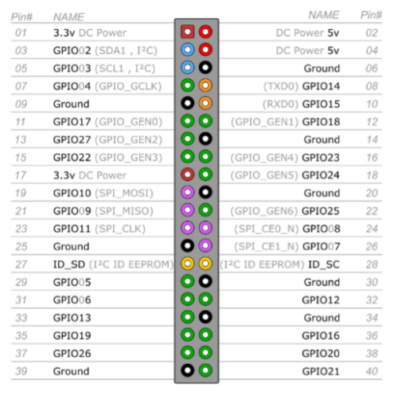
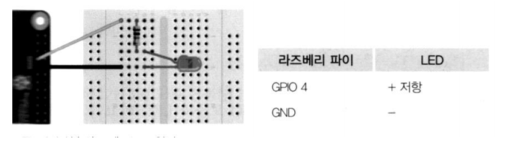

## 2020.09.24 TIL

### 라즈베리 파이 GPIO 및 센서 활용하기

##### GPIO 핀 배치



##### GPIO 

- General Purpose Input Output
- 범용 입출력 포트

#####  GPIO 제어 모듈

- RPi.GPIO 모듈이 기본 설치되어 있음


- 절차
  - 모듈 임포트
  - 핀 번호 지정 방식 설정
    - BCM * : GPIO 핀 번호 사용
    - BOARD : 보드 핀 번호 사용
  - 핀 I/O 모드 설정
  - 핀 제어
  - 마칠 때 cleanup()
    - 모든 GPIO 핀을 초기화

##### LED 실습



##### LED_Blink.py

```python
import RPi.GPIO as GPIO
import time

# 사용할 GPIO핀의 번호를 선정합니다.(BCM 모드)
led_pin = 18 #GPIO18

# GPIO핀의 번호 모드 설정
GPIO.setmode(GPIO.BCM)

# LED 핀의 IN/OUT 설정
GPIO.setup(led_pin, GPIO.OUT)

# 10번 반복문
for i in range(10):
    GPIO.output(led_pin,1) # LED ON
    time.sleep(1) # 1초동안 대기상태
    GPIO.output(led_pin,0) # LED OFF
    time.sleep(1) # 1초동안 대기상태

GPIO.cleanup() # GPIO 설정 초기화
```


##### 푸시 버튼 스위치 실습(Polling 방식)


##### Btn_Polling.py

```python
import RPi.GPIO as GPIO
import time

# 사용할 GPIO 핀의 번호를 선정합니다.
button_pin = 23

# GPIO핀의 번호 모드 설정
GPIO.setmode(GPIO.BCM)

# 버튼 핀의 입력설정 , PULL DOWN 설정
GPIO.setup(button_pin, GPIO.IN, pull_up_down=GPIO.PUD_DOWN)

while 1: #무한반복
    # 만약 버튼핀에 High(1) 신호가 들어오면, "Button pushed!" 을 출력합니다.
    if GPIO.input(button_pin) == GPIO.HIGH:
        print("Button pushed!")

    time.sleep(0.1) # 0.1초 딜레이
```

