## 2020.09.25 TIL

##### GPIO 핀의 상태 변경 감지

- GPIO.add_event_detect(채널, GPIO.RISING, callback=my_callback)
  - GPIO 핀의 상태가 0 또는 1로 변경될 때 호출할 함수(my_callback)를 등록


##### Btn_Event.py

```python
#!/usr/bin/python

import RPi.GPIO as GPIO
import time

# button_callback 함수를 정의합니다.
def button_callback(channel):
    print("Button pushed!")

# 사용할 GPIO핀의 번호를 선정합니다.
button_pin = 23

# GPIO핀의 번호 모드 설정
GPIO.setmode(GPIO.BCM)

# 버튼 핀의 IN/OUT 설정 , PULL DOWN 설정
GPIO.setup(button_pin, GPIO.IN, pull_up_down=GPIO.PUD_DOWN)

# Event 방식으로 핀의 Rising 신호를 감지하면 button_callback 함수를 실행합니다.
# bouncetime - ms 단위로 delay를 주는 함수
GPIO.add_event_detect(button_pin,GPIO.RISING,callback=button_callback, bouncetime=10)

while 1:
    time.sleep(0.1) # 0.1초 딜레이
```

##### 푸시 버튼 스위치 실습(Event 알림 방식)

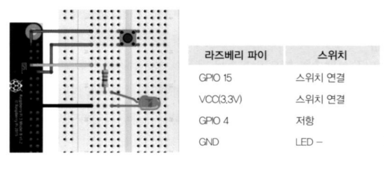

##### 디바운싱

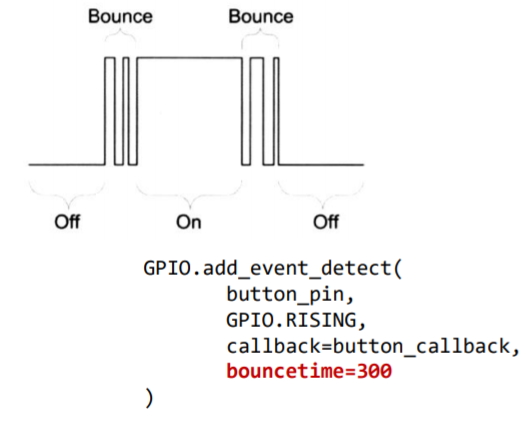

##### Btn_LED.py

```python
import RPi.GPIO as GPIO
import time

# 사용할 GPIO핀의 번호를 선정합니다.
button_pin = 23
led_pin = 18

# GPIO핀의 번호 모드 설정
GPIO.setmode(GPIO.BCM)

# 버튼 핀의 INPUT설정 , PULL DOWN 설정
GPIO.setup(button_pin, GPIO.IN, pull_up_down=GPIO.PUD_DOWN)

# LED 핀의 OUT설정
GPIO.setup(led_pin, GPIO.OUT)

# boolean 변수 설정
light_on = False

# button_callback 함수를 정의합니다.
def button_callback(channel):
    global light_on # Global 변수선언
    if light_on == False: # LED 불이 꺼져있을때
        GPIO.output(led_pin,1) # LED ON
        print("LED ON!")
    else: # LED 불이 져있을때
        GPIO.output(led_pin,0) # LED OFF
        print("LED OFF!")
    light_on = not light_on # False <=> True

# Event 알림 방식으로 GPIO 핀의 Rising 신호를 감지하면 button_callback 함수를 실행
# 300ms 바운스타임을 설정하여 잘못된 신호를 방지합니다.
GPIO.add_event_detect(button_pin,GPIO.RISING, callback=button_callback, bouncetime=10)

try:
    while 1: #무한반복
        GPIO.output(led_pin,GPIO.input(button_pin)) # LED ON
        time.sleep(0.1) # 0.1초 딜레이
except KeyboardInterrupt:
    GPIO.cleanup()
```

### Python 고급 문법

##### 클래스 데코레이터

- __callable__ 메서드
  - 클래스를 함수 호출하듯이 사용했을 때 호출되는 메서드

```python
import RPi.GPIO as GPIO
import time

# callable class
class LedEx:
    def __init__(self):
        pass

    def __call__(self):
        print("LedEx call")

if __name__ == "__main__":
    ex = LedEx() # LedEx 인스턴스, 생성자 호출
    # Led ex; 정적 할당(파이썬은 정적할당 없음)
    # Led *ex = new LedEx(); 동적할당

    ex() # LedEx 클래스의 __call__() 메소드 호출
```

##### callable 클래스로 모듈화

- myapp.pi

  ```python
  import sys
  
  class MenuItem:
      def __init__(self, title, action):
          self.title = title
          self.action = action
  
      def __str__(self):
          return f"<MenuItem {self.title}>"
  
      def __repr__(self):
          return f"<MenuItem {self.title}>"
  
      def run(self):
          self.action()
          
  class Menu:
      def __init__(self):
          self.menus= []
  
      def add_menu(self, menu_item):
          self.menus.append(menu_item)
  
      def print(self):
          print("[메뉴] ", end="")
          for i, menu in enumerate(self.menus):
              print(f"{i}:{menu.title}  ", end="")
          print()
  
      def run(self, select):
          if select >= len(self.menus):
              print("잘못된 메뉴 선택입니다.")
              return
          self.menus[select].run()        
  
  
  
  class Application:
      def __init__(self):
          self.book = [1, 2, 3]
          self.menu = Menu()
          self.create_menu(self.menu)
  
      def create_menu(self, menu):	
          pass
  
      def exit(self):
          sys.exit(0)
  
      def run(self):
  
          while True:
              self.menu.print()
              sel = int(input("선택] "))
              try: # Ctrl+c 한 경우 해당 기능 실행만 중단
                  self.menu.run(sel)
              except KeyboardInterrupt:
                  pass
              print()
  ```

- piapp.py

  ```python
  from myapp import *
  import RPi.GPIO as GPIO
  
  class PiApplication(Application):
      def __init__(self):
          GPIO.setmode(GPIO.BCM)
          super().__init__()
  
  
      def exit(self):
          GPIO.cleanup()
          sys.exit(0)
  ```

- ledex.py

  ```python
  import RPi.GPIO as GPIO
  import time
  
  # callable class
  class LedEx:
      def __init__(self):
          self.led_pin = 18
          GPIO.setup(self.led_pin, GPIO.OUT)
  
      def __call__(self):
          # 10번 반복문
          for i in range(10):
              GPIO.output(self.led_pin,1) # LED ON
              time.sleep(1) # 1초동안 대기상태
              GPIO.output(self.led_pin,0) # LED OFF
              time.sleep(1) # 1초동안 대기상태
  
  # if __name__ == "__main__":
  #     ex = LedEx()  # LedEx 인스턴스 생성자 호출
  #     ex()  # LedEx 클래스의 __call__() 메서드 호출
  ```

- btnex.py

  ```python
  import RPi.GPIO as GPIO
  import time
  
  # callable class
  class BtnEx:
      def __init__(self):
          self.button_pin = 23
          self.led_pin = 18
  
          GPIO.setup(self.button_pin, GPIO.IN, pull_up_down=GPIO.PUD_DOWN)
          GPIO.setup(self.led_pin, GPIO.OUT)
  
      def __call__(self):
          while 1:
              GPIO.output(self.led_pin, GPIO.input(self.button_pin))
              time.sleep(0.1) # 0.1초 딜레이 
  ```

- btneventex.py

  ```python
  import RPi.GPIO as GPIO
  import time
  
  # callable class
  class BtnEventEx:
      def __init__(self):
          # 사용할 GPIO핀의 번호를 선정합니다.
          self.button_pin = 23
          self.led_pin = 18
          # 버튼 핀의 INPUT설정 , PULL DOWN 설정
          GPIO.setup(self.button_pin, GPIO.IN, pull_up_down=GPIO.PUD_DOWN)
          # LED 핀의 OUT설정
          GPIO.setup(self.led_pin, GPIO.OUT)
          # boolean 변수 설정
          self.light_on = False
  
      def button_callback(self, channel):
          if self.light_on == False: # LED 불이 꺼져있을때
              GPIO.output(self.led_pin,1) # LED ON
              print("LED ON!")
          else: # LED 불이 져있을때
              GPIO.output(self.led_pin,0) # LED OFF
              print("LED OFF!")
          self.light_on = not self.light_on # False <=> True
  
      def __call__(self):
          self.light_on = False
          GPIO.add_event_detect(self.button_pin,GPIO.RISING, callback=self.button_callback, bouncetime=10)
  
          try:
              while 1:
                  time.sleep(0.1) # 0.1초 딜레이
          except KeyboardInterrupt:
              GPIO.remove_event_detect(self.button_pin)
  ```

##### PWM으로 프로그래밍

- 절차
  - PWM 인스턴스 생성 **p = GPIO.PWM(channel, frequency)**
  - 시작 듀티비 설정 **p.start(dc) # dc : 0 ~100**
  - 사용할 주파수 변경 **p.ChangeFrequency(freq)**
  - 듀티비 설정 **p.ChangeDutyCycle(dc) # dc : 0 ~100**
  - PWM 인스턴스 정지 **p.stop()**


- pwmex.py

  ```python
  import RPi.GPIO as GPIO
  import time
  
  # callable class
  class PwmEx:
      def __init__(self):
          self.led_pin = 18
  
          GPIO.setup(self.led_pin, GPIO.OUT)
          self.p = GPIO.PWM(self.led_pin, 50)
          self.p.start(0)
  
      def __call__(self):
          try:
              while 1:
                  # fade in
                  for dc in range(0, 101, 5):
                      self.p.ChangeDutyCycle(dc)
                      time.sleep(0.1)
  
                  for dc in range(100, -1, -5):
                      self.p.ChangeDutyCycle(dc)
                      time.sleep(0.1)
  
          except KeyboardInterrupt:
              self.p.stop()
  ```

  ##### PWM으로 부저 실습

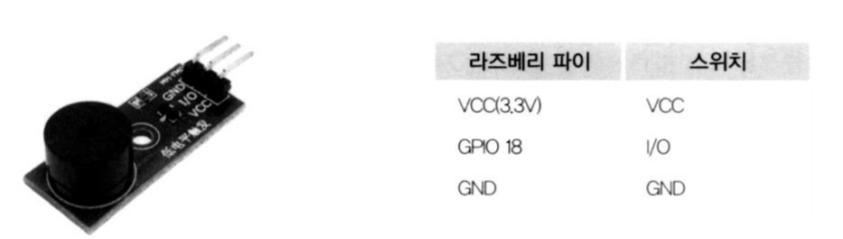


##### PWM으로 서보모터 실습


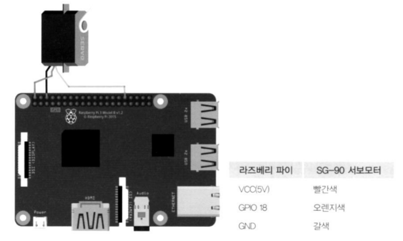

- pwmservoex.py

  ```python
  import RPi.GPIO as GPIO
  import time
  
  # callable class
  class PwmServoEx:
      def __init__(self):
          self.led_pin = 25
  
          GPIO.setup(self.led_pin, GPIO.OUT)
          self.servo = GPIO.PWM(self.led_pin, 50)
          self.servo.start(0)
  
      def __call__(self):
          try:
              while True:
                  # 듀티비를 변경하여 서보모터를 원하는 만큼 움직임
                  self.servo.ChangeDutyCycle(7.5) # 90도
                  time.sleep(1)
                  self.servo.ChangeDutyCycle(12.5) # 180도
                  time.sleep(1)
                  self.servo.ChangeDutyCycle(2.5) # 0도
                  time.sleep(1)
                  
          except KeyboardInterrupt:
              self.servo.stop()
  ```

  

##### 초음파센서(HC-SR04) 실습

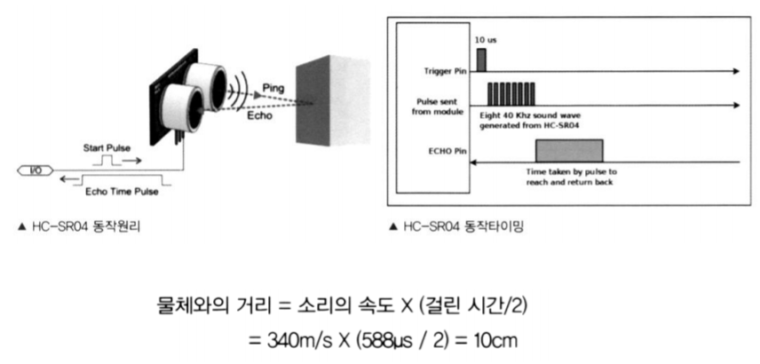

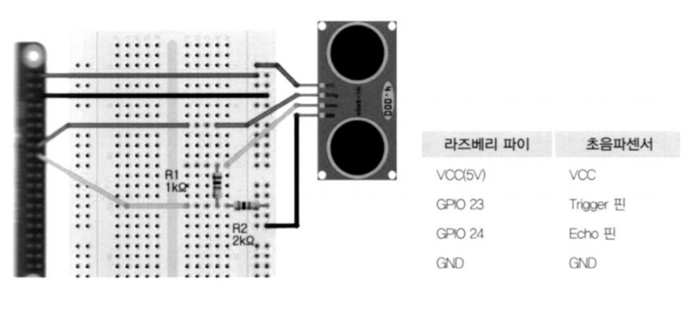

- ultraex.py

  ```python
  import RPi.GPIO as GPIO
  import time
  
  # callable class
  class UltraEx:
      def __init__(self):
          self.TRIG = 23
          self.ECHO = 24
  
          GPIO.setup(self.TRIG, GPIO.OUT)
          GPIO.setup(self.ECHO, GPIO.IN)
  
      def __call__(self):
          GPIO.output(self.TRIG, 0)
          print("Waiting for sensor to settle")
          time.sleep(2)
  
          while True:
              GPIO.output(self.TRIG, True) # Triger 핀에 펄스신호를 만들기 위해 1 출력
              time.sleep(0.00001) # 10µs 딜레이
              GPIO.output(self.TRIG, False)
  
              while GPIO.input(self.ECHO)==0:
                  start = time.time() # Echo 핀 상승 시간
              while GPIO.input(self.ECHO)==1:
                  stop= time.time() # Echo 핀 하강 시간
  
              check_time = stop - start
              distance = check_time * 34300 / 2
              print("Distance : %.1f cm" % distance)
              time.sleep(0.4) # 0.4초 간격으로 센서 측정
  ```

  

### MCP3008

##### MCP3008

- ADC: Analog to Digital Converter

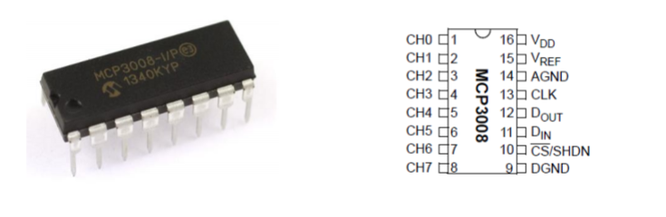


##### MCP3008 통신

- SPI 통신으로 데이터 전송, MCP3008 IC는 slave로 동작

- 신호 타이밍 : 8비트로 세번 나누어져 있음

  - 첫 바이트 : 라즈베리파이로 MOSI(DIN)을 통해 0x01을 보내서 start를 알림
  - 두 번째 바이트 : 상위 4비트를 통해 ADC값을 얻고자 하는 채널을 선택
  - 세번째 바이트 : MISO(DOUT)핀을 통해 null 비트로 시작하는 ADC값 전송

  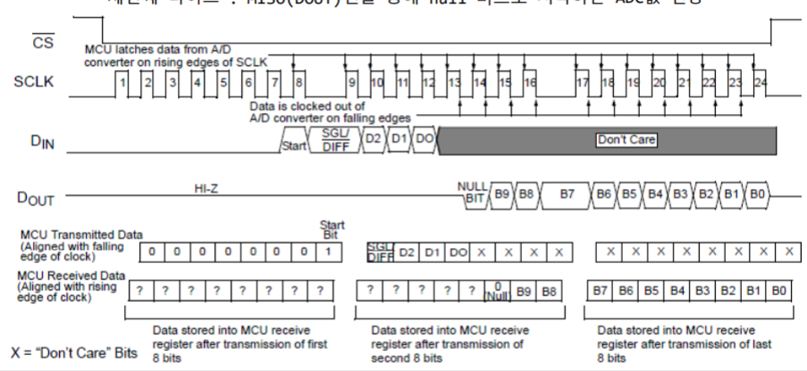

##### 채널 선택

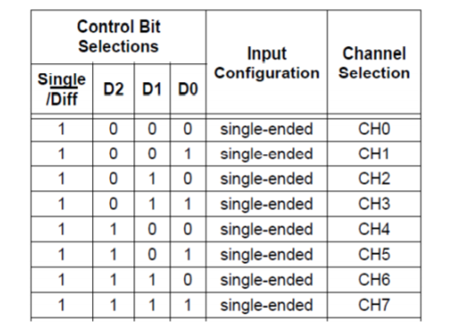

##### SPI 라이브러리

```shell
$ sudo pip3 install --upgrade spidev
```

- 라즈베리파이
  - 2개의 SPI 장치
  - **ls /dev/spi***
    - **/dev/spidev0.0**
    - **/dev/spidev0.1**
    - bus 값은 0이고 각각 device 값이 0와 1인 2개의 SPI 장치


##### 핀이름

- MOSI : Master Out Slave In
- MISO : Master In Slave Out
- CE : Chip Enable( CE0 : 0번 디바이스 선택, CE1: 1번 디바이스 지정)

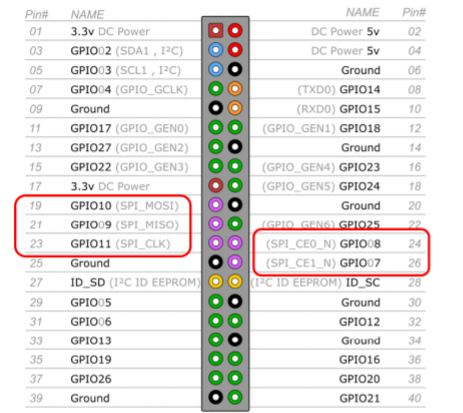

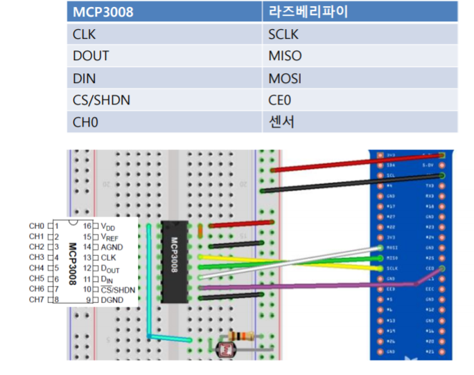

- mcpex.py

  ```python
  import spidev, time
  
  # callable class
  class McpEx:
      def __init__(self):
          self.spi = spidev.SpiDev()
          self.spi.open(0,0) # (버스, 디바이스)
          self.spi.mode = 3
          self.spi.max_speed_hz = 1000000
  
      def analog_read(self, channel):
          # 매개변수 (시작비트, 채
          # 널, 자릿수 맞춤 위치), 리턴값 : 아날로그 값
          r = self.spi.xfer2([1, (0x08+channel)<<4, 0])
          adc_out = ((r[1]&0x03)<<8) + r[2] # 수신 데이터 결합
          return adc_out
  
      def __call__(self):
  
          while True:
              adc = self.analog_read(0)
              voltage = adc*3.3/1023
              print("ADC = %s(%d) Voltage = %.3fV" % (hex(adc), adc, voltage))
              time.sleep(0.5)
  ```

  

- gpioapp.py

  ```python
  from piapp import *
  import RPi.GPIO as GPIO
  
  from ledex import LedEx
  from btnex import BtnEx
  from btneventex import BtnEventEx
  from pwmex import PwmEx
  from pwmservoex import PwmServoEx
  from ultraex import UltraEx
  from mcpex import McpEx
  
  class GpioApp(PiApplication):
      def __init__(self):
          super().__init__()
  
      def create_menu(self, menu):   
          menu.add_menu(MenuItem("종료", self.exit))
          menu.add_menu(MenuItem("LED", LedEx()))
          menu.add_menu(MenuItem("Button", BtnEx()))
          menu.add_menu(MenuItem("Button Event", BtnEventEx()))
          menu.add_menu(MenuItem("PWM LED", PwmEx()))
          menu.add_menu(MenuItem("PWM Servo", PwmServoEx()))
          menu.add_menu(MenuItem("Distance", UltraEx()))    
          menu.add_menu(MenuItem("ADC", McpEx()))          
  
  if __name__ == "__main__":
      app = GpioApp()
      app.run()
  ```

  

  ### GPIO-ZERO

  ##### 설치

  ```shell
  pi@raspberrypi:~$ sudo apt update
  pi@raspberrypi:~$ sudo apt install python3-gpiozero
  ```

  ##### 문서

  - **https://gpiozero.readthedocs.io/en/stable/**

  ##### Importing GPIO **Zero**

  -  import gpiozero
     button = gpiozero.Button(2)'
  - from gpiozero import Button
     button = Button(2)

##### 입력 장치 클래스 계층도

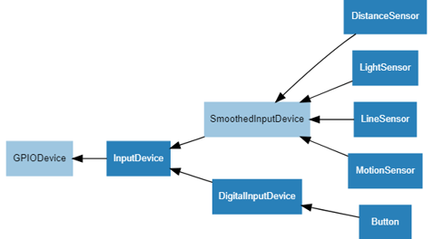

##### 출력 장치 클래스 상속도

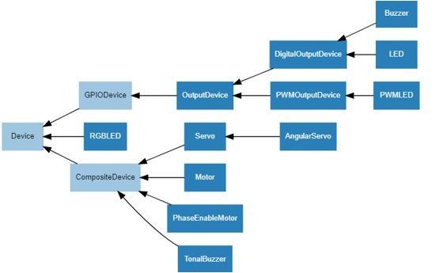

##### 핀번호

- Broadcom (BCM) pin numbering

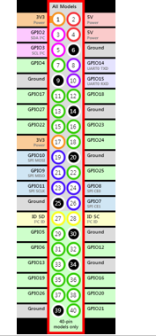

- led.py

  ``` python
  from gpiozero import LED
  from time import sleep
  
  red = LED(17)
  
  while True:
      red.on()
      sleep(1)
      red.off()
      sleep(1)
  ```

  