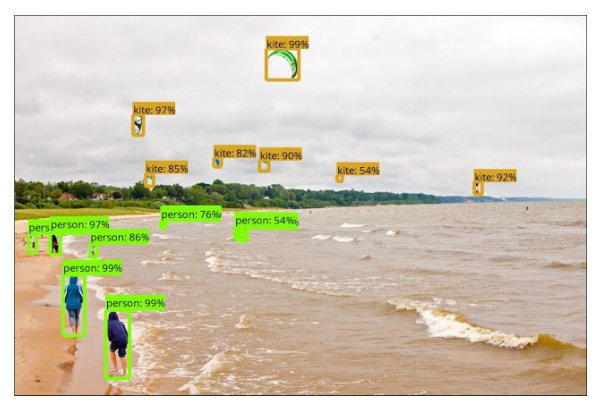

## 2020.10.15 TIL

### Object Detection API (윈도우)

##### 홈페이지

- https://github.com/tensorflow/models/tree/master/research/object_detection
- 

##### 검출 객체 인덱스(data/mscoco_label_map.pbtxt)


##### odapi-ex01.py 사진에서 객체 검출하기

```python
import cv2
import pathlib
from objdetect import ObjDetectApi

PATH_TO_LABELS = 'data/mscoco_label_map.pbtxt'
MODEL_NAME = 'ssd_mobilenet_v1_coco_2017_11_17'
api = ObjDetectApi(MODEL_NAME, PATH_TO_LABELS)

# 예제 데이터
PATH_TO_TEST_IMAGES_DIR = pathlib.Path('test_images')
TEST_IMAGE_PATHS = sorted(list(PATH_TO_TEST_IMAGES_DIR.glob("*.jpg")))

# 검출 진행
for image_path in TEST_IMAGE_PATHS:
    image, output_dict = api.inference_file(image_path)
    print(output_dict)
    labeled_image = api.visualize(image, output_dict)
    labeled_image = cv2.cvtColor(labeled_image, cv2.COLOR_RGB2BGR)
    cv2.imshow('image', labeled_image)
    cv2.waitKey(0)

cv2.destroyAllWindows()
```

##### output_dict 사전 구조

- 키
  - detection_classes: 검출 객체의 mscoco_label_map ID 
  - detection_boxes: 검출 객체의 영역 
  - detection_scores: 검출 객체가 실제 해당 클래스일 점수(확률) 
    - 0.5점(디폴트) 이상의 객체만 비주얼화
  -  num_detections: 검출 가능 객체의 총 개수

```python
{
    'detection_classes': array([18, 18, ..., 47], dtype=int64),
    'detection_boxes': array([
        [3.90827656e-02, 1.92147642e-02, 8.72103572e-01, 3.15773666e-01],
        [1.09515071e-01, 4.02835906e-01, 9.24646258e-01, 9.73048031e-01],
        :
        [0.00000000e+00, 3.58073592e-01, 1.63850799e-01, 5.19781828e-01]],
    dtype=float32),
    'detection_scores': array([ 0.9406898 , 0.9345039 , ... 0.03041759],
    dtype=float32),
    
    'num_detections': 100
}
```

##### odapi-ex02.py 동영상에서 객체 검출

```python
import cv2
from cam import USBCam
from objdetect import ObjDetectApi

PATH_TO_LABELS = 'data/mscoco_label_map.pbtxt'
MODEL_NAME = 'ssd_mobilenet_v1_coco_2017_11_17'

api = ObjDetectApi(MODEL_NAME, PATH_TO_LABELS)

def intrusion_detection(output_dict):
    persons = []
    for ix, obj_ix in enumerate(output_dict['detection_classes']):
        if obj_ix == 1 and output_dict['detection_classes'][ix] >= 0.5:
            persons.append(ix)
    
    return len(persons)

def detect(frame):
    frame_rgb = cv2.cvtColor(frame, cv2.COLOR_BGR2RGB)
    output_dict = api.inference_image(frame_rgb)

    # 침입인지 아닌지 판단...
    if intrusion_detection(output_dict):
        print("침입 발생")
        # 레코딩 시작.
        # 카톡으로 알림 전송 등 후속 처리...

    labeled_image = api.visualize(frame_rgb, output_dict)
    labeled_image = cv2.cvtColor(labeled_image, cv2.COLOR_RGB2BGR)
    cv2.imshow('frame', labeled_image)
    key = cv2.waitKey(1)
    if key == 27: # esc key
        return False
    else:
        return True

cam= USBCam()
cam.run(detect)
```

### Object Detection API (라즈베리파이)

##### Protocol Buf 설치

- 리눅스

  - ```shell
    $ sudo apt-get install protobuf-compiler
    $ protoc --version
    ```

- 나머지 PC와 코드 같음


### Kotlin

##### main 함수

- 코틀린 프로그램 실행의 진입점(entry point)

```kotlin
fun main(args : Array<String>){
    
}
```

##### ex01_first.kt

```kotlin
package basic

fun main(args : Array<String>){
    println("안녕하세요. kotlin입니다")
    // 종결자 없이도 실행가능
}
```

##### 변수 선언


##### ex02_variable.kt

```kotlin
package basic

fun varTest() {
    // 1. 변수의 타입을 미리 정함
    var num : Int // 초기화하지 않아도 됨.
    num = 1

    // 2. 변수의 타입을 정하지 않음
    // 아래는 초기화 반드시 해야함.
    // var number; <-- 에러임
    var number = 2
    // 아래도 에러발생
    // number = "";
    // 즉, 선언과 함께 초기화를 하면 알아서 타입을 정하는 기능정도인 듯.
}
```

##### ex02.1_variable.kt

```kotlin
fun valTest() {
// val은 const와 같은 읽기전용값임.
val num = 1
val name : String
name = ""

// 에러임. 이미 할당한 값을 재할당 못함.
// msg = "저장"

}
fun main(args : Array<String>){
    // 변수를 정의하는 방법은 2가지
    // "var, val" 구분해야함.
    varTest() // R/W 가능변수
    valTest() // ReadOnly 변수
}
```

##### 숫자형 변수

- Double, Float, Long, Int, Short, Byte

##### ex03.01_datatype_number.kt

```kotlin
package basic

fun main(args : Array<String>){
    // 숫자형 DataType 크기 순으로 선언
    var doubleValue : Double = 10.1111
    var floatValue : Float = 10.1f
    var longValue : Long = 10
    var intValue : Int = 10
    var shortValue : Short = 10
    var byteValue : Byte = 10

    println (doubleValue)
    println (floatValue)
    println (intValue)
    
    // 크기변환후, 대입 : 캐스팅
    // to대입할크기() 메소드를 사용한다.
    // ** as로 형변환은 기본형에서는 안된다. **
    doubleValue = intValue.toDouble()
    intValue = doubleValue.toInt()
}
```

##### 문자형 변수(String)


##### ex03.02_datatype_string.kt

```kotlin
package basic

import java.util.*

fun main(args : Array<String>){
    var sName = "문자열 테스트입니다. "
    // 1.문자열을 추가하는 것은 + 연산자로 가능함 <- Java와 동일
    println (sName + " : 문자열 붙이기")
    // 2. """ 이 안에 줄넘김 문자열이 들어갈 수 있다. """
    var sTest = """
    어떻게 출력 될지..
    모르겠지만
    마치 HTML의 <pre>와 비슷할....
    듯
    """
    println(sTest)

    // 3. 문자열 내의 포멧팅 방법
    // linux의 bash와 비슷함.
    var sTest2 = "sName의 값을 가져오는 것: $sName"
    println(sTest2)
    
    // 4. linux bash와 비슷하니
    // ${}안에
    // 함수호출이나 수식처리도 가능함.
    // Date는 자바 객체, 앞에서 import java.util.* 필요
    var sTest3 = "sName의 값을 가져오는 것: ${sName + "움하하하" + Date()}"
    println(sTest3)
    }
```

##### 범위(scope)


##### 함수


##### basicfunction.kt

```kotlin
package basic

// fun 함수명(변수명 : 데이터타입, ...) : 리턴타입 { return; }
fun funByReturn(s: String): Any? {
    return s + "-를 입력받았습니다."
}

fun funByParameter(i: Int, s: String) { // Unit (C언어의 Void)
    println (i.toString() + s)
}

fun funByInline(i: Int, i1: Int) = i * i1 // 1줄 짜리일 때 가능

fun funByNoParam() {
    println ("매개변수 없어요")
}

// 함수를 정의한 변수
val funcVariable = { s : String -> println (s)} // -> : 람다 함수(매개변수 -> 함수)
var funVarByType : (String) -> Any? = ::funByReturn // :: : 메소드가 아닌 일반 함수(전역함수를 말함)
                                                    // C++의 함수 포인터와 같음
                                                    // 매개변수로 리턴타입이 한개이고 리턴타입이 ANY인거
fun main(args : Array<String>){
    funByNoParam()
    funByParameter(3, " 숫자입니다")
    println (funByReturn("3을 넘기니"))
    println(funByInline(3, 10))

    funcVariable ("함수형 변수 1")
    println(funVarByType("함수형 변수 2"))
}
```

##### Any Type

- 동적 타입 운영
- 어떠한 타입의 데이터도 대입 가능

##### any_type.kt

```kotlin
package basic
fun main(args : Array <String>){
    // any는 C에서 void*와 같은 역할을 하는 듯.
    // 어떠한 데이터 형의 변수이던간에 담을 수 있는 크기.
    var anything : Any

    anything = 1
    anything = "문자열"
    anything = 111.01010
    anything = 10.00f

    // is와 !(not) 연산자로 어떤 데이터 형인지 채크가 가능함.
    if(anything !is String) {
        
        if (anything is Float) {
        println("float입니다")
        }
    }
}
```

##### 제어문

- if
  - if()
  - if() {} else {}
  - if() {} else if() {} … else {}
- 반복문
  - for() 
  - while()
- 선택문
  - when() {비교값->{}; 비교값->{}; … }

##### contition.kt

```kotlin
package basic
fun ifExample() {
    // 비교문
    //var a : Any? = "aaaa";
    //var a : Any? = 10.00f;
    //var a : Any? = 8;
    var a : Any? = null;
    if (a == "aaaa"){ // ==를 이용한 값비교
    println ("문자:" + a )

    } else if( a is Float ) { // is를 이용한 형비교
    println ("숫자:" + a)

    } else if (a in (0..9) ){ // in을 이용한 범위비교 (0에서부터 9까지)
    println ("0-9까지 숫자")

    } else if (a == null ){
    println ("null!")
    }
}

fun loopExample() {
    // 반복문 for: in과 (시작..끝)으로 반복가능
    for (i in (0..10)){
    println ("i -> " + i )
    }

    // 반복문 while: while(조건){}
    var i : Int = 0;
    while(i < 10){
    i++; println ("$i 입니다.")
    }
}

fun caseExample() {
    //var obj : Any? = "aaaa";
    var obj : Any? = 10.00f
    //var obj : Any? = 8;
    
    when(obj){
    "aaaa" -> {println ("문자:" + obj )}
    is Float-> {println ("숫자:" + obj)}
    in (0 .. 9) ->{println ("0-10까지 숫자")}
    else ->{println ("???")}
    }
}

fun main(args : Array<String>){
    ifExample()
    loopExample()
    caseExample()
}
```


##### 레이블(함수형 프로그래밍의 필수 요소)


```kotlin
package basic
fun doubleLoop() {
    for(i in 0 .. 2){
        for (j in 0.. 10){
            if (j == 2) break
            println("i->$i, j->$j")
        }
        println("j loop end")
        }
    println("i loop end")
}

// @레이블 지정후, break@레이블로 나감
fun ExitDoubleLoop() {
    HereToExit@ for(i in 0 .. 2){
        for (j in 0.. 10){
            if (j == 5) break@HereToExit;
            println("i->$i, j->$j")
            }
        println("j loop end");
        }
    println("i loop end");
}

// 이름없는 함수(람다식)의 리턴
var lambdaReturn = Exit@{
    if(true){
        return@Exit 3
    }
    1000
}

fun main(args : Array<String>){
    doubleLoop();
    println("=================>")
    ExitDoubleLoop();
    println( lambdaReturn() )
}
```

