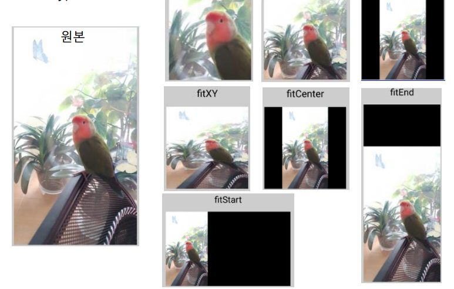
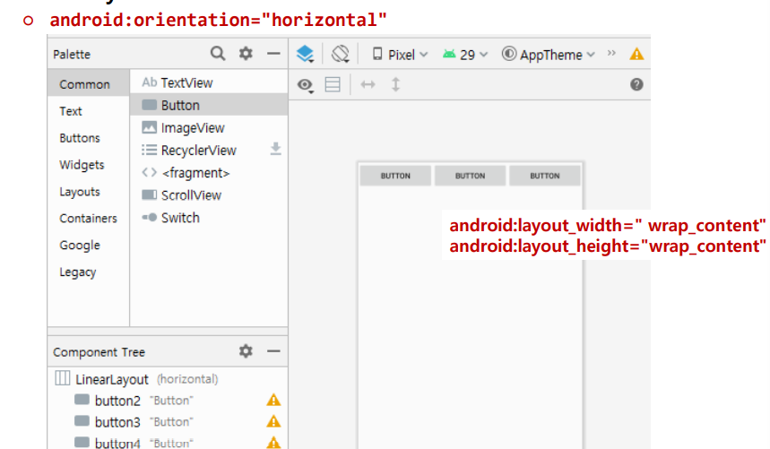

## 2020.10.16 TIL

### Kotlin

##### 컬렉션


- map 메소드


- filter 메소드


##### collections.kt

```kotlin
package basic
fun main(args : Array<String>){
    // 읽기전용- list. 데이터형을 마구 섞어도 된다.
    val lst = listOf(1, "헉", 3.00f, true)
    for (i in 0 .. lst.size- 1){
        println ( lst.get(i).toString() )
    }

    // 수정가능- List. 데이터형을 미리 정해야 하는듯.
    println("__________")
    var lstEditable = mutableListOf<String>()

    // add 메소드로 추가
    lstEditable.add("나는야")
    lstEditable.add("우주의")
    lstEditable.add("판타지")
    lstEditable.add("이박사")

    for(s in lstEditable){
        println(s)
    }

    println("__________")
    // remove 메소드로 삭제
    lstEditable.removeAt(0);
    for(s in lstEditable){
        println(s)
    }
    
    println("__________")
    var m = hashMapOf("고양이" to 1, "강아지" to 2)
    println(m["고양이"])
}
```

##### 예외 처리

##### trycatch.kt

```kotlin
package basic

import java.io.BufferedReader
import java.io.FileReader

fun main(args : Array<String>){
    // try catch를 강제적으로 할 필요가 없다는 말임.
    // 그것보다는 알아서 방어코드를 만들라는 것이 kotlin 철학임.
    try{
        13 / 0
    } catch(e: Exception){
        println(e)
    } finally {
        println("마지막 수행.")
    }

    var zerodivided = 13 / 0;
    println(zerodivided)
}
```

##### Null 처리


##### variable_cull.kt

```kotlin
package basic
    fun main(args : Array<String>){
    // null 채크를 좀 심하게 하는 언어같음.
    // null을 넣는다고 다 들어가지 않음.
    // 변수기본이 null을 대입할 수 없음.
    // 아무래도 null처리로 인한 버그가 많으므로
    // kotlin이라는 언어는 그것을 강하게 제어하겠다는 의지로 보임.
    var number : Int? = 10
    number = null
    // 사용법: data형 끝에 ?를 붙인다.
}
```

### Kotlin 객체지향 프로그래밍

##### class와 상속


- **open이 없는 클래스는 상속할 수 없다**


##### class.kt

```kotlin
package oop

// class passwd(변수명: 데이터형, ..){} 으로 생성자를 만들어쓰기도 한다.
class TestClass{
    var name : String = "";

    // 기본 생성자
    constructor(){
        println("기본생성자");
    }
    // 오버로딩된 생성자
    constructor(name : String ){
        this.name = name;
        println("$name 을 입력받은 생성자");
    }
}

// kotlin에서는 기본적으로 상속이 거부되어 있다.
// 선조클래스를 open으로 지정해야 한다.
open class ParentClass {
        var name : String = this.toString();
        fun getMyName() : String = name;
}

// 상속받을 떄는 선조클래스를 "class passwd : 선조클래스명(생성자인자){}"
// 형식으로 해야 한다.
class ChildClass : ParentClass(){ // ChildClass에는 open이 명시돼있지 않기 때문에 상속 불가능

}

fun main(args : Array<String>){
    var obj1 = TestClass();
    var obj2 = TestClass("파라메터 받음.");

    var obj3 = ParentClass();
    println( obj3.getMyName() );

    var obj4 = ChildClass();
    println( obj4.getMyName() );
}
```

##### overloading, override


##### polymorphism.kt

```kotlin
package oop
open class baseClass{
    // 상속받은 클래스에서 오버라이드하려면 선조클래스에서 open으로 정의.
    open var name = "base";
    open fun func1() = println(this.toString());

    // 외부사용금지 .찍고 메소드 사용못함.
    private fun onlyMyFunc() = println("클래스내부에서만 사용");
    constructor(){
        onlyMyFunc();
    }
}

class childClass : baseClass(){
    override var name = "";
    override fun func1() = println(this.toString() + " 재정의함.");
    fun func2() = println("func2");

    // overloding
    fun func2(s : String ) = println("func2:$s ");
    fun func2(s : String, num : Int ) = println("func2: $s, $num ");
}

fun main(args : Array<String>){
    var obj1 = baseClass();
    obj1.func1();
    
    var obj2 = childClass();
    obj2.func1();
    obj2.func2();
    obj2.func2("문자열 파라메터");
    obj2.func2("문자열 파라메터", 100);
}
```

#####  Interface, abstract, static


##### interface_abstract_static.kt

```kotlin
package oop
interface SimpleInterface{ // SimpleInterface : 타입, 타입의 종류 : 자료형, 클래스, 인터페이스
    fun TestFunc();
}

class SimpleImp : SimpleInterface{ // 구현
    override fun TestFunc() = println ("구현했음");
}

abstract class TestAbstract{
    fun TestFunc() = println("TestFunc");
    abstract fun abstractFunc();
}

class TestAbstractImp : TestAbstract(){ //  상속
    override fun abstractFunc() = println("상속구현했음");

    // companion object {} 안에서 구현해야 static 가능
    companion object { // 내부에서 운영되는 독자적인 객체
    var staticVar = "staticVar";
    fun staticFunc() = println("이거스태틱 함수임");
    }
}

fun main(args : Array<String>){
    // SimpleInterface
    SimpleImp().TestFunc();
    var obj : SimpleInterface;

    // 추상화
    // 아래 코드는 다음과 같이도 가능함
    // TestAbstractImp().apply { TestFunc(); abstractFunc(); }
    var obj2 = TestAbstractImp();
    obj2.TestFunc();
    obj2.abstractFunc();

    // static
    println( TestAbstractImp.staticVar);
    TestAbstractImp.staticFunc() ;
}
```

##### data class


##### dataclass.kt

```kotlin
package oop

class DummyClass{
    var DummyData : String? = null
}

data class BasicInfo(var name : String, var age : Int)
data class DetailInfo(var name : String, var age : Int = 30, var dummy :DummyClass? = null )

fun main(args: Array<String>) {
    var data1 = BasicInfo("김모씨", 30)
    var data2 = DetailInfo(name = "박모씨", dummy = DummyClass().apply{ DummyData = "더미입니다" })

    var (name1, age1) = data1
    println ("$name1 : $age1")

    var (name2, age2, dummy) = data2
    println ("$name2 : ${dummy?.DummyData}")

    // 이 부분이 제일 유용함
    var data3 = data2.copy(name = "회장님")
    println ("${data3.toString()}")
}
```

### 안드로이드

##### Configure Your Project

- Name: UIDesign
- Package name: com.example.uidesign
- Save location: <자신의 위치>
- Language: Kotlin
- Minimum SDK: API 16


##### 레이아웃 관리자

- ConstraintLayout
  - 각 컴포넌트간의 제약조건에 따른 위치 배정
  - 디폴트 레이아웃

- LinearLayout
  - 한쪽 방향 으로만 배치하는 레이아웃
- RelativeLayout
  - 기준 컴포넌트에 대한 상대 위치로 배치
- FrameLayout
  - 겹침이 가능한 레이아웃
- TableLayout
- GridLayout …

##### 뷰 컴포넌트

- 화면에 나타나는 개별 요소 객체
- View 클래스
  - 모든 뷰 컴포넌트의 최상위 부모
- 주요 속성
  - android:id 
    - 뷰 컴포넌트의 ID 
    - 프로그램에서 ID를 이용해 뷰 접근
  - android:layout_width
  - android:layout_height
    - 뷰의 폭과 높이 
    - wrap_content : 내용물의 크기에 맞춤
    -  match_parent : 부모 컴포넌트의 크기에 맞춤
    -  0dp : 허용된 제약조건에 맞춤 ⁃ 절대값 
  - android:text 
    - 출력할 문자열 
- 수정은 GUI에서 또는 code에서 직접 수정

##### TextView의 ID 설정

- TextView 선택 후 id 항목 입력


##### Button

- 클릭할 수 있는 뷰 컴포넌트
- click 이벤트 처리 가능
  - 액티비티에서 click 이벤트를 처리하도록 함


#####  기존 TextVeiw를 삭제하고 Button을 추가


#####  id 배정 및 제약조건 설정


#####  크기 설정, text 속성 설


#####  텍스트 색상, 배경 색상 지정 - color 속성 검색 후 설정


##### TextView 추가


##### TextView 속성 설정

- android:layout_width="0dp"
- android:layout_height="wrap_content"
- android:text="Hello World"
- android:gravity="center"
- android:textSize="38sp

##### 실습: TextView 글자 크기 설정

- android:textAppearance="@style/TextAppearance.AppCompat.Large"


##### EditText

- 글자 입력을 위한 뷰 컴포넌트


- 주요 속성
  -  inputType : 어떤 종류의 글자를 입력할 지 지정
    - email, number, textPassword 등
  - hint
    - 사용자가 입력전에 출력할 문자열 
    - 사용자가 입력시작하면 사라짐
    - html의 placeholder와 동일
  - ems
    - layout_widht가 wrap_content일 경우 글자 입력전이라 크기 결정 못함 
    - 지정한 글자 수의 크기만큼 폭을 가짐
  - maxLength
    - 최대 입력 가능한 문자수
  - lines
    - 화면에 보여줄 라인 수

#####  ImageView

- Component Search에서 검색


#####  ImageView

- drop 하는 순간 연결할 이미지 선택 대화 상자 출력 ImageView


- 이미지 선택 후 설정되는 속성
  - tools:srcCompat="@tools:sample/avatars"
  - 추후 변경 가능
- scaleType 속성
  - ImageView와 실제그림의 크기 차이가 발생할 때 어떻게 보여줄지 결정
    -  그림의 확대/축소/자르기 결정



##### LinearLayout

- 컴포넌트를 한쪽 방향으로만 배치
  - orientation 속성으로 결정
    - horizontal : 가로 방향 
    - vertical: 세로 방향





##### LinearLayout의 자식 뷰 속성

- android:layout_weight
- layout_width 또는 layout_height가 0dp여야 함
- 비율에 맞춰 크기를 결정