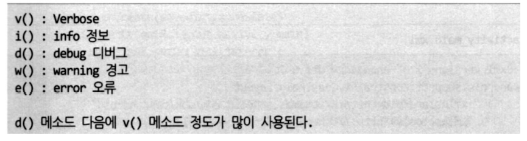

## 2020.10.20.TIL

### Kotlin

##### LinearLayout

- android:layout_weight
- layout_width 또는 layout_height가 0dp여야 함
-  비율에 맞춰 크기를 결정

```xml
<?xml version="1.0" encoding="utf-8"?>
<LinearLayout xmlns:android="http://schemas.android.com/apk/res/android"
    xmlns:app="http://schemas.android.com/apk/res-auto"
    xmlns:tools="http://schemas.android.com/tools"
    android:layout_width="match_parent"
    android:layout_height="match_parent"
    android:orientation="vertical"
    tools:context=".MainActivity">

<LinearLayout
    android:layout_width="match_parent"
    android:layout_height="wrap_content"
    android:orientation="horizontal">
<TextView
    android:layout_width="0dp"
    android:layout_height="wrap_content"
    android:layout_weight="1"
    android:textSize="22sp"
    android:text="이름" />

<EditText
    android:layout_width="0dp"
    android:layout_height="wrap_content"
    android:layout_weight="2"
    android:ems="10"
    android:inputType="textPersonName"
    android:textSize="22sp"/>

</LinearLayout>

<LinearLayout
    android:layout_width="match_parent"
    android:layout_height="wrap_content"
    android:orientation="horizontal">
<TextView
    android:layout_width="0dp"
    android:layout_height="wrap_content"
    android:layout_weight="1"
    android:textSize="22sp"
    android:text="비밀번호" />

<EditText
    android:layout_width="0dp"
    android:layout_height="wrap_content"
    android:layout_weight="2"
    android:ems="10"
    android:inputType="textPassword"
    android:textSize="22sp"/>
</LinearLayout>

<Button
    android:id="@+id/button5"
    android:layout_width="match_parent"
    android:layout_height="wrap_content"
    android:layout_marginTop="50dp"
    android:textSize="22sp"
    android:text="로그인" />
</LinearLayout>
```


##### Gradle 정보


### 프로그램 기본

##### 액티비티에서 뷰 컴포넌트 제어하기

- 뷰에 대한 참조가 필요 (findViewById<뷰클래스>(뷰 ID))
  - 뷰 ID 지정방식
    - R.<리소스유형>.<뷰 ID>
- 뷰의 속성 변경
  - 뷰참조.속성 = 속성값

```kotlin
package com.example.basic_1_unsingxml

import android.graphics.Color
import android.os.Bundle
import android.widget.TextView
import androidx.appcompat.app.AppCompatActivity

class MainActivity : AppCompatActivity() {
    override fun onCreate(savedInstanceState: Bundle?) {
        super.onCreate(savedInstanceState)
        setContentView(R.layout.activity_main)
		// 내가 참고하는 곳에 대해 참조를 얻어야 한다
        var txt = findViewById<TextView>(R.id.txtHello)
        txt.text = "안녕하세요"
        txt.textSize = 32.0F
        txt.setTextColor(Color.parseColor("#FF0000"))
    }
}
```

##### 뷰 id 변수

- findViewById()의 절차 간소화(생략) 

- 뷰 id와 동일한 이름의 변수를 바로 사용

  - 별도의 변수 선언 필요 없음
  - import kotlinx.android.synthetic.main.activity_main.* 필요
  - 해당 변수를 자동완성으로 입력하면 자동으로 import 됨

  


#####  버튼 클릭 이벤트 처리

- View.setOnClickListener(핸들러)로 버튼 클릭 시 실행할 코드 작성
- 자바 스타일

```java
btn1.setOnClickListener(
    View.OnClickListener(){
    // 코드 작성
    }
)
```

- 코틀린 스타일

```kotlin
btn2.setOnClickListener {
    btn2.apply{
    // 코드 작성
    }
}
```

- 핸들러는 이벤트가 발생한 뷰 객체 참조를 매개변수로 가짐
  - it으로 접근 가능

```kotlin
package com.example.basic_1_unsingxml

import android.graphics.Color
import android.os.Bundle
import android.widget.Button
import androidx.appcompat.app.AppCompatActivity

class MainActivity : AppCompatActivity() {
    override fun onCreate(savedInstanceState: Bundle?) {
        super.onCreate(savedInstanceState)
        setContentView(R.layout.activity_main)

        var btn2 = findViewById<Button>(R.id.btn2)
        btn2.setOnClickListener{
            btn2.apply{
                text = "Click"
                setTextColor(Color.parseColor("#333333"))
                setBackgroundColor(Color.parseColor("#FFFF33"))
            }
        }
    }
}
```

##### text클릭

```xml
package com.example.basic_1_textview

import android.graphics.Color
import androidx.appcompat.app.AppCompatActivity
import android.os.Bundle
import android.text.Html
import android.widget.Button
import android.widget.TextView

class MainActivity : AppCompatActivity() {

    var nCount : Int = 0

    override fun onCreate(savedInstanceState: Bundle?) {
        super.onCreate(savedInstanceState)
        setContentView(R.layout.activity_main)

        var txtNormal = findViewById<TextView>(R.id.textNormal)
        txtNormal.setOnClickListener {
            txtNormal.apply {
                setBackgroundColor(Color.RED)
                text = "Clicked!! ${nCount++}"
                setTextColor(Color.WHITE)
                setTextSize(28.0F)
            }
        }

        var txtHTML = findViewById<TextView>(R.id.textHTML)
        txtHTML.setOnClickListener {
            // setOnClickListener는 파라메터로 클릭한 Control인 View 객체를 넘겨준다.
            // 이름을 따로 정의하지 않으면, it으로 되어 있다.
            // it을 TextView로 캐스팅하고 사용할 수 있다.
            val htmlText = it as TextView
            htmlText.text = Html.fromHtml("<h1>Hi</h1>HTML<p style=\"color:red;\">Red</idv>")
            // fromHtml에 가운데줄은 권장하지 않는 메소드라는 뜻
        }
    }
}
```

#### EditText활용

##### res/layout/activity_main.xml

```xml
<?xml version="1.0" encoding="utf-8"?>
<LinearLayout xmlns:android="http://schemas.android.com/apk/res/android"
    xmlns:app="http://schemas.android.com/apk/res-auto"
    xmlns:tools="http://schemas.android.com/tools"
    android:layout_width="match_parent"
    android:layout_height="match_parent"
    android:orientation="vertical"
    tools:context=".MainActivity">

    <LinearLayout
        android:layout_width="match_parent"
        android:layout_height="wrap_content"
        android:orientation="horizontal">

        <TextView
            android:layout_width="0dp"
            android:layout_height="wrap_content"
            android:layout_weight="1"
            android:text="이름"
            android:textSize="22sp" />

        <EditText
            android:id="@+id/edtName"
            android:layout_width="0dp"
            android:layout_height="wrap_content"
            android:layout_weight="2"
            android:ems="10"
            android:inputType="textPersonName"
            android:textSize="22sp" />

    </LinearLayout>

    <LinearLayout
        android:layout_width="match_parent"
        android:layout_height="wrap_content"
        android:orientation="horizontal">

        <TextView
            android:layout_width="0dp"
            android:layout_height="wrap_content"
            android:layout_weight="1"
            android:text="패스워드"
            android:textSize="22sp" />

        <EditText
            android:id="@+id/edt_passWD"
            android:layout_width="0dp"
            android:layout_height="wrap_content"
            android:layout_weight="2"
            android:ems="10"
            android:inputType="textPassword"
            android:textSize="22sp" />

    </LinearLayout>

    <EditText
        android:id="@+id/txtViewPassWd"
        android:layout_width="match_parent"
        android:layout_height="wrap_content"
        android:ems="10"
        android:inputType="textPersonName"
        android:text="" />

    <Button
        android:id="@+id/btn_login"
        android:layout_width="match_parent"
        android:layout_height="wrap_content"
        android:layout_marginTop="50dp"
        android:text="로그인"
        android:textSize="22sp" />
</LinearLayout>
```

##### 이벤트

- 입력 포커스 변경
  - setOnFocusChangeListener()
    - 이벤트를 발생한 뷰 
    - 포커스을 얻었는지(true), 잃었는지 여부(false)

```kotlin
edtName.setOnFocusChangeListener() { v, hasFocus ->
                                    
}
```

- 입력 문자 변경
  - addTextChangedListener()
    - TextWatcher 익명 구현체

```kotlin
edtPassWD.addTextChangedListener(object:TextWatcher{
    override fun afterTextChanged(s: Editable?) {
    }
override fun beforeTextChanged(s: CharSequence?,
    start: Int, count: Int, after: Int) {
    }
override fun onTextChanged(s: CharSequence?,
    start: Int, before: Int, count: Int) {
    }
})
```

##### MainActivity.kt

```kotlin
package com.example.basic_1_edittext

import android.graphics.Color
import androidx.appcompat.app.AppCompatActivity
import android.os.Bundle
import android.text.Editable
import android.text.TextWatcher
import android.widget.EditText
import kotlinx.android.synthetic.main.activity_main.*

class MainActivity : AppCompatActivity() {
    override fun onCreate(savedInstanceState: Bundle?) {
        super.onCreate(savedInstanceState)
        setContentView(R.layout.activity_main)

        edtName.setOnFocusChangeListener { v, hasFocus ->
            val edt = v as EditText // 형 변환 v:View -> EditText로 변환
            var color = if (hasFocus) {
                Color.TRANSPARENT
            } else{
                Color.LTGRAY
            }
            edt.setBackgroundColor(color)
        }

        edt_passWD.addTextChangedListener(object: TextWatcher {
            override fun afterTextChanged(s: Editable?) {

            }

            override fun beforeTextChanged(s: CharSequence?, start: Int, count: Int, after: Int) {

            }

            override fun onTextChanged(s: CharSequence?, start: Int, before: Int, count: Int) {
                txtViewPassWd.text = s
            }
        })

    }
}
```

##### LogCat

- 로그 메시지 출력 객체
- ADB(Android Debuger)에 의한 지원도 가능 
- ADB 명령을 PATH에 추가

##### Log 클래스


1. 로그 출력 메소드
2. 로그를 구분 짓기 위한 태그 문자열
3. 로그로 출력할 문자열



```kotlin
package com.example.basic_2_logcat

import android.nfc.Tag
import androidx.appcompat.app.AppCompatActivity
import android.os.Bundle
import android.util.Log
import kotlinx.android.synthetic.main.activity_main.*
import java.lang.Exception

class MainActivity : AppCompatActivity() {
    val TAG = "MainActivity"
    var nCount : Int = 0
    var nMaxCount : Int = 0
    override fun onCreate(savedInstanceState: Bundle?) {
        super.onCreate(savedInstanceState)
        setContentView(R.layout.activity_main)

        btnLogcatTest.setOnClickListener {
            Log.d(TAG, "${nCount++} clicked")
            try{
                var nResult = nMaxCount / (nMaxCount - nCount)
                Log.d(TAG, "nMaxCount / (nMaxCount - nCount) is ${nResult}")
            } catch (e : Exception){
                Log.e(TAG, "${nCount} : ${e.toString()}")
            }
        }
    }
}
```

##### 계산기

##### activity_main.xml

```xml
<?xml version="1.0" encoding="utf-8"?>
<androidx.constraintlayout.widget.ConstraintLayout xmlns:android="http://schemas.android.com/apk/res/android"
    xmlns:app="http://schemas.android.com/apk/res-auto"
    xmlns:tools="http://schemas.android.com/tools"
    android:layout_width="match_parent"
    android:layout_height="match_parent"
    tools:context=".MainActivity">

    <LinearLayout
        android:layout_width="match_parent"
        android:layout_height="match_parent"
        android:layout_marginStart="8dp"
        android:layout_marginTop="8dp"
        android:layout_marginEnd="8dp"
        android:layout_marginBottom="8dp"
        android:orientation="vertical"
        app:layout_constraintBottom_toBottomOf="parent"
        app:layout_constraintEnd_toEndOf="parent"
        app:layout_constraintStart_toStartOf="parent"
        app:layout_constraintTop_toTopOf="parent">

        <LinearLayout
            android:layout_width="match_parent"
            android:layout_height="259dp"
            android:orientation="horizontal">

            <EditText
                android:id="@+id/firstNumber"
                android:layout_width="115dp"
                android:layout_height="wrap_content"
                android:layout_weight="0"
                android:ems="10"
                android:inputType="number" />

            <Button
                android:id="@+id/btnPlus"
                android:layout_width="wrap_content"
                android:layout_height="wrap_content"
                android:layout_weight="0"
                android:text="+" />

            <Button
                android:id="@+id/btnMinus"
                android:layout_width="wrap_content"
                android:layout_height="wrap_content"
                android:layout_weight="0"
                android:text="-" />

            <EditText
                android:id="@+id/secondNumber"
                android:layout_width="wrap_content"
                android:layout_height="wrap_content"
                android:layout_weight="0"
                android:ems="10"
                android:inputType="number" />

        </LinearLayout>

        <TextView
            android:id="@+id/txtResult"
            android:layout_width="wrap_content"
            android:layout_height="wrap_content"
            android:layout_weight="0"
            android:text="결과값" />

    </LinearLayout>
</androidx.constraintlayout.widget.ConstraintLayout>
```

##### MainActivity.kt

```kotlin
package com.example.basic_2_calculator

import androidx.appcompat.app.AppCompatActivity
import android.os.Bundle
import kotlinx.android.synthetic.main.activity_main.*

class MainActivity : AppCompatActivity() {

    // 빼기 함수(메소드)
    private fun subNumber(i: Int, i1: Int) : Int{
        return i - i1;
    }
    // 더하기 함수(메소드)
    private fun addNumber(i: Int, i1: Int) : Int{
        return i + i1;
    }
    // 함수형 예제를 위한 계산함수
    private fun calculate(pFunc : (Int, Int)->Int,
                          num1 : Int, num2 : Int) : Int {
        return pFunc(num1, num2)
    }

    override fun onCreate(savedInstanceState: Bundle?) {
        super.onCreate(savedInstanceState)
        setContentView(R.layout.activity_main)

        btnPlus.setOnClickListener { // + 버튼을 눌렀을 때(일반적인 스타일)
            // 입력받은 값이 null인지 채크
            if (firstNumber.text == null || secondNumber.text == null) {
                return@setOnClickListener
            }
            // 입력받은 값이 ""인지 채크
            if (firstNumber.text.length == 0 || secondNumber.text.length == 0) {
                return@setOnClickListener
            }
            // 숫자값을 가져오기
            var first = firstNumber.text.toString()
            var second = secondNumber.text.toString()

            // 문자열을 숫자로 변형하는 방법 : toInt()
            var result = addNumber(first.toInt(), second.toInt())
            txtResult.setText("$result")
        }

        // - 버튼을 눌렀을 때(함수형 프로그래밍 스타일)
        btnMinus.setOnClickListener {

            // 입력받은 값을 검증
            val lstCheck = listOf(firstNumber, secondNumber)
            lstCheck
                .map { if (it == null) return@setOnClickListener else it }
                .map { if (it.text.length < 1) return@setOnClickListener else it}

            // 숫자값을 가져오기
            val lstNumber = lstCheck.map { it.text.toString().toInt() }
            lstNumber.let{
                calculate(::subNumber, it.get(0), it.get(1))
                    .let{ txtResult.text = "${it}"}
            }
        }
    }
}
```

### Activity

##### Activity Life Cycle 메서드

- Activity가 생성되서 운영되고, 종료될 때 까지 각 상태 변경시 호출되는 콜백 메서드


- 주요 메소드


##### MainActivity.kt

```kotlin
package com.example.basic_2_activitylife

import androidx.appcompat.app.AppCompatActivity
import android.os.Bundle
import android.util.Log
import android.view.ActionMode

class MainActivity : AppCompatActivity() {
    var nLineNumber = 0

    override fun onCreate(savedInstanceState: Bundle?) {
        super.onCreate(savedInstanceState)
        setContentView(R.layout.activity_main)
        Log.d("ALLTEST","${nLineNumber++} onCreate")
    }

    override fun onStart() {
        super.onStart()
        Log.d("ALLTEST","${nLineNumber++} onStart")
    }

    override fun onResume() {
        super.onResume()
        Log.d("ALLTEST","${nLineNumber++} onResume")
    }

    override fun onStop() {
        super.onStop()
        Log.d("ALLTEST","${nLineNumber++} onStop")
    }

    override fun onDestroy() {
        super.onDestroy()
        Log.d("ALLTEST","${nLineNumber++} onDestroy")
    }

}
```

#####  Intent 객체

- 사용자의 의도를 안드로이드 시스템에 알리는 용도
-  컴포넌트간 정보 전달을 위해 사용

##### 안드로이드 Component

- 사용자 정의 컴포넌트는 반드시 AndroidManifest.xml에 등록해야 함


##### Component 간의 Intent를 이용한 정보 전달


#####  요소별 Intent 전송 방법

- startActivity()
- sendBroadCast()
- startService()

#####  Intent로 호출된 컴포넌트에서 전달된 Intent 얻기

- getIntent()

#####  안드로이드 시스템이 기본 제공하는 Activity 호출

- 전화걸기 
- 웹 
- 문자보내기 
- 주소록 보기 등

- startActivity(action, uri) 
  - action ⁃ Intent.ACTION_SENDTO 
  - Intent.ACTION_VIEW

##### Intent로 정보 전달하기


##### activity_main.xml

```xml
<?xml version="1.0" encoding="utf-8"?>
<androidx.constraintlayout.widget.ConstraintLayout xmlns:android="http://schemas.android.com/apk/res/android"
    xmlns:app="http://schemas.android.com/apk/res-auto"
    xmlns:tools="http://schemas.android.com/tools"
    android:layout_width="match_parent"
    android:layout_height="match_parent"
    tools:context=".MainActivity">

    <LinearLayout
        android:layout_width="match_parent"
        android:layout_height="match_parent"
        android:layout_marginStart="8dp"
        android:layout_marginTop="8dp"
        android:layout_marginEnd="8dp"
        android:layout_marginBottom="8dp"
        android:orientation="vertical"
        app:layout_constraintBottom_toBottomOf="parent"
        app:layout_constraintEnd_toEndOf="parent"
        app:layout_constraintStart_toStartOf="parent"
        app:layout_constraintTop_toTopOf="parent">

        <Button
            android:id="@+id/btnSMS"
            android:layout_width="match_parent"
            android:layout_height="wrap_content"
            android:text="SMS 보내기" />

        <Button
            android:id="@+id/btnInternet"
            android:layout_width="match_parent"
            android:layout_height="wrap_content"
            android:text="인터넷이동" />

        <Button
            android:id="@+id/btnMap"
            android:layout_width="match_parent"
            android:layout_height="wrap_content"
            android:text="MAP 연동" />

        <Button
            android:id="@+id/btnMarket"
            android:layout_width="match_parent"
            android:layout_height="wrap_content"
            android:text="구글마켓 연동" />
    </LinearLayout>
</androidx.constraintlayout.widget.ConstraintLayout>
```

##### MainActivity.kt

```kotlin
package com.example.basic_3_usingintent

import android.content.Intent
import android.net.Uri
import androidx.appcompat.app.AppCompatActivity
import android.os.Bundle
import kotlinx.android.synthetic.main.activity_main.*

class MainActivity : AppCompatActivity() {
    override fun onCreate(savedInstanceState: Bundle?) {
        super.onCreate(savedInstanceState)
        setContentView(R.layout.activity_main)

        setUpUI()
    }
    private fun setUpUI() {

        btnSMS.setOnClickListener {
            // SMS 보내기
            val uri = Uri.parse("smsto:" + "01011112222")
            val intent = Intent(Intent.ACTION_SENDTO, uri)
            intent.putExtra("sms_body", "여기가 문자!!")
            startActivity(intent)
        }

        btnInternet.setOnClickListener{ // 인터넷이동
            //val intent = Intent(Intent.ACTION_DIAL, Uri.parse("tel:" + 114))
            //startActivity(intent)
            val uri = Uri.parse("http://vintageappmaker.tumblr.com/")
            val intent = Intent(Intent.ACTION_VIEW, uri)
            startActivity(intent)
        }
        btnMap.setOnClickListener{ // 지도이동
            val uri = Uri.parse("geo: 37.5310091, 127.0261659")
            val intent = Intent(Intent.ACTION_VIEW, uri)
            startActivity(intent)
        }
        btnMarket.setOnClickListener{ // 마켓으로 이동하기
            val uri = Uri.parse("market://details?id=com.psw.moringcall")
            val intent = Intent(Intent.ACTION_VIEW, uri)
            startActivity(intent)
        }

    }
}
```

##### 새로운 Activity 추가

- 패키지 >> New > Activity > Empty Activity

##### Activity 호출

- Intent 객체

  - 사용자의 의도를 안드로이드 시스템에 알리는 용도 
  - Activity 호출에 사용
    - 어떤 액티비에서 어떤 액티비티를 호출한다는 정보를 표현 
    - Intent(호출하는 액티비티 참조, 호출할 액티비티 클래스 정보)
  - startActivity()를 이용해 안드로이드 시스템에 전달

  ```kotlin
  val intent = Intent(this, Main2Activity::class.java)
  startActivity(intent)
  ```

```kotlin
package com.example.basic_3_addactivity

import android.content.Intent
import androidx.appcompat.app.AppCompatActivity
import android.os.Bundle
import kotlinx.android.synthetic.main.activity_main.*

class MainActivity : AppCompatActivity() {
    override fun onCreate(savedInstanceState: Bundle?) {
        super.onCreate(savedInstanceState)
        setContentView(R.layout.activity_main)

        btnOK.setOnClickListener {
            val i = Intent(this, MainActivity2::class.java)
            startActivity(i)
        }
    }
}
```

##### 다른 Activity에 값 전달하는 경우

- Activity1 -> Acitivty2
  - 매개변수에 해당
- Activity1<- Acitivty2
  - 리턴값에 해당
  - startActivityForResult()로 호출해야 함
  - onActivityResult()에서 리턴값 처리


##### MainActivity.kt

```kotlin
package com.example.basic_3_intentwithdata

import android.content.Intent
import android.graphics.Color
import androidx.appcompat.app.AppCompatActivity
import android.os.Bundle
import android.text.Editable
import android.text.TextWatcher
import android.widget.EditText
import kotlinx.android.synthetic.main.activity_main.*

class MainActivity : AppCompatActivity() {

    companion object{ // 어떤 호출인지 상수로 정의
        val REQUEST = 0
        val ID = "ID"
        val PASSWD = "PASSWD"
        val RESULT = "RESULT"
    }

    override fun onCreate(savedInstanceState: Bundle?) {
        super.onCreate(savedInstanceState)
        setContentView(R.layout.activity_main)

        btnLogin.setOnClickListener {
            val i = Intent(this, ResultActivity::class.java)
            i.putExtra(ID, edtId.text.toString())
            i.putExtra(PASSWD, edtPassWD.text.toString())
            startActivityForResult(i, REQUEST)
        }
    } // end of onCreate
    // 호출한 Activity에서 결과값을 받을 때,
    override fun onActivityResult(requestCode: Int, resultCode: Int,
                                  data: Intent?) {
        if(requestCode != REQUEST) return
        data?.getStringExtra(RESULT).let{
            txtMessage.text = it
        }
        super.onActivityResult(requestCode, resultCode, data)
    }
}
```

##### ResultActivity.kt

```kotlin
package com.example.basic_3_intentwithdata

import androidx.appcompat.app.AppCompatActivity
import android.os.Bundle
import kotlinx.android.synthetic.main.activity_result.*

class ResultActivity : AppCompatActivity() {
    override fun onCreate(savedInstanceState: Bundle?) {
        super.onCreate(savedInstanceState)
        setContentView(R.layout.activity_result)
    }

    override fun onStart() {
        super.onStart()
        // 값이 없으면 리턴
        val i = intent ?: return // 호출에 사용된 Intent
        val sID = i.getStringExtra(MainActivity.ID)
        val sPasswd = i.getStringExtra(MainActivity.PASSWD)
        txtMessage2.text = "아이디: ${sID}\n패스워드: ${sPasswd}"
        i.putExtra(MainActivity.RESULT, txtMessage2.text.toString())
        setResult(MainActivity.REQUEST, i)
    }

}
```

