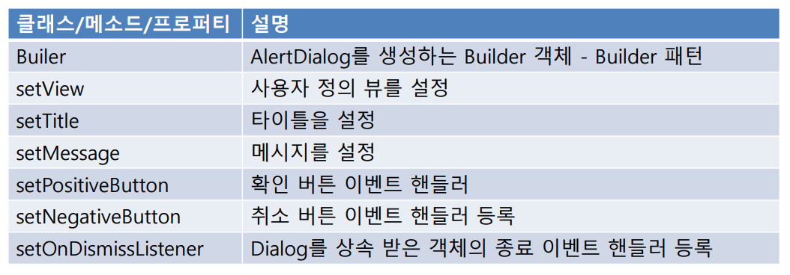

## 2020.10.22 TIL

### Dialog

##### Dialog 만드는 법

- AlertDialog 활용
  - 단순 메시지 출력
- Dialog 상속 받아 정의
  - 커스텀 레이아웃을 사용하여 화면 구성



#####  res/layout/activity_main.xml

```xml
<?xml version="1.0" encoding="utf-8"?>
<androidx.constraintlayout.widget.ConstraintLayout
    xmlns:android="http://schemas.android.com/apk/res/android"
    xmlns:tools="http://schemas.android.com/tools"
    xmlns:app="http://schemas.android.com/apk/res-auto"
    android:layout_width="match_parent"
    android:layout_height="match_parent"
    tools:context=".MainActivity">

    <Button
        android:id="@+id/btnAlert"
        android:layout_width="wrap_content"
        android:layout_height="wrap_content"
        android:layout_marginStart="8dp"
        android:layout_marginTop="32dp"
        android:text="Alert Dialog"
        app:layout_constraintStart_toStartOf="parent"
        app:layout_constraintTop_toTopOf="parent" />

    <Button
        android:id="@+id/btnCustom"
        android:layout_width="wrap_content"
        android:layout_height="wrap_content"
        android:layout_marginStart="84dp"
        android:layout_marginTop="32dp"
        android:layout_marginEnd="86dp"
        android:text="Custom Dialog"
        app:layout_constraintEnd_toEndOf="parent"
        app:layout_constraintStart_toEndOf="@+id/btnAlert"
        app:layout_constraintTop_toTopOf="parent" />
</androidx.constraintlayout.widget.ConstraintLayout>
```

##### MainAcivity.kt

```kotlin
package com.example.basic_3_dialog

import androidx.appcompat.app.AppCompatActivity
import android.os.Bundle
import android.text.InputType
import android.widget.EditText
import androidx.appcompat.app.AlertDialog
import kotlinx.android.synthetic.main.activity_main.*
import org.jetbrains.anko.alert
import org.jetbrains.anko.noButton
import org.jetbrains.anko.toast
import org.jetbrains.anko.yesButton

class MainActivity : AppCompatActivity() {
    private fun simpleAlertDialog() {
        val builder = AlertDialog.Builder(this)

        builder.setTitle("타이틀입니다")

        val input = EditText(this)
        input.inputType = InputType.TYPE_CLASS_TEXT
        builder.setView(input)
        builder.setIcon(R.mipmap.ic_launcher_round)

        builder.setMessage("메시지입니다")

        builder.setPositiveButton("OK", { dialog, which -> title = input.text.toString() })

        builder.setNegativeButton("Cancel", { dialog, which -> dialog.cancel()} )
        
        builder.setCancelable(false) // 뒤로가기 버튼을 해도 안닫힘

        // builder.show()
        
        val dialog = builder.create()
        dialog.setCanceledOnTouchOutside(false)
        dialog.show()
    }


    override fun onCreate(savedInstanceState: Bundle?) {
        super.onCreate(savedInstanceState)
        setContentView(R.layout.activity_main)

        btnAlert.setOnClickListener {
            simpleAlertDialog()
        }

    }
}
```

##### Anko를 이용한 AlertDialog

##### MainActivity.kt

```kotlin
package com.example.basic_3_dialog

import androidx.appcompat.app.AppCompatActivity
import android.os.Bundle
import android.text.InputType
import android.widget.EditText
import androidx.appcompat.app.AlertDialog
import kotlinx.android.synthetic.main.activity_main.*
import org.jetbrains.anko.alert
import org.jetbrains.anko.noButton
import org.jetbrains.anko.toast
import org.jetbrains.anko.yesButton

class MainActivity : AppCompatActivity() {

    private fun ankoAlertDialog(){
        alert("타이틀입니다.", "메시지입니다.") {
            yesButton { toast("Oh…") }
            noButton {}
        }.show()
    }

    override fun onCreate(savedInstanceState: Bundle?) {
        super.onCreate(savedInstanceState)
        setContentView(R.layout.activity_main)

        btnAlert.setOnClickListener {

            ankoAlertDialog()
        }

    }
}
```


#####  사용자 정의 Dialog

- 레이아웃 정의
- Dialog 클래스를 상속

##### dialog_my.xml

```xml
<?xml version="1.0" encoding="utf-8"?>
<androidx.constraintlayout.widget.ConstraintLayout
    xmlns:android="http://schemas.android.com/apk/res/android"
    xmlns:app="http://schemas.android.com/apk/res-auto"
    xmlns:tools="http://schemas.android.com/tools"
    android:layout_width="match_parent"
    android:layout_height="match_parent">

    <CalendarView
        android:id="@+id/calendarView"
        android:layout_width="wrap_content"
        android:layout_height="wrap_content"
        android:layout_marginStart="8dp"
        android:layout_marginTop="8dp"
        android:layout_marginEnd="8dp"
        android:layout_marginBottom="8dp"
        app:layout_constraintBottom_toBottomOf="parent"
        app:layout_constraintEnd_toEndOf="parent"
        app:layout_constraintHorizontal_bias="0.6"
        app:layout_constraintStart_toStartOf="parent"
        app:layout_constraintTop_toTopOf="parent"
        app:layout_constraintVertical_bias="0.203" />

    <TextView
        android:id="@+id/txtSelectDate"
        android:layout_width="wrap_content"
        android:layout_height="wrap_content"
        android:layout_marginStart="50dp"
        android:layout_marginTop="25dp"
        android:layout_marginEnd="51dp"
        android:text="TextView"
        app:layout_constraintEnd_toStartOf="@+id/btnCancel"
        app:layout_constraintStart_toStartOf="parent"
        app:layout_constraintTop_toBottomOf="@+id/calendarView" />

    <Button
        android:id="@+id/btnCancel"
        android:layout_width="wrap_content"
        android:layout_height="wrap_content"
        android:layout_marginStart="10dp"
        android:layout_marginTop="16dp"
        android:text="CANCEL"
        app:layout_constraintEnd_toStartOf="@+id/btnOk"
        app:layout_constraintStart_toEndOf="@+id/txtSelectDate"
        app:layout_constraintTop_toBottomOf="@+id/calendarView" />

    <Button
        android:id="@+id/btnOk"
        android:layout_width="wrap_content"
        android:layout_height="wrap_content"
        android:layout_marginStart="3dp"
        android:layout_marginTop="16dp"
        android:layout_marginEnd="59dp"
        android:text="OK"
        app:layout_constraintEnd_toEndOf="parent"
        app:layout_constraintStart_toEndOf="@+id/btnCancel"
        app:layout_constraintTop_toBottomOf="@+id/calendarView" />

</androidx.constraintlayout.widget.ConstraintLayout>
```

##### MyDialog.kt

```kotlin
package com.example.basic_3_dialog

import android.app.Dialog
import android.content.Context
import android.os.Bundle
import kotlinx.android.synthetic.main.dialog_my.*

class MyDialog(ctx : Context) : Dialog( ctx ) {
    open var dayString = ""
    override fun onCreate(savedInstanceState: Bundle?) {
        super.onCreate(savedInstanceState)
        setContentView(R.layout.dialog_my)

        // 캘린터 Control의 일정이 바뀔 경우
        // 발생하는 이벤트핸들러 등록 및 구현
        calendarView.setOnDateChangeListener { view, year, month, dayOfMonth ->
            dayString = "${year}-${month + 1}-${dayOfMonth} " // 월이 0월부터 시작한다.
            // 월에 +1 해주자!
            txtSelectDate.text = dayString
        }

        btnOk.setOnClickListener{
            dismiss() // 다이얼로그 닫기
        }
        btnCancel.setOnClickListener {
            dayString = ""
            dismiss()
        }
    }
}
```

##### MainActivity.kt

```kotlin
package com.example.basic_3_dialog

import androidx.appcompat.app.AppCompatActivity
import android.os.Bundle
import android.text.InputType
import android.widget.EditText
import android.widget.Toast
import androidx.appcompat.app.AlertDialog
import kotlinx.android.synthetic.main.activity_main.*
import org.jetbrains.anko.*

class MainActivity : AppCompatActivity() {
    override fun onCreate(savedInstanceState: Bundle?) {
        super.onCreate(savedInstanceState)
        setContentView(R.layout.activity_main)

        btnAlert.setOnClickListener {
            simpleAlertDialog()
            // ankoAlertDialog()
        }

        btnCustom.setOnClickListener {
            val dlg = MyDialog(this)
            dlg.setOnDismissListener {
                Toast.makeText(this, "${dlg.dayString}입니다.",
                    Toast.LENGTH_LONG).show()
                // 위 두줄 없이 아래처럼도 운용 가능
                // LongToast("${dlg.dayString}입니다.")
            }
            dlg.show()
        }
    }

    private fun ankoAlertDialog() {
        alert("타이틀입니다.", "메시지입니다.") {
            yesButton { toast("Oh...")}
            noButton {}
        }.show()
    }

    private fun simpleAlertDialog() {
        val builder = AlertDialog.Builder(this)  // context(컨택스트)

        builder.setTitle("타이틀입니다")

        val input = EditText(this)
        input.inputType = InputType.TYPE_CLASS_TEXT
        builder.setView(input)
        // builder.setIcon(R.mipmap.ic_launcher_round)

        builder.setMessage("메시지입니다")

        builder.setPositiveButton("OK", { dialog, which -> title = input.text.toString() })
        // 앱의 타이틀을 바꿔준다.

        builder.setNegativeButton("Cancel") {
                dialog, which -> dialog.cancel()
        } // 마지막 매개변수가 람다 함수면 괄호 바깥으로 빼는게 권장 사항

        // builder.show()

        builder.setCancelable(false)  // 뒤로가기 버튼을 터치해도 안닫힘

        val dialog = builder.create()
        dialog.setCanceledOnTouchOutside(false)  // 영역 밖에서 터치해도 사라지지 않음
        dialog.show()
    }
}
```

### MyWebBrowser

##### activity_main.xml

```xml
<?xml version="1.0" encoding="utf-8"?>
<androidx.coordinatorlayout.widget.CoordinatorLayout xmlns:android="http://schemas.android.com/apk/res/android"
    xmlns:app="http://schemas.android.com/apk/res-auto"
    xmlns:tools="http://schemas.android.com/tools"
    android:layout_width="match_parent"
    android:layout_height="match_parent"
    tools:context=".MainActivity">

    <com.google.android.material.appbar.AppBarLayout
        android:layout_width="match_parent"
        android:layout_height="wrap_content"
        android:theme="@style/Theme.MyWebBrowser.AppBarOverlay">

        <androidx.appcompat.widget.Toolbar
            android:id="@+id/toolbar"
            android:layout_width="match_parent"
            android:layout_height="?attr/actionBarSize"
            android:background="?attr/colorPrimary"
            app:popupTheme="@style/Theme.MyWebBrowser.PopupOverlay" />

    </com.google.android.material.appbar.AppBarLayout>

    <include layout="@layout/content_main" />

</androidx.coordinatorlayout.widget.CoordinatorLayout>
```

##### content_main.xml

```xml
<?xml version="1.0" encoding="utf-8"?>
<androidx.constraintlayout.widget.ConstraintLayout xmlns:android="http://schemas.android.com/apk/res/android"
    xmlns:app="http://schemas.android.com/apk/res-auto"
    xmlns:tools="http://schemas.android.com/tools"
    android:layout_width="match_parent"
    android:layout_height="match_parent"
    app:layout_behavior="@string/appbar_scrolling_view_behavior">


    <EditText
        android:id="@+id/urlEditText"
        android:layout_width="0dp"
        android:layout_height="wrap_content"
        android:layout_marginStart="8dp"
        android:layout_marginTop="8dp"
        android:layout_marginEnd="8dp"
        android:ems="10"
        android:imeOptions="actionSearch"
        android:inputType="textUri|textPersonName"
        android:text="http://"
        app:layout_constraintEnd_toEndOf="parent"
        app:layout_constraintStart_toStartOf="parent"
        app:layout_constraintTop_toTopOf="parent" />

    <WebView
        android:id="@+id/webView"
        android:layout_width="0dp"
        android:layout_height="0dp"
        app:layout_constraintEnd_toEndOf="parent"
        app:layout_constraintStart_toStartOf="parent"
        app:layout_constraintBottom_toBottomOf="parent"
        android:layout_marginTop="8dp"
        app:layout_constraintTop_toBottomOf="@+id/urlEditText"
        android:layout_marginBottom="8dp"
        android:layout_marginLeft="8dp"
        android:layout_marginStart="8dp"
        android:layout_marginRight="8dp"
        android:layout_marginEnd="8dp" />
</androidx.constraintlayout.widget.ConstraintLayout>
```

##### menu_main.xml

```xml
<menu xmlns:android="http://schemas.android.com/apk/res/android"
    xmlns:app="http://schemas.android.com/apk/res-auto"
    xmlns:tools="http://schemas.android.com/tools"
    tools:context="com.example.mywebbrowser.MainActivity">
    <item android:title="검색 사이트" >
        <menu >
            <item
                android:id="@+id/action_naver"
                android:title="naver" />
            <item
                android:id="@+id/action_google"
                android:title="구글" />
            <item
                android:id="@+id/action_daum"
                android:title="다음" />
        </menu>
    </item>
    <item android:title="개발자 정보" >
        <menu >
            <item
                android:id="@+id/action_call"
                android:title="연락처" />
            <item
                android:id="@+id/action_send_text"
                android:title="문자 보내기" />
            <item
                android:id="@+id/action_email"
                android:title="이메일 보내기" />
        </menu>
    </item>
    <item
        android:id="@+id/action_home"
        android:icon="@drawable/ic_baseline_home_24"
        android:title="Home"
        app:showAsAction="ifRoom|withText" />
</menu>
```

##### menu_context.xml

```xml
<?xml version="1.0" encoding="utf-8"?>
<menu xmlns:android="http://schemas.android.com/apk/res/android">
    <item
        android:id="@+id/action_share"
        android:title="페이지 공유" />
    <item
        android:id="@+id/action_browser"
        android:title="기본 브라우저에서 열기" />
</menu>
```

##### MainActivity.kt

```kotlin
package com.example.mywebbrowser

import android.content.Intent
import android.net.Uri
import android.os.Bundle
import android.util.Log
import android.view.ContextMenu
import com.google.android.material.floatingactionbutton.FloatingActionButton
import com.google.android.material.snackbar.Snackbar
import androidx.appcompat.app.AppCompatActivity
import android.view.Menu
import android.view.MenuItem
import android.view.View
import android.view.inputmethod.EditorInfo
import android.webkit.WebViewClient
import kotlinx.android.synthetic.main.content_main.*
import org.jetbrains.anko.*
import kotlin.concurrent.timer

class MainActivity : AppCompatActivity() {

    override fun onCreate(savedInstanceState: Bundle?) {
        super.onCreate(savedInstanceState)
        setContentView(R.layout.activity_main)
        setSupportActionBar(findViewById(R.id.toolbar))

        // 컨텍스트 메뉴 등록
        registerForContextMenu(webView)

        // 웹뷰 기본 설정
        webView.apply { // this는 webView
            settings.javaScriptEnabled = true
            webViewClient = WebViewClient()
        }
        webView.loadUrl("http://www.google.com")

        urlEditText.setOnEditorActionListener { _, actionId, _ ->
            if (actionId == EditorInfo.IME_ACTION_SEARCH) {
                webView.loadUrl(urlEditText.text.toString())
                true // 람다 함수라 return값이 없다
            } else {
                false
            }
        }

    }

    var backCount = 0 // 뒤로가기 버튼 연속 클릭 횟수
    var counter = 0 // 타이머 함수 실행 횟수

    // 백 버튼 처리
    override fun onBackPressed() {
        if (webView.canGoBack()) {
            webView.goBack()
        } else {
            backCount++
            if (backCount == 1) {
                toast("종료하려면 한번 더 뒤로가기를 누르세요")
                timer(period = 3000) {
                    Log.e("--------------------", "---------------")
                    if (counter == 1) {
                        backCount = 0
                        counter = 0
                        cancel()
                    } else {
                        counter++
                    }
                }
            } else if (backCount == 2)
                super.onBackPressed()
        }
    }


    override fun onCreateOptionsMenu(menu: Menu): Boolean {
        // Inflate the menu; this adds items to the action bar if it is present.
        menuInflater.inflate(R.menu.menu_main, menu)
        return true
    }

    override fun onOptionsItemSelected(item: MenuItem): Boolean {
        // Handle action bar item clicks here. The action bar will
        // automatically handle clicks on the Home/Up button, so long
        // as you specify a parent activity in AndroidManifest.xml.
        when (item?.itemId) {
            R.id.action_google, R.id.action_home -> {
                webView.loadUrl("http://www.google.com")
                return true
            }
            R.id.action_naver -> {
                webView.loadUrl("http://www.naver.com")
                return true
            }
            R.id.action_daum -> {
                webView.loadUrl("http://www.daum.net")
                return true
            }
            R.id.action_call -> {
                val intent = Intent(Intent.ACTION_DIAL)
                intent.data = Uri.parse("tel:031-123-4567")
                if (intent.resolveActivity(packageManager) != null) {
                    startActivity(intent)
                }
                return true
            }
            R.id.action_send_text -> {
                webView.url?.let { sendSMS("031-123-4567", it) }
                return true
            }
            R.id.action_email -> {
                webView.url?.let { email("test@example.com", it) }
                return true
            }
        }
        return super.onOptionsItemSelected(item)

    }
    // 컨텍스트 메뉴 작성
    override fun onCreateContextMenu(menu: ContextMenu?, v: View?,
                                     menuInfo: ContextMenu.ContextMenuInfo?) {
        super.onCreateContextMenu(menu, v, menuInfo)
        menuInflater.inflate(R.menu.menu_context, menu)
    }

    override fun onContextItemSelected(item: MenuItem): Boolean {
        when(item.itemId){
            R.id.action_share -> webView.url?.let { share(it) }
            R.id.action_browser -> webView.url?.let { share(it) }
        }
        return super.onContextItemSelected(item)
    }
}
```