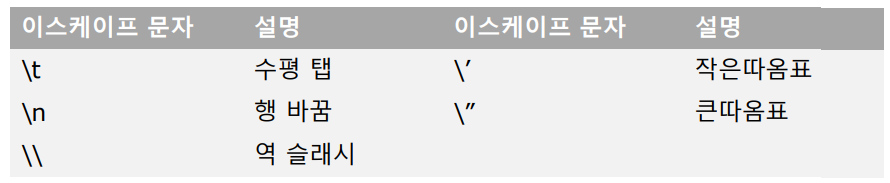
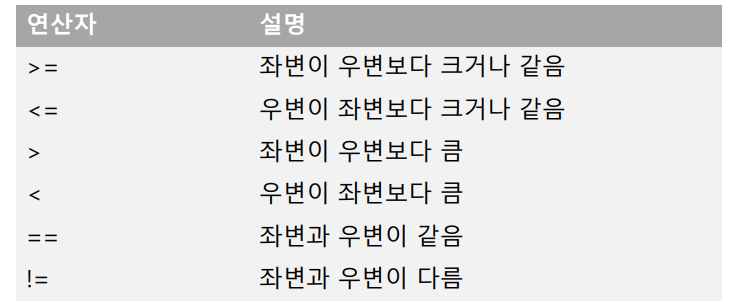
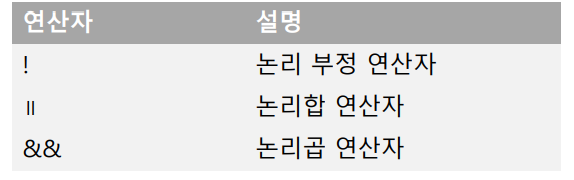
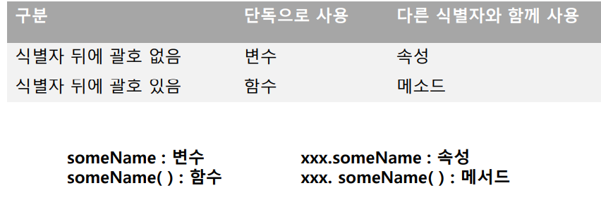
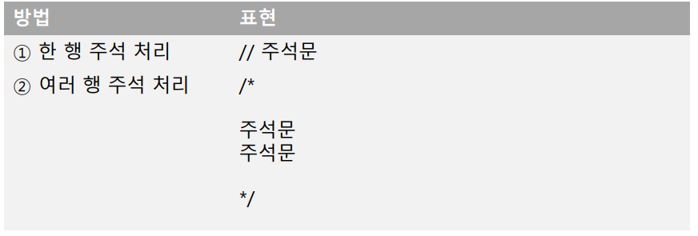

## 2021.02.02 TIL

### JavaScript

##### 데이터 타입

- 문자열
  - 문자의 집합
- 문자열  생성 방법
  - 큰따옴표 안에 문자를 넣는 방법
  - 작은 따옴표 안에 문자를 넣는 방법(추천)
  - 문자열 안에 따옴표를 넣는 경우
    - 서로 다른 따옴표로 문자열을 감싸줌
- 이스케이프 문자
  - 특수 기능 수행



- ##### 문자열은 문자열 연결 연산자를 사용하여 합칠 수 있음


```javascript
console.log("토끼\n거북이");
console.log("아주 엄청나게 긴 문자열을 한 행에 입력할 때는 \
백슬레시를 행 끝에 붙이고 다음 줄로 내려 쓸 수 있습니다.");
console.log(`아주 엄청나게 긴 문자열을 한 행에 입력할 때는
백슬레시를 행 끝에 붙이고 다음 줄로 내려 쓸 수 있습니다.`);
```

- 불리언

  - 결과를 참과 거짓으로 표현할 때 사용

  

  - 문자열도 비교 가능
    - 국어 사전의 앞쪽에 위치할수록 값이 작음

- 논리 연산자



```javascript
var a = 3;

if (a == 3){
    console.log("a는 3입니다.");
} else {
    console.log("a는 3이 아닙니다.");
}
```

##### 변수

- 값을 저장할 때 사용하는 식별자
- 숫자뿐만 아니라 모든 자료형 저장 가능


- 변수의 사용과정

  - 변수 선언 (var 키워드 사용)
    - var a;
  - 변수 초기화 (처음 값을 할당)
    - var a  = 12;
  - 연속 선언
    - var a, b = 3, c;

  ```javascript
  var a = 12;
  var b = "korea";
  console.log("a = " + a);
  console.log("b = " + b);
  ```

- 선언 없이 사용하기

```javascript
a = 12;
b = "korean";
```

- ##### 선언 없이 사용한 변수는 전역 변수가 됨

- 동적 타입

  - 변수의 타입은 언제든지 변경 가능

- 엄격 모드 설정

  - "use strict"
    - 변수를 선언하지 않고 사용할 수 없다.
    - 일반 함수에서 this는 전역 객체가 아닌 undefined가 된다.
    - eval() 안에서 변수나 함수를 선언할 수 없다.
    - with문을 사용할 수 없다.
    - 함수의 arguments 객체는 인수의 정적 사본이다.
    - 같은 이름으로 함수, 멤버, 인수를 중복 정의하면 에러 처리된다.
    - 8진수 리터럴을 허용하지 않는다.
    - public, interface 등 확장을 위한 예약어가 키워드로 인정된다.
    - 읽기 전용, 확장 불가, 삭제 불가 속성을 잘못 건드릴 경우 에러 처리한다.

  ```javascript
  "use strict";
  a = 1234;
  console.log("a = " + a);
  ```

  ```javascript
  a = 12;
  console.log("a = " + a);
  a = "korea";
  console.log("a = " + a);
  ```

- 식별자

  - 자바스크립트에서 이름을 붙일 때 사용하는 단어

- 식별자의 규칙

  - 키워드를 사용하면 안 된다.
  - 특수문자는 _과 $만 허용한다.
  - 숫자로 시작하면 안 된다.
  - 공백은 입력하면 안 된다.

- 식별자를 만들 때 지키는 관례

  - 생성자 함수의 이름은 항상 대문자로 시작한다.
  - 변수, 인스턴스, 함수, 메소드의 이름은 항상 소문자로 시작한다.
  - 여러 단어로 이뤄진 식별자는 각 단어의 첫 글자를 대문자로 한다.

- 식별자의 종류

  - 변수
  - 속성
  - 함수
  - 메소드

  

- 주석

  - 프로그램의 진행에 전혀 영향을 주지 않는 코드
  - 프로그램을 설명하는데 사용

  

- 변수의 범위

  - 전역, 전역변수
  - 지역, 지역변수
  - 주의 사항 : 함수 내에서 변수 선언 없이 새로운 변수에 값 대입하면 전역변수가 됨

```javascript
var global = "전역";

function func() {
    var local = "로컬";
    console.log("함수안 local = " + local);
    console.log("함수안 global = " + global);
}

func();
// console.log("함수밖 local = " + local);
console.log("함수밖 global = " + global);
```

```javascript
var score = 100;
function func() {
    score = 77;
    console.log("함수안 score = " + score);
}
func();
console.log("함수밖 score = " + score);
```

```javascript
for (var i = 0; i < 3; i++) {
    var k = 1234;
console.log("i = " + i);
}
console.log("i = " + i + " ,k = " + k);
```

- let 키워드
  - 블록 범위 변수 선언
- 상수
  - const 키워드

```javascript
const MILE = 1.609;
var marathon = 42.195;
console.log("마라톤 코스 길이는 " + (marathon / MILE) + "마일이다.");
```

```javascript
const RATIO = 3.25;
var a = 1000;
var b = 2850;
console.log(a + "만원 정기 예금의 1년 이자 = " +
(a * RATIO / 100) + "만원");
console.log(b + "만원 정기 예금의 1년 이자 = " +
(b * RATIO / 100) + "만원");
```

- 특수한 값
  - null
    - 아무것도 참조하지 않음을 나타냄
  - undifined
    - 초기화 되지 않은 변수가 가지는 값
  - NaN
    - 연산결과가 숫자가 아님
  - infinite
    - 무한대 숫자

```javascript
var notinit;
console.log("초기화 되지 않은 변수 : " + notinit);
console.log("존재 하지 않는 변수 : " + ghost);
```

```javascript
var veryBig = 1234/0;
console.log("veryBig = " + veryBig);
var noNumber = Math.sqrt(-2);
console.log("noNumber = " + noNumber);
```

##### 타입 변환

- 암시적 변환

  - +연산자
    - 문자열이 우선
    - 문자열이 아닌 타입 -> 문자열

  

  - 다른 연산자
    - 숫자가 우선
      - 숫자 이외의 타입 - > 숫자

```javascript
var name = "김상형 : ";
var score = 98;
console.log(name + score);

var value1 = "8";
var value2 = "6";
var add = value1 + value2;
console.log("add : " + add);

var sub = value1 - value2;
console.log("subtract : " + sub);
```

- 명시적 형변환
  - Number()
    - 숫자 이외의 값이 포함되어 있으면 NaN 배정
  - parseInt(), parseFloat()
    - 숫자 이외의 값이 포함되어 있으면 숫자 부분만 해석

```javascript
var korean = "82";
var english = "75";
var total = korean + english;

console.log("총점은 " + total + "이다.");
```

```javascript
var korean = "82";
var english = "75";
var total = Number(korean) + Number(english);

console.log("총점은 " + total + "이다.");
```

- 숫자를 문자열로 변환
  - String()

```javascript
var staff = "김상형 : ";
var salary = 320;

console.log(staff + String(salary) + "만원");
```

```javascript
var staff = "김상형 : ";
var salary = 320;
var bonus = 160;

console.log(staff + salary + bonus + "만원");
```

```javascript
var staff = "김상형 : ";
var salary = 320;
var bonus = 160;

console.log(staff + String(salary + bonus) + "만원");
```

- 논리형 변환
  - false로 해석하는 경우
    - 0
    - ""
    - null
    - undefined
    - NaN
  - 나머지는 true로 해석
  - 변환함수
    - Boolean()

```javascript
if (0) {
	console.log("참입니다.");
} else {
	console.log("거짓입니다.");
}
```

