# 2021.08.28 TIL

## 인공지능 개요

### 1. 인공지능 개념

- (개념적) 사람의 지적 능력(인지/언어/학습/예측 등)을 컴퓨터 시스템으로 구현해내는 기술/학문 분야
- (기술적) 데이터내의 패턴 탐지 및 인식, 지식, 추론 등을 응용하는 예측 분석 및 자동화 시스템
- 강 인공지능 - 문제의 영역을 좁혀주지 않아도 어떤 문제든 해결할 수 있는 수준
- 약 인공지능 - 정해진정해진 특정 입력정보를 가지고 제한된 영역에서 주어진 문제를 풀기 위한 수준

##### 인공지능과 빅데이터 관계

- 고성능의 인공지능을 만들기 위해서는 반드시 빅데이터가 있어야 가능, 인공지능을 만들기 위한 원료

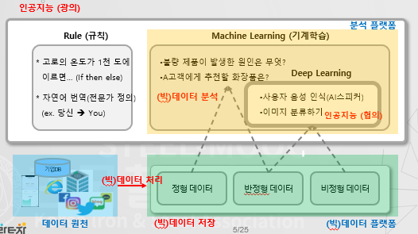

##### 데이터 분석의 관심사

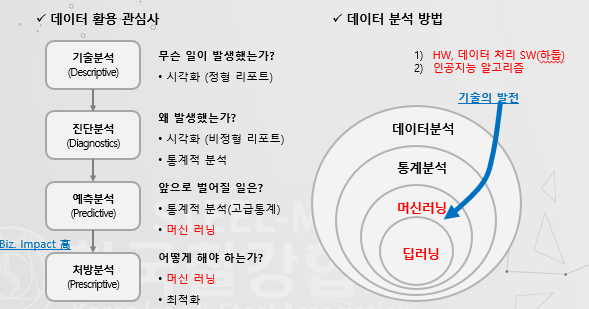

- **예측분석과** **처방분석**이 분석기술 중 빈도가 높음

##### 머신러닝

- 과거 데이터에서 숨겨진 패턴을 읽어내어 기계가 학습한 후 미래를 예측하는 기술
- 인공지능의 내부 시스템 가운데 학습영역을 구체화 한 기술

##### 머신러닝 활용 사례

- 이메일 스팸 필터링
- 상품 컨텐츠 추천
- 이상징후 예측
- 자연어 처리
- 연관 검색어 처리

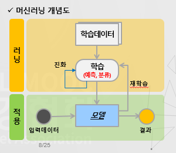

### 2. 과제 수행 절차

##### 질문과 데이터의 흐름

- 비즈니스 Pain Point 해결을 위한 질문에서 인공지능 및 빅데이터 분석 과제가 시작됨

##### 과제 수행 절차

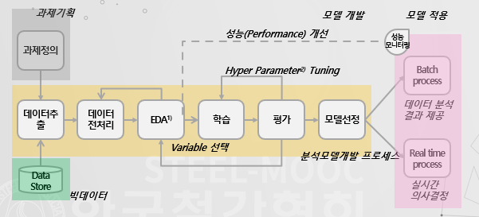

- 1)EDA - Exploratory Data Analysis, 탐색적데이터분석
- 2)Hyper Parameter - 모델링할 때 사용자가 직접 정의하는 값. 경험에 의해 결정되는 경우가 많음

절차

1. **과제정의**
2. **빅데이터**
3. 데이터추출 → 모델선정(**모델개발**)
   - 데이터 추출
   - 데이터전처리 : 데이터셋, 파생변수 생성
   - EDA 
   - 학습 : 모델생성이라고도 함
   - 평가 : 학습한 모델이 실제 환경에서 잘 돌아가는지 확인하는 작업, 잘 돌아가지 않는다면 Hyper Parameter를 갖고 재학습
   - 모델선정 : 만든 여러개 모델 중 제일 학습이 잘 된 것을 선정
4. **모델 적용**
   - Batch process : 일괄 처리
   - Real time process : 실시간 처리
   - 모델의 성능을 개선 시킬 땐 다시 학습부터 반복

- **데이터 추출, 가공이 제일 시간 오래걸림**

##### 과제 수행 절차

- 과제 정의

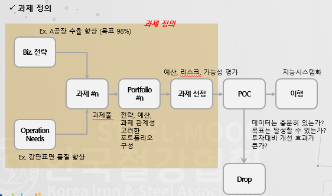

- EDA (Exploratory Data Analysis)
  - 기술통계와 시각화 도구로 데이터의 형태를 기술하거나 차트로 시각화하는 작업으로 데이터에 대한 이해도를 높임

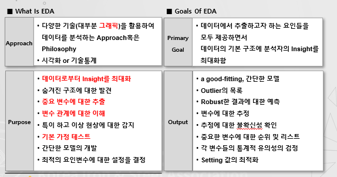

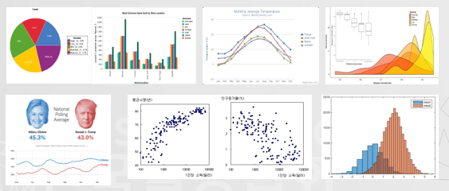

- 학습 및 평가
  - 다양한 분석모형을 이용하여 학습과 평가를 반복하며 분석 모델을 진화적으로 발전시킴
  - 학습데이터와 평가데이터는 8:2, 6:4 등으로 나눔

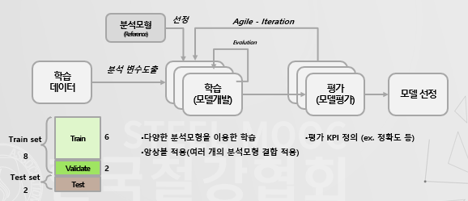

- 분석 모형 선정 - 정형 데이터

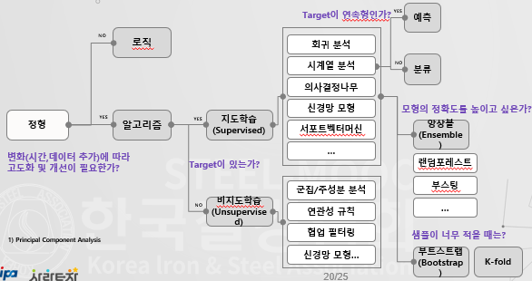

- 분석 모형 선정 - 비정형 데이터

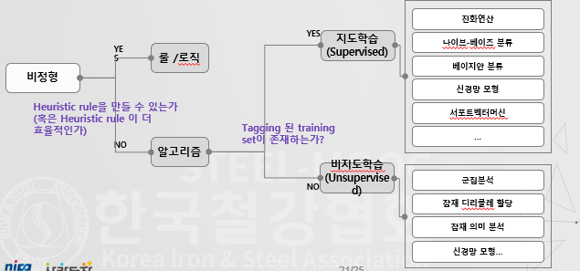

- 분석 모델 학습 및 평가
  - 선정한 분석 모형을 참조하여 분석 모델을 학습시키고 평가함
  - 평가 결과의 지표가 정의한 기준을 통과할 경우 학습을 종료함

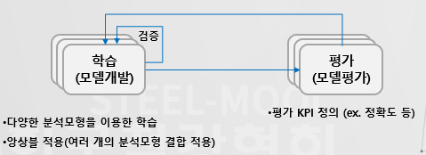

## 예측 및 분류 모형

##### 분석 알고리즘 유형

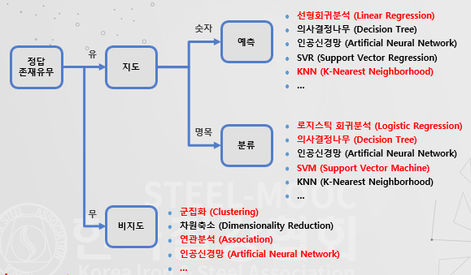

### KNN

1. 비즈니스 문제점(질문)
   - 날씨 온도가 1도 올라가면 아이스크림 매출은 어떻게 변화할까?
   - 이 데이터는 개인가? 고양이인가?
2. KNN
   - 입력 데이터에서 가장 가까운 k개의 샘플을 선택하여 입력 데이터를 분류하거나 예측하는 머신러닝 기법
   - 가장 간단한 기계 학습 알고리즘
   - 오직 지역적으로 근사하고 모든 계산이 분류될 때까지 연기되는 인스턴스 기반 또는 게으른 학습의 일종

##### KNN 분류와 회귀

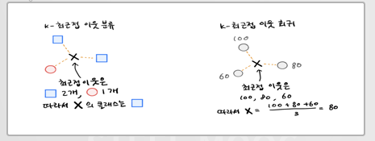

- 장단점
  - 장점 : 매우 단순한 기계학습기법으로 사용이 쉬움
  - 단점 : 비모수적인 기법으로 데이터의 용량이 늘어나면 속도 저하, 데이터 간 거리에 기반한 학습 방법으로 데이터 간 경계선에 있는 경우 예측과 분류의 정확도가 낮음

##### 선형 회귀

1. 비즈니스 문제점(질문)
   - 날씨 온도가 1도 올라가면 아이스크림 매출은 어떻게 변화할까?

- 선형회귀 : 하나 이상의 독립변수들이 종속변수에 미치는 영향을 추정하는 머신러닝 기법

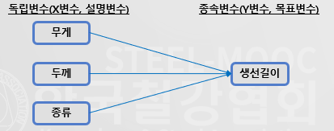

- 단순선형 회귀 : 독립변수와 종속변수가 한 개씩 있으며 오차항이 있는 관계

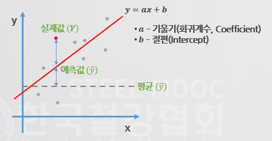

- 다중선형 회귀
  - k개의 독립변수가 종속변수와의 관계가 선형인 회귀식
  - y = ax1 + ax2 + ... + c
  - 사례 - 엔진크기, RPM, 무게로 자동차 가격 예측

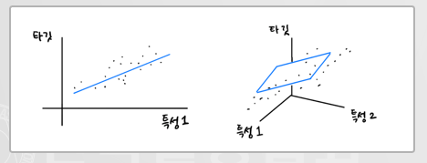

- 다항선형 회귀
  - 독립변수가 종속변수와의 관계가 1차 함수 이상인 관계
  - 사례 - 소득이 없으면 지출이 하나도 없을까?

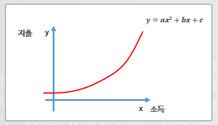

- 회귀 계수 추정
  - 최소제곱법을 사용하여 값을 추정
  - 오차를 제곱하여 합한 값이 최소인 경우가 최적의 회귀계수

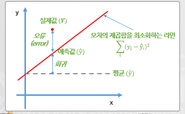

- 규제가 있는 회귀분석
  - 데이터의 특징이 많아질 수록 설명 변수들 사이에 다중공선성 문제가 발생하여 과적합이 발생할 가능성이 높음
  - 이 문제를 모델의 가중치(계수, 기울기)를 제한하여 문제를 해결하는 방법을 말함

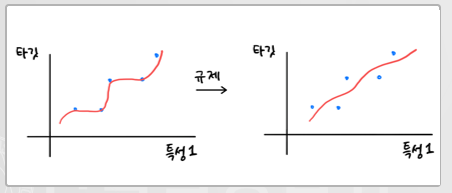

- 규제 방식

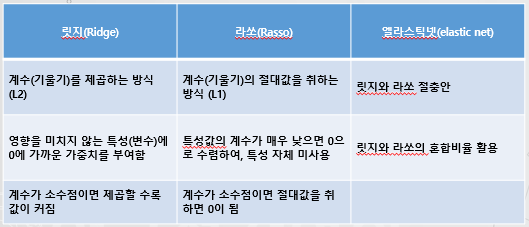

### 로지스틱 회귀

1. 비즈니스 문제점 (질문)
   - 이 강판에 발생한 스크래치는 품질불량으로 분류해야 할 정도인가
2. 로지스틱 회귀 분석이란?
   - 독립변수의 선형결합을 이용해 사건의 발생 여부를 예측하며, 종속변수가 범주형일 경우에 사용하는 회귀분석
   - 종속변수의 변수가 두 개 일 때 이항 로지스틱 회귀분석이라 하고, 그 이상이면 다항 로지스틱 회귀분석이라 함

- 선형회귀 분석과의 차이점
  - 일반적인 선형 회귀분석은 x값과 y값 모두 -무한대~+무한대 사이의 값을 가짐
  - 로지스틱 선형 회귀분석의 y값은 0 or 1의 값을 가짐
  - 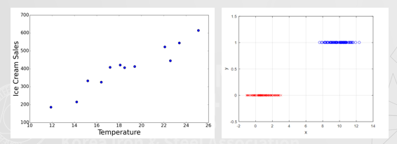
  - 범주형 데이터에 선형 회귀 모델을 적용하면 → x값의 변화로 y값이 변화를 설명할 수 있음
  - 로지스틱 회귀분석은 y의 값을 0~1 (확률p) 사이의 값을 갖게 하여 확률에 따라 y값을 분류하는 과정

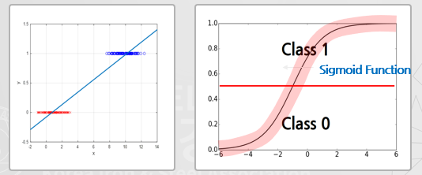

- 로지스틱 회귀 분석

  - 선형회귀분석에서 나온 값을 확률로 변환하여 데이터를 가장 잘 설명하는 계수를 찾는 과정

  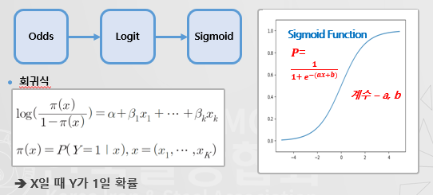

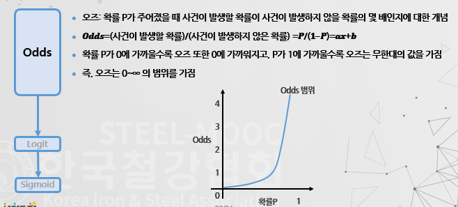

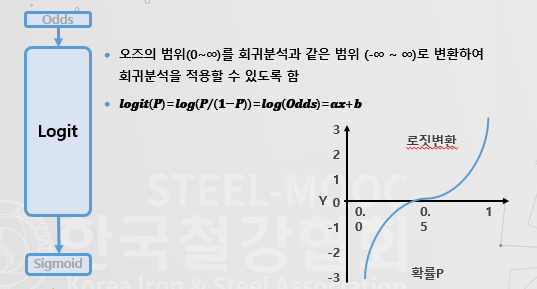

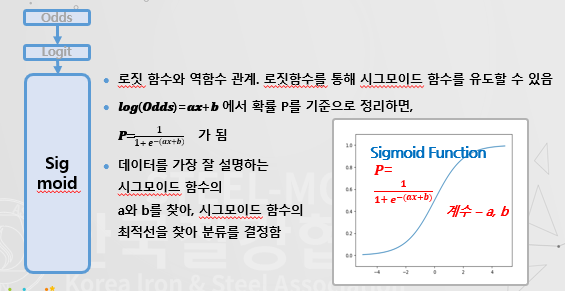

- 계수 추정 - 최대우도 추정법

  - 확률적으로 가장 일어날 가능성을 최대화 시킬 수 있게 계수를 추정하는 방법
  - 확률 분포가 주어졌을 때 관찰한 사실이 얼마나 일어날 가능성이 있는지 정량적으로 계싼하는 함수
  - 파란공이 3개,  흰 공이 5개 들어있는 주머니에서 공을 한 번에 하나씩 꺼내고 다시 주머니에 넣는 것을 반복

  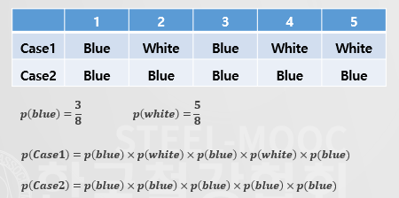

  

### 의사결정 나무

1. 비즈니스 문제점(질문)
   - 고로의 온도가 1,500도 이상에서 10도가 더 올라갔을 때, 품질 클레임 발생 횟수는 얼마나 증가할까? (예측)
   - 이 강판에 발생한 스크래치 품질불량으로 분류해야 할 정도인가? (분류)
2. 의사결정나무
   - 데이터에 존재하는 패턴을 분석하여 나무 모형으로 나타낸 것
   - 전체 데이터에서 스무고개 하듯 질문하며 분류해 나감
   - 전체 자료를 분류하거나 예측할 때 사용

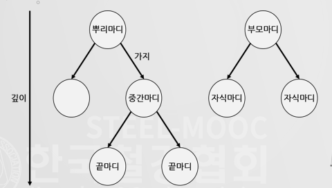

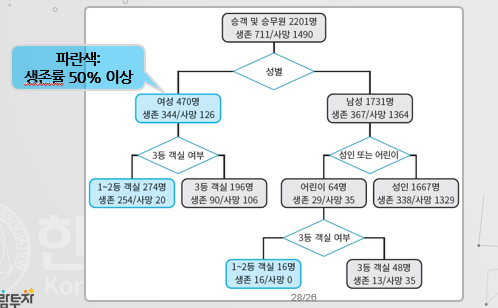

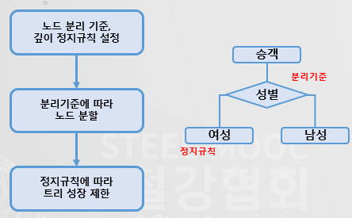

- 노드 분리 기준
  - 무엇을 기준으로 노드를 분리해야 할까? → 불순도가 낮아지는 방향으로 분리해야 함
- 왜 불순도가 낮아야 할까?
  - 분류가 완전한 것이 좋은 노드, 순도가 높으면 완전한 분류 가능
  - 노드1과 노드2가 0 or 1에 가까우면 좋은 노드
- 불순도
  - 불순도를 계산하는 방식은 지니계수, 엔트로피지수 등이 있음

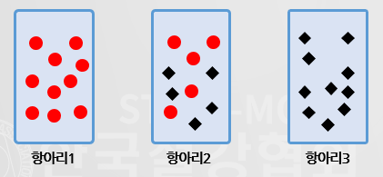

- 지니계수
  - Gini계수가 가장 작은 것을 첫 단계의 노드로 선택
  - 이후 각각의 분기에 대하여 동일한 방법으로 Gini계수가 가장 작은 노드 선택
  - 최종적으로 의사결정 트리가 완성

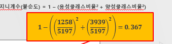

- 엔트로피
  - 불순도를 수치화한 지표 중의 하나
  - 확률변수의 불확실성을 수치로 나타낸 것
  - 노드의 클래스 비율을 사용하지만, 밑이 2인 로그를 사용(지니계수는 제곱을 사용)

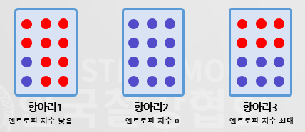

- 정보이득
  - 부모 노드와 자식 노드의 불순도 차이
  - 트리모델은 정보이득이 최대가 되도록 데이터를 분할

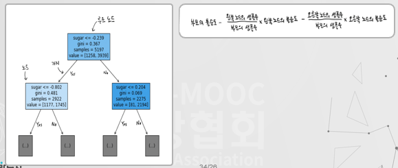

- 가지치기 - 정지기준
  - 모든 자료가 한 그룹에 속할 때
  - 마디에 속하는 자료가 일정 수 이하일 때
  - 불순도의 감소량이 아주 작을 때
  - 뿌리마디로부터의 깊이가 일정 수 이상일 때

- 앙상블 모형 - 랜덤포레스트
  - 분석 성능 향상을 위해 다수의 모형에서 출력된 결과를 종합하여 하나의 최종 결과를 도출하는 방법
  - 랜덤포레스트는 의사결정나무 기반의 대표적인 앙상블 모형
  - 다수의 앙상블 모형이 의사결정나무를 기반으로 함

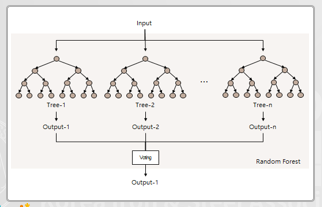

## 인공신경망 & 딥러닝모형

##### 분석 알고리즘 유형

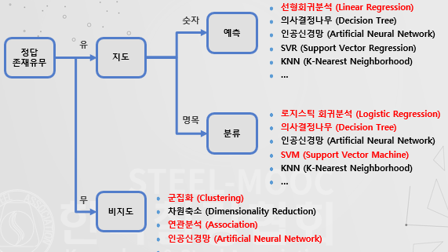

### 인공신경망

- 발전 역사

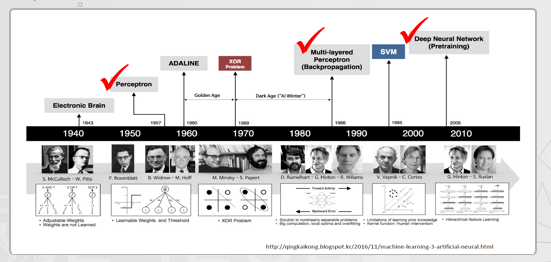

- 인공신경망
  - 사람 두뇌의 신경세포인 뉴런이 전기신호를 전달하는 모습을 모방한 기계학습 모델
  - 입력 값을 출력 값으로 만들기 위해 활성화 함수사용
  - 노드들이 복잡하게 연결된 구조를 가지고 있으며, 입력데이터에 가중치를 부여하여 분석

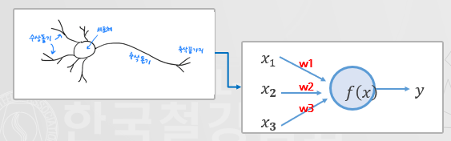

- 단층 퍼셉트론

  - 입력값, 가중치, 순입력함수, 활성함수, 출력값으로 구성

  - AND, OR 연산은 가능하지만, XOR 연산은 불가능, 다층 퍼셉트론에서 해결 가능

  - 

  - 단층퍼셉트론 계산 방식

    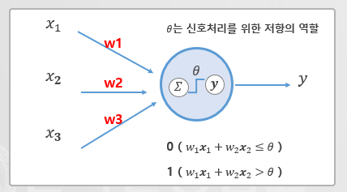

- 다층 퍼셉트론

  - 여러 개의 은닉층과 역전파알고리즘을 이용하여 단층 퍼셉트론을 발전시킨 것

  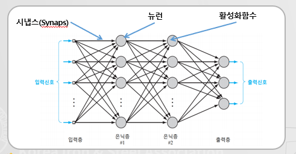

  - 다층 퍼셉트론은 역전파 알고리즘을 이용하여 가중치를 조정함
  - 오류를 줄이기 위한 목적이며, 미분값을 역방향으로 전달하는 형태로 가중치를 조절

- 활성화 함수
  - 노드에 입력된 값을 처리하는 비선형 함수로 함수를 통과한 값은 결과로 출력되거나 다음 노드의 입력 값이 됨
  - 시그모이드
    - 입력되는 값을 곡선 형태로 0과 1사이의 값을 출력
    - 입력 절대값이 클 경우 0이 되어 기울기가 소실되는 문제가 발생

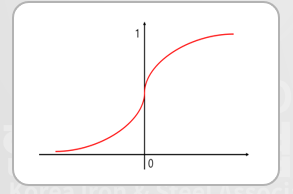

