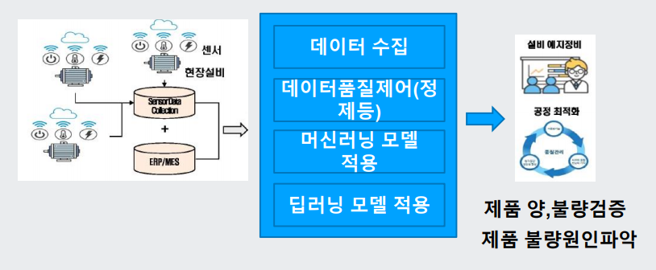
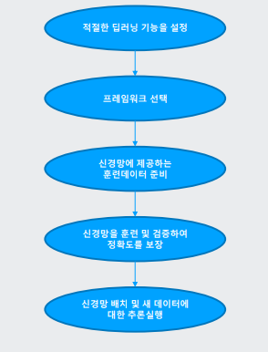
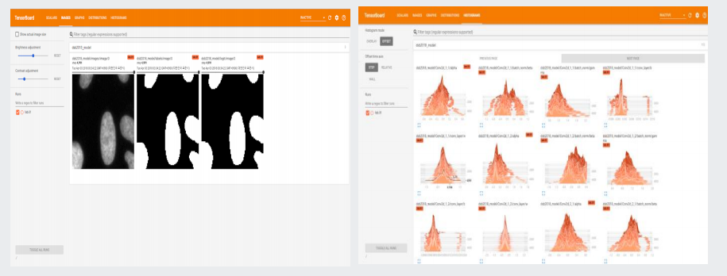
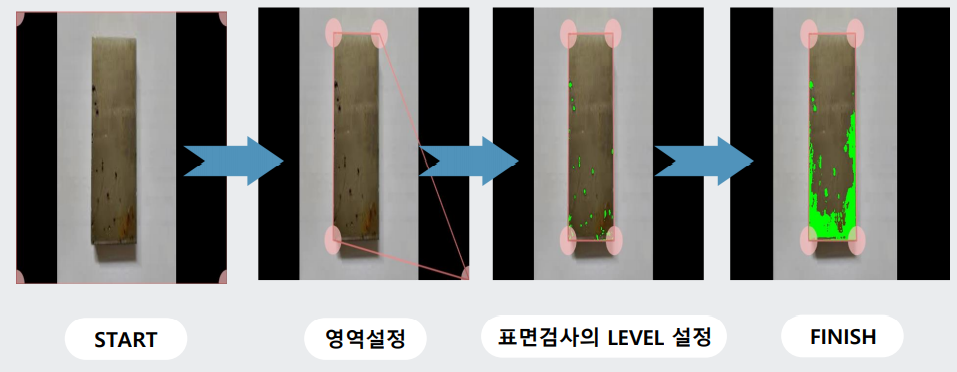
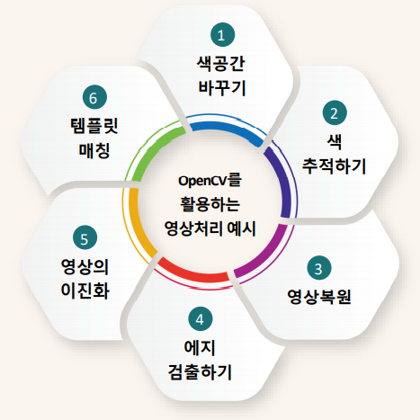

## 2021년 8월 25일

### 철강 설비 이미지 분석 모델 개요

##### 머신러닝/딥러닝 모델 적용 방법

#### 머신비전 딥러닝을 활용하기 위한 5단계

#### 적절한 딥러닝 설정

1. 분류 - 시작을 어떻게 할 것인가?
   - 딥러닝의 가장 중요한 기본적 기능은 분류
   - 이 프로세스에서는 이미지를 공통 특성에 기초하여 다양한 유형 및 그룹으로 분류
   - 분류 기능을 사용하여 생산 라인의 품질 관리 또는 PCB 납땜 검사 중에 결함 부품과 양호한 부품을 구분할 수 있음
2. 검출 및 지역화 - 검출의 방법과 지역화의 설정
   - 머신비전에 이상적인 또 다른 딥러닝 작업은 검출 및 지역화라고 부름
   - 이 기능을 사용하면 이미지의 특징을 확인하고 바운딩 박스 좌표를 제공하여 이미지의 위치 및 크기를 결정
3. 분할 - 핵심 포인트와의 분할
   - 일반적으로 이미지의 어떤 픽셀이 어떤 객체에 해당하는지 확인할 때 사용
   - 분할은 객체의 맥락과 객체의 상호관계를 결정해야 하는 응용제품에 이상적
   - 자율주행자 / 고급 운전자 보조 시스템(ADAS)
4. 이상검출 - 포인트와 상이한 대상의 검출
   - 패턴에 일치하지 않는 영역을 확인하는 데 사용될 수 있음
   - 이상 검출이 부가가치를 창출할 수 있는 응용 분야의 전형적인 사례는 식료품점의 재고 관리
   - 추론 카메라를 사용하여 비어 있거나 보충이 필요한 진열대를 검출하여 강조 표시함으로써 실시간 알림을 제공하고 효율성을 개선할 수 있음

##### 프레임워크 선택

1. Pytorch
   - 간단하고 쉽게 사용할 수 있음
   - 많은 연구 프로젝트에서 사용
   - 대형 배치에는 흔히 사용하지 않음
   - python에만 모두 지원
2. TensorFlow
   - 훌륭한 문서화 기능으로 많은 사용자층
   - Pytorch보다 학습곡선이 높음
   - 생산 배치가 확장 가능하며, 이동성 배치를 지원
3. Caffe2
   - 경량으로서, 효율적인 배치로 변환
   - OpenCV를 사용하는 휴대용 장치에 최적

- 어떤 신경망을 선택할지는 결국 바로 수행해야 하는 작업의 복잡성 및 추론을 실행해야 하는 속도에 따라 달라짐
- 예를 들어, 층 및 뉴런이 더 많은 신경망을 선택하면 추론실행이 더 느려짐

### 신경망에 제공하는 훈련데이터 준비

- 특성을 갖춘 이미지, 이미지에 적절한 라벨 표시

##### 신경망을 훈련 및 검증하여 적중률 향상(정확도 보장)

##### 신경망 배치 및 New 데이터에 대한 추론 실행

- 선택된 하드웨어에 훈련된 신경 네트워크를 배치하여 성능을 테스트하고 현장에서 데이터를 수집
- 추론의 처음 몇 단계는 현장에서 사용하여 훈련 데이터로서 앞으로 반복 사용할 수 있는 추가 테스트 데이터를 수집하는 것이 이상적
  - 배치방법
    - 클라우드 배치
      - 하드웨어 비용의 상당한 절감
      - 신속한 확장성
      - 여러 위치에 변경 사항을 배치 및 전파할 수 있는 능력
      - 인터넷 연결의 필요성이 주요 단점
      - 엣지 배치보다 긴 대기시간
      - 낮은 신뢰성
    - 엣지(표준 PC)
      - 고성능 응용제품에 이상적
      - 주문 제작 범위가 넓음
      - 유연한 가격 범위
      - 고비용
      - 일반적으로 설치 공간이 상당히 증가

#### 철강산업에서의 AI 도입 사례

#### 영상처리 프로그램에 사용된 주요 모듈

##### OpenCV

- 소스 컴퓨터 비전 및 기계 학습 소프트웨어 라이브러리
- 컴퓨터 비전 응용 프로그램을 위한 공통 인프라를 제공하고 상용 제품에서 기계 인식 사용을 가속화하기 위해 개발

